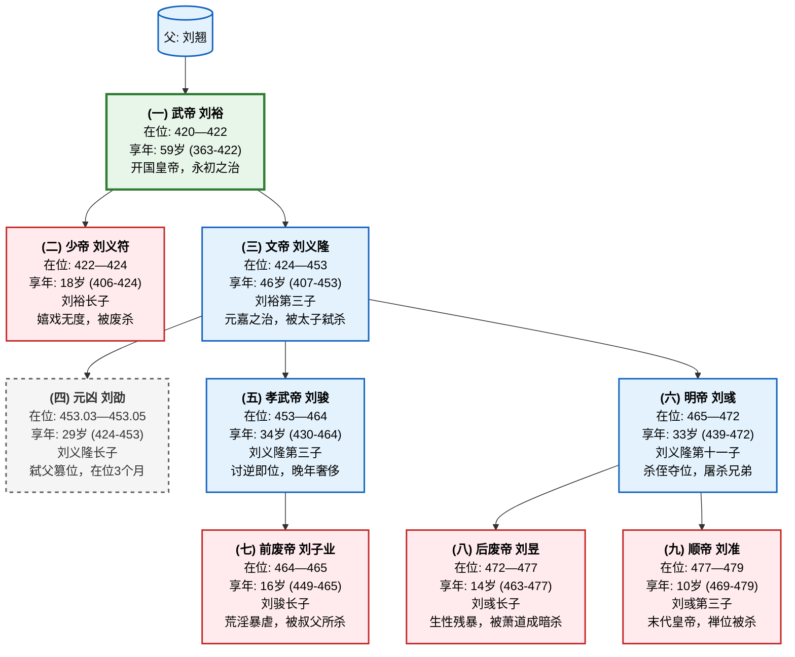
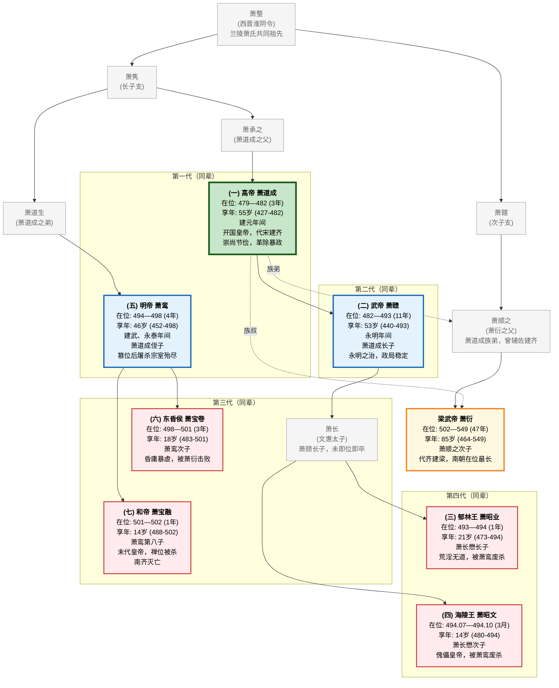
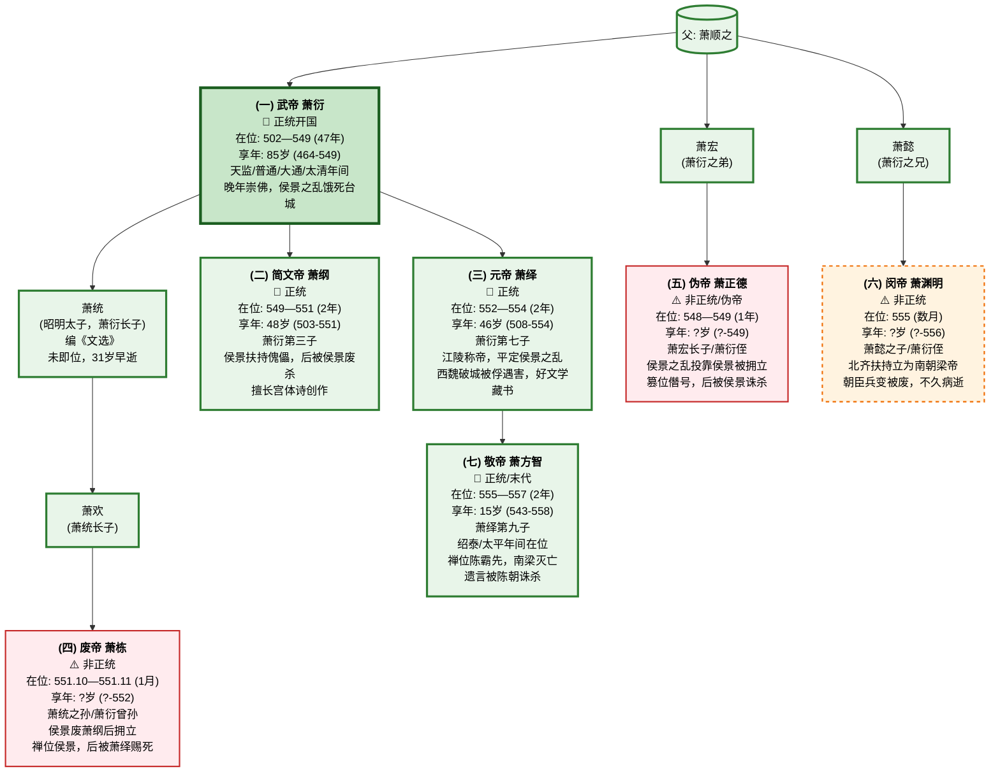
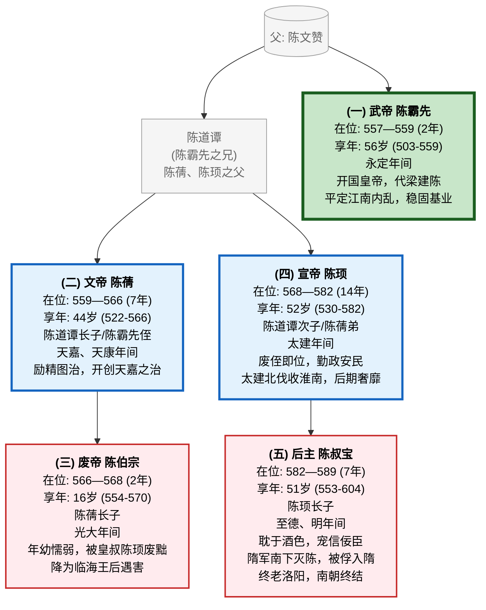

# 魏晋、南北朝笔记

说来也巧，前段时间去了趟佛狸祠（参考[不见神鸦社鼓](../Talks/Bilici.md)），然后莫名地对那段混乱的历史有了一点兴趣，挑了小半个下午搜集资料，然后就有了这个笔记。

北朝的就待补充吧！

哦对，感谢豆包的搜集工作与答疑，出乎意料地它搜集得格外的不错，准确度比我想得要高很多，意外之喜。

## 南朝

420-589。宋齐梁陈。“**南朝四百八十寺，多少楼台烟雨中。**”

### 宋

**刘裕**（“人道寄奴曾住”的那个“寄奴”）建立，共传4世8帝，不含1弑父篡权的“元凶”，国祚首尾60年 (420 - 479)，是南朝四代里最长的。

---

### 齐

齐是南朝四代里寿命最短的，仅24年，但共传3代7帝，这还是在**萧赜凭一己之力在位11年**狠狠刷了一波数据之后的结果。

另一个重要故事是，齐和后来的梁都是“萧”氏创立的，他们都是兰陵萧氏的后代。齐的创立者**萧道成是萧衍（梁的创立者）的族叔**。

### 梁

萧衍建立，正统认为梁4帝（萧衍 -> 萧纲 -> 萧绎 -> 萧方智），首尾55年，侯景之乱、北齐干预亦立有3傀儡帝王，并附。

### 陈

陈，南朝的最后一个国家，共传三世五帝，首尾 33 年。陈朝的传承比较特殊——皇位从陈霸先传给了**侄子**陈蒨，后来又发生了**叔父陈顼**废侄子陈伯宗的事件。

