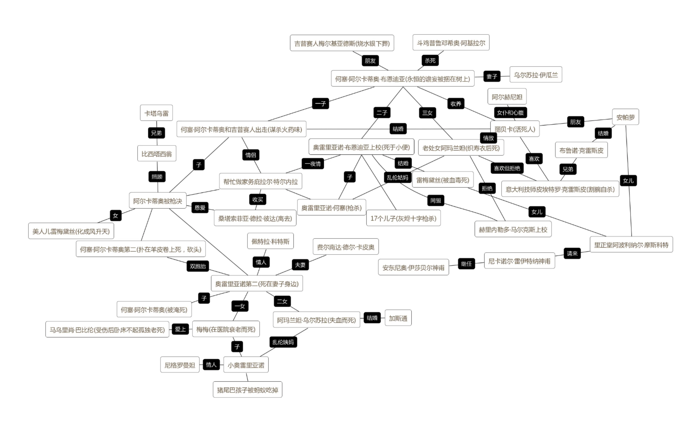

# 百年孤独

(网图：人物关系表)

## 我的摘记
----------

- 何塞·阿卡蒂奥·布恩迪亚（第一代）
- 乌苏拉（妻子，第一代）：和布恩迪亚家族一直是近亲结婚：生出了张着尾巴的儿子
- 何塞·阿卡蒂奥（儿子，第二代）
    - 阿卡迪奥 （儿子，第三代），和庇拉所生
        - 自由派失败被杀
        - 死后由索菲亚（妻子，第三代）生下的孩子取名叫雷梅苔丝（女儿，第四代，俏姑娘梅雷苔丝）
        - 何塞·阿卡蒂奥第二（第四代）；
        - 奥雷良诺第二（妻子：菲南达·卡庇奥，第四代）
            - 奥雷良诺一直和情妇鬼混
            - 儿子：何塞·阿卡蒂奥（第五代）
                - 发现乌苏拉的金币，生活放荡，被歹徒杀死
            - 妹妹：梅梅（很漂亮，第五代）（修女学校，男友死后一言不发，母亲不允许妹妹和其他男性交往）
                - 男友：马乌里肖·巴比洛尼亚 ；在香蕉公司的厂里当机修工学徒 
                    - 被保镖打伤瘫痪
                - 私生子：奥雷里亚诺·布恩迪亚（第六代）沉迷破译梵文
            - 妹妹：阿玛兰塔：布鲁塞尔学习；回来后翻新了马孔多；加斯东（丈夫），飞行员
            - 大屠杀
- **庇拉·特内拉**（纸牌算命）
- 奥雷良诺（小儿子，第二代，上校）
    - 十七个表兄弟：十七个孩子（被香蕉公司杀害）
    - 和父亲一样专注于炼金
    - 和庇拉的儿子：奥雷良诺·何塞（阿玛兰塔抚养）（第三代）
        - 奥雷良诺·何塞被杀
    - 逃过了枪决
- **墨尔基阿德斯** 
- 阿玛兰塔 （女儿，第二代）
    - 给雷梅苔丝下毒？
    - 缝纫
    - 意大利人求爱不成自杀
- 雷贝卡·布恩迪亚：（远方送来的孤儿）他们发现雷蓓卡只吃院子里的湿土和用手指从墙上挖下来的石灰块 
- 雷梅苔丝 （堂阿波利纳尔·莫科特 女儿）

> 维希塔肖恩：生活在有失眠症部落的人
> 
> 失眠症最可怕的地方还不在于使人毫无倦意不能入眠，病症无情， 发展到后来会出现最危急的症状，会失去记忆。 

诺斯特拉达姆斯预言 

-----

## Quotations

1. “世界上正在发生令人难以置信的事情，”他对乌苏拉说，“就在那边，在河对岸，就有各式各样神奇的机器，可我们还在过着毛驴似的生活。” 
2. 他被磁铁热、天文计算、炼金梦以及想认识世界奇迹的渴 望迷住了心窍。富有闯荡精神的、整洁的霍塞·阿卡迪奥·布 恩地亚，变成了一个外表怠惰、衣着马虎的人。 
3. 霍塞·阿卡迪奥·布恩地亚始终未能揭开梦里用镜子作墙 的房子这个谜，直到那天他认识了冰块，才自以为懂得了这个谜 的深刻意义。他设想在不久的将来，可以用水这种日常所见的 材料，大规模制作冰块，并用它们来建造村里的新住宅。 
4. 奥雷良诺明白，他哥哥的烦闷不是寻求炼金 石引起的，但无法掏出他心中的秘密。 
5. 因此要写得更加清楚。那 块挂在牛脖子上的字牌，就是马贡多居民决心同遗忘作斗争的 范例:这是牛，每天早晨应挤奶以生产牛奶，牛奶应在煮沸后 加入咖啡，配制牛奶咖啡。他们就这样在一种难以把握的现实中 生活着，这现实暂时被文字挽留着，可是一旦人们忘记了文字的 意义，它就会逃走，谁也奈何它不得。 
6. 在通往沼泽地的路口挂着一块牌子，上面写着，马贡多，镇中心的街道上挂着一块更大的牌子，上面写着:上帝存在。每户 居民家里都写了字，便于人们记住东西的名称和喜怒哀乐的感 情。这套办法要求人们花费很多精神，还要有毅力，因此，许多 人便拜倒在制造虚幻现实的巫术脚下，此法是他们自己创造的， 虽不怎么实用，但却更令人鼓舞。 
7. 若干年后，面对行刑队，阿卡迪奥准会回忆 起，墨尔基阿德斯给他念了几页那本深奥著作时他惊奇得震颤 的情景，当然他听不懂，可是觉得高声朗读起来象人家唱的教皇 通谕。 
8. “只要你的父母还没有入土，你就不会幸福。” 
9. 管时间的机器出毛病了 
10. 瞧瞧这空气，听这太阳 的嗡嗡声，和昨天、前天一个样，今天也是星期一。 
11. 黎明时，经过军事法庭的速决审判，阿卡迪奥在公墓的墙前 被枪决了。在他生命的最后两小时内，他没有弄明白为什么从 童年时代起就一直折磨着他的那种恐惧突然消失了。他神情漠 然地听着对他提出的没完没了的控告，甚至也没想到显示一下 他刚刚获得的这种胆量 
12. 在去公墓的路上，毛毛细雨下个不停。阿卡迪奥注意到地平线 上正透出一个阳光灿烂的星期三。 
13. 他已经获得了一种随意 增加体重的本领，最后只得把他拖到床上。当这位年迈的、备 受日晒雨淋之苦的大汉开始呼吸的时候，房间的空气中弥漫着 一种嫩蘑菇、棒棒花和野外的陈腐而浓烈的怪味道。第二天起身， 他不在床上。乌苏拉找遍了所有的房间，最后又在栗树下发现了 他。于是只得把他缚在床上。虽然他的力气还象过去一样大，但 却没有反抗的样子，对他来说，呆在哪儿都一样。他所以回到栗 树下去，并非出于他的愿望，而是由于身体已习惯那里的环境。 
14. 他们不仅是母与子，而且是孤寂中的同党。 
15. 只要一看到他的尸体，我现在以我父 亲和我母亲的尸骨，以纪念霍塞·阿卡迪奥·布恩地亚的名义 和在上帝面前向你起誓，不管你钻到哪儿，我都要把你拖出来， 用我的双手把你杀死。”在离开房间前，不等他回答，最后又加上 一句: “就象当初你出生时如果长着猪尾巴的话我会做的那样。” 
16. 结束一场战争远比发动它要艰难。
17. “死，远远比一个人所想象的要难。” 
18. 在这一刻里，他发觉这半个多世纪来，日常生活的重担在她身上留下了多少深深浅浅的爪印 鞭痕，多少大大小小的创伤、溃疡和瘢疤。 
19. 他在没有爱情的荒漠中所结识的那些女人，多得不可胜数，她们把他的种子撒播在整个加勒比海岸，但没有在他的感情上留下一丝痕迹。 
20. 再三声明他并非如他们所说 的那样是什么国家的名流，而只是一个失去了记忆力的手工匠 
21. 这列无辜的黄色火车将给马贡多带来多少捉摸不定的困惑和确凿无疑的事实，多少恭维、奉承和倒霉、不幸，多少变化、灾难和多少怀念啊。 
22. 但是香蕉公司来后，地方官员都被发号施令的外乡客代替了。 
23. 孩子不小心碰着了一位警察小队长，汽水溅上了他的制服。 这个野蛮的家伙竟用砍刀把孩子捣成肉泥，又一刀砍下了前去 阻拦的爷爷的头。当一群人把无头尸体抬往家去时，全镇的人 都看到了。他们还看到那个被砍下的头颅由一位妇女抓着头发 拎在手中，还看到那只装着孩子碎尸的鲜血淋淋的布袋。 
24. 他的十七个儿子在沿海各地被看不见的 凶手们象逮兔子似地打死了 
25. 请你告诉他，”上校笑了笑说，“一个人不是在该死的时候， 而是要到能死的时候才能死去 
26. 他和他们一起同日常的凌辱进行一场可悲的战争。这是 一场申请书与请求书的战争，一场“请你明天再来吧”的战争， 一场“已经差不多了”的战争，一场“我们正在认真地研究你的 情况”的战争，总之，是一场反对“最忠诚可靠的仆人”的无可 挽回地失败了的战争。 
27. 老年的理智使她明白了，孩子在母亲腹中的哭叫声不是什么当口技演员的象征，也不是什么占卦能力的 标志，而是没有爱的能力的最明显的信号。（奥雷良诺·布恩迪亚）
28. 阿玛兰塔在专心致志地织她的裹尸布， 
29. 这是一群蝴蝶。梅梅 看到这群象是突然从阳光里生出来的蝴蝶 
30. 于是，他俩在大门边看到了早 在奥雷良诺懂事之前就开场了的一出戏剧的最后一幕。两名追 捕奥雷良诺·阿马多好多年，象狗一样尾随他走遍半个世界的 警探，从对面人行道上的扁桃树后面钻了出来，用毛瑟枪朝奥雷 良诺·阿马多打了两枪，不偏不倚打穿了那个圣灰十字。 
31. 在死亡的彼岸等待着她的桔黄色的尖啸声和那看不见的气球究 竟是什么东西。她只来得及伸手胡乱地摸到一条毛巾，把它塞 进嘴里用牙齿咬住，以免从她嘴里传出那正在撕裂她五脏的牝 猫的尖叫。 
32. 这时，奥雷良诺动弹不得， 倒不是因为惊呆了，而是因为在这奇妙的瞬间，他领悟了墨尔基 阿德斯具有决定意义的密码，他发现羊皮纸上的标题完全是按 照人们的时间和空间排列的:家族的第一人被绑在一棵树上，最 后一个人正在被蚂蚁吃掉。 

---------------

## 关于孤独

“名著”的作用是帮你更好地认清自己的阅读领域。

我想起我第一次阅读《百年孤独》的时候，我还在读初中，我还在学习素描，当时有一个同学下午来上课的时候就带了一本《百年孤独》。我当时已经听说过这本书，因为表哥小时候给我讲过那个一生下来就被吃掉的长着猪尾巴的婴儿的故事。那个时候害怕啊，又猎奇又害怕，很难说清具体是一种什么感受。

今年把手头的事情大致忙完，空了一天的时间专门用来读书，感觉受益匪浅。一是因为小时候完全没有任何辨认人物关系、世代关系的意识，现在自己做了一个世系表（虽然并不完全，而且还有一些缺漏），而且开始捋一捋马尔克斯埋在书里的一些细节了。

看到最后的时候飓风刮走了马孔多，看似一个宿命论的结果（命运写成了密码，破解开发现是一家人百年的诅咒），实际是把文学的未知推向了顶峰。马孔多的结局马尔克斯给定了，但是我们每个读者的想法呢？翻完了100年7代人的恩恩怨怨和你来我往，我们看到了什么？

你是一个拉美人，你可能想到美国后花园香蕉公司的压榨，三十二场战争；

你是一个中国人，你读完了一本“名著”，你多了一些吹嘘的资本，虽然我至今没有去过拉美；

你是其他第三世界国家的左翼，你看到了一个穷苦无法挣脱发展陷阱的国家（民族/家庭），你发现了世人皆苦，你意识到需要不断革命。

然后，你参加到了第三十三场战争中。

或者说，每个读者都已经走入了下一场战争中。

相比于知道自己正经历苦难，我们似乎更应该知道，苦难是无穷无尽的。

