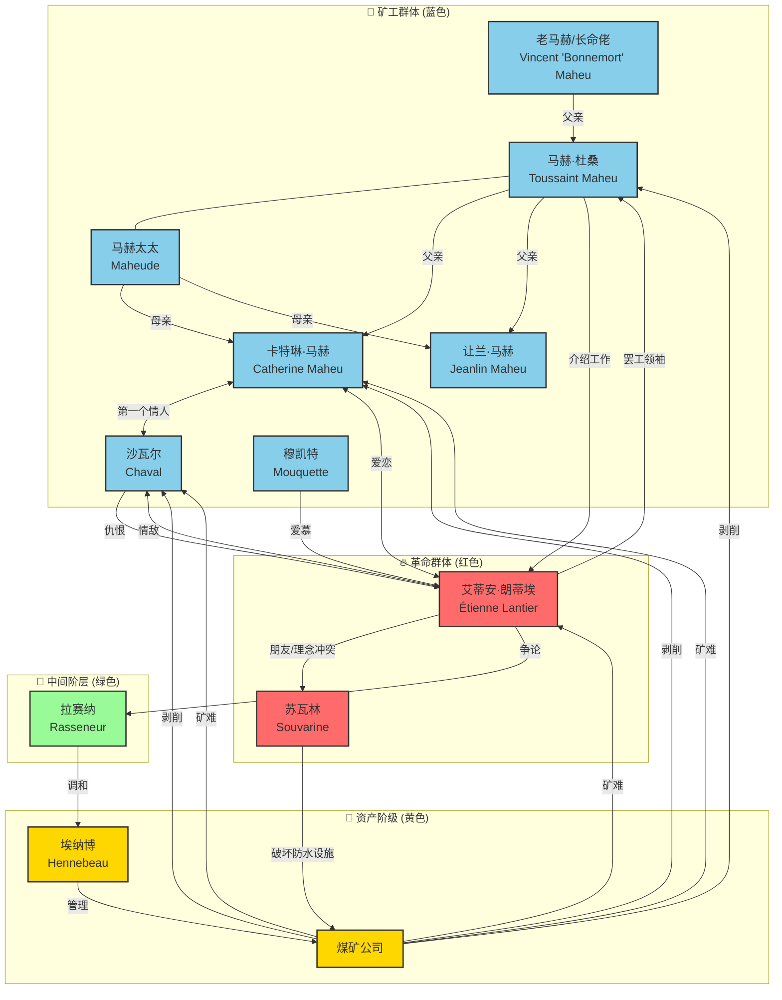

# 萌芽

一本大大大部头，看过的第一本左拉。文学上说是现实主义自然主义结合的煤矿工人运动写实资料。与意识形态机器宣传的宏大叙事不同，==这本书写的是“工人运动“四个字背后的**人**==，他们生活环境如何，矿井意味着什么（疾病、工作，工资，家庭、伙伴），他们为什么如此“崇尚暴力”，为什么罢工会愈演愈烈逐渐扩大，他们又如何被镇压，经理们考虑的是什么、董事会又在考虑什么，为什么运动总是夹杂着煤矿小团体的斗争，当权者是如何通过分化、割裂、拉拢不同矿井、地区工人，调度宪兵来瓦解罢工潮流的等等等等。

这本书看到中间，我的笔记写的大多是一些心痛和可怜：贫血、贫穷、煤肺以及过劳，越写只会感到自己始终是隔了一层不知名的膜。越到后面，看到工人内部的乱交、无所事事与无来由的暴力、思维的落后、组织性、纪律性的缺失导致他们的易被操纵，**我反而越发地理解列宁了**：

想起前段时间扫过的他的文集，我终于理解到为什么在十月革命成功后，他的危机感反而越来越严重：**不错，暴力可以杀人、枪炮可以夺取政权、革命可以颠覆国家**，==靠着一小部分精锐、团结、忠诚、先进的先锋队可以一脚踹塌腐朽的统治==，但然后呢？苏维埃的镰刀锤子画上了国旗，但是<span style="color:red;font-weight:bold">那象征进步、解放的镰刀锤子真的放进那些底层百姓心里了吗</span>？退一步讲，难道我们的“先锋队”也真的知道为什么要这么做么？一个革命的队伍，怎样才能永葆先锋呢？

人真的能摆脱原先巨大的思维惯性，拥抱革命的成果了么？==他们是不是还沉溺在穷人隶属、讨好富人，女人依附、从属男人==的那一套价值上？他们是不是还经常整日耗散消沉于酗酒带来的暴力冲动之中呢？

想到这一步时候我的大脑嗡嗡作响了：**人落后贫瘠、肮脏狭隘的思想污垢，偏执野蛮、未受教育的劣习陋作，无时无刻不在摧毁先前取得的一切革命成果**：因而，这种在底层劳工百姓中极大地普及教育、思想、文化，铲除不符合新工业生产力的落后的奴性思维，对于那些终生贫困的人而言，这太重要、太重要了。

---

当然，如果读读1981年郑克鲁先生译本序，你可以获取到关于左拉政治观点的精确描述：左拉<u>认为并不需要使用暴力</u>，要在小说中写出老板们追求利润也有人性，合法斗争将来有一天也许更为有利。也就是说，<u>他希望工人平静地参加工会，把政权夺过来，就能够变成主人</u>。这当然是具有法国国情的特殊认知：

我倒觉得作者或者书籍试图传达的政治观点是第二性的。因为所谓“透过事实看本质”有个前提：你需要真的看到个事实才行，第一性的事是去了解和认识一下，教科书上鲜少明确展开的“工人运动/国际共运”，到底发生了什么，工人两个字意味着什么，罢工是怎么进行的，结果如何，现实的矿井是怎样的。我认为在这一点上，这本书做得很好。

---

## 小说人物

| 人名              | 外文名                    | 人物关系                                                     | 人物结局                                                                                     |
| :---------------- | ------------------------- | ------------------------------------------------------------ | -------------------------------------------------------------------------------------------- |
| **艾蒂安**·朗蒂埃 | Étienne Lantier           | 流浪机器匠，马赫家房客，卡特琳的爱人，沙瓦尔的情敌，罢工领袖 | 矿难中唯一幸存者，<br>身体受伤无法再下井，后被开除，<br>离开矿区前往巴黎，成为革命思想传播者 |
| **卡特琳**·马赫   | Catherine Maheu           | 马赫家女儿，16岁，井下推车工，艾蒂安与沙瓦尔的爱人           | 被困井下8天后，<br>在艾蒂安怀中死去，<br>死前与艾蒂安完成结合                                |
| **沙瓦尔**        | Chaval                    | 矿工，卡特琳的第一个情人，艾蒂安的情敌，罢工后成为工贼       | 矿难中与艾蒂安搏斗，被艾蒂安用石块砸死                                                       |
| 老马赫/**长命佬** | Vincent "Bonnemort" Maheu | 老矿工，马赫家族族长，艾蒂安的介绍人                         | 在精神崩溃状态下，<br>于格雷古瓦家探访时<br>掐死了塞西尔                                     |
| **马赫**（杜桑）  | Maheu (Toussaint)         | 矿工，卡特琳的父亲                                           | 罢工冲突中被宪兵枪杀                                                                         |
| 马赫太太          | Maheude                   | 老马赫的妻子，卡特琳的母亲                                   | 失去丈夫和女儿后，继续在矿区艰难生活                                                         |
| 让兰              | Jeanlin Maheu             | 马赫家小儿子，童工                                           | 下井工作事故腿受伤，<br>罢工中参与暴力行动，<br>后幸存但前途未卜                             |
| **苏瓦林**        | Souvarine                 | 无政府主义者，机械师，艾蒂安的朋友                           | 破坏矿井防水设施导致矿难，<br>之后消失                                                       |
| **埃纳博**        | Hennebeau                 | 煤矿公司经理，资产阶级代表                                   | 罢工结束后继续担任经理，<br>维持对矿工的剥削统治                                             |
| **拉赛纳**        | Rasseneur                 | 酒馆老板，前矿工，改良主义者                                 | 试图调和劳资矛盾，<br>罢工失败后继续经营酒馆                                                 |
| 穆凯特            | Mouquette                 | 年轻女工，放浪乱交，对艾蒂安有好感                           | **罢工中被枪杀**                                                                             |

### 次要人物简表

这里的次要人物，包含其他矿工家庭：皮埃隆夫妻、勒瓦克夫妻子女，以及资产阶级煤矿老板（格兰古瓦）的家庭关系。

| 人名             | 外文名            | 人物关系                                               | 人物结局                                                                       |
| :--------------- | ----------------- | ------------------------------------------------------ | ------------------------------------------------------------------------------ |
| **皮埃隆**       | Pierron           | 矿工，皮埃隆家男主人，丽迪的父亲，后成为工贼           | 罢工中背叛工友，充当矿方眼线，罢工结束后继续在矿区工作，维持工贼身份           |
| 焦脸婆           | La Brûlé          | 皮埃隆的母亲，选煤工，性格暴躁                         | -                                                                              |
| 皮埃隆太太       | Pierronne         | 皮埃隆的妻子，矿区最漂亮的女人，与总工头丹赛尔有私情   | 与丹赛尔的私情被揭露后，在矿区声名狼藉，继续与丈夫一起生活                     |
| 丹赛尔           | Dansaert          | 煤矿公司总工头，埃纳博的得力助手，皮埃隆太太的情人     | 罢工期间协助埃纳博镇压工人，罢工结束后继续担任总工头，维持对矿工的高压管理     |
| 丽迪             | Lydie Pierron     | 皮埃隆夫妇的小女儿                                     | 跟随父母在矿区生活，<br>**罢工中被宪兵枪杀**                                   |
| **勒瓦克**       | Levaque           | 矿工，勒瓦克家男主人，贝博和菲洛梅的父亲，布特鲁的房东 | 性格粗暴、头脑简单，罢工中参与暴力行动，后幸存但生活依旧贫困                   |
| 勒瓦克太太       | Levaque           | 勒瓦克的妻子，布特鲁的情人                             | 与布特鲁的私情公开后，在矿区遭受非议，继续与丈夫和孩子艰难生活                 |
| 布特鲁           | Bouteloup         | 矿工，勒瓦克家的房客，勒瓦克太太的情人                 | 罢工期间表现活跃，后幸存，继续在矿区工作                                       |
| 菲洛梅·勒瓦克    | Philomène Levaque | 勒瓦克的女儿，19岁，马赫家儿子扎查里的情人             | 与扎查里保持关系，罢工中经历苦难，后幸存                                       |
| 贝博·勒瓦克      | Bébert Levaque    | 勒瓦克的儿子，12岁，童工                               | 罢工中参与破坏活动，<br>**罢工中被枪杀**                                       |
| 梅格拉           | Maigrat           | 前矿上监工，后开商店，垄断矿区商品贸易，放高利贷       | 罢工期间摔死，被矿工围殴                                                       |
| 穆凯             | Mouquet           | 矿工，穆凯特的哥哥                                     | 罢工中积极参与抗议活动，<br> **罢工中被枪杀**                                  |
| 保罗·**内格尔**  | Paul Négrel       | 埃纳博的侄子，煤矿工程师，埃纳博太太的情人             | 罢工期间协助埃纳博管理矿区，与埃纳博太太的私情持续，罢工结束后继续在矿区工作   |
| **埃纳博**太太   | Madame Hennebeau  | 埃纳博的妻子，拜金主义者，内格尔工程师的情人           | 沉迷于奢华生活，对丈夫的事业漠不关心，罢工结束后继续过着资产阶级生活           |
| **格雷古瓦**先生 | Monsieur Grégoire | 煤矿公司股东，资产阶级代表，塞西尔的父亲               | 认为工人贫困是因为自身懒惰，罢工结束后继续享受财富，试图将女儿塞西尔嫁给内格尔 |
| 格雷古瓦太太     | Madame Grégoire   | 格雷古瓦先生的妻子，塞西尔的母亲                       | 与丈夫一样鄙视工人，专注于女儿的婚事，维持资产阶级生活方式                     |
| 德内兰           | Deneulin          | 格雷古瓦夫妇的表兄弟，另一家煤矿公司的老板             | 罢工及资本竞争中破产，<br>变卖了自己的煤矿                                     |
| 塞西尔·格雷古瓦  | Cécile Grégoire   | 格雷古瓦夫妇的女儿，被父母安排与内格尔工程师结婚       | 养尊处优，被迫接受父母安排的婚姻，<br>后被老马赫掐死                           |

### 人物关系图



---

## 摘抄

### 矿井环境

由于左拉真的去到矿井、下到井下做了考察调研，因此书中极度写实和不厌其烦的描写显得十分撼动人心。左拉去的是法国北部的昂赞，因此书中描写的是19世纪末法国北部煤矿的典型代表，其结构可分为**地面设施**与**地下系统**两大部分，垂直深度达**554米**，整体呈复杂的“树根状”网络。

煤矿的地下结构主要由一系列垂直的**竖井**（Shaft）和水平的**巷道**（Galleries/Adits）构成。竖井是连接地面与地下的主要通道，通常不止一个，各自承担不同功能 。主提升井负责使用**绞车升降煤炭、矿工及设备**；**通风井**则引入新鲜空气并排出污浊气体；此外还会设置安全出口或备用井。这些竖井在地面上的位置决定了整个矿区的宏观布局。

深入地下后，**巷道网络如同人体的血管系统，向四面八方延伸**，开辟出采煤的工作区域。当时主流的采煤方法主要有两种：一是传统的“**房柱法**”，即在煤层中挖掘平行的巷道形成“房间”，同时留下规则的煤柱以支撑上方的岩层，防止坍塌 ；二是更为先进的**壁式采煤法**，它沿着煤层走向大规模连续推进，虽然能提高回采率，但也对顶板管理和通风提出了更高要求。这种网格状的巷道布局确保了煤炭的有序开采，但也埋下了因应力集中导致局部失稳的风险。

- 书中描述的**地上设置**：在罢工和机器破坏潮中工人主要破坏的部分：

| 设施名称     | 核心功能                         | 书中描述要点                                         |
| ------------ | -------------------------------- | ---------------------------------------------------- |
| **井架**     | 支撑提升设备，安装天轮           | 高大的木质或砖石结构，如“巨大的绞刑架”，俯视整个矿区 |
| **提升机房** | 放置卷扬机、钢索，控制罐笼升降   | 噪音巨大，蒸汽驱动，是矿井的“心脏”                   |
| **锅炉房**   | 提供蒸汽动力，驱动抽水机、通风机 | 罢工中被工人破坏，导致矿井瘫痪                       |
| **选煤场**   | 筛选煤炭，分离矸石               | 设有选煤筛，女工在此分拣煤炭，工作环境恶劣           |
| **矸子堆**   | 堆放废石（矸石）                 | 矿区标志性景观，如“黑色的金字塔”，随风扬起粉尘       |
| **通风井**   | 与主井形成空气对流，排出瓦斯     | 通常为废弃矿井改造，通风炉设置在下方                 |

- **地下系统**（矿井“脉络”）

| 层级                 | 结构名称        | 深度/尺寸                  | 功能描述                                               |
| -------------------- | --------------- | -------------------------- | ------------------------------------------------------ |
| **竖井（井筒）**     | 主井+副井       | 直径3.5-4米，深554米       | 连接地面与地下，安装罐道与罐笼，是人员、煤炭的主要通道 |
| **罐笼站**           | 多层平台        | 每320米设一站              | 人员换乘、矿车周转，设有安全门                         |
| **水平巷道**         | 主巷道+分支巷道 | 高度1-1.5米，宽度0.8-1.2米 | 连接竖井与掌子面，仅容工人爬行或弯腰行走               |
| **掌子面（工作面）** | 煤层开采区      | 随煤层厚度变化             | 工人直接采煤的区域，环境最危险，瓦斯浓度最高           |
| **通风系统**         | 进风巷+回风巷   | 贯穿全矿                   | 利用空气压力差，排出瓦斯与粉尘，保障呼吸安全           |
| **排水系统**         | 排水沟+抽水机井 | 沿巷道底部                 | 收集矿井渗水，通过抽水机排至地面                       |

<span style="color:red;font-weight:bold">整体工作条件</span>

- **空间压迫**：多数巷道高度不足1.2米，工人需长期弯腰或爬行，导致脊柱变形、关节炎等职业病
- **黑暗与噪音**：唯一光源是矿灯（明火或电石灯），照明范围有限；通风机、抽水机、矿车摩擦声震耳欲聋
- **高温高湿**：地下500米处温度达30℃以上，湿度接近100%，工人常年浸泡在汗水与矿水中

<span style="color:red;font-weight:bold">工人的健康与生活状况</span>

**矽肺病，吸入过多的煤炭粉尘导致的肺部问题**
:   比如老马赫吐痰都带着黑色的碳点。

**风湿病、气喘症、肌肉浮肿**
:   年老的马赫都有这些身体问题。

**贫血**
:   比如卡特琳就有严重的贫血。

**瓦斯中毒、瓦斯爆炸导致的残疾与慢性病**。
:   比如卡特琳就在井下中毒过。

**女人的连续生育、工人之间的滥交、普遍的营养不良**：
:   菲洛梅，一个**19岁**的姑娘，已经**有了两个孩子**。她因为肺弱的缘故，只能在矿上当一名选煤工。

    马赫老婆39岁，已经生育了7个孩子。

    穆凯特18岁：几乎全矿的伙伴都沾过她，像是在众人手中轮流的一杯酒，谁都不把她当回事：他从10岁起就在废墟的各个角落里厮混。

    沙瓦尔强行将15岁的凯特琳压倒、占有。

    许多年轻矿工都在贮煤厂里幽会，放纵的爱情在本能的推动下，==让这些未成年的女孩子怀上了孩子==。

**童工**
:   凯特琳15岁，已经下井干活。

**囤货居奇者、黑心商人**
:   不论哪个矿工想多拖几天债，就必须打发老女儿或老婆来，不管她们是丑是美，只要能讨梅格拉喜欢就行。

---

> 一个姑娘在矸子堆后失了身，16岁就生了孩子。然后如果她的情人娶了她，就过起穷日子来。这不是普遍的规律吗？凯特琳从来没有想过别的。


<span style="color:red;font-weight:bold">压迫：</span>

- **坑木克扣**：资本家以“木料成本高”为由，将坑木费用计入工人工资，导致实际收入大幅减少
- **罚款制度**：工人因“煤质不纯”“产量不足”“损坏工具”等被随意罚款，有时甚至“罚超工资”
- **劳动时间**：每天工作12-14小时，无休息日，矿工平均寿命仅35-40岁

> 资本家借口“木料短缺”，将每车煤的工价从3法郎降至2.5法郎，同时增加各种罚款，使**工人收入骤减**。这一决策直接触及工人的生存底线，因为坑木是保障他们生命安全的关键——资本家为节省成本，甚至使用劣质木材，导致巷道坍塌事故频发。艾蒂安在酒馆中号召工人：“他们不仅要抢我们的面包，还要拿我们的生命去换钱！”最终引发了大规模罢工。


```
地面
┌─────────────────────────────────────────────┐
│ 井架（天轮）— 提升机房 — 锅炉房 — 选煤场 — 矸子堆 │
└─────────────────────────────────────────────┘
        ↓（主井：罐笼通道，进风）
        ┌─────────────────────────────┐
        │ 竖井（直径4米，深554米）     │
        │ ┌─────────────────────────┐ │
        │ │ 罐笼（载15人/3矿车）     │ │
        │ │ 罐道（木质/金属）        │ │
        │ └─────────────────────────┘ │
        │ 罐笼站（320米处）           │
        └─────────────────────────────┘
                ↓（水平巷道）
        ┌─────────────────────────────┐
        │ 主巷道（1.5米高）— 分支巷道 │
        │ ┌─────────────────────────┐ │
        │ │ 坑木支撑（橡木立柱）    │ │
        │ │ 排水沟（连接抽水机）    │ │
        │ └─────────────────────────┘ │
        │ 掌子面（煤层开采区）       │
        │ ┌─────────────────────────┐ │
        │ │ 瓦斯渗出点（危险区）    │ │
        │ │ 童工推车通道（0.5米高） │ │
        │ └─────────────────────────┘ │
        └─────────────────────────────┘
                ↓（回风巷）
        ┌─────────────────────────────┐
        │ 通风井（排出瓦斯与废气）    │
        └─────────────────────────────┘
```

---

### 描写

矿井像一头凶恶的猛兽蹲在他的面前，黑暗中有几点微弱的灯光。

煤矿永远不停工，不论白天黑夜，这些人形的昆虫总在甜菜地底下600米的深处挖着岩层。

炼焦炉和耸立的高炉，在好像要压灭它们的太阳之下冒着浓烟，空中洒落着无穷无尽的煤灰。

!!! quote ""
    为什么有人穷？为什么有人富？为什么穷人被富人踩在脚底下，而从来也不希望去取代他们？埃蒂安第一步意识到自己的**无知**，从这时起，暗中的羞愧，内心的烦恼一直折磨着他；他对于全**人类一律平等，人们应该共享世上财富这些激动他心弦的事情一无所知**，也不敢谈论。


!!! warning ""
    鉴于工人们对坑木支架工作很不重视，决定采取新的采煤付款方法。**今后将对坑木按照工作需要量和实际运到下面应用的每立方米数另行付款**。因此必须降低每一车煤的工价。即根据采掘面的性质和距离井口的远近，**每车煤的工钱由原来的50生丁降到40生丁**。

    “因为坑木支撑的不好，扣罚金20法郎。”

埃蒂安传播的思想，在这种反抗的声浪中成长着、扩大着。工人们急于想看到曾向他们许诺过的、在这个像坟墓一般封闭着的穷困天地之外的黄金时代，渴望着自己应当享有的幸福。


## 其他

**煤矿公司**：它总共有19个矿井，13个是采煤井。公司有1万多工人，开采区包括67个村镇，每天出煤5000吨，有一条铁路连接着各个矿井、车间和工厂。

**格雷古瓦**每年有4万法郎左右的收入，他的财产完全投入蒙苏煤矿做了股金。夫妇俩让女儿塞西尔掌管家里施舍的事。他们认为这是一种崇高的教育，**人们要以慈善为本。他们总说他们的家就是仁慈的上帝的家**。

**大资本**在斗争中是那样的有力，即使失败也无损于他，而且他还会**吃掉死在他身旁的弱小者的尸体来喂肥自己**。

----

> **格雷古瓦**：我的财产是抢来的吗？那难道不是我祖上千辛万苦挣来的吗？不是他们留给我们的吗？==我们不是为生意冒各种风险吗==？难道我们今天把收入乱花了吗？……像==我们这种老实人==，过着安分的生活，我们不搞投机。只要能依靠我们跟穷人分得的一份合理的生活就满足了。
>
> **埃纳博**脑海里浮想出一个计划：在罢工没有转机的情况下，**为什么不借此良机使事情恶化下去，一直到邻矿破产为止，然后用低价把它收买过来呢**？这是重新获得董事们宠幸的最保险的办法。董事们多少年来一直梦想着把隔壁的煤矿霸占过来。
>
> 埃纳博为了分化代表们，设法让皮埃龙说话……“你们应该承认事实，**你们受到了可恶的煽动**。现在有一种瘟疫在工人中蔓延，**腐蚀着最老实**的工人……你们从前那么安分守己，现在被人教唆坏了。”

工人代表们不理解他们这段话的含义，却感觉到**年轻人在这个舒适的环境里所要求的正是他们自己的权利**。他们开始用不满的眼光重新打量客厅里温暖的围帘。

----

**拉塞纳**认为：“什么政治呀，大政府呀，我都不管。**我所要求的就是使矿工们得到更好的待遇……要为现在仍在井下工作的伙伴们争得利益**……用你们的那一套什么也争不到，而且会把工人的命运弄得更悲惨。等他们饿得没办法，==不得不再回到井里工作的时候，他们会受到更加严格的、严苛的压榨==。公司会像对待一只逃跑后又被赶回窝里的狗一样，狠狠地用棍子揍他们 …… 如果我们非得罢工，非都饿死不可。”

**无政府主义者苏瓦林认为**：用火，用刀子，敢于烧杀的人才是真正的英雄，才是人民的复仇者，才是采取实际行动而不讲书本上空话的革命者：**要用一系列的恐怖暗杀来恐吓统治者，唤醒人民** 。


### 矿难

可以参考：

1. 法国北部的库里耶矿难：欧洲最严重的矿难 (Courrières mine disaster) ，**于 1906 年 3 月 10 日在法国北部造成 1099 名矿工死亡**。原因是瓦斯爆炸；
2. 1942 年 4 月 26 日，**中国本溪湖煤矿事故**，1542人死亡，最严重的矿难事故。矿井内发生煤气和煤尘爆炸。日本人又封闭了通风口并封闭了矿井口，产生的一氧化碳中毒导致了多数人的死亡。