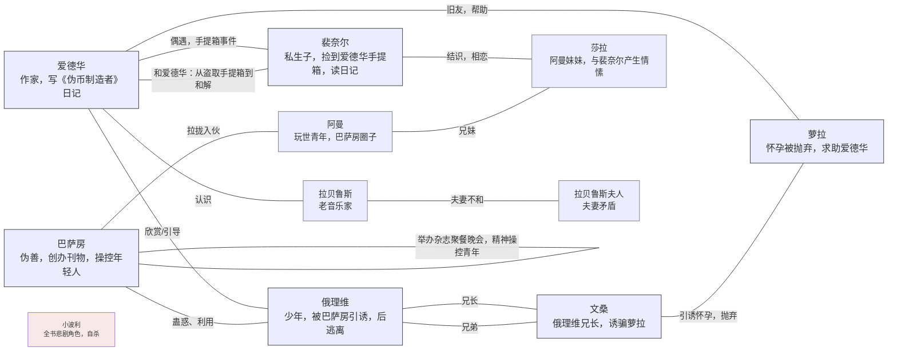

# 伪币制造者

纪德的（唯一一本）长篇小说。我认为初读纪德应该无脑避开这本。首先这本书作为小说而言并不那么好懂，纪德用一种“多线头编织”的方式展开整个情节，不同线头之间交叉错杂互相耦合，前后粘连，理清关系颇费脑细胞，另一方面，上译的这本是盛澄华的译本——已经是1945年的译本了，柳鸣九的前言也已经是快半个世纪前所作，其中的相当多译法已经不符合常用语习惯（比如“俄理维”->“奥利维尔”云云），所以读的时候我的体验并不算好，加之此书讲故事的手法具有某种现代性，淡而不轻易言表，乱而不刻意修整，就当拓宽一下阅读面。

人物关系整理如下：

对了，考虑这是作者晚年作品，因此用现代话说难免有了一种历经万事后的“爹味”，比如喜欢表达自己在道德文学和创作上的观点，看到时候能感受到一种絮叨，试举几例，我觉得我看完完全不知道在说什么。

## 摘抄

像我不爱他，与我不是很爱他。天呐，这之间有什么区别？在情感的领域中，真实的与意象的分不出什么区别。而如果想象中的爱已经足够使人爱，那么当你爱的时候，也许就是你想象中的爱。这样你立刻可以把爱减少一点，或者好，或者是在你所爱的身上离解一些爱的结晶。但是当一个人如果这样反省的话，他的爱不就已经不如先前那么热切了吗？

不断地谈论到突然的爱情结晶，但是迟缓的结晶分化，我却从来没有听人提到过。而这对我却是一桩更感兴趣的心理现象。我相信任何由恋爱而进入婚姻的夫妻中，经过相当的时期，都可以观察到这种现象。

----

精确不应求诸于详尽的描写，而应该**用恰到好处的三笔两笔打中读者自己的想象力** ... 孩子易感而不自觉的个性，往往借某种姿态去做自卫，而把他的真面目隐藏在后面。

我始终不习惯虚构。但我处身在现实面前，恰似一个画家对他的模特一样。他对后者说，取这样一种姿势，用这样一种我所需要的表情。在现今社会所攻击我的那些模特中，如果我认识他们的结构，我可以使他们顺我的意思动作，或至少在他们不自觉中，我可以提出某些问题随他们自己的意思去解决。那样在他们的反应中，我得到一种认识。纯粹出于小说家的立场，我才关切地感到，对他们的命运有干涉与策划的必要。

我觉得直到如今，文学中似乎忽视了某种悲剧意味。小说一般只注意到故事的起落、艳遇或是厄运、人情或是欲情，再是人物特别的性格，但完全忽略了生命的本质。

---

我希望，您能帮我起草一篇卷首的宣言。内容指出，但也不必太确定文学上的新倾向，我们以后再来商量。**譬如选定三个重要的形容词，不必一定要用新名词，普通的和极常用的都可以，但我们给它加上一种新的意义**，用来作为口号……譬如福楼拜，以后人们用音调和谐的、有节奏的来形容它……

**您看象征主义派最大的弱点在乎仅仅建立了一种美学原理**。文学中任何主义的出现，除了它特别的比较以外，一定还带有一种新的伦理观、新的条规、新的项目，对于爱情或人生的新见解。而象征主义它出来，他就很简单，他不顾人生，不求理解人生，他否认人生，他把人生丢开不管，这简直是荒谬绝伦。

---

局部的和特征的描绘必然多加上一重限制，没有一种心理真相不是特殊的。这话固然很对，但一切属于艺术的却都是普遍的。所以整个问题就在这，由特殊来表达一般，使一般由特殊中表达出来……

在小说中放入一些知识分子总是一件危险的事，它会使读者们头痛。从他们口中所说出的谈吐又不能是一些废话，而一切与他们接触的必然带有一种抽象的气氛……您应该明白，一本这样的书根本就不可能有所谓计划。如果我事先有任何决定的话，一切都会显得非常做作……

---

奈尔自始至终静听着爱德华的议论。他自己是一个持怀疑论的人，在他看来，爱德华几乎就是一个妄想者。可是在最后的瞬间，爱德华的雄辩使他颇为感动……

冒着思想小说的名，至今人们所提供给我们的实际仅仅是那些可诅咒的论文小说……==我承认我对思想比对人更感兴趣，比对一切更感兴趣==。思想有自己的生命，有它的斗争，它们和人一样能痛苦呻吟。无疑，人可以说我们认识思想，还是由于人的缘故。**就像我们看到芦苇摇头，才知道那有风经过，但风毕竟本身比芦苇更加重要**。

---

人类精神上的一切疾病，人们自以为痊愈了，其实正像医学上所说的那样，只是把疾病驱散了，而又患上一些新的疾病。 —— 圣伯夫

我开始窥见我书中所说的深奥的题旨。无疑，**这即是我现实世界与我们观念中的世界两者之间所发生的冲突**。表象世界所给予我们的诸相，以及我们个人对它所特有的解释，==构成了我们生命上的戏剧==。现实的抗拒使我们一己的理想不得不移诸于梦境，希冀于来世。现世所受的委屈，同时滋生我们对外来世的信念。重视现实的人们以事实出发，不止一己的见解与事实相背。

当我知道这件事的真相以后，和他提起过去的一切，我就使他明白，**可耻的是他不去追求真正的幸福，而偏爱幻想中的幸福……我对他说，经过一番努力所获得的报偿才是真正的幸福**……

“在欲念中，我们自己所最不注意到的是惰性。它是一切欲念中最厉害、最阴险的一种。虽然它的暴力并不明显，而为它所破坏的一切也不易发现……借惰性取得安息，是心灵所感受的无上乐趣。人每能因此突然放弃最热烈的追求、最坚定的决心。为给这欲念一种正确的概念，我们必须说，**惰性正像是心灵的福佑，它对心灵所感受的遗憾给予慰藉，它替代了一切未曾获得的幸福**。”

---

我会说拉封丹用这些诗句来描写他自己，**同时也就是替艺术家所做的一幅肖像。所谓艺术家，即是指对外在世界、对表面、对花感兴趣的人。** 接着我就用一幅学者的，也就是探究与发掘者的肖像来做对比。而最后这名学者所探究的正是艺术家所得到的。从事发掘的人，越发觉越深陷，越深陷越盲目，因真理即是表象，神秘即是形象，而人身上最深奥的就是他的皮囊。

---

俄里维说：“你始终那么爱她吗？”

不，裴奈尔说，我越来越爱她。我相信爱情的本质在于不能保持同一的局面，不进则退。它和友情所不同的正在于此。

---

我不知道我是否称得上人所谓的刻薄。我不能那么相信，因为我自己觉得心头还有太多的憎与恨。总之我并不在意，很久以来我克制足以使自己动心的一切，那是真的。但我并不是不懂敬慕为何物，或是类似的盲目的忠诚。只是生而为人，对人对己，我一律蔑视与憎。随时随地，我不愿，我不断听人反复说，文学艺术科学最终都为谋取人类的福利。这已经很能使我对这些东西作呕，但我不能不把这些命题来做反面的考察。到那时我才能舒一口气。是的，我衷心想象的适得其反，整个卑贱的人类协力在建造一种残酷的纪念物。我喜欢注意问题的反面，这有什么办法？我的脑筋必须头向地脚踏天才能得到平衡……

---

**我应该向你承认，一切人类排泄出的污秽物中，文学是最令我反胃的。我所看到的只是恭维与奉承，而我怀疑文学可以成为别的东西，除非它把过去的一切都扫除殆尽。我们皆既定的情感生活，而读者自以为也有同感，因为一切印成白纸黑字的，他全都相信**。作者借此投机，正像他以习俗认作是他艺术的基础一样。这些情感恰似筹码，所发出的声音是假的，但竟通行无阻。而人人都知道伪币足以销绝真币，结果有人把真的献给大众，倒反被看作是废纸。在这人人欺骗的社会中，真实的人反被看作是骗子。所以我必须向您声明，如果我来主编一份杂志，先得戳破纸老虎，废止一切所谓的美丽情感以及这些汇票：文字。