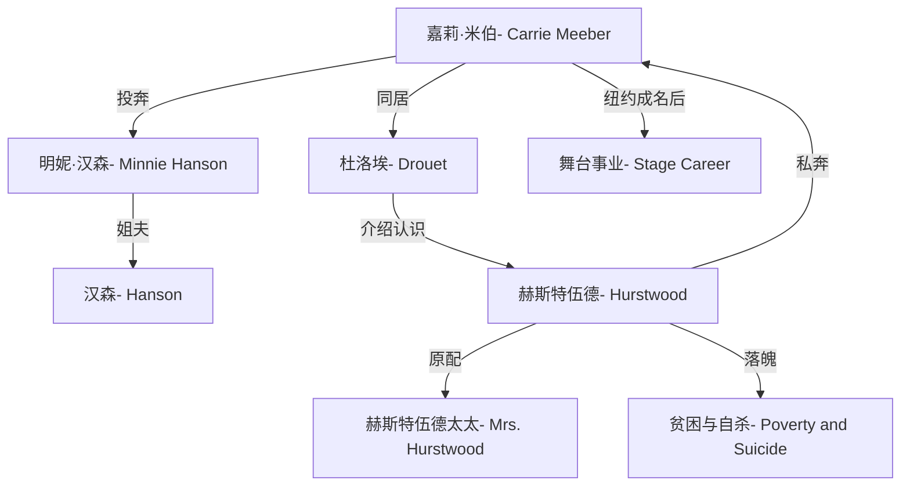

# 嘉莉妹妹

美国作家西奥多·德莱塞（Theodore Dreiser）的长篇小说，1900年出版，是美国自然主义文学的代表作之一。小说以乡村少女嘉莉进城谋生的经历为线索，一面写她借助舞台天赋向上攀升，一面写赫斯特伍德在纽约的步步沉沦，勾勒出资本主义都市中欲望、机遇与命运的冷酷图景。

## 故事情节

嘉莉妹妹从乡村来到芝加哥投奔姐姐，因贫困先后与推销员杜洛埃和酒店经理赫斯特伍德相识。她先与杜洛埃同居，后与赫斯特伍德私奔至纽约。赫斯特伍德事业失败、日渐堕落，嘉莉则凭借舞台天赋成为知名演员。最终赫斯特伍德穷困潦倒自杀，嘉莉虽获成功却仍感孤独。

## 人物关系图

## 人物表

| 人名                     | 外文名            | 身份与作用                                       |
| :----------------------- | :---------------- | :----------------------------------------------- |
| **嘉莉**·米伯            | Carrie Meeber     | 女主角，乡村少女，后成为知名演员                 |
| 明妮·汉森                | Minnie Hanson     | 嘉莉的姐姐，嘉莉初到芝加哥的投奔对象             |
| 汉森                     | Hanson            | 嘉莉的姐夫，普通工人，家境拮据                   |
| **杜洛埃**               | Charles Drouet    | 推销员，嘉莉的第一个情人，介绍她认识赫斯特伍德   |
| **赫斯特伍德**           | George Hurstwood  | 酒店经理，与嘉莉私奔至纽约，后穷困潦倒自杀       |
| 赫斯特伍德太太           | Mrs. Hurstwood    | 赫斯特伍德的原配，其离婚纠纷促使他铤而走险       |
