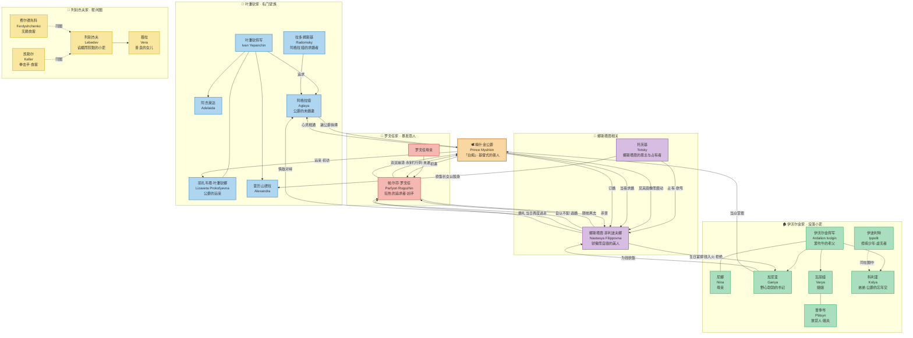

# 白痴 The Idiot

26年来北京后读的第一个真正意义上的长篇，相当不易，过程充满艰辛，堪称今日之长征。原因有几点。

(1) 人物关系的复杂、人性的多变狡黠，而这本来就是陀思妥耶夫斯基最擅长拿捏和刻画的，在这部小说里，人物的行为动机埋藏在相互串联的对话里，人人都窝藏小九九，但是无论高低贵贱，人又都有自己的激荡纠缠的内心、无法和解的自我。

(2) 俄国人名的变换。父名、小名、教名，穿梭着就从眼前晃过去了；

(3) 作家也要谋生，陀思妥耶夫斯基是那类过得不咋地的（甚至差点掉脑袋的）作家，后期为了糊口不得不急匆匆地在短时间内大量生产作品，于是不少地方充斥着啰嗦的解释与絮絮叨叨的侃天侃地，这些烟雾弹让我在第四部前半段的阅读中数度想要「快进到最后了事」。

想法上没怎么变：如果世界上真的有邪佞，有魔鬼，有一个东西是「恶」的化身，那ta一定看起来道貌岸然、衣冠楚楚，看起来让你觉得人畜无害；如果世界上真的有善，有至高的美，有一个东西是「正」的化身，那ta一定不会那么招你喜欢。

逻辑似乎可以这么说。一个「善」必然需要感召那些邪恶的人性，去缠斗，去得罪那些迷途的羔羊，去让良知昭明，而这种「必要的入世与拯救」，本身就注定会伤害那些借良知与善意的灰色地带牟利获福的众生，尽管众生在出发点上或许并无此意；一个「恶」必然要包含那种代表着「伪装」的邪祟，而这本身就注定需要扮演一个总能博得人信任、使人安心但是心怀鬼胎的冷漠残酷的「假善」的存在。

所以我更宁愿相信的是「文明化了的魔鬼」与「野蛮化了的上帝」这一组合。陀思妥耶夫斯基构建的梅诗金，在我看来是「文明化了的上帝」，而这个世界恰恰不允许这种事物的存在，文学作品的解答，就是找一个“精神病”的借口把它们囚禁或者放逐。这背后的逻辑简单到可怕：人都不是非黑即白的，人的多面性、在利益面前的狡猾与善变，在内心激烈情感面前的脆弱与渺小，都会在各种关系的交织下被放大。

这是人性的悲歌，却也是人所存在的必要条件。

!!! note "陀思妥耶夫斯基｜1868—1869｜《俄罗斯信使》连载"
    梅什金公爵——一个在瑞士疗养院治好癫痫、被人叫作「白痴」的纯洁之人——回到俄国，闯入一个由金钱、情欲与自尊交织的世界。他想以善意拯救所有人，最终却被这个世界吞没。

!!! example "资料来源"
    [Wikipedia: The Idiot](https://en.wikipedia.org/wiki/The_Idiot)

## 故事脉络

### 第一部
- 十一月，公爵自瑞士回国，火车上结识刚继承巨产的富商之子**罗戈任**与帮闲小吏**列别杰夫**。罗戈任正痴迷于美人**娜斯塔霞**。
- 公爵拜访远亲**叶潘钦将军**一家，见到夫人丽扎韦塔与三位千金，对高傲的**阿格拉娅**印象最深。
- **托茨基**原是娜斯塔霞的监护人与占有者，为脱身，他与将军合谋，出七万五千卢布把她「嫁」给加尼亚。
- 在**加尼亚**家，公爵见到娜斯塔霞的画像而心神震动；娜斯塔霞登门羞辱加尼亚，加尼亚当众掌掴公爵。
- 娜斯塔霞生日宴上，她当众把**罗戈任**送来的十万卢布扔进壁炉烧掉，拒绝加尼亚。公爵当场求婚，她却自认不配，随罗戈任离去，公爵追出。

### 第二部
- 半年后，公爵到**罗戈任**家中，两人交换十字架结为兄弟，又因娜斯塔霞彼此猜忌。罗戈任让他看霍尔拜因《死去的基督》，随后在楼梯间持刀行刺，公爵突发的癫痫救下两人。
- 众人到**帕夫洛夫斯克**消夏。无赖青年**布尔多夫斯基**冒认公爵恩人帕夫利谢夫之子前来索钱，被加尼亚当众揭穿。
- 痨病少年**伊波利特**当众发作，向众人索求爱与承认；娜斯塔霞当街揭穿**拉多姆斯基**伯父的丑闻。
- 公爵与**阿格拉娅**日渐心灵相通，阿格拉娅当众朗诵普希金《可怜的骑士》，暗指公爵。

### 第三部
- 公爵开始爱上阿格拉娅。公园音乐会上，娜斯塔霞当众用马鞭抽打一名军官，公爵上前拦阻被推倒。
- 阿格拉娅塞给公爵密约的字条；她收到娜斯塔霞的来信，信中坚称自己爱着阿格拉娅、求她嫁给公爵。
- 公爵生日宴上，**伊波利特**朗读自白，宣称次日日出将自杀，随后当众开枪，却因忘装底火而未遂。
- 公爵与阿格拉娅在绿椅上长谈，她逼问公爵对娜斯塔霞的感情；公爵只言怜悯而非爱。

### 第四部
- 叶潘钦家设宴引公爵进入上流社交圈，公爵却大谈反天主教与贵族，失手打碎名贵中国花瓶，又突发癫痫，给宾客留下恶劣印象。
- 阿格拉娅与娜斯塔霞当面交锋。娜斯塔霞命阿格拉娅带走公爵，阿格拉娅逼公爵当场抉择；公爵在两份同情间无法取舍，阿格拉娅绝望离去。
- 公爵与娜斯塔霞订婚，叶潘钦家与他决裂。婚礼当天，娜斯塔霞再次逃走，投入罗戈任。
- 公爵与罗戈任重逢，发现娜斯塔霞已被罗戈任刺死。罗戈任被判十五年苦役，流放西伯利亚。
- 公爵精神彻底崩溃，经拉多姆斯基奔走被送回瑞士疗养院，成了真正的「白痴」。阿格拉娅随一名波兰流亡者出走，此人既非富有也非伯爵。

## 人物与情节图

## 人物简表

| 人名             | 外文名                 | 身份与作用                                         |
| :--------------- | :--------------------- | :------------------------------------------------- |
| **梅什金公爵**   | Prince Myshkin         | 主角，「白痴」，善与同情的化身                     |
| **娜斯塔霞**     | Nastasya Filippovna    | 被托茨基占有的美人，骄傲而自毁                     |
| **罗戈任**       | Parfyon Rogozhin       | 富商之子，痴迷娜斯塔霞，最终杀她入狱               |
| **阿格拉娅**     | Aglaya Yepanchina      | 叶潘钦家幼女，公爵的未婚妻                         |
| **叶潘钦将军**   | Ivan Yepanchin         | 公爵的远亲，务实的老将军                           |
| **丽扎韦塔**     | Lizaveta Prokofyevna   | 将军夫人，公爵的远亲，性情急躁而善良               |
| **托茨基**       | Afanasy Totsky         | 富有的恩主，娜斯塔霞的占有者，想把她「转让」出去   |
| **加尼亚**       | Ganya Ivolgin          | 野心书记，为钱欲娶娜斯塔霞                         |
| **伊沃尔金将军** | Ardalion Ivolgin       | 加尼亚之父，爱吹牛的没落老将军                     |
| **列别杰夫**     | Lukyan Lebedev         | 谄媚而狡黠的小吏，公爵的房东与跟班                 |
| **伊波利特**     | Ippolit Terentyev      | 痨病少年，虚无主义者，自杀未遂                     |
| **拉多姆斯基**   | Yevgeny Radomsky       | 阿格拉娅的求婚者，由轻浮转为敬重公爵               |
