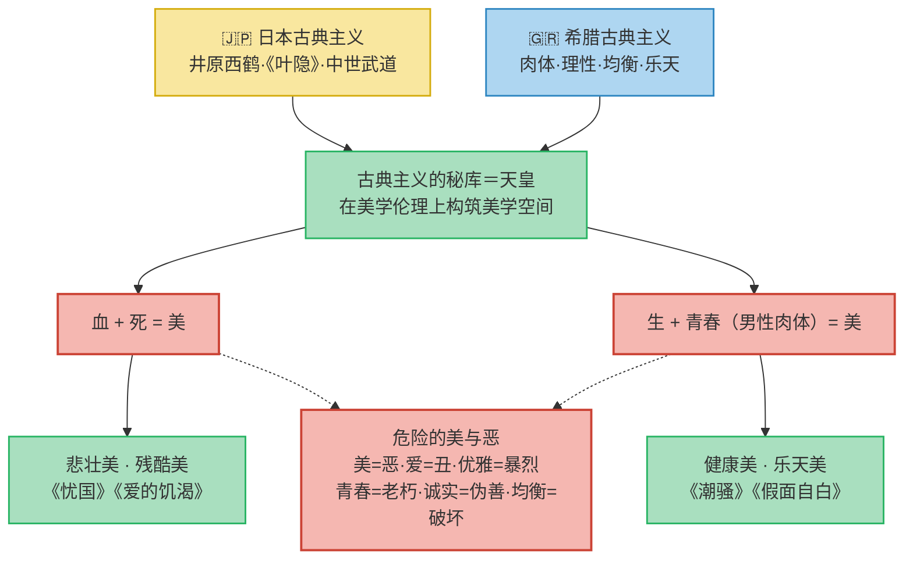
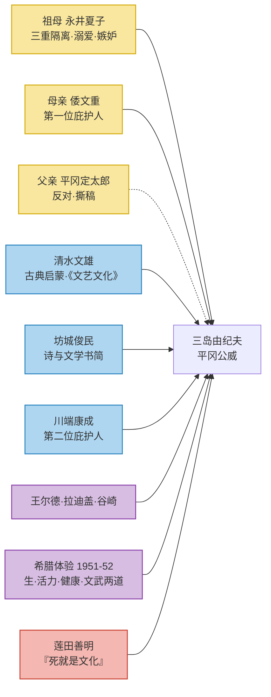

# 三岛由纪夫：生平与作品

!!! abstract "「日本悠久历史的骄子」"
    平冈公威以「三岛由纪夫」为名，把一生写成一道极端的美学方程：**血 + 死 = 美**，**生 + 青春（男性肉体）= 美**。他既是战后日本文坛的异数，也是自身观念的殉道者。

| -            | 内容                                                                      |
| :----------- | :------------------------------------------------------------------------ |
| **本名**     | 平冈公威（平岡公威）                                                      |
| **生卒**     | 1925 年 1 月 14 日 — 1970 年 11 月 25 日                                  |
| **出生地**   | 东京·四谷（官僚之家）                                                     |
| **笔名**     | 16 岁首次以「三岛由纪夫」发表小说；「三岛」一说取自父亲任职地静冈县三岛市 |
| **文学座标** | 战后派的对立面；「文化概念的天皇制」；文武两道                            |
| **核心命题** | 生与死、活力与颓废、健康与腐败、美与恶的对立交织                          |
| **代表作品** | 《假面自白》《潮骚》《金阁寺》《忧国》《丰饶之海》                        |

> 本笔记部分摘录自《怪异鬼才 三岛由纪夫传》。1994.12. 作家出版社。

---

## 一、家世与诞生

- **祖母系出永井氏**：祖母夏子的祖父**永井尚志**活跃于幕末，参与倒幕、箱馆战争，明治后任元老院大书记官，1876 年隐退；老来无子，领养嗣子**永井岩之丞**（夏子之父，大审院大法官，育有十二子女，创立宗族组织「樱木会」）。
- **祖母永井夏子**：永井家长女，幼时患歇斯底里，十岁（一说十二岁）被寄养在与明治天皇血缘极近的**有栖川宫家**五年，习诗画、受皇族礼仪。她因此养成<b>武士的骄矜</b>与<b>皇族的孤高</b>，性格自负、顽固、狂躁，独占欲极强。十八岁下嫁世代农家出身的小官吏**平冈定太郎**。
- **父亲平冈定太郎**：东京帝国大学法学系毕业，由内务省事务官起步，历任栎木县警察部长、广岛与宫城县内务部长、福岛县知事，后擢升**桦太厅长官**。1914 年因「基门斯事件」受贿案（接受德国基门斯公司十万日元政治献金，把桦太渔场权批给桦太渔业物产会社，款项转给原敬作竞选经费）被迫辞职，山本内阁亦随之倒台。
- **1925 年**，平冈家得子，借枢密院顾问、造船界巨头**古市公威**之名取名为「公威」。定太郎当着全家在奉书纸上挥毫写下「平冈公威」，置入壁龛。一位日本评论家因此称这个婴儿是「日本悠久历史的骄子」。

---

## 二、被锁住的三重隔离 —— 幼年

!!! quote "佐伯彰一《三岛由纪夫评传》"
    公威幼小的处境是「被锁在二三重隔离的状态下。首先是与母亲隔离，其次是与户外自然的隔离，第三是与同年代的游玩伙伴的隔离」。

- 祖母夏子把公威**拴在身边**：不许外出，不许自由去见父母；每天只准回父母身边半小时到一小时，超时即翌日罚停一天会面。
- 她对公威与母亲**倭文重**的母子之情怀有莫名的嫉妒；公威一提「妈妈」她便皱眉阻拦。
- 与世隔绝的病房里，公威退入**非现实的世界**：作画、听童话、溺于梦幻，甚至「记得」自己初生时澡盆边缘的样子。
- 童话里他不爱公主，只爱**王子**，尤其偏爱面临死亡、被杀害的年轻王子——《玫瑰妖精》《渔夫和人鱼》《被杀害的王子》；把紧身衣裤的体形与残酷的死结合在一起，竟产生一种<b>神秘的快感</b>。

---

## 三、文学觉醒：清水文雄、坊城俊民与母亲

- **学习院的身份自卑**：同学多为皇族、华族，公威是「连爵位也没有的平民子弟」；他从小在女孩子堆里长大，不会男孩的游戏，常被欺负。他借贝多芬姓名中的「芬」字（与日本家徽「纹」谐音）感叹平民出身的处境。
- **恩师清水文雄**：学习院国文教师、和泉式部专家。他读《酸模》发现少年天才，引导公威学习古典（《和泉式部日记》《古事记》《上田秋成全集》等），并介绍他认识**保田与重郎**与同人刊物《文艺文化》。一次雷雨课堂，他一句「式部写完日记之后被雷击……」被公威视为「极其宝贵的阅读古典文学的方法」。
- **挚友坊城俊民**：文艺部部长，高公威五个年级。两人每日交换长长的文学书简，互评诗作。坊城失恋的坦白，让公威说出：「所谓诗就是在这种时候拯救人的啊！」

> **阅读谱系**：王尔德（谷崎润一郎译《莎乐美》《狱中之歌》等）、拉迪盖《魔鬼附身》、谷崎润一郎。王尔德让他有「犹如被雷击一般的感觉」，拉迪盖则「燃起了我的斗志」——「疯狂地妒忌，狂热地梦想，必须同拉迪盖较量」。

- **母亲倭文重**：每稿必读、逐篇提意见、请先生审读，是公威的**第一位庇护人**；父亲梓则坚决反对，撕碎原稿、把《一千零一夜》也收起来。公威后来说：「唯有我母亲是最理解我的人。」「一般地说，作家的才能是从对母亲的执著中产生的，这是我的学说。」
- 16 岁，他以「三岛由纪夫」之名发表小说处女作**《鲜花盛时的森林》**；父亲怕他行将入伍、一去不返，暗中托人张罗了出版纪念会。

---

## 四、塞巴斯蒂昂之箭 —— 美的倒错

!!! quote "《假面自白》"
    「我穷其一生只用我的美学雕塑，也同样只用我的美学破坏不是这个世界的丑怪的巨像。」

- 13 岁那年，公威趁父亲出差，从橱柜深处翻出意大利文艺复兴画集，翻到一页便**神魂颠倒**：他认那是「专为我而存在、专等着我的画像」——雷尼（Guido Reni）的 **《圣塞巴斯蒂昂殉教图》**。
- 殉教者赤裸的青春肉体、射入腋窝与腹侧的箭、痛苦中渗出的「某种音乐般的倦怠的逸乐」，第一次击中了他，让他体会到「**无限痛苦与欢乐的焰火**」。
- <u>自此，他对男性形象、力、肉体与美产生倾倒：《假面自白》中自白对掏粪工、士兵、塞巴斯蒂昂等的向往，尤其发现学友**近江**那副「希腊雕塑式的壮实身躯」时的自我陶醉，标志着性觉醒与性倒错的萌芽</u>。

---

## 五、战争阴影下的两面性

- **体检落第**：征兵复查时公威体重仅「39.5 公斤」，被列为「第二乙种及格」，可推迟入伍；父亲故意让他回原籍兵库县农村应检，好让他的文弱「不显得突出」。
- **强制劳动**：先后被遣往静冈沼津、神奈川县海军工厂（图书馆管理员、挖掩藏零部件的壕沟），战争末期又去群马县中岛飞机制造厂做事务工作。
- **空袭中的美学**：他抱着稿子躲进防空洞，探头观赏大城市被空袭时「五彩缤纷的火光」，觉得「美极了」，像观赏「看似豪华的死和毁灭的大宴会一样的篝火」。他后来说：「在这样的日子里，确实是幸福……我的教养是旧书店的教养。」
- **赤纸与遗书**：1945 年 2 月，入伍通知（「赤纸」）送到，他写下「遗书」，叮嘱弟弟继承「皇军的貔貅」，末尾高呼「天皇陛下万岁！」二十年后，这纸遗书被重新发现，他撰《我的遗书》公诸于世，并反思其中真假难辨的自我。
- **两面性**（野口武彦）：一面与时代共有的狂热「爱国」情感共振，一面顽强坚守排他性的文学世界。三岛自称既是「时代的象征者」，又是「时代的落伍者」，「束手无策」。
- **莲田善明的影响**：莲田在《大津皇子论》中「死就是文化」一语，像闪电般击中年少的三岛。二十年后（1970 年 3 月），他为小高根二郎的传记《莲田善明及其死》作序，并在人生最后一次谈话中承认，自己终于明白莲田给予他的是什么。

---

## 六、战后废墟上的「赞美绝望」

- 1945 年 10 月 23 日，妹妹**美津子**因伤寒去世；初恋对象**笃子**不久与他人订婚、结婚。
- 他形容此后的心境：「此后二三年，我最接近死亡了。未来没有希望，唤起的过去都是丑恶。」「战后的一切失去真实，只是虚假，既没有值得共鸣的希望，也没有绝望。」
- 战败后美军占领、废除绝对主义天皇制，战后派作家以「近代的自我」批判天皇制。三岛则反其道而行，要在「否定战后的精神结构内」再构筑与战后派逆反方向的「美」——「过去的辉煌，现在化为死灰。希望只在过去。」他自称这是**「赞美绝望」**。
- 战后实验期：《香烟》被他称为「纯然是近代小说」，**川端康成**读后推荐发表，成为他「通往战后日本文坛的通行证」；《中世》被志贺直哉批评「净是梦」；第一部长篇《盗贼》模仿拉迪盖，由川端作序。
- 从此，除母亲之外，**川端康成**成为他文学上的**第二位庇护人**。

---

## 七、假面与真面 —— 青春三部作

=== "《假面自白》1949"

    一部「假面」的自白小说。战后精神空虚、失去「文化概念上的天皇制」这根支柱，他把对假想人物的心理分析与对自我的「活体解剖」结合，「犹如波特莱尔的所谓'让死囚来充当执行死刑的人'」，自认是「从精神危机中产生的排泄物」。它有别于日本自然主义私小说的外向型自白，是一种内向的、感情性与肉体性的自白。

=== "《爱的饥渴》1950"

    农园主儿媳**悦子**爱上了园丁**三郎**。她迷恋三郎健壮而温顺的肉体、处女般的羞怯、军人式的口气；发现三郎与美代相爱后，她妒忌、监视、折磨自己。小说把爱欲与占有推向极端，最终以悦子抡死三郎、血与死交错作结。

=== "《禁色》1951"

    三岛首次正面描写**男色**世界，将性倒错推入新的怪异领域。老作家**桧俊辅**其貌虽丑、妻与情人皆背叛他，便借助希腊雕像般的青年**南悠一**替自己报仇，由此树立「男性美」的理念，推翻「男人必须爱女人」的古老公理。评论家本多秋五说，它的主人公「不是美貌青年南悠一，而是战后派的时代本身」；唐纳德·金称其「在这之前，日本没有一个现代作家公开以男色作为小说的主题」。

---

## 八、希腊之解药：生、活力与健康

!!! quote "《阿波罗之杯》"
    「至少是希腊治愈了我的自我嫌恶和孤独，唤醒了尼采式的'对健康的意志'。我觉得我已经成为一个不会动不动就受伤的人了。」

- 1951—1952 年周游欧美，访问希腊。他惊叹：「希腊人相信美的不灭……而日本人是否相信美的不灭呢？这是个疑问。」
- 归国后「希腊热」达到绝顶，他积极练习**剑道、柔道**，锻炼肉体——后来「**文武两道**」的想法即由此萌生；同时进行文体改造，把欧洲莫朗、拉迪盖的文体与日本古典（森鸥外式的和洋结合）熔于一炉。
- 《[潮骚](../Novel/Chaosao.md)》1954：见笔记。
- **海·死·美**（《仲夏之死》《午后曳航》1954）：
    - 《仲夏之死》以海作为**恶**的形象，一举夺走一家六口中一半，将悲剧推向顶点；
    - 《午后曳航》的海虽亦与死相连，却是**美**的形象。小主人公**阿登**崇拜海员**龙二**如同崇拜海，当龙二为与母亲结婚而离开海上生活，阿登便认定他「背叛了美」，与伙伴以过量安眠药将他毒死，以保持海之美的象征的纯粹。

---

## 九、在丑与恶中创造美 ——《金阁寺》（1956）

摘抄、分析、介绍，参考 [金阁寺](../Novel/Jinge.md)。

三岛借此改写真善美的旧方程，设计出**绝对的美与丑、恶对立**的新方程，以创造「灭亡」的美。

---

## 十、文学基因的裂变 —— 2·26 三部曲

- 1960 年发表**《忧国》**，美学的基因以「2·26 事件」为背景发生裂变。中尉**武山**奉敕令去镇压同僚的前夜，与新婚妻子在肉体上尽情欢悦，又使之与即将到来的自杀（不愿镇压同僚而愧疚自戕）的肉体痛苦重叠。生与死、爱与死在同一瞬间达到「净化和陶醉的极至」。
- 三岛由此形成一种**悲壮美 / 残酷美**：《忧国》是他追求「残酷美」的实践，也是其「天皇美学观」的文学版。他自己承认，《忧国》「集中于我的各种因素」，「包括我这个作家的优劣」。
- 以此为中轴，辐射出 **《忧国》《十日菊》《英灵之声》**「2·26 事件三部曲」。作家安部公房批评说，若把职业军人理念化，爱与死的悲剧「没有必要选择'2·26 事件'作背景」。

---

## 十一、特异的精神结构：文化概念的天皇与「文武两道」

- **《文化防卫论》** 提出所谓「**文化概念的天皇制**」：把天皇抽象为「纯粹的美」，天皇成了他古典主义美学的秘库。
- **《太阳与铁》** 阐述「**文武两道**」的实质：以肉体的锻炼与语言的锻炼并行，追求精神与肉体、行动与艺术的统一。
- 1960 年代后期，三岛由文学转向政治行动，组建私人武装团体「**盾之会**」，自称要当「**丑盾**」。

---

## 十二、最后一天：从天才到疯子？

- **1970 年 11 月 25 日**，三岛由纪夫率盾之会成员进入东京市谷的自卫队驻地，在阳台向自卫队士兵发表演说，呼吁捍卫天皇与日本传统，随后当场剖腹自尽，由森田必胜介错。
- 围绕他究竟是「天才」还是「疯子」的争论，在他死后仍未平息。正如本书设问：「从天才到疯子？」——而三岛早已在自己的美学里给出了答案：**死就是文化**。

---

## 美的方程式

三岛将**日本古典主义**（井原西鹤的「男色」审美、《叶隐》的武士道、中世武道以死相赠的悲壮）与**希腊古典主义**（肉体、理性、均衡；享受生、崇拜生的乐天精神）两者融合，在紧张的对立中形成其内面「生与死、活力与颓废、健康与腐败」的交织循环。

??? note "延伸：两个方程式的"逆反"演绎"
    三岛经常带着逆反与冒险的精神演绎这套美学，提出一连串反转等式：**美＝恶、爱＝丑、优雅＝暴烈、青春＝老朽、诚实＝伪善、希望＝破灭、均衡＝破坏**。他在《反抗与冒险——自画像》中写道：「我穷其一生只用我的美学雕塑，也同样只用我的美学破坏……美神的幻影大概会出现同样只有我的美学的空间。」

---

## 影响谱系

---

## 主要作品一览

| 作品               |   年份    | 体裁         | 主题 / 关键词                                  |
| :----------------- | :-------: | :----------- | :--------------------------------------------- |
| 《酸模》           |   1938    | 短篇习作     | 少年天才初露；囚犯悔改的故事                   |
| 《鲜花盛时的森林》 |   1941    | 短篇         | 王朝文学风格；古典与现代结合                   |
| 《香烟》           |   1946    | 短篇         | 「纯然是近代小说」；川端推荐，文坛「通行证」   |
| 《中世》           |   1946    | 短篇         | 末世观的美学作品化；梦与轮回                   |
| 《盗贼》           |   1948    | 长篇         | 观念性的爱；青春的神秘和美；模仿拉迪盖         |
| 《假面自白》       |   1949    | 长篇（自白） | 性倒错；自我活体解剖；塞巴斯蒂昂               |
| 《爱的饥渴》       |   1950    | 长篇         | 悦子与三郎；爱欲·妒忌·血与死                   |
| 《禁色》           |   1951    | 长篇         | 男色；精神与肉体；俊辅与悠一                   |
| 《阿波罗之杯》     |   1952    | 游记         | 希腊体验；文体改造的宣言                       |
| 《潮骚》           |   1954    | 长篇         | 生·活力·健康；《达夫尼斯与赫洛亚》             |
| 《仲夏之死》       |   1954    | 短篇         | 海＝恶；死亡的顶点                             |
| 《午后曳航》       |   1954    | 长篇         | 海＝美；阿登毒死龙二                           |
| 《金阁寺》         |   1956    | 长篇         | 绝对美与丑；南泉斩猫；毁灭之美                 |
| 《忧国》           |   1960    | 短篇         | 2·26 事件；爱与死；残酷美                      |
| 《太阳与铁》       |   1968    | 随笔         | 文武两道；精神与肉体                           |
| 《丰饶之海》四部曲 | 1965—1970 | 长篇         | 梦与轮回；《春雪》《奔马》《晓寺》《天人五衰》 |

---

## 年谱

|   年份    | 事件                                                        |
| :-------: | :---------------------------------------------------------- |
|   1925    | 生于东京，本名平冈公威；出生在祖母永井夏子掌管的官僚之家    |
| 1931 前后 | 入学习院初等科；遭祖母「三重隔离」                          |
|   1938    | 13 岁，见雷尼《塞巴斯蒂昂·圣殉教图》，终身难忘              |
|   1940    | 15 岁，大量写诗；发表《酸模》                               |
|   1941    | 16 岁，以「三岛由纪夫」发表《鲜花盛时的森林》               |
|   1944    | 学习院高等科毕业，入东京帝国大学法学部；被遣往工厂劳动      |
|   1945    | 接「赤纸」写下遗书；8 月战败；10 月妹妹美津子病逝；初恋失意 |
|   1946    | 战后正式跃登文坛（《香烟》）；《中世》                      |
|   1947    | 从东京大学法学部毕业                                        |
|   1948    | 《盗贼》                                                    |
|   1949    | 《假面自白》——确立战后作家地位                              |
|   1950    | 《爱的饥渴》                                                |
|   1951    | 《禁色》；开始周游欧美                                      |
|   1952    | 访问希腊；《阿波罗之杯》                                    |
|   1954    | 《潮骚》《仲夏之死》《午后曳航》                            |
|   1956    | 《金阁寺》                                                  |
|   1958    | 与杉山瑶子结婚                                              |
|   1960    | 《忧国》；2·26 三部曲                                       |
|   1968    | 《太阳与铁》；组建盾之会                                    |
|   1970    | 《丰饶之海》完稿；11 月 25 日于市谷自卫队驻地剖腹自尽       |

!!! example "资料来源"
    本书为一部三岛由纪夫传记，照片涵盖其家世、幼年、文学觉醒、战争体验、战后创作与美学思想等章节。本页据书页照片转录整理，年谱中 1947 年后的部分条目综合本书章节结构补全。
