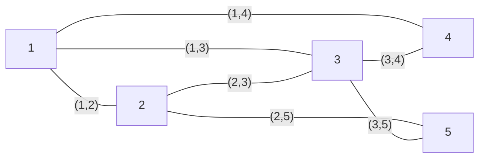

# 图论


!!! abstract "路径规划的必修课。"
    参考：
    
    1. [Stanford Course](https://web.stanford.edu/~ashishg/cs261/win21/notes/)
    2. [MIT Course (Old version)](https://ocw.mit.edu/courses/15-082j-network-optimization-fall-2010/download/)

## 概念

**图，(Graph)**
:   是一个由点集 $V$ 和 $V$ 中有限个元素的无序对构成的一个集合 $E$，二者组合形成的二元组。记为 $G = (V, E)$。 $V$ 中的元素 $v_i$ 称为顶点（Vertex），$E$ 中的元素称为边（Edge）。
    
    按照图中边的不同属性，可以分为**有向图、无向图**。

    给边或者点赋予一定权重，表示类似成本、流量等的图，称为**赋权图**。

**环（Loop）**
:   一条边的两个端点如果相同，称为“环”。包含环的图，就是有环图。两个顶点如果有多重边，称为多重图。==一个既没有环也没有多重边的图，称为**简单图**。==


**连通图**
:   如果一个图任意两点间至少存在一条链，那么这个图称为连通图；

**树**
:   连通且不含圈的无向图称为树；

## 最小生成树

### Prim算法

- 每次从没有选的边里选一条边，这个边权值要尽可能地小，并且使它和已有的不够成圈，直到选够 $n - 1$ 个边为止。

!!! tip "🔔 ：小提示"
    有一个并查集的优化：迅速找到父节点并且回到源。

----


### Kruskal 算法

- 找每一个圈，把圈里最大的边删除掉，直到没有圈为止。

## 最短路问题: 建模、对偶问题

**问题描述**
:   设 $G = (V,E)$ 为连通图，$V$ (vertex) 表示图中的点的集合，$A$ (arcs)表示图中边的集合；图中各边 $(i, j)$ 有对应权重 $c_{ij}$，设 $s, t$ 为图中任意两点，求一条路径 （也就是一系列边的序列），使得它是从 $s$ 到 $t$ 的所有路径中总权最小的路径。


<!--  -->


**决策变量**
:   $x_{ij}$ 一个 $0-1$ 变量，表示从 $i$ 到 $j$ 的边是否被选中。选中为$1$，否则$0$。

**目标函数**
:   $$\min \sum \limits_{i \in V} \sum \limits_{j \in V} c_{ij} x_{ij}$$

**约束条件**

$$\begin{aligned}
\sum_j x_{ij} - \sum_i x_{ji} =  \quad 
\begin{cases}
1 \quad i = \text{start} \\ 
-1 \quad i = \text{terminal} \quad \quad \forall i \in V\\ 
0 \quad else
\end{cases}
\end{aligned}$$

如果精简一下，记图为 $G = (V, A)$, 决策变量精简为 $f_e$ 表明边 $e$ 是否被选择，这里为了和下面对偶问题结合起来，我们把这个变量松弛成一个线性变量。见（2）。

$$\min \sum_{e\in E} f_e c_e$$


$$\begin{aligned}
\begin{cases}
\begin{align}
\sum_{(i, j) \in E} f_{(i,j)} - \sum_{(j, i) \in E} f_{(j, i)} & = d_j \quad \quad \forall j \in V  \\ 
f_e & \geq 0 \quad \quad \forall e \in E
\end{align}
\end{cases}
\end{aligned}$$

其中 $d_j$ 是节点 $j$ 的度 （出度 - 入度）。最后路径上每个节点的度只有-1, 1, 0 三种。


!!! question "针对这个建模的进一步思考：最短路问题的对偶问题。"
    **最短路问题同样有对偶问题，那么这个对偶问题的含义是什么？**

    为了方便写对偶问题，我们可以先把原问题约束 (1) 写成**对偶标准形式**(dual standard form)。（等号变大于等于，含义不变）
    
    $$\sum_{(i, j) \in E} f_{(i,j)} - \sum_{(j, i) \in E} f_{(j, i)}  \geq d_j \quad \quad \forall j \in V$$

    因为对于每个非start / terminal 节点，节点是流平衡的，而start节点的 $d_j = 1$，terminal 节点的 $d_j = -1$，所以所有节点的 (1) 约束加起来，可以写成 $0 \geq 0$。故而本质上该约束可替换等号。

我们分析一下原来最短路问题的**矩阵表示**。

$f_e = \begin{bmatrix} f_{(1,1)} & f_{(1,2)} & f_{(1,3)} & ... & f_{(2,3)} &  f_{(2,4)} & ... & f_{(a, b)}  \end{bmatrix}^T$，是一个向量，长度为边的数量。（2）对该向量里的每个元素做了约束。我们专注于约束（1），尤其是转化为对偶标准形式后的约束 （1）。

可以看出，右端项 $d()$ 是一个长度为节点数的向量。除了start  / terminal 外，出入度均相等，于是：$d() = \begin{bmatrix} 1 & 0 & 0 & 0 & ... & 0 & -1 \end{bmatrix}^T$

而左侧的系数矩阵，是一个 $V \times E$ 的矩阵。把所有的边提取成 $f_e$。对于如下的图：



可以用下面的约束表示原问题：

$$\begin{bmatrix}  1 & 1 & 1 & 0 & 0 & 0 & 0 \\ -1 & 0 & 0 & 0 & 1 & 1 & 0 \\ 0 & -1 & 0 & -1 & -1 & 0 & 1 \\ 0 & 0 &  -1 & 1 & 0 & 0 & 0 \\ 0 & 0 & 0 & 0 & 0 & -1 & -1\end{bmatrix} \begin{bmatrix} f_{(1,2)} \\ f_{(1,3)} \\ f_{(1,4)} \\ f_{(3,4)} \\ f_{(2,3)} \\ f_{(3,5)} \\ f_{(3,7)} \end{bmatrix} = \begin{bmatrix} 1 \\ 0  \\ 0 \\ 0 \\ -1 \end{bmatrix}$$

**系数矩阵实际上就是一个以列表示边、以行表示节点的图的关联矩阵。** 现在，我们开始写对偶问题。

简单理解，我们把原问题的右端项移到目标函数上，目标函数的决策向量长度就是$d$的长度，也就是节点的数量。而右端项大部分是0，我们用 $l_v$ 表示原问题每个约束（其实就是每个节点 $v$ ）对应的对偶决策变量。可以看到除了start / terminal 外，其他节点的 $l_v$ 都是0，所以**对偶问题目标函数**即为：

$$\max l_s - l_t$$

其中 $l_t$ 对应 `terminal` 节点的对偶变量，$l_s$ 对应 `start` 节点的对偶变量。

现在开始写**对偶问题的约束条件**。

由于原问题的系数矩阵本身是边的关联矩阵，而原问题的每一列代表一条边出入节点的情况，只有一个$-1$和$1$，其余均为$0$，这个结构转置形成对偶问题的系数矩阵后，对应对偶问题决策变量的系数，所以对偶问题的约束中，每一行只有一个$-1$和$1$，其余系数为$0$. 转置后的行数对应原问题的列，也就说明，对偶问题的约束个数 = 边的个数。


所以，**最短路问题的对偶问题**最终可以写成：

$$\max l_s - l_t$$

$$\begin{aligned}
\begin{cases}
\begin{align}
l_p - l_q \leq c_{(p,q)}, \quad \forall (p,q) \in E \quad \\
l_v \geq 0, \quad \forall v \in V \quad 
\end{align}
\end{cases}
\end{aligned}$$

$l_p$ 和 $l_q$  是由每个边 $(p,q)$ 的节点决定的，对应的是原问题的约束条件里与节点 $p$ 和 $q$ 有关的对偶变量。

!!! note "一个启发式的理解思路。"
    可以把原来的图中的每一个边想象成一个无法被拉伸的线，以节点相连接，边 $e$ 的长度是 $c_e$，现在一只手拎住起点 $s$，一只手拎住重点 $t$ ，尽可能地把这个提线木偶一样的东西捋直、捋顺，（也可以理解为拎着起点，让图自然下垂）。

    此时有一些边因为比较长，会悬挂在边上（比如下图中的边 $(1,3), (3,5), (5,4)$，有一些边自然下垂 $(1,2), (2,5)$。

    等这张图不能再继续下垂（不能继续被你拉长捋得更顺了），此时从 $s$ 到 $t$ 的距离一定是最长的（朴实地形容就是：我们无法再捋任何一条边使得从s到t更长了），这就对应的是我们的**对偶问题**；
    
    反过来来想，这条从 $s$ 到 $t$ 的路径，也就是从 $s$ 到 $t$ 的最短路，因为如果不走这个路，必须要从那些悬挂着的边上走，这些边明显没有被拉紧，也就一定不会比我这条路更短了。这种方式下，对应的就是我们的**原问题**：最短路问题。


!!! quote "[参考链接：MIT](https://ocw.mit.edu/courses/15-082j-network-optimization-fall-2010/87ee338a701dcd52784c86daef642113_MIT15_082JF10_lec15.pdf) | [参考链接：Stanford](https://web.stanford.edu/~ashishg/cs261/win21/notes/l9_note.pdf)"


## 求解最短路问题： Dijkstra 算法（单源最短路）

!!! abstract "关于Dijkstra算法"
    一种用于计算从单个源节点到图中所有其他节点的最短路径的算法。适用于加权图，其中要求**边的权重为非负值**。

<!--  -->


- Dijkstra算法采用的是一种==贪心==的策略。声明一个列表`dis`来保存**源点到各个顶点的最短距离**，并用一个集合 $T$ 保存**已经找到了最短路径的顶点的集合**。每次都从当前能抵达的节点中的最近节点出发，继续下一步寻路的过程，直到抵达目的地。

**步骤**

:   1. 初始时，源点 $s$ 的路径权重被赋为 0 。若对于顶点 $s$, 存在能走行的边 $(s,m)$ （意思是可以到达节点 $m$），则把 `dis[m]`设为 $c_{sm}$，同时把到所有其他的节点（也就是$s$在这一步无法到达的节点）的长度设为无穷大。这一步骤，集合`T`中仅包含源点。
    2. 从列表`dis`中选择**最小值**，以及这个最小值对应的节点（记为 $z$）。该值就是源点 $s$ 到该节点 $z$ 的最短路径。把该点加入到 $T$ 中。OK，此时已经找到了一个点的最短路，但还没到达目标节点。
    3. 这时，我们需要看，新加入的顶点 $z$ 是否可以**到达其他节点**，并且看看通过该节点到达其他点的路径长度是否比当前`dis`中存储的“当前最短路”要更短。如果是，那么就**更新**这些顶点在 `dis` 中的值。 
    4. 更新完毕后，继续重复 3, 直到 $T$ 中包含了图的所有顶点。

!!! warning "注意！"
    - 无法处理负权问题。
    - 节点较多的话，计算量会加大。

伪代码如下：


当然，在编程实现的过程中，会涉及到：**从当前所有可达节点中选择路径最短的那个节点**的过程，一般而言会通过**优先队列**来实现。

```Python
import heapq
def dijkstra(graph, start, end):
    """
    实现Dijkstra算法，计算从起点到给定终点的最短路径和路径长度。
    """
    # 初始化距离字典和前驱节点字典
    distances = {vertex: float('infinity') for vertex in graph}
    distances[start] = 0
    predecessors = {vertex: None for vertex in graph}
    # 使用优先队列来存储和获取当前已知的最短距离的节点
    priority_queue = [(0, start)]
    while priority_queue:
        current_distance, current_vertex = heapq.heappop(priority_queue)
        # 如果到达终点，构建路径并返回结果
        if current_vertex == end:
            path = []
            while current_vertex is not None:
                path.append(current_vertex)
                current_vertex = predecessors[current_vertex]
            path.reverse()  # 逆序
            return current_distance, path
        # 如果从优先队列中取出的距离大于当前记录的距离，继续
        if current_distance > distances[current_vertex]:
            continue
        # 遍历当前节点的所有邻接节点
        for neighbor, weight in graph[current_vertex].items():
            distance = current_distance + weight
            # 只有当计算出的新距离小于当前记录的距离时，才更新距离和前驱节点，并将邻接节点添加到优先队列
            if distance < distances[neighbor]:
                distances[neighbor] = distance
                predecessors[neighbor] = current_vertex
                heapq.heappush(priority_queue, (distance, neighbor))
    return float('infinity'), []  # 如果终点不可达，返回无穷大距离和空路径

# 测试用的图数据
graph = {
    'A': {'B': 1, 'C': 4},
    'B': {'A': 1, 'C': 2, 'D': 5},
    'C': {'A': 4, 'B': 2, 'D': 1, 'E': 3},
    'D': {'B': 5, 'C': 1, 'E': 5},
    'E': {}
}

# 调用Dijkstra算法
start_node = 'A'
end_node = 'E'
distance, path = dijkstra(graph, start_node, end_node)

# 输出结果
print(f"从起点 {start_node} 到终点 {end_node} 的最短路径距离为：{distance}")
print(f"从 {start_node} 到 {end_node} 的最短路径为：{' -> '.join(path)}")

```

## 求解最短路问题：Floyd算法 （多源最短路）

!!! quote "Floyd算法又称为插点法，是一种利用**动态规划的思想**寻找给定的加权图中多源点之间最短路径的算法。相比Dijkstra，**Floyd算法适用于负权图。**"
    思路是基于一个图的权值矩阵，求出它的每两点间的最短路径矩阵。

- 我们的点如果在最短路上，那么我们用这个点去松弛最短路上的边的话，必定会松弛成功。因此，我们要想知道一个点在哪些点的最短路上，我们只需要用这个点去松弛所有边即可，松弛指的就是，把这个点作为一个“中转点”，遍历其出度和入度，如果距离更短就刷新图；
- 从一开始的邻接矩阵，遍历所有的节点，每次加入新结点都要更新==所有顶点之间的最短距离==，直到==所有顶点均可以作为中间顶点==之后（也就是对所有点都做了一次松弛），才算更新完毕，即可得到最终结果。

1. 输入权重矩阵： $D^{(0)} = D$
2. 计算 $D^{(k)} = (d^{(k)}_{ij})_{n \times n}$，其中： $d^{(k)}_{ij} = \min \{ d^{(k - 1)}_{ij}, d^{(k - 1)}_{ik} + d^{(k - 1)}_{kj} \}$
3. $D^{(n)} = (d^{(n)}_{ij})_{n \times n}$，元素 $d^{(n)}_{ij}$ 就是从 $i$ 到 $j$ 的最短路长。


例题：给定初始矩阵，求任意两点的最短路长。


首先输入我们的权重矩阵，把边的权重输入进去。

$$D = D^{(0)} = \begin{bmatrix}
0 & 5 & 1 & 2 & \infty \\
5 & 0 & 10 & \infty & 2 \\
2 & 3 & 0 & 2 & 8 \\
2 & \infty & 6 & 0 & 4 \\
\infty & 2 & 4 & 4 & 0
\end{bmatrix}$$

首先，我们输入权重矩阵（如上），$a_{ij}$ 表示从$i$到$j$的距离。开始计算！

我们会依次固定网络中每一个节点。假设我们固定节点1，也就是先固定第1行和第1列的所有元素，对于矩阵中其他的元素，假设它的位置是 $(i,j)$，也就是第 $i$ 行第 $j$ 列，那么将原来的值 $a_{ij}$ 与第 $1$ 列第 $i$ 行和第 $1$ 行第 $j$ 列的元素的和进行比较： $a_{ij} = \min \{ a_{ij}, a_{0j} + a_{i0}\}$，进行更新。

以此类推，第二次迭代专注节点2，第三次迭代专注节点3...，推广：如果我们专注于节点  $k$，那么固定第 $k$ 行和第 $k$ 列的元素不变，对于其他的元素，$a_{ij} = \min \{ a_{ij}, a_{kj} + a_{ik}\}$

$$D^{(1)} = \begin{bmatrix}
\colorbox{yellow}{0} & \colorbox{yellow}{5} & \colorbox{yellow}{1} & \colorbox{yellow}{2} & \infty \\
\colorbox{yellow}{5} & 0 & (6) & (7) & 2 \\
\colorbox{yellow}{2} & 3 & 0 & 2 & 8 \\
\colorbox{yellow}{2} & (7) & (3) & 0 & 4 \\
\infty & 2 & 4 & 4 & 0
\end{bmatrix}, D^{(2)} = \begin{bmatrix}
0 & \colorbox{yellow}{5} & 1 & 2 & (7) \\
\colorbox{yellow}{5} & \colorbox{yellow}{0} & \colorbox{yellow}{6} & \colorbox{yellow}{7} & \colorbox{yellow}{2} \\
2 & \colorbox{yellow}{3} & 0 & 2 & (5) \\
2 & \colorbox{yellow}{7} & 3 & 0 & 4 \\
(7) & \colorbox{yellow}{2} & 4 & 4 & 0
\end{bmatrix}$$

$$D^{(3)} = \begin{bmatrix}
0 & (4) & \colorbox{yellow}{1} & 2 & (6) \\
5 & 0 & \colorbox{yellow}{6} & 7 & 2 \\
\colorbox{yellow}{2} & \colorbox{yellow}{3} & \colorbox{yellow}{0} & \colorbox{yellow}{2} & \colorbox{yellow}{5}\\
2 & (6) & \colorbox{yellow}{3} & 0 & 4 \\
(6) & 2 & \colorbox{yellow}{4} & 4 & 0
\end{bmatrix}, D^{(4)} = \begin{bmatrix}
0 & 4 & 1 & \colorbox{yellow}{2} & (6) \\
5 & 0 & 6 & \colorbox{yellow}{7} & 2 \\
2 & 3 & 0 & \colorbox{yellow}{2} & 5 \\
\colorbox{yellow}{2} & \colorbox{yellow}{6} & \colorbox{yellow}{3} & \colorbox{yellow}{0} & \colorbox{yellow}{4} \\
6 & 2 & 4 & \colorbox{yellow}{4} & 0
\end{bmatrix},$$

$$D^{(5)} = \begin{bmatrix}
0 & 4 & 1 & 2 & \colorbox{yellow}{6} \\
5 & 0 & 6 & (6) & \colorbox{yellow}{2} \\
2 & 3 & 0 & 2 & \colorbox{yellow}{5} \\
2 & 6 & 3 & 0 & \colorbox{yellow}{4} \\
\colorbox{yellow}{6} & \colorbox{yellow}{2} & \colorbox{yellow}{4} & \colorbox{yellow}{4} & \colorbox{yellow}{0}
\end{bmatrix},$$

```Python

def floydWarshall(graph):
    dist = list(map(lambda i: list(map(lambda j: j, i)), graph))
    for k in range(V):
        for i in range(V):
            for j in range(V):
                dist[i][j] = min(dist[i][j],
                                 dist[i][k] + dist[k][j])

```

!!! note "如果我不仅想知道最短路径多长，还想知道最短路径是什么，怎么修改？"
    - 增加一个路径矩阵，记录路径，每次更新最短路径的时候，把路径矩阵也更新一下即可。


!!! warning "注意"
    不能把负权加上最小的负数变整数这种做法，因为不是分阶段的问题，不能单纯地用DP的思想去解决。


## 最大流问题

!!! warning "2024.06.12 已标记为待补充 / 修订。"

> 网络流，充分利用各个弧的容量，使得网络的通过流量最大。
>
> 有的问题可能有多个源/汇，但是可以加上虚拟源/汇，使得变成**单一源/汇**的问题，进而构成最大流问题
> **容量网络**：只有一个入次为0的点（源），只有一个出次为0的点（汇），其他的都是中间节点的网络；

- 最大流最小割定理：任何一个可行流的容量不会超过任何一个割集的容量。
    - 引入割的概念：把所有的点分成两个集合，起点在其中一个集合中，终点在另一个集合中，割的大小就是从起点割集S到终点割集T的个数；
    - 最小割：就是所有的割中，求一个最小的割，使得其容量**最小**；
    - 最大流和最小割问题是互为对偶的问题；

### Ford-Fulkson算法

> 在已经“犯错误”的情况下， 依然能够找到下一条路径；
>
> 前一次没有用过的边依然保留，为了纠正以前路径，可以把之前的路径反过来；
> 如此来实现不断地删除增广链；
> 
- 可行流f为最大流的充分必要条件是： ==当且仅当网络不存在增广链==;
- 给出一初始可行流，例如 fij =0
-  寻找增广链，若存在，通过添加反向路径，允许水流按照原来方向流回去，制造反向图residual graph；
      - 如果找到增广链，则通过该增广链调整、增加网络流
      - 若不存在增广链，则网络流不可再增加。求得最大流
- 管道网络中每条边的最大通过能力（容量）是有限的，实际流量不超过容量。最大流问题(maximum flow problem)，一种组合最优化问题，就是要讨论如何充分利用装置的能力，使得运输的流量最大，以取得最好的效果。求最大流的标号算法最早由福特和福克逊于1956年提出，20世纪50年代福特(Ford)、福克逊(Fulkerson)建立的“网络流理论”，是网络应用的重要组成成分。

## 最小费用流问题（Ford-Fulkerson 迭加算法）

- 输油管道，每个管道有运油量约束和成本，现在要从一个出发地运送特定数量的油（小于最大流的数量）到某个目的地，怎么运输，让成本最小。


- 思路：尽可能发挥费用少的链路的潜力，寻找一条从i到j的费用最少的链路，并使得它的潜力充分发挥出来，直到达到运输数量要求； 总是在费用最小的增广路上增加流值，直到流值达到v。
- 标号算法
1. Dijkstra算法先找到最短路（也就是费用最少的路），用所有边上弧容量最小的；
2. 调整容量
3. 对所有弧，如果是饱和的，就设置原有的弧反向，如果不饱和，就设置一条反向负权弧（权重为费用）
4. 重复1-3操作，不过找最短路时候可以用枚举法操作结束的标志就是再也不存在一条从起点到终点的最短路；
      1. 注意：如果遇到了逆向流，流量最小值要用其原本的流量大小进行比较；

!!! Tip ""
    Ford-Fulkerson 的核心在于“塑造反向弧”，给了一个“纠错”的空间。使得一个已有的（但是效果不那么好的）可行的解可以在后续找的过程中被优化；

### 用最小费用流表示其他问题的建模

- 运输问题：直接设置一个汇总发地和一个汇总收地，只不过从汇总发地到原发地、原收地到汇总收地的费用全部是0；
  
- 指派问题：设置虚拟头和虚拟尾；每一个人到一个任务的容量都是1，费用即为成本；虚拟头到每个人、虚拟尾到每件事的容量也是1；

- 最短路问题：同指派问题，容量设置成1；起点供应节点设置一单位，需求供应节点设置一单位；
- 最大流问题：头和尾之间连接一条成本$M$的线路

