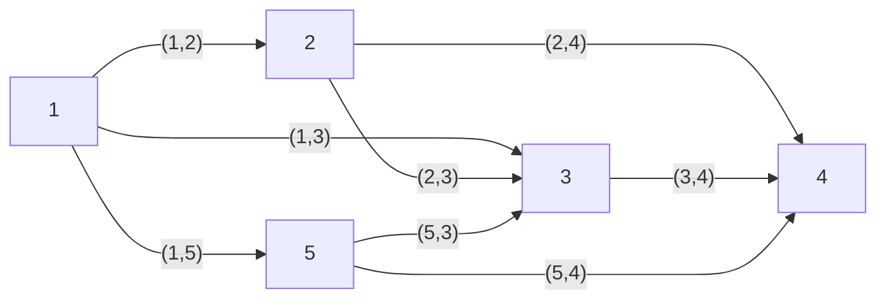
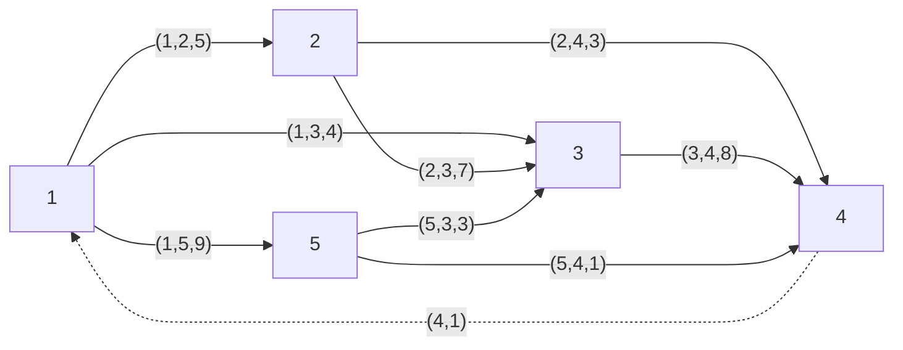

# 最小费用流：建模，拓展

最小费用流问题（`Minimal Cost Flow Problem`）在网络最优化问题中占有核心地位。可以表述如下：

> 给定图 $G(V,E)$，对每个节点 $v_i$ 均给定实数 $b_i$， 如果 $b_i > 0$，那么称 $b_i$ 为发点，可以供给资源，$b_i$ 的值为该点的供给量。如果 $b_i < 0$，那么称 $b_i$ 为收点，需要接收资源， $-b_i$ 为该点的需求量。若  $b_i = 0$，那么称 $b_i$ 为转运点。
>
> 对于每条边 $e_j$，给定实数 $c_j$，它是在边 $e_j$ 上每单位流量的费用，称为费用系数。再给定正数 $u_j$，它是边 $e_j$ 上流量的上界。


最小费用流的问题就是要确定每个边上的流量 $x_j$，使得不超过上界限制，并满足各个节点的供需要求，同时又使得**总费用最小**。对于网络，我们引入一个 $m \times n$ 的矩阵 $A$。其中每个元素按照如下标准取值：

$$\begin{aligned}\begin{equation*}
a_{ij} = \begin{cases}
1, \hspace{10pt} \text{if } e_j \quad \text{starts from} \quad v_i \\
-1, \hspace{10pt} \text{if } e_j \quad \text{ends at} \quad v_i \\
0, \hspace{10pt} \text{Otherwise}
\end{cases}
\end{equation*}\end{aligned}$$

写成矩阵形式，如下：

$$\begin{bmatrix} 1 & 1 & 0 & 0 & 0 & 1 & 0 & 0 \\ -1 & 0 & 1 & 1 & 0 &  0 & 0 & 0 \\  0 & -1 & -1 & 0 & 1 & 0 & -1 & 0 \\ 0 & 0 & 0 & -1 & -1 & 0 & 0 & -1 \\ 0 & 0 & 0 & 0 & 0 & -1 & 1 & 1 \end{bmatrix}$$

即可表示如图的网络。



在前面介绍最短路问题的时候，我们也出现了这个矩阵，**一般称之为节点-边关联矩阵（Node-edge incidence matrix）。** 

事实上，最小费用流模型可以视为一种基于边的建模方式。由于上述矩阵的列数 = 边数，所以假设我们的决策变量是针对每一条边而言的，那么关联矩阵乘决策向量，正好构成了约束条件的左端项，同时约束条件的个数也就对应了节点个数，可以用此刻画节点中的流量关系。以矩阵乘法形式给出就是：

$$\begin{bmatrix} 1 & 1 & 0 & 0 & 0 & 1 & 0 & 0 \\ -1 & 0 & 1 & 1 & 0 &  0 & 0 & 0 \\  0 & -1 & -1 & 0 & 1 & 0 & -1 & 0 \\ 0 & 0 & 0 & -1 & -1 & 0 & 0 & -1 \\ 0 & 0 & 0 & 0 & 0 & -1 & 1 & 1 \end{bmatrix} \begin{bmatrix} x_1 \\ x_2 \\ x_3 \\ x_4 \\ x_5 \\ x_6 \\ x_7 \\ x_8 \end{bmatrix}= \begin{bmatrix} b_1 \\ b_2 \\ b_3 \\ b_4 \\ b_5 \end{bmatrix}$$


!!! note "节点-边关系矩阵"
    $m \times n$ 的矩阵，行表示节点，列表示边。

    对每一列而言，有且仅有一个1和一个-1，1表示从该节点出发，-1表示到该节点。0表示与该节点无关。

    对每一行而言，可能有多个1和多个-1，因为一个节点可能有多条边出发/到达，1的个数，表示从该节点出发的边数（出度）；-1的个数，表示到达该节点的边数（入度）。


于是，我们给出最小费用流的数学模型：

$$\min \mathbf{cx}$$

$$\begin{aligned}
\begin{cases}
\begin{align}
\mathbf{Ax} = \mathbf{b} \quad\\
\mathbf{0} \leq \mathbf{x} \leq \mathbf{u} \quad
\end{align}
\end{cases}
\end{aligned}$$

其中，$\mathbf{A}$ 就是节点-边关系矩阵，$\mathbf{x}$ 是边的流量向量，长度等于边的数量； $\mathbf{b}$ 是每个节点的供求向量，长度等于节点的数量。$\mathbf{u}$ 是边的流量限制向量，限制每条边的流量大小。

对于约束 (1) 中的每一个约束，可以表示为：

$$\sum \limits_{j \in E} a_{ij} x_j = b_i , \forall i \in V$$

实际上，左边就是：

$$\sum \limits_{j \in E} a_{ij} x_j = \sum \limits_{a_{ij} = 1} x_{j} - \sum \limits_{a_{ij} = -1} x_j  , \forall i \in V$$

>（因为如果 $a_{ij} = 0$，就不会出现 $x_j$ ）。

等式右边的第一个和式，对应的是所有从 $v_j$ 离开的流量；第二个和式，对应所有汇入 $v_j$ 的流量。 

不失一般性，我们可以假设供求总是平衡的，也就是 $\sum_{i \in V} b_i = 0$，对于供大于求的图 ($\sum_{i \in V} b_i > 0$)，可以设置一个虚拟节点，吸收全部的过剩供给量，从每个发点添加一个虚拟边到这个虚拟节点，这个虚拟边的费用是0。这样就转化为一个供求平衡的最小费用流问题。

最小费用流问题是网络流问题的**重要基础**，事实上，许多问题均可以被转化为这类问题，或者是最小费用流问题的一个特例。下面展开几个例子。

---

<br><br>


## 从最小费用流到运输问题

运输问题，具体的问题描述同样可以参考[第三章](./Chapter3.md)。这里简要复习一下。

!!! note "运输问题"
    给定一张图$G(V,E)$，所有节点分为供给节点和需求节点两类。各个供给节点之间没有边相连，各个需求节点之间也没有边相连，但是供给和需求节点之间可以相互抵达。以图论的概念表示，网络图就是一个Bipartite Graph（二分图，概念的具体解释见本笔记最后）。

    - 问题:我们需要在事先给定运费和供给量的情况下，规划从不同供给节点到不同需求节点运送的货物量，使得总运输成本最小，同时还能满足所有需求节点的需求。

在[第三章](./Chapter3.md)，我们已经给出了运输问题在供需平衡下的建模， 由于我们考虑的是不带转运的运输问题，因此建模如下：

$$\mathop{\min} \hspace{4pt} z = \sum \limits^{m}_{i = 1} \sum \limits^{n}_{j = 1} c_{ij}x_{ij}$$

$$s.t \hspace{4pt} \left\{ \begin{aligned} \sum \limits^{n}_{j=1} x_{ij} = a_i , i = 1,2,..,m \\ \sum \limits^{n}_{i=1} x_{ij} = b_j , j = 1,2,..,n   \\  x_{ij} \geq 0, i = 1,2,...m, j = 1,2...n  \end{aligned}  \right.$$

这里的决策变量 $x_{ij}$ 是基于节点的，表示从 $i$ 地到 $j$ 地的流量。我们同样可以基于最小费用流模型框架给出模型，差异在于，基于最小费用流模型的决策变量是基于边的。 $y_{ij}$ 表示边 $(i,j) \in E$ 从 $i$ 流到 $j$的流量。我们保持节点-边关系矩阵 (incidence-matrices)不变，作为系数矩阵， $c_{ij}$ 表示边 $(i,j)$ 上的运输成本。所以可以给出等价模型：

$$\mathop{\min} \hspace{4pt} z = \sum \limits_{(i,j) \in E} c_{ij} y_{ij} $$

$$\begin{aligned}
\begin{cases}
\begin{align}
\sum \limits_{ (i, j) \in E} y_{ij} - \sum \limits_{(j, i) \in E} y_{ji} = d_i, \quad \forall i \in V \\
y_{ij} \geq 0, \quad \forall (i,j) \in E
\end{align}
\end{cases}
\end{aligned}$$

这里的右端项 $d_i$ 表示：运输问题下，节点 $i$ 的需求情况。由于节点区分供给点和需求点，因此，有如下情形：

1. 如果 $i$ 是供给点，记该点的供给量为  $a_i$，则 $d_i = a_i$；
2. 如果 $i$ 是需求点，记该点的需求量为 $b_i$，则 $d_i = -b_i$。

事实上，基于此，我们也可以很容易地写出基于边的建模框架下，带转运的运输问题的模型。

!!! info "解答"
    实际上，你只需要更改一下  $d_i$ 的定义即可，除了收地、发地外，还要考虑中转地，中转地不存储货物，因此中转点的 $d_i = 0$，也就是流平衡约束。

## 从最小费用流到指派问题

指派问题可以视为运输问题的一个特例，实际背景是把 n 个活分配给 n 个人去做，每个人做不同工作有不同的时间，每个人都做一个工作，使得总时间最少。

上面已经写了最小费用流 -> 运输问题，只需要稍微修改就可以得到分配问题的建模。

> 限制每个节点的供给/需求量都是1，每个边上的流量只能为0或者1.

<br>
<br>

----

## 从最小费用流到最短路问题

从最小费用流模型也可以推导出最短路问题的建模。一句话概括一下最短路：

> 已知一个网络上各边长度，要求出从图上给定的节点 $v_s$ 到 节点 $v_t$ 的最短路径。

事实上，只需要把最小费用流的系数 $c_{ij}$ 换成边 $(i,j)$ 的长度。令右端项中 $b_s = 1, b_t = -1$，其他 $b_i = 0$，就得到了最短路问题的模型。==这其实就是限制了除了起点和终点外其他节点都视为转运点==。各个边上的流量上界 $u_{ij}$ 取 1。这样就得到了最短路问题的建模。这个建模可以参考[第七章：最短路问题](./Chapter7.md) .

<br><br><br>
---

## 从最小费用流到最大流问题

从最小费用流模型也可以推导出最大流问题的建模。一句话概括一下最大流：

> 已知一个网络上各边的流量上界，每个边的流量不得超过这个界限。要求出从图上给定的节点 $v_s$ 到 节点 $v_t$ 的最大流量。

看起来不怎么相关的问题，也可以转化为最小费用流进行计算。




我们先令**原来网络**中所有边的费用系数向量 $\mathbf{c} = \mathbf{0}$，令供求向量 $\mathbf{b} = \mathbf{0}$。此时，我们**添加一条虚拟边** $e_{n+1}$，从终止节点 $v_t$ 通往 $v_s$。这条边上的流量没有上界限制，其费用系数为负数，设为 $-1$。

此时，求解包括这个虚拟边的新图的最小费用流问题。因为虚拟弧的边权（费用系数）是负数，所以当目标函数最小的时候，这条边上的流量也就达到最大了。同时，由于 $\mathbf{b} = \mathbf{0}$,意味着所有节点的流入和流出的流量是相等的（包括起点和终点，与之不同的，最小费用流问题的起终点的流量不为0）。

上述建模方式，实际上是，虚拟边流入节点 $v_s$ 的流量就要在原来的网络上以零费用返回节点 $v_t$，也就是说只要不超过各边的流通能力，从 $v_s$ 到 $v_t$ 的流量越大。


## 延伸：二分图

推荐初学者从这个[B站视频](https://www.bilibili.com/video/BV1Pb421H7Sj/?p=10)开始入门，可以从一个很简单的小问题入手。

!!! note "weekend dinner scheduling"
    假设你有A,B,C,D,E,F,G,H,I，共9个好朋友，你想在周五和周六两个晚上请他们吃饭。但是，朋友之间有一些关系，如下所示：

    

    这里的每个边表示相邻的两个朋友互相**不喜欢**。所以，这两个人必定不能在同一个晚上过来dinner。

    用严格的语言表达就是，我们需要安排每个人来参加晚餐的日期（周五或者周六，只有两天），使得：
    
    1. 这里的每个朋友都来参加一次并且仅参加一次晚餐
    2. 任何不喜欢的朋友不能在同一天参加晚餐；

上面那个问题，不用多说，可以得到一些有意思的观察：

1. A人缘很好，没有人不喜欢ta，所以ta可以在周五或者周六任意一天来参加晚餐；
2. F,G, H 颇有隔阂，他们彼此不喜欢，所以，他们不能在同一天参加晚餐；但是，总共只有2个晚餐，无论如何都不可能在周五或者周六都来参加；比如周五邀请F，那么周六只能邀请G或者H，但是G和H彼此不喜欢，所以，他们不能在同一天参加晚餐。所以，他们只能选择其中一天参加晚餐；

这也就意味着，==并不是所有的这种图都能找到解，上图就是一个经典的不可解的情况== 。

**我们要问的问题是：对什么样的图，这样的问题是有解的？**

先思考一下下一张图。如果我们缓和GH之间的关系，他们之间不再互相讨厌了，图就变成了：


诶，这个时候就可以发现，我们可以找到一个解了。

比如。我们从B开始，依次给所有人安排日期：

> B安排在周五，那么C在周六，同理D在周五，而E也在周六；
>
> 继续，由于D在周五，所以F在周六，所以GHI都在周五。A随便给ta安排一个时间即可。

所以可以有：

|     周五      |    周六    |
| :-----------: | :--------: |
| B, D, G, H, I | A, C, E, F |

我们实际上把每个节点都划分为两类，一类是周五，一类是周六。所以，这个图实际上是一个二分图(Bipartite Graph)。我们把图画成如下的情形：


诶，你会发现，左边的每个节点之间，都**不互相连接**（也就是在左侧节点集合内部不存在相连的边），右边的每个节点之间，也不互相连接；==所有的链接都是左边的一个节点连接到右边的节点。==

------

### 从二分图到图着色

现在我们换一个阐述问题的思路。假设我们现在有两个颜色，红色和蓝色。我们希望给每个节点都涂上颜色，使得相邻的节点不能是同一种颜色。**这实际上和上面那个安排聚餐日期是一样的，你可以想象成“红色”对应周五聚餐的人；“蓝色”对应周六聚餐的人，以此类推；**

我们把“能够用上述规则用两种颜色进行染色”的图，称为 `2-colorable` 的。可以发现，如果一个图是二分图，那么它一定可以被2-colorable；反过来，如果一个图2-colorable，那么它一定是二分图；同时我们补充，如果一个图没有任何边，那么它也算一个二分图。

!!! question "现在，我们关注的重点是: 怎么判断一个图是2-colorable的？"

如果你有一定注意力，你可以发现，出现3-循环的图一定是不可能2-colorable，比如第一张图GFH的关系；

你也可以发现，出现4-循环的图不一定不能2-colorable，假如ABCD首尾相连，我们可以把AC放在同一天，BD放在同一天，这样也可以2-colorable。

推广第一个结论，你可以发现**奇数循环**的图一定不能2-colorable。而偶数循环则不一定。

我们也可以写出一个简单的检查二分图染色问题的代码：

```Python
def bipartiteGraphColor(graph, start, coloring, color):
    if start not in graph:
        return False, {}

    if start not in coloring:
        coloring[start] = color
    elif coloring[start] != color:
        return False, {}
    else:
        return True, coloring

    if color == 'Sha':
        newcolor = 'Hat'
    else:
        newcolor = 'Sha'

    for vertex in graph[start]:
        val, coloring = bipartiteGraphColor(graph, vertex, coloring, newcolor)
        if val == False:
            return False, {}

    return True, coloring


if __name__ == "__main__":
    graph1 = {
        "A": [],
        "B": ['C'],
        "C": ['B', 'D'],
        "D": ['C', 'E', 'F'],
        "E": ['D'],
        "F": ['D', 'G', 'H', 'I'],
        "G": ['F'],
        "H": ['F'],
        "I": ['F'],
    }

    print(bipartiteGraphColor(graph1, 'A', {}, 'Sha'))
```
