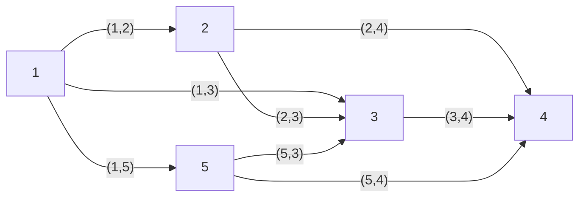
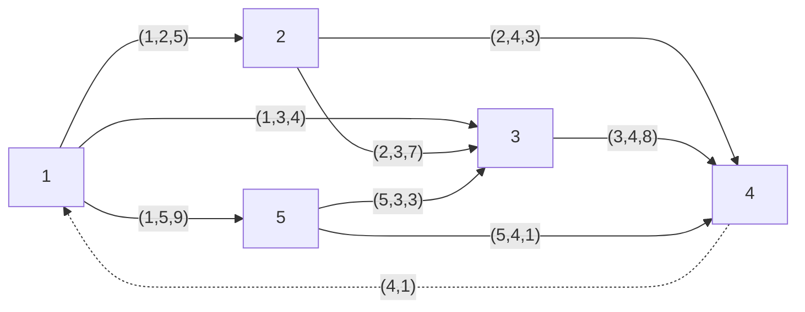

# 最小费用流：建模，拓展

最小费用流问题（`Minimal Cost Flow Problem`）在网络最优化问题中占有核心地位。可以表述如下：

> 给定图 $G(V,E)$，对每个节点 $v_i$ 均给定实数 $b_i$， 如果 $b_i > 0$，那么称 $b_i$ 为发点，可以供给资源，$b_i$ 的值为该点的供给量。如果 $b_i < 0$，那么称 $b_i$ 为收点，需要接收资源， $-b_i$ 为该点的需求量。若  $b_i = 0$，那么称 $b_i$ 为转运点。
>
> 对于每条边 $e_j$，给定实数 $c_j$，它是在边 $e_j$ 上每单位流量的费用，称为费用系数。再给定正数 $u_j$，它是边 $e_j$ 上流量的上界。

最小费用流的问题就是要确定每个边上的流量 $x_j$，使得不超过上界限制，并满足各个节点的供需要求，同时又使得**总费用最小**。对于网络，我们引入一个 $m \times n$ 的矩阵 $A$。其中每个元素按照如下标准取值：

$$\begin{aligned}\begin{equation*}
a_{ij} = \begin{cases}
1, \hspace{10pt} \text{if } e_j \quad \text{starts from} \quad v_i \\
-1, \hspace{10pt} \text{if } e_j \quad \text{ends at} \quad v_i \\
0, \hspace{10pt} \text{Otherwise}
\end{cases}
\end{equation*}\end{aligned}$$

写成矩阵形式，如下：

$$\begin{bmatrix} 1 & 1 & 0 & 0 & 0 & 1 & 0 & 0 \\ -1 & 0 & 1 & 1 & 0 &  0 & 0 & 0 \\  0 & -1 & -1 & 0 & 1 & 0 & -1 & 0 \\ 0 & 0 & 0 & -1 & -1 & 0 & 0 & -1 \\ 0 & 0 & 0 & 0 & 0 & -1 & 1 & 1 \end{bmatrix}$$

即可表示如图的网络。

```mermaid
flowchart LR
    1-- (1,2) --->2
    1-- (1,3) --->3
    1-- (1,5) --->5
    2-- (2,3) --->3
    2-- (2,4) --->4
    3-- (3,4) --->4
    5-- (5,3) --->3
    5-- (5,4) --->4
```

在前面介绍最短路问题的时候，我们也出现了这个矩阵，**一般称之为节点-边关联矩阵（Node-edge incidence matrix）。** 

事实上，最小费用流模型可以视为一种基于边的建模方式。由于上述矩阵的列数 = 边数，所以假设我们的决策变量是针对每一条边而言的，那么关联矩阵乘决策向量，正好构成了约束条件的左端项，同时约束条件的个数也就对应了节点个数，可以用此刻画节点中的流量关系。以矩阵乘法形式给出就是：

$$\begin{bmatrix} 1 & 1 & 0 & 0 & 0 & 1 & 0 & 0 \\ -1 & 0 & 1 & 1 & 0 &  0 & 0 & 0 \\  0 & -1 & -1 & 0 & 1 & 0 & -1 & 0 \\ 0 & 0 & 0 & -1 & -1 & 0 & 0 & -1 \\ 0 & 0 & 0 & 0 & 0 & -1 & 1 & 1 \end{bmatrix} \begin{bmatrix} x_1 \\ x_2 \\ x_3 \\ x_4 \\ x_5 \\ x_6 \\ x_7 \\ x_8 \end{bmatrix}= \begin{bmatrix} b_1 \\ b_2 \\ b_3 \\ b_4 \\ b_5 \end{bmatrix}$$

!!! note "节点-边关系矩阵"
    $m \times n$ 的矩阵，行表示节点，列表示边。

    对每一列而言，有且仅有一个1和一个-1，1表示从该节点出发，-1表示到该节点。0表示与该节点无关。

    对每一行而言，可能有多个1和多个-1，因为一个节点可能有多条边出发/到达，1的个数，表示从该节点出发的边数（出度）；-1的个数，表示到达该节点的边数（入度）。

于是，我们给出最小费用流的数学模型：

$$\min \mathbf{cx}$$

$$\begin{aligned}
\begin{cases}
\begin{align}
\mathbf{Ax} = \mathbf{b} \quad\\
\mathbf{0} \leq \mathbf{x} \leq \mathbf{u} \quad
\end{align}
\end{cases}
\end{aligned}$$

其中，$\mathbf{A}$ 就是节点-边关系矩阵，$\mathbf{x}$ 是边的流量向量，长度等于边的数量； $\mathbf{b}$ 是每个节点的供求向量，长度等于节点的数量。$\mathbf{u}$ 是边的流量限制向量，限制每条边的流量大小。

对于约束 (1) 中的每一个约束，可以表示为：

$$\sum \limits_{j \in E} a_{ij} x_j = b_i , \forall i \in V$$

实际上，左边就是：

$$\sum \limits_{j \in E} a_{ij} x_j = \sum \limits_{a_{ij} = 1} x_{j} - \sum \limits_{a_{ij} = -1} x_j  , \forall i \in V$$

>（因为如果 $a_{ij} = 0$，就不会出现 $x_j$ ）。

等式右边的第一个和式，对应的是所有从 $v_j$ 离开的流量；第二个和式，对应所有汇入 $v_j$ 的流量。 

不失一般性，我们可以假设供求总是平衡的，也就是 $\sum_{i \in V} b_i = 0$，对于供大于求的图 ($\sum_{i \in V} b_i > 0$)，可以设置一个虚拟节点，吸收全部的过剩供给量，从每个发点添加一个虚拟边到这个虚拟节点，这个虚拟边的费用是0。这样就转化为一个供求平衡的最小费用流问题。

最小费用流问题是网络流问题的**重要基础**，事实上，许多问题均可以被转化为这类问题，或者是最小费用流问题的一个特例。下面展开几个例子。

---

  

## 从最小费用流到运输问题

运输问题，具体的问题描述同样可以参考[第三章](./Chapter3.md)。这里简要复习一下。

!!! note "运输问题"
    给定一张图$G(V,E)$，所有节点分为供给节点和需求节点两类。各个供给节点之间没有边相连，各个需求节点之间也没有边相连，但是供给和需求节点之间可以相互抵达。以图论的概念表示，网络图就是一个Bipartite Graph（二分图，概念的具体解释见本笔记最后）。

    - 问题:我们需要在事先给定运费和供给量的情况下，规划从不同供给节点到不同需求节点运送的货物量，使得总运输成本最小，同时还能满足所有需求节点的需求。

在[第三章](./Chapter3.md)，我们已经给出了运输问题在供需平衡下的建模， 由于我们考虑的是不带转运的运输问题，因此建模如下：

$$\mathop{\min} \hspace{4pt} z = \sum \limits^{m}_{i = 1} \sum \limits^{n}_{j = 1} c_{ij}x_{ij}$$

$$s.t \hspace{4pt} \left\{ \begin{aligned} \sum \limits^{n}_{j=1} x_{ij} = a_i , i = 1,2,..,m \\ \sum \limits^{n}_{i=1} x_{ij} = b_j , j = 1,2,..,n   \\  x_{ij} \geq 0, i = 1,2,...m, j = 1,2...n  \end{aligned}  \right.$$

这里的决策变量 $x_{ij}$ 是基于节点的，表示从 $i$ 地到 $j$ 地的流量。我们同样可以基于最小费用流模型框架给出模型，差异在于，基于最小费用流模型的决策变量是基于边的。 $y_{ij}$ 表示边 $(i,j) \in E$ 从 $i$ 流到 $j$的流量。我们保持节点-边关系矩阵 (incidence-matrices)不变，作为系数矩阵， $c_{ij}$ 表示边 $(i,j)$ 上的运输成本。所以可以给出等价模型：

$$\mathop{\min} \hspace{4pt} z = \sum \limits_{(i,j) \in E} c_{ij} y_{ij} $$

$$\begin{aligned}
\begin{cases}
\begin{align}
\sum \limits_{ (i, j) \in E} y_{ij} - \sum \limits_{(j, i) \in E} y_{ji} = d_i, \quad \forall i \in V \\
y_{ij} \geq 0, \quad \forall (i,j) \in E
\end{align}
\end{cases}
\end{aligned}$$

这里的右端项 $d_i$ 表示：运输问题下，节点 $i$ 的需求情况。由于节点区分供给点和需求点，因此，有如下情形：

1. 如果 $i$ 是供给点，记该点的供给量为  $a_i$，则 $d_i = a_i$；
2. 如果 $i$ 是需求点，记该点的需求量为 $b_i$，则 $d_i = -b_i$。

事实上，基于此，我们也可以很容易地写出基于边的建模框架下，带转运的运输问题的模型。

!!! info "解答"
    实际上，你只需要更改一下  $d_i$ 的定义即可，除了收地、发地外，还要考虑中转地，中转地不存储货物，因此中转点的 $d_i = 0$，也就是流平衡约束。

## 从最小费用流到指派问题

指派问题可以视为运输问题的一个特例，实际背景是把 n 个活分配给 n 个人去做，每个人做不同工作有不同的时间，每个人都做一个工作，使得总时间最少。

上面已经写了最小费用流 -> 运输问题，只需要稍微修改就可以得到分配问题的建模。

> 限制每个节点的供给/需求量都是1，每个边上的流量只能为0或者1.

 
 

----

## 从最小费用流到最短路问题

从最小费用流模型也可以推导出最短路问题的建模。一句话概括一下最短路：

> 已知一个网络上各边长度，要求出从图上给定的节点 $v_s$ 到 节点 $v_t$ 的最短路径。

事实上，只需要把最小费用流的系数 $c_{ij}$ 换成边 $(i,j)$ 的长度。令右端项中 $b_s = 1, b_t = -1$，其他 $b_i = 0$，就得到了最短路问题的模型。==这其实就是限制了除了起点和终点外其他节点都视为转运点==。各个边上的流量上界 $u_{ij}$ 取 1。这样就得到了最短路问题的建模。这个建模可以参考[第七章：最短路问题](./Chapter7.md) .

   

---

## 从最小费用流到最大流问题

从最小费用流模型也可以推导出最大流问题的建模。一句话概括一下最大流：

> 已知一个网络上各边的流量上界，每个边的流量不得超过这个界限。要求出从图上给定的节点 $v_s$ 到 节点 $v_t$ 的最大流量。

看起来不怎么相关的问题，也可以转化为最小费用流进行计算。

```mermaid
flowchart LR
    1-- (1,2,5) --->2
    1-- (1,3,4) --->3
    1-- (1,5,9) --->5
    2-- (2,3,7) --->3
    2-- (2,4,3) --->4
    3-- (3,4,8) --->4
    5-- (5,3,3) --->3
    5-- (5,4,1) --->4
    4-. (4,1) -.->1
```

我们先令**原来网络**中所有边的费用系数向量 $\mathbf{c} = \mathbf{0}$，令供求向量 $\mathbf{b} = \mathbf{0}$。此时，我们**添加一条虚拟边** $e_{n+1}$，从终止节点 $v_t$ 通往 $v_s$。这条边上的流量没有上界限制，其费用系数为负数，设为 $-1$。

此时，求解包括这个虚拟边的新图的最小费用流问题。因为虚拟弧的边权（费用系数）是负数，所以当目标函数最小的时候，这条边上的流量也就达到最大了。同时，由于 $\mathbf{b} = \mathbf{0}$,意味着所有节点的流入和流出的流量是相等的（包括起点和终点，与之不同的，最小费用流问题的起终点的流量不为0）。

上述建模方式，实际上是，虚拟边流入节点 $v_s$ 的流量就要在原来的网络上以零费用返回节点 $v_t$，也就是说只要不超过各边的流通能力，从 $v_s$ 到 $v_t$ 的流量越大。

---

## 最小费用流问题的对偶

考虑最小费用流问题的原始线性规划形式：

\[
\begin{aligned}
\min \quad & \sum_{(i,j)\in E} c_{ij} x_{ij} \\
\text{s.t.} \quad & \sum_{(i,j)\in E} x_{ij} - \sum_{(j,i)\in E} x_{ji} = b_i, \quad \forall i \in V \\
& 0 \le x_{ij} \le u_{ij}, \quad \forall (i,j) \in E
\end{aligned}
\]

其中节点‑边关联矩阵 \(A\) 隐含在第一个约束中。这是一个典型的线性规划：等式约束对应每个节点，变量有上界。

引入对偶变量：

- 对每个节点 \(i\) 的等式约束，引入**节点势** \(\pi_i\)（无符号限制，因为等式约束对应自由变量）。
- 对每条边的上界约束 \(x_{ij} \le u_{ij}\)，引入**非负对偶变量** \(w_{ij} \ge 0\)。

则对偶问题可写为：

\[
\begin{aligned}
\max \quad & \sum_{i\in V} b_i \pi_i - \sum_{(i,j)\in E} u_{ij} w_{ij} \\
\text{s.t.} \quad & \pi_i - \pi_j - w_{ij} \le c_{ij}, \quad \forall (i,j)\in E \\
& w_{ij} \ge 0, \quad \forall (i,j)\in E
\end{aligned}
\]

- 第一个约束来自原始变量 \(x_{ij}\) 的系数。若边 \((i,j)\) 从 \(i\) 指向 \(j\)，则它在节点 \(i\) 的约束中系数为 \(+1\)，在节点 \(j\) 的约束中系数为 \(-1\)，因此对应对偶变量贡献为 \(\pi_i - \pi_j\)，再减去 \(w_{ij}\)

> 因为 \(x_{ij} \le u_{ij}\) 的约束方向是 \(\le\)，对偶变量取非负，在拉格朗日函数中会产生 \(-w_{ij}\) 项），最终形成 \(\pi_i - \pi_j - w_{ij} \le c_{ij}\)。

- 目标函数中，\(\sum b_i \pi_i\) 来自原始等式右端项，\(-\sum u_{ij} w_{ij}\) 来自上界约束的右端项（因为不等式方向是 \(x_{ij} \le u_{ij}\)，对偶后取负号）。

---

### 最优性条件 (Optimality Conditions)

（作为一年后的更新，）这一章节补充**如何求解**（算法）、**如何判断最优**（最优性条件）以及**经典建模案例**（Caterer Problem）。注意，下面会用到一些常见术语比如 Residual Network. 它在实际含义上与神经网络的略有区别。

在最大流问题中，我们只关心残差网络中的**容量**；而在最小费用流中，我们必须同时关心残差网络中的**费用**。

对于当前的可行流 $x$，残差网络 $G(x)$ 的定义如下：

*   **前向弧** $(i, j)$：若 $x_{ij} < u_{ij}$，则存在弧 $(i, j)$。
    *   残差容量：$r_{ij} = u_{ij} - x_{ij}$
    *   费用：$c_{ij}$
*   **后向弧** $(j, i)$：若 $x_{ij} > 0$，则存在弧 $(j, i)$。
    *   残差容量：$r_{ji} = x_{ij}$
    *   费用：$-c_{ij}$ （**注意**：退回流量相当于减少成本，故费用为负）

定义弧 $(i, j)$ 的**既约费用 (Reduced Cost)** $c_{ij}^\pi$ 为：

$$ c_{ij}^\pi = c_{ij} - \pi_i + \pi_j $$

**物理含义**：
*   $\pi_i$ 可以理解为节点 $i$ 的“势能”或“标高”。
*   $c_{ij}^\pi$ 表示考虑了节点势能变化后的相对成本。
*   **重要性质**：任意有向圈 $W$ 的既约费用之和等于原始费用之和。

$$ \sum_{(i,j) \in W} c_{ij}^\pi = \sum_{(i,j) \in W} c_{ij} $$

----

**定理 (最优性条件)**：

可行流 $x^*$ 是最优解，**当且仅当** 存在节点势向量 $\pi^*$，使得在残差网络 $G(x^*)$ 中所有弧的既约费用非负：

$$ c_{ij}^{\pi^*} \geq 0, \quad \forall (i, j) \in G(x^*) $$

**与负圈的关系**：

*   残差网络中存在**负费用圈 (Negative Cost Cycle)** $\iff$ 当前流不是最优解。
*   消除负圈的过程，本质上就是调整流 $x$ 和势 $\pi$ 直到满足上述最优性条件。

通俗讲，最优性条件说的就是，要想最优，那么 **残差网络里所有路的“相对成本”都不能为负**。

> 为什么？**如果有条路相对成本是负的，说明顺着走能“省钱”**（就像发现了一个套利漏洞），那你肯定要继续运货来降低成本，直到这个漏洞被填满（容量耗尽）或消失。这对应算法中的“负圈消除”。
> 
> 假设你消除了所有的套利漏洞，说明再也找不到更省钱的方案了，这就是最优解。简单来说，“无负圈”等价于“无路可走（指省钱的路）”。此时流量分配已达经济平衡，任何调整只会增加或不改变总费用，**就像水已经流到了最低势能面，无法再自发流动**。

### 互补松弛条件

设原始可行解 \(x^*\) 和对偶可行解 \((\pi^*, w^*)\) 分别为最优解，则它们满足：

我们这里用上述“既约成本”对互补松弛条件进行描述。

**最优性条件（节点势形式）**：  
存在一组节点势 \(\pi_i\)，使得对于所有边 \((i,j) \in E\)，有：

- 若 \(0 < x_{ij}^* < u_{ij}\)，则 \(c_{ij}^\pi = 0\)；
- 若 \(x_{ij}^* = 0\)，则 \(c_{ij}^\pi \ge 0\)；
- 若 \(x_{ij}^* = u_{ij}\)，则 \(c_{ij}^\pi \le 0\)。

这个条件等价于在残差网络 \(G(x^*)\) 中所有弧的既约费用非负，也是负圈消除算法的理论基础。

!!! quote "对偶变量的直观理解"

    - \(\pi_i\) 可以理解为节点 \(i\) 的“势”或“影子价格”。若增加节点 \(i\) 的供给量（增大 \(b_i\)），目标函数值的增加率（边际成本）就是 \(\pi_i\)。
    - \(w_{ij}\) 反映了边容量约束的松紧程度。若某边未达上限（\(x_{ij} < u_{ij}\)），由互补松弛知 \(w_{ij}=0\)；若边满载（\(x_{ij}=u_{ij}\)），则 \(w_{ij}\ge 0\) 可能为正，表示每增加一单位容量所能节省的费用。

----

### 求解算法：负圈算法 (Cycle Canceling Algorithm)

==算法流程==

1.  **寻找初始可行流**：
    *   忽略费用，仅满足容量和供需约束 $Ax=b$。
    *   可通过构造辅助最大流问题求解（见下文）。
2.  **构建残差网络** $G(x)$。
3.  **检测负圈**：
    *   在 $G(x)$ 中寻找总费用 $< 0$ 的有向圈 $W$。
    *   可使用 Bellman-Ford 或 SPFA 算法检测。
4.  **增广 (Augment)**：
    *   若找到负圈 $W$，计算瓶颈容量 $\delta = \min \{r_{ij} : (i, j) \in W\}$。
    *   沿圈 $W$ 推送 $\delta$ 单位流量。
    *   总费用减少 $\delta \times |cost(W)|$。
5.  **更新与终止**：
    *   更新残差网络。
    *   若不存在负圈，则当前流为最优解。

!!! note "最小费用流算法需要一个初始可行解。若直接寻找困难，可构造辅助问题："

    1.  添加超级源点 $s^*$ 和超级汇点 $t^*$。
    2.  若 $b_i > 0$ (供给)，添加弧 $(s^*, i)$，容量 $b_i$，费用 $0$。
    3.  若 $b_i < 0$ (需求)，添加弧 $(i, t^*)$，容量 $-b_i$，费用 $0$。
    4.  添加弧 $(t^*, s^*)$，容量 $\infty$，费用 $-M$ (极大负值)。
    5.  求解该网络的最小费用流。若最优解中 $(t^*, s^*)$ 的流量等于总供给量，则原问题有可行解，且去掉辅助节点后的流即为初始可行流。

**定理**：若最小费用流问题中的所有容量 $u_{ij}$ 和供需量 $b_i$ 均为整数，则必然存在一个**整数最优解**。这意味着我们不需要使用复杂的整数规划方法，网络流算法自然能保证整数解（前提是数据整数）。

## 应用案例：The Caterer Problem (配餐员问题)

**时间展开网络 (Time-Expanded Network)** 建模的经典案例。它将动态决策转化为静态网络流。

**问题描述**

*   **需求**：连续 $n$ 天，第 $j$ 天需要 $d_j$ 块干净餐巾。
*   **来源**：
    1.  **购买新餐巾**：费用 $a$。
    2.  **快洗 (1-day)**：当天脏，隔天干净，费用 $c$。
    3.  **慢洗 (2-day)**：当天脏，隔两天干净，费用 $b$。
*   **目标**：最小化总成本。

**网络建模**

为了用最小费用流求解，我们需要将“时间”和“状态”转化为节点。

*   **节点设计**：

| 节点           | 解释                                                       |
| :------------- | :--------------------------------------------------------- |
| **节点 $j$**   | 代表第 $j$ 天**可用**的干净餐巾 (Clean napkins on day $j$) |
| **节点 $j'$**  | 代表第 $j$ 天**用完**的脏餐巾 (Dirty napkins on day $j$)   |
| **节点 $0$**   | 餐巾来源 (购买新餐巾)                                      |
| **节点 $n+1$** | 餐巾归宿 (不再清洗的脏餐巾)                                |

*   **弧与费用设计**：
    1.  **购买**：弧 $(0, j)$，费用 $a$，容量 $\infty$。
    2.  **使用 (满足需求)**：弧 $(j, j')$，费用 $0$，**流量固定为 $d_j$** (可通过设置上下界均为 $d_j$ 实现)。
    3.  **清洗 (核心逻辑)**：
        *   弧 $(j', j+1)$：1 天快洗，费用 $c$。
        *   弧 $(j', j+2)$：2 天慢洗，费用 $b$。
    4.  **库存**：弧 $(j, j+1)$，干净餐巾留到明天，费用 $0$ (或存储费)。
    5.  **丢弃**：弧 $(j', n+1)$，脏餐巾不再清洗，费用 $0$。
    6.  **循环流**：添加弧 $(n+1, 0)$，费用 $0$，使网络形成循环流 (Circulation)，便于求解。

这就能构成一个对应关系表，映射到最小费用流上：

| 最小费用流要素     | 在配餐员问题网络中的对应                                                                      | 说明                                                                 |
| :----------------- | :-------------------------------------------------------------------------------------------- | :------------------------------------------------------------------- |
| **节点**           | 每一天的两种状态节点（$j$ 干净，$j'$ 脏），外加虚拟源点 $0$ 和汇点 $n+1$                      | 节点代表了“时间点”和“物品状态”的组合，这是时间展开网络的核心。       |
| **边**             | 购买、使用、清洗（快/慢）、库存、丢弃、循环边                                                 | 每一条边都代表一种可能的“操作”或“状态转移”，并带有相应的成本。       |
| **流量 $x_{ij}$**  | 每条边上的餐巾数量。例如，边 $(j, j')$ 上的流量就是第 $j$ 天使用的餐巾数，必须等于 $d_j$。    | 流量是决策变量，代表了在各个操作间流转的餐巾数量。                   |
| **费用 $c_{ij}$**  | 每条边对应的单位成本：购买费 $a$，快洗费 $c$，慢洗费 $b$，其余为 $0$。                        | 与最小费用流的目标——最小化总成本——完全一致。                         |
| **节点供需 $b_i$** | 此处体现为**流量守恒**。大部分节点是转运点（$b_i=0$），整个网络通过循环弧形成一个**循环流**。 | 这是最小费用流中“ Circulation ”问题的一个特例，即所有节点净流量为0。 |

*   **建模意义**：
    这个问题展示了如何将**多阶段决策问题**转化为**静态网络流问题**。通过增加节点维度（时间 + 状态），将复杂的决策（洗还是不洗？快洗还是慢洗？）转化为网络上的路径选择。

