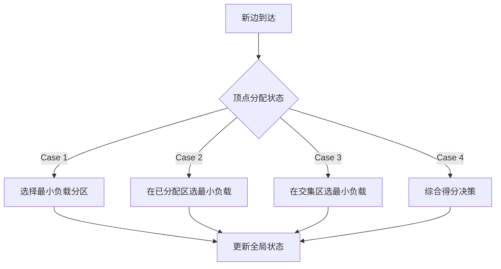

# 图划分问题 (Graph Partition)

有两种主要的图划分(Graph Partition)场景。第一个，点分割（Vertex Partition）；第二个，边分割（Edge Partition）。

**点分割**就是将原来图里的所有点划分到不同集合中，不同集合中的点不重合，同时尽可能最大/小化某些目标函数。如下图右上，**这里就需要删除原先的某些边。(Edge-cut)**

**边分割**就是将原来图中的所有边划分到不同集合中，不同集合中你的边不重合，同时可能最大/小化某些目标函数。如下图右下。**这里，原先的某个节点可能出现在多个集合中。也就是节点的重复，可以想象成把一个节点切成了好几块，所以是 (Vertex-Cut)**

对于点分割，其目标是最小化切边或点 `minimum cuts`（减少通讯代价）；对于边分割，其目标是负载均衡 `load balancing`（减少存储代价）。

同时优化这两个目标是平衡图分割（`Balanced graph partitioning`）问题。目前通常会将这两个目标同时考虑。

注意：一个有许多度的节点，在进行边分割的时候可以被切分到多个不同的集合中，而一个边只链接2个节点，这是二者一个主要区别，正是由于这种变化，**普遍认为边分割的效果比点分割更好。**

> It has been shown that vertex-cut techniques perform better than edge-cut ones on such graphs (i.e., create less storage and network overhead)

## 边分割（Edge Partition）

### Bg & Motivation

**大规模图处理问题**
:   分布式图计算系统（如PowerGraph、Spark GraphX、Chaos）需要高效处理大规模图数据（如社交网络、Web图），传统点分割（Vertex Partition）方法在**幂律分布图**（Power-law Degree Distribution）中面临严重负载不均衡问题。

**点分割的局限性**
:   1. 幂律图中少数高度数顶点（如社交网络中的“名人”）会导致存储、通信和计算资源集中在少数机器上，引发**长尾延迟**（Stragglers）。
    2. 点分割的优化目标是**最小化跨分区边数量**，但对幂律图效果有限。

!!! question "什么是幂律分布"
    幂律分布是指某个具有分布性质的变量，且其分布密度函数是幂函数。幂律分布表现为一条斜率为幂指数的负数的直线。

    可以参考：[Links](https://randall.math.gatech.edu/AlgsF05/nov7.pdf)

    

### 数学模型

可以参考这个 Tighten 的模型：`A strong formulation for the graph partition problem. Sunil Chopra, Sangho Shim.  https://doi.org/10.1002/net.21916`

### 边分割的优势

✅ **负载均衡**：将边均匀分配到不同机器，直接控制各分区的**边数量**（存储和计算复杂度与边数量线性相关），避免资源倾斜。  
✅ **顶点复制优化**：通过减少顶点在不同分区的重复出现（即**顶点复制因子**，Vertex Replication），降低机器间通信开销（图计算的瓶颈之一）。

> **关键概念**：  
> - **顶点复制（Vertex Replication）**：若两个相邻边（共享同一顶点）被分配到不同机器，则该顶点需要在多个机器上复制。  
> - **目标**：<u>在边均匀分配的前提下，**最小化全局顶点复制因子**。</u>

---

### 方法对比总结 

| 方法           | 结构利用度 | 适用场景   | 可扩展性 | 顶点复制因子 |
| -------------- | ---------- | ---------- | -------- | ------------ |
| RAND           | 无         | 高带宽网络 | 高       | 高           |
| DBH            | 低         | 幂律图     | 高       | 中           |
| Oblivious/HDRF | 中         | 流式数据   | 中       | 中-低        |
| Sheep          | 高         | 树状图     | 低       | 低           |
| METIS扩展      | 极高       | 中小规模图 | 低       | 最低         |

**注**：当前边分割研究的核心矛盾在于**全局结构利用**与**可扩展性**的权衡。流式算法和分布式多级划分是未来突破方向。

### 问题描述

**图结构**：
:   用无向无权图 \( G = (V, E) \) 表示。
    
    \( V \)：顶点集合，共 \( n = |V| \) 个顶点。
    
    \( E \)：边集合，共 \( m = |E| \) 条边。
    
    边 \( (x, y) \)：连接顶点 \( x \) 和 \( y \) 的边。

**邻域关系**
:   \( N(x) \)：顶点 \( x \) 的所有邻居（直接相连的顶点）。  
    
    \( N(S) \)：顶点集合 \( S \) 中所有顶点的邻居的并集。  
    

1. 我们的任务是：将图的边集合 \( E \) **均匀分配**到 \( p \) 个分区（如分布式系统中的机器），同时**最小化顶点重复**。具体定义如下：

!!! note "\( p \)-edge partitioning"
    **分配规则**：将边集合 \( E \) 划分为 \( p \) 个子集 \( E_1, E_2, \dots, E_p \)，满足：
    
    所有子集的并集等于原边集：\( \bigcup_{i=1}^p E_i = E \)
    
    子集之间互不重叠：\( E_i \cap E_j = \emptyset \)（当 \( i \neq j \) 时）

2. **平衡性约束（\( \alpha \)-balanced）**

**条件**：每个子集的大小不超过阈值：  

\[
  \max \{ |E_i| \} \leq \lceil \alpha \cdot \frac{|E|}{p} \rceil
\]
  
  \( \alpha \geq 1 \) 是平衡因子，越接近1表示分配越均匀。
  
*示例*：若总边数 \( |E|=100 \)，\( p=4 \)，则理想情况下每个子集有25条边；若 \( \alpha=1.2 \)，允许最大子集有30条边。

**这个约束的实际含义就是负载均衡（Load Balance），每一划分中的边的weights必须在一个范围内。**

3. **复制因子（Replication Factor, RF）**

**定义**：衡量顶点在不同分区中的重复程度，计算公式为：  
  \[
  RF(E_1, \dots, E_p) = \frac{1}{|V|} \sum_{i=1}^p |V(E_i)|
  \]
- \( V(E_i) \)：子集 \( E_i \) 覆盖的所有顶点（即这些顶点需要在该分区中存储）。
- **目标**：最小化全局复制因子 \( RF \)，从而降低通信和存储开销。
- **这一目标的实际含义就是通讯代价尽可能小；**

> **关键解释**：  
> 
> - 若一个顶点的边被分配到多个分区，则该顶点需在这些分区中**重复存储**（即“复制”）。  

我们可以将问题形式化为最小复制因子问题（ `MIN-RF(p, α)`）

**任务**：找到一个满足 \( \alpha \)-平衡约束的 \( p \)-边分割方案，使得复制因子 \( RF \) 最小。

--------

### DBH (Degree-Based Heuristic)

> Paper: `C. Xie, L. Yan, W.-J. Li, and Z. Zhang. Distributed power-law graph computing: Theoretical and empirical analysis. In Advances in Neural Information Processing Systems, pages 1673–1681, 2014.`

上述都是基于Streaming的，也就是边会动态到达，需要动态地分到对应的集合中去。

DBH的做法是，考虑新入的边 (i,j) 的两个节点 i 和 j，分别的度。**建立两组映射：节点到集合的，边到集合的。**

**每次进来一个边，优先将它放到度小的那个节点所在的集合中。** 分割通过判断结点的度信息来切分结点分配边。对于幂律图来说低度结点的局部性很容易保持，高度结点因为关联太多结点如果将边全部分配在一个子图上不太可能，因此该算法尽最大可能保持低度结点的局部性。

对于一条边 的两个节点，根据度小的结点计算哈希函数返回分配的子图id，将该条边分配到对应子图。该算法融合了度信息和随机哈希的特征，高效且保持了局部性。

比如：`[(1,2), (1,3), (1,4), (2,4), (2,3)]`；进行 K = 2 的划分:

进来第一个 $(1,2)$，分了之后：$\{ (1,2)\}, \{\}$，此时 1,2 都映射到集合 1；

进来第二个 $(1,3)$，度更小的是 3，根据3的Hash值，分到第二个集合中 $\{ (1,2)\}, \{(1,3)\}$；此时 1,2 映射到 集合 3映射到集合 2

进来第三个 $(1,4)$，度更小的是 4，随机分到一个集合中， $\{ (1,2), (1,4)\}, \{(1,3)\}$；此时 1,2,4 映射到 集合 3映射到集合 2

进来第四个 $(2,4)$，度一样，随机选一个计算哈希函数分到一个集合中， $\{ (1,2), (1,4), (2, 4)\}, \{(1,3)\}$；此时 1,2,4 映射到 集合 3映射到集合 2

进来第五个 $(2,3)$，3 的度更小， $\{ (1,2), (1,4), (2, 4)\}, \{(1,3), (2,3)\}$；此时 1,2,4 映射到 集合 3映射到集合 2

----

### Greedy动态图划分算法

**核心目标**：在流式处理中**实时决策**边的分配，通过**维护全局状态信息**，在**平衡分区负载**与**最小化顶点副本数**之间取得最优权衡。

1. **全局状态维护**

- **顶点分配记录**：`A(v)`表示顶点v已分配的分区集合
- **分区负载追踪**：实时记录各分区当前边数量（`size(p)`）

2. **边分配决策规则**（四类场景）

| 场景类型                 | 处理策略                                     | 设计意图                     |
| ------------------------ | -------------------------------------------- | ---------------------------- |
| **Case 1**：双顶点未分配 | 将边分配到当前最小负载分区                   | 初始负载均衡                 |
| **Case 2**：单顶点已分配 | 在已分配顶点的分区中选择最小负载分区         | 利用历史分配信息减少副本     |
| **Case 3**：双顶点有交集 | 在共同存在的分区中选择最小负载分区           | 优先复用已有副本             |
| **Case 4**：双顶点无交集 | 在各自分区中选择最小负载区，必要时创建新副本 | 平衡负载与副本成本的动态决策 |

3. **得分函数设计**

采用**线性加权组合**方式：

$$C_{\text{greedy}}(p) = \underbrace{f(v_i,p) + f(v_j,p)}_{\text{Replication}} + \underbrace{\epsilon \cdot \frac{\text{max\_size} - \text{min\_size}}{\text{min\_size}}}_{\text{Balance}}$$

**复制项**（Replication Term）：
  

$$f(v,p) = \begin{cases} 
  1 & \text{if } p \in A(v) \\
  0 & \text{otherwise}
  \end{cases}$$

鼓励选择已有顶点副本的分区

**平衡项**（Balance Term）：
  

$$\epsilon \cdot \frac{\text{max\_size} - \text{min\_size}}{\text{min\_size}}$$

动态调整负载均衡权重（\(\epsilon\)为调节系数）

4. **分配决策流程**

---

### **与HDRF的关键差异**
| 维度           | Greedy算法               | HDRF算法               |
| -------------- | ------------------------ | ---------------------- |
| **状态依赖**   | 需维护完整分配记录(A(v)) | 仅需顶点度数统计       |
| **决策依据**   | 完全基于历史分配状态     | 结合度数分布与局部结构 |
| **时间复杂度** | O(K)（K为分区数）        | O(K)                   |
| **负载均衡**   | 显式平衡项控制           | 隐式通过度数加权       |
| **适用场景**   | 中小规模动态图           | 大规模幂律分布图       |

### **HDRF**

> Paper: `HDRF: Stream-Based Partitioning for Power-Law Graphs`

#### 核心目标

面向**幂律分布图**（存在大量低度顶点 + 极少数高度顶点），在流式图分区场景中实现：

1. **减少副本数量**（优先复制高度顶点）
2. **保持分区负载均衡**
3. **避免预处理开销**（适应流式数据特性）

关键：

- **幂律图特性**：移除少量高度顶点（hub）会导致图分裂成孤立子图，低度顶点常属于密集子图并通过hub连接。
- **策略**：将低度顶点的强连通组件保留在单一分区内，对高度顶点进行切割+复制（因高度顶点数量少，复制代价可控）。

1. **动态度数跟踪**

部分度数（Partial Degree）**：流式处理中实时维护顶点度数表，每处理一条边 \( e=(v_i, v_j) \)时更新\( \delta(v_i) \)和\( \delta(v_j) \)（无需预计算全图度数）。

- **归一化度数**：计算顶点\( v_i \)的相对度数权重：

$$\theta(v_i) = \frac{\delta(v_i)}{\delta(v_i) + \delta(v_j)}$$

2. **分区评分函数**：为每个分区\( p \)计算得分\( C_{\text{HDRF}}(v_i, v_j, p) \)，由两部分组成：

- **复制优化项（\( C_{\text{REP}} \)）**：鼓励将边分配到已有顶点副本的分区。

$$C_{\text{REP}}^{\text{HDRF}}(v_i, v_j, p) = g(v_i, p) + g(v_j, p)$$

\( g(v, p) \) 定义：

$$g(v, p) = 
\begin{cases} 
1 + (1 - \theta(v)) & \text{若 } p \text{ 已包含 } v \text{ 的副本} \\
0 & \text{否则}
\end{cases}$$

- **逻辑**：优先选择已包含顶点副本的分区，且高度顶点（\( \theta \)值大）的复制收益更高。

- **负载均衡项（\( C_{\text{BAL}} \)）**：通过参数\( \lambda \)控制分区大小平衡：

$$C_{\text{BAL}}^{\text{HDRF}}(p) = \lambda \cdot \frac{\text{max\_size} - |p|}{\varepsilon + \text{max\_size} - \text{min\_size}}$$

- \( \lambda \)的作用：
  - \( \lambda = 0 \)：完全忽略平衡（类似纯贪心）
  - \( 0 < \lambda \leq 1 \)：仅在复制分数相同时打破平衡
  - \( \lambda > 1 \)：强制增强平衡（应对有序输入流）
  - \( \lambda \to \infty \)：退化为随机分配

3. **边分配规则**

将边\( e=(v_i, v_j) \)分配给得分最高的分区\( p^* \)，并更新顶点副本位置：

$$p^* = \arg\max_p \left[ C_{\text{REP}}^{\text{HDRF}}(v_i, v_j, p) + C_{\text{BAL}}^{\text{HDRF}}(p) \right]$$

### 核心创新点
1. **动态度数感知**：通过流式更新的部分度数\( \delta(v) \)近似真实度数，避免预处理
2. **\( \theta \)-加权复制策略**：高度顶点的复制决策通过\( \theta \)值量化，降低整体复制因子
3. **\( \lambda \)-参数化平衡**：灵活控制复制与负载的权衡，适应不同输入特征（如有序流）

---

### 与Greedy算法的对比
| 特性           | Greedy算法                    | HDRF算法                                      |
| -------------- | ----------------------------- | --------------------------------------------- |
| **核心目标**   | 最小化副本数                  | 最小化副本数 + 动态平衡负载                   |
| **度数依赖**   | 无                            | 动态跟踪部分度数（\( \theta \)值）            |
| **平衡控制**   | 固定平衡项（无\( \lambda \)） | 通过\( \lambda \)参数灵活调节平衡强度         |
| **输入适应性** | 对有序输入敏感（易失衡）      | 通过\( \lambda>1 \)缓解有序输入导致的失衡问题 |

-------

## 点分割（Vertex Partition）

不同于前一部分侧重启发式算法，这里会先把点分割建模成一个优化问题。可以参考这个 Paper：`Nguyen, D. P., Minoux, M., Nguyen, V. H., Nguyen, T. H., & Sirdey, R. (2017). Improved compact formulations for a wide class of graph partitioning problems in sparse graphs. Discrete Optimization, 25, 175-188.`

**带集合约束的图划分问题**（GPP-SC）可一般定义如下。给定一个无向连通图 $G=(V,E)$，其中 $V=\{1,\ldots,n\}$，$|E|=m$，且每条边 $e\in E$ 关联一个长度 $l_{e}\in \mathbb{Z}_{+}$，需将顶点集 $V$ 划分为不相交的集合（或簇），满足以下条件：

- 每个簇 $C\subset V$ 满足形式为  $\mathcal{G}(y^{C})\leq 0$ 的约束，其中 $y^{C}$ 是 $C$在 $\{0,1\}^{n}$ 中的关联向量，$\mathcal{G}:\{0,1\}^{n}\rightarrow \mathbb{R}$ 是一个给定的单调非递减伪布尔函数（注意，$\mathcal{G}$也可视为一个集合函数：$\mathcal{P}(V)\rightarrow \mathbb{R}$，它将实数值$\mathcal{G}(y^{C})$ 与每个子集 $C\subset V$ 关联）。这一段看起来很抽象，可以参考下面的解释。
- 连接不同簇的边的长度总和最小化。

1.  **背包约束下的图划分问题（GPKC）**：当每个簇$C$需要满足==节点权重约束 $\sum_{v\in C}w_{v}\leq W$ ==，其中 $w_{v}$（对于所有 $v\in V$ ）是给定的非负节点权重，$W$是簇的总节点权重上限。这对应于考虑线性约束$\mathcal{G}(y^{C})\leq 0$，其中$\mathcal{G}$ 是由 $\sum_{v\in V}w_{v}y_{v}^{C}-W\leq 0$ 定义的非递减伪布尔函数。注意，GPP-SC 的这一特例是 Garey 和 Johnson 书中定义的经典图划分问题版本，已知是 NP-Hard 的。在本文中，我们将此特例称为背包约束下的图划分问题。

2.  **容量约束下的图划分问题（GPCC）**：当每个簇$C$受限于形式为$\mathcal{G}(y^{C})\leq 0$的约束，其中$\mathcal{G}$是一个给定的非递减二次伪布尔函数$\{0,1\}^{n}\rightarrow \mathbb{R}$，定义如下：

$$
\mathcal{G}(y^{C})=\sum_{(u,v)\in E}t_{uv}(y_{u}^{C}+y_{v}^{C}-y_{u}^{C}y_{v}^{C})-T\leq 0
$$

对于给定的 $t_{uv}\in \mathbb{R}_{+}$（对所有 $(u,v)\in E$）和正常数 $T$。如果将 $t_{uv}$  视为边 $(u,v)$ 的容量，则 $\sum_{(u,v)\in E}t_{uv}(y_{u}^{C}+y_{v}^{C}-y_{u}^{C}y_{v}^{C})$ 表示至少有一个端点在簇 $C$ 中的边的总容量。该约束将此容量限制为常数 $T$。

### 基本0/1规划模型

后面的内容我们不考虑容量约束。

我们为所有节点对 $u,v\in V,u<v$ ， 引入 $\frac{n(n-1)}{2}$ 个二进制变量 $x_{uv}$ ，使得

$$
x_{uv}=\begin{cases}0&\text{若 }u\text{ 和 }v\text{ 属于同一簇},\\1&\text{否则}.\end{cases}
$$

三角不等式与二进制约束常被用于定义图 $G$ 的划分。记 $\mathcal{T}$ 为 $V$ 中所有满足 $u<v<w$ 的节点三元组 $(u,v,w)$ 的集合， $E_{n}$ 为 $V$ 中所有有序节点对的集合（即 $|E_{n}|=\frac{n(n-1)}{2}$ ），这些约束可以写为：

$$
\begin{cases}\forall(u,v,w)\in\mathcal{T}\\\ x_{uv}+x_{uw}\geq x_{vw}\\ x_{uv}+x_{vw}\geq x_{uw}\\ x_{vw}+x_{uw}\geq x_{uv}\\ x_{uv}\in\{0,1\}\quad\forall(u,v)\in E_{n}.\end{cases}\qquad(1)
$$

系统 (I) 中三角不等式的数量为 $3\binom{n}{3}$ ，无论 $m$ 的值如何。可以证明，该问题的线性规划松弛完全刻画了 $V$ 的所有可能划分的关联向量的凸包，即所有解向量。

对于每个节点 $u \in V$ 和包含 u 的簇 C，关联向量 $y^{C}$ 也就等于 n 维的向量 $1 - \chi^{u}$，其中，$\chi^{u}$ 可以被定义为如下：

$$\chi_{v}^{u} = x_{|uv|} = \begin{cases} x_{uv} & \text{if } u < v, \\ x_{vu} & \text{if } u > v, \forall v \in V. \\ 0 & \text{if } u = v, \end{cases}$$

现在，解中每个簇 C 需要满足的约束 $\mathcal{G}(y^{C}) \leq 0$ 可以等价地重新表述为 n 个单独的约束 $\mathcal{G}(\mathbb{1} - \chi^{u}) \leq 0$，对于所有 $u \in V$。记 $g_{u}(x) = \mathcal{G}(\mathbb{1} - \chi^{u}) $，对于所有 $u \in V$，GPP-SC 的 Node-Node 模型为：

$$\text{ (IP) } \left\{ \begin{aligned} \min & \sum_{(u, v) \in E} l_{uv} x_{uv} \\ \text{s.t.} & \quad \forall (u, v, w) \in \mathcal{T} \\ & x_{uv} + x_{uw} \geq x_{vw} \\ & x_{uv} + x_{vw} \geq x_{uw} \\ & x_{vw} + x_{uw} \geq x_{uv} \\ & g_{u}(x) \leq 0 & \forall u \in V \\ & x_{uv} \in \{0, 1\} & (u, v) \in E_{n}. \end{aligned} \right. \qquad (1)$$

注意，假设 $\mathcal{G}$ 关于 $y^{C}$ 非递减意味着每个伪布尔函数 $g_{u} : \{0,1\}^{n} \to R_{+}$ 关于 x 应该是非递增的（注意 $g_{u}$ 实际上只依赖于变量子集 $x_{ij}$，其中 $i = u$ 或 $j = u$）。令 $(\overline{\text{IP}})$ 表示 (IP) 的连续松弛。该模型有 $O(n^{2})$ 个变量和 $O(n^{3})$ 个约束。

### 改进0/1规划模型

**对于稀疏图的情况，三角不等式的数量可以显著减少，同时保持模型的等价性**。==思路是仅考虑那些至少有一对节点在 $E$ 中形成边的三元组，而不是考虑所有 $\mathcal{T}$ 中的三元组==。具体地，令 $\mathcal{T}^{\prime}$ 表示这些三元组的集合，即 $\mathcal{T}^{\prime}=\{(u, v, w) : u<v<w\in V \text{ 且至少有一条边 } (u, v),(u, w) \text{ 或 } (v, w)\in E\}$。然后，通过仅对 $\mathcal{T}^{\prime}$ 中的三元组表达三角不等式，从 (IP) 得到简化规划模型如下：

$$\begin{array}{l}
\text{ (RIP) }\left\{\begin{array}{ll}
\min &\sum_{(u, v)\in E}l_{uv}x_{uv}\\
\text {s.t.}&\forall(u, v,w)\in\mathcal{T}^{\prime}\\
& x_{uv}+x_{uw}\geq x_{vw}\\
& x_{uv}+x_{vw}\geq x_{uw}\\
& x_{vw}+x_{uw}\geq x_{uv}\\
& g_{u}(x)\leq 0\quad\forall u\in V\\
& x_{uv}\in\{0,1\}\quad(u, v)\in E\\
& x_{uv}\in[0,1]\quad(u, v)\in E_{n}\setminus E.
\end{array}\right.
\end{array}$$

显然，$|\mathcal{T}^{\prime}|\leq m(n-2)$，因此 (RIP) 中三角不等式的数量最多为 $3m(n-2)$。(RIP) 的连续松弛记为 $(\overline{\mathrm{RIP}})$。由于三角不等式的减少，当应用于稀疏图时，$(\overline{\mathrm{RIP}})$ 对于 LP 求解器显然比 $(\overline{\mathrm{IP}})$ 更有利。

## Reference:

一个汇总：[Zhihu Links](https://zhuanlan.zhihu.com/p/446152634).