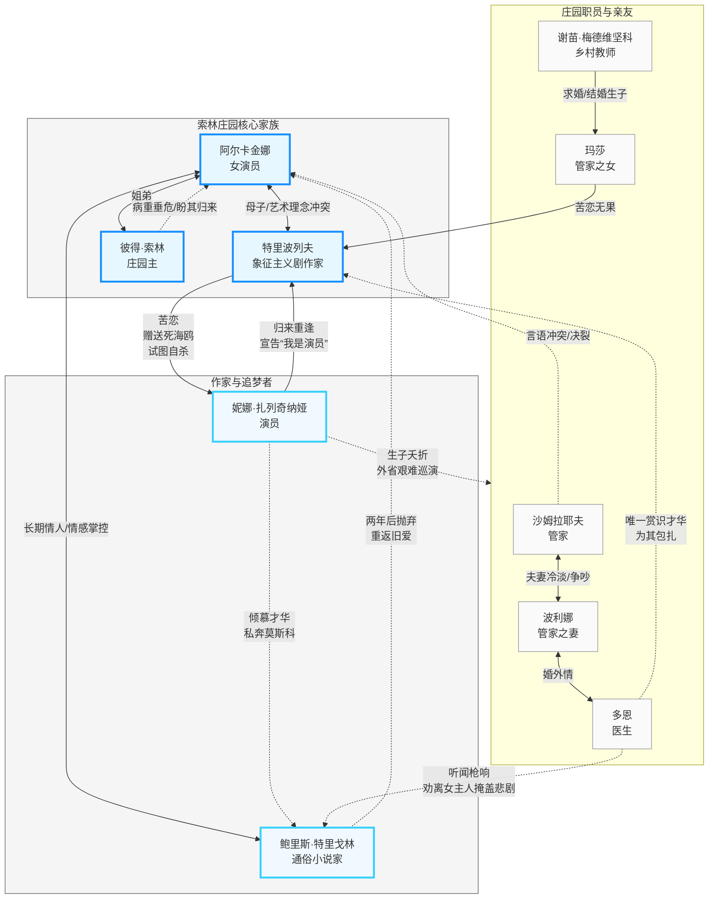
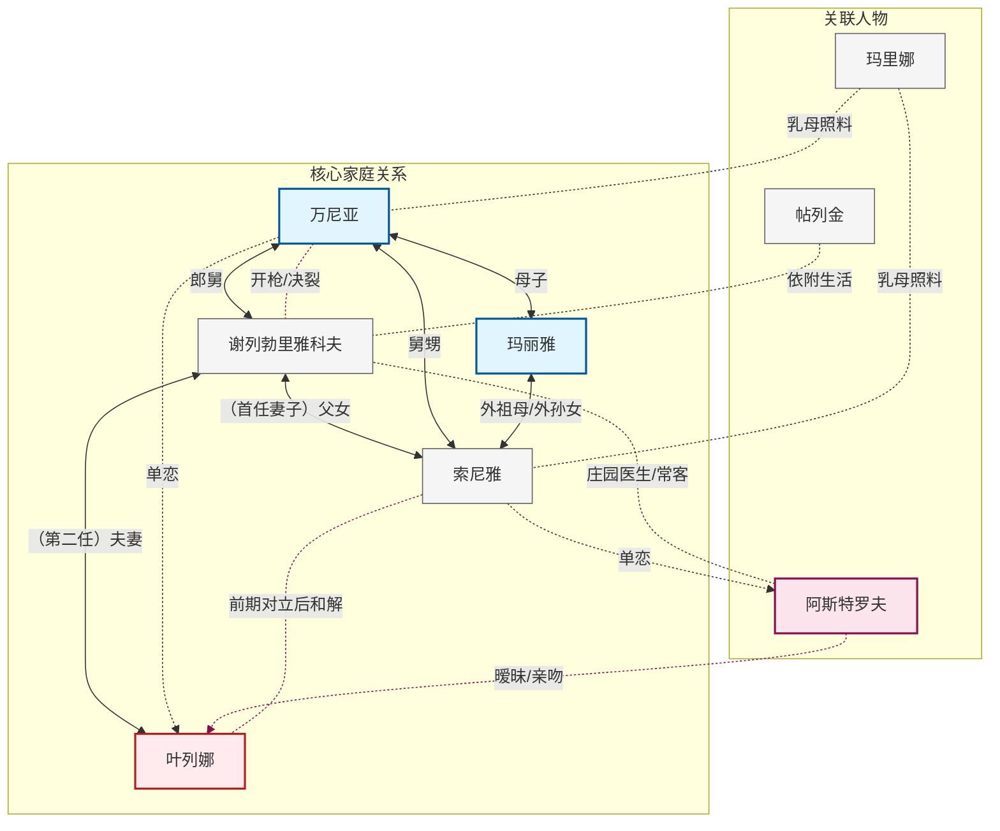
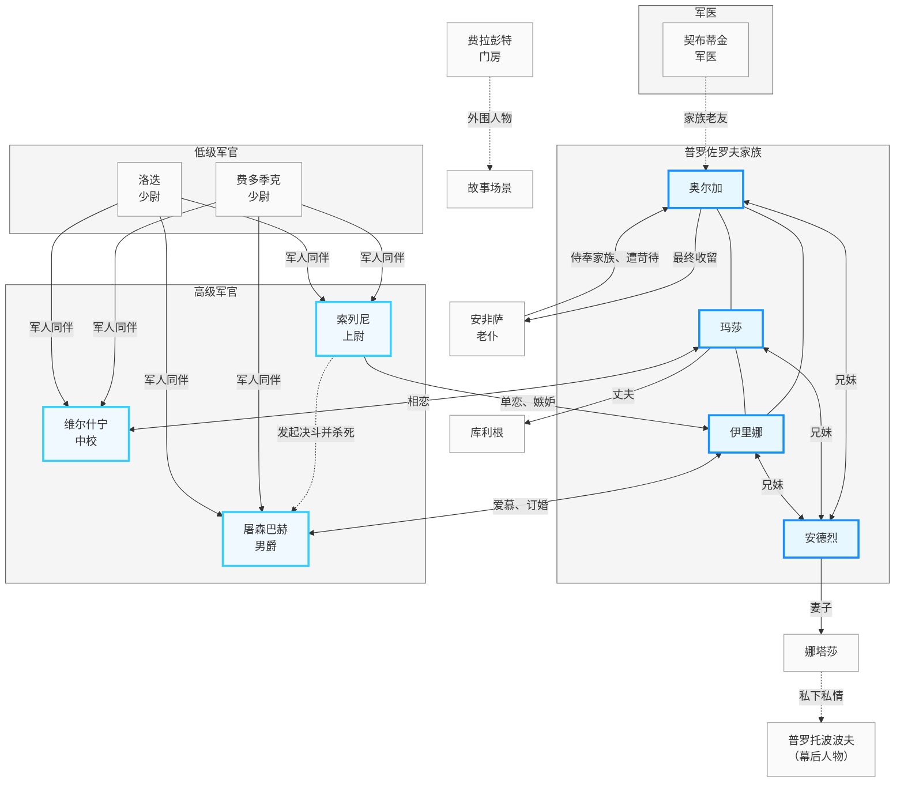
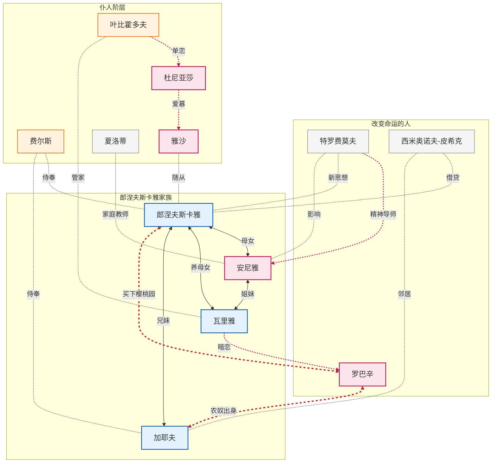

# 契诃夫戏剧集

## 海鸥 (The Seagull, 1894)

现代戏剧的一座信标。可以想象后代有多少作品都试图复刻特里波列夫，以及妮娜在剧中的呢喃：“人，狮子，鹰和鹧鸪，长着犄角的鹿……一切生命，都在完成它们凄惨的变化历程之后绝迹了…”

焦菊隐的后记写得让人意犹未尽，落款于1943年，更让人看到了一只乱世中的海鸥。

| 中文人名                                 | 英/俄文名字                                                      | 人物关系                                                 | 人物形象                                                                 |
| ---------------------------------------- | ---------------------------------------------------------------- | -------------------------------------------------------- | ------------------------------------------------------------------------ |
| 伊琳娜·尼古拉耶芙娜·**阿尔卡金娜**       | Irina Nikolayevna Arkadina Ирина Николаевна Аркадина          | 女演员，特里波列夫之母，特里戈林的情人                   | 自负且缺乏安全感的过气明星，代表庸俗中产审美， 对艺术与现实皆显掌控欲 |
| 康斯坦丁·加夫里洛维奇·**特里波列夫**     | Konstantin Gavrilovich Treplev Константин Гаврилович Треплев  | 伊琳娜之子，象征主义剧作家                               | 敏感忧郁，追求戏剧革新却屡遭否定，情感受挫后走向绝望与自我毁灭           |
| 彼得·尼古拉耶维奇·**索林**               | Pyotr Nikolayevich Sorin Пётр Николаевич Сорин                | 伊琳娜之兄，**庄园主人**                                 | 退休高级文官，体弱多病，渴望都市文化生活却终生困守乡村                   |
| **妮娜**·米哈伊洛夫娜·扎列奇纳娅         | Nina Mikhailovna Zarechnaya Нина Михайловна Заречная          | 富农之女， aspiring 演员，特里波列夫与特里戈林的爱慕对象 | 纯真坚韧，历经爱情幻灭、丧子之痛与演艺挫败后， 仍坚定拥抱演员身份     |
| 鲍里斯·阿列克谢耶维奇·**特里戈林**       | Boris Alexeyevich Trigorin Борис Алексеевич Тригорин          | 著名通俗**小说家**，阿尔卡金娜的情人，妮娜的恋人/抛弃者  | 才华横溢但精神倦怠，随波逐流，将他人的苦难视为创作素材                   |
| 伊利亚·阿法纳西耶维奇·沙姆拉耶夫         | Ilya Afanasyevich Shamrayev Илья Афанасьевич Шамраев          | 退役中尉，索林庄园管家                                   | 性格固执强硬， 常与阿尔卡金娜发生冲突                                 |
| **波利娜**·安德烈耶芙娜                  | Polina Andreyevna Полина Андреевна                            | 沙姆拉耶夫之妻，多恩的情人                               | 渴望情感慰藉，婚姻冷淡，与医生保持长期婚外情                             |
| **玛莎**（玛丽亚·伊里尼奇娜·沙姆拉耶娃） | Maria Ilyinishna Shamrayeva, "Masha" Мария Ильинична Шамраева | 波利娜与沙姆拉耶夫之女，梅德维坚科之妻                   | 忧郁隐忍，苦恋特里波列夫无果，最终接受无爱婚姻并生育                     |
| 叶夫根尼·谢尔盖耶维奇·**多恩**           | Yevgeny Sergeyevich Dorn Евгений Сергеевич Дорн               | 乡村医生，波利娜的情人                                   | 温和豁达，是剧中少数 真正赏识特里波列夫才华的旁观者                   |
| 谢苗·谢苗诺维奇·梅德维坚科               | Semyon Semyonovich Medvedenko Семён Семёнович Медведенко      | 乡村教师，玛莎的丈夫                                     | 贫穷务实，深爱玛莎却得不到回应，以妥协换取婚姻                           |

人物关系与情节图

情节概括
**I**

1. 故事发生于索林乡间庄园，过气女星阿尔卡金娜携情人、作家特里戈林前来度假。
2. 庄园主人与客人们观看其子特里波列夫执导的象征主义“戏中戏”，邻居少女妮娜担任主演。
3. 阿尔卡金娜对剧本嗤之以鼻，演出因观众打断而惨淡收场，特里波列夫愤然离场。
4. 剧中多角恋初现端倪：教师梅德维坚科苦恋玛莎，玛莎暗恋特里波列夫，特里波列夫迷恋妮娜，而妮娜倾心于特里戈林。

**II**

1. 数日后，阿尔卡金娜与管家沙姆拉耶夫发生激烈争吵，决意提前离开庄园。
2. 特里波列夫将一只射杀的海鸥赠予妮娜，妮娜对此感到困惑与惊恐。
3. 特里戈林偶遇海鸥，构思以“如海鸥般自由的少女被男人出于无聊毁掉”为题材创作小说。
4. 妮娜被特里戈林的名气与谦逊深深吸引，阿尔卡金娜见其倾心，转而决定留在庄园。

**III**

1. 庄园室内，阿尔卡金娜与特里戈林准备返回莫斯科，特里波列夫因绝望开枪自杀未遂，头部缠满绷带。
2. 妮娜向特里戈林赠送刻有献词的金质纪念章，祈求临行前再见一面。
3. 特里波列夫与母亲就特里戈林爆发争吵；特里戈林一度想留下，终被阿尔卡金娜劝回莫斯科。
4. 妮娜与特里戈林约定在莫斯科重逢，她不顾父母反对毅然离家投身演艺事业。

**IV**

1. 两年后的冬日，玛莎已与教师结婚生子，却仍痴恋特里波列夫；妮娜与特里戈林同居生子，但婴儿夭折，特里戈林已重返阿尔卡金娜身边。
2. 妮娜在外省剧团艰难巡演，特里波列夫虽发表短篇小说却日益消沉，索林病危，众人发电报召回阿尔卡金娜。
3. 众人聚在客厅玩宾果游戏，妮娜悄然归来与特里波列夫重逢，诉说两年苦难后重拾信念：“我是一名演员。”
4. 妮娜离去后，特里波列夫撕毁手稿并开枪自尽；医生多恩发现真相后，暗中嘱咐特里戈林带阿尔卡金娜迅速离开。

----

海鸥从自由象征到毁灭符号，最终成为艺术重生的隐喻

海鸥意象在剧中经历三次转变。初次出现时，**妮娜像海鸥那样爱这片湖水，也像海鸥那样的幸福和自由**——此时海鸥代表纯真与无拘束的生命状态。

特里波列夫杀死海鸥后对妮娜说：「我做了这么一件没脸的事，竟打死了这只海鸥。我把它献在你的脚下。」并预言：「我不久就会照着这个样子打死自己的。」妮娜回应：**「我太单纯了，不能了解你」**——象征已被引入，但接受者尚未理解其重量。

到第四幕，海鸥与妮娜的命运完全融合：她在信件中屡次自称「海鸥」，署名亦然。特利果林从中看到短篇小说的题材：「一片湖边，从幼小就住着一个很像你的小女孩子；她像海鸥那样爱这一片湖水……偶然来了一个人，看见了她，因为没有事情可做，就把她，像这只海鸥一样，给毁灭了。」

妮娜最终道出：「你还记得你打死过一只海鸥吗？一个人偶然走来，看见了它，因为无事可做，就毁灭了它……这是一篇短篇小说的题材啊。」**象征从被毁灭的对象转化为叙述的主体**——她不再是被动的受害者，而是能以艺术家视角审视自身创伤的人。

---

人物形象：特利果林的自我贬抑与妮娜的理想化形成尖锐对照

特利果林的自我认知极度负面：**「作为一个渺小的作家，特别是在背时的时候，总觉得自己是笨拙的、愚蠢的、肤浅的；他的神经是紧张的、痛苦的；他没有法子不在文学艺术界的圈子外边徘徊，没有人承认，没有人注意，他真怕见到人。」**

他同时坦白创作的强迫性：「我爱像这样的水，这些树，这片天空；我对大自然有感情，它在我内心唤起一种不可抗拒的写作欲望。」甚至云像三角钢琴这样随意的观察，都会立刻转化为素材：「应该在我一篇小说的什么地方，描写出一朵像三角钢琴的流云在徘徊。」

妮娜却将他视为楷模：「如果你是一个作家，我就要把我整个生命献给千百万人，而同时也完全会知道，要叫千百万人提高到和我一样，才是他们的唯一的幸福；那么，他们就会推动我奔向胜利了。」

特里波列夫：被嘲笑摧毁的梦想与勇气

特里波列夫对妮娜说：**「他不相信演戏，他总是嘲笑我的梦想，于是我自己也就一点一点地不相信它了，结果我失去了勇气……」**

玛莎对特里波列夫的描述揭示了另一种绝望：「我会想起你那一天的样子，晴朗的那一天——你还记得吗？——一个星期以前，你穿着一件颜色鲜明的衣裳……我们闲谈着……那只全身洁白的海鸥放在长凳上。」

关于特利果林的评判：「那些旧情，他从来也没有断绝过；像他这样没有骨气的人，他是安排好了要到处兼顾的。」

---

妮娜的转变弧光：从纯真少女到创伤艺术家

**第一幕**：妮娜将海鸥放在长凳上，自称「太单纯了，不能了解你」——此时她是未被世界触碰的纯真存在。

**第三幕**：她决意出走：「我已经打定主意了，局势已经定了，我要去演戏。明天我就不在这儿了，我要离开家，放弃一切，开始新的生活……我到莫斯科去。」

**第四幕**：玛莎转述妮娜的状态：「每一行都叫我发现她的神经是紧张的、受了伤害的。她的想象力也有一点混乱。她自己签名为'海鸥'。」**从被毁灭的海鸥到自我命名为海鸥**——身份完成转化。

---

演出史与导演诠释：首演惨败与斯坦尼斯拉夫斯基的心理现实主义

首演经历：「这出戏轰然跌落了。剧场里有一种侮慢而沉重的压迫空气。演员们演得愚蠢得可憎。这次的教训是：一个人不应当写戏。」

契诃夫对表演的要求：「演员们表演得太多了」——并非指过火，而是「嫌他们只在表演感觉心象和字句」。**「做出来的必须很简单很自然，正如在现实生活里一样。那必须做得好像他们每天都谈到的事情一样。」**

只有斯坦尼斯拉夫斯基建立的心理体系理论，才满足契诃夫对自然主义表演的要求。

---

!!! abstract "《海鸥》折射 19 世纪末俄罗斯少女的集体苦闷与追寻"

    「假如我们了解《樱桃园》里世纪末之悲哀，也必会了解这《海鸥》里的'**世界忧郁**'的悲哀。」

    妮娜是当时俄罗斯少女的逼真写照：「**一面有许多苦闷的青年如特里波列夫，追寻着梦想与新生活；平行的有许多乡间少女，怀着幻念与野心，想从那陈腐迟滞如死泥塘一般的环境中逃出**。」

    三种女性归宿：

    - **献给上帝**：多少少女进修道院
    - **献给自由与工作**：在人权压迫下，成群走进戏剧圈子
    - **献给天才男人**：变成妮娜那样的人物，无条件牺牲给能刺激起幻梦的男人

    契诃夫的洞察：「**你愈多读一遍，就愈能多发现一分新东西——在契诃夫对世界对人类那种广大无遗而又渗入底层的视察下，人生中任何东西都有它的生命力，也都或大或小，或直接或间接地对生活贡献着极大的意义**。」

    作家本人的命运：「可怜的作家，他自己却像海鸥一样，无辜地受了生命的残害，为了人家不经意的毁坏而缩短了自己的生命。他和可怜的妮娜一样，等到经过了痛苦而达于成熟，自己的灵魄上却已经遍体鳞伤了！」

----

## 万尼亚舅舅 (Uncle Vanya, 1896)

| 中文人名                                    | 英/俄文原名                                                                | 人物关系                                                                                       | 形象特点                                 |
| ------------------------------------------- | -------------------------------------------------------------------------- | ---------------------------------------------------------------------------------------------- | ---------------------------------------- |
| **谢列勃里雅科夫**，亚历山大·弗拉基米罗维奇 | Aleksandr Vladimirovich Serebryakov Алекса́ндр Влади́мирович Серебряко́в   | 依靠亡妻（万尼亚之姐）的庄园收入生活，庄园由万尼亚与索尼雅管理；**叶列娜的丈夫，索尼雅的父亲** | 退休大学教授                             |
| 叶列娜·安德烈耶夫娜（**叶列娜**）           | Helena Andreyevna Serebryakova (Yelena) Еле́на Андре́евна Серебряко́ва     | 谢列勃里雅科夫的第二任妻子                                                                     | 27岁，年轻貌美                           |
| 索菲雅·亚历山德罗夫娜（**索尼雅**）         | Sofia Alexandrovna Serebryakova (Sonya) Со́фья Алекса́ндровна Серебряко́ва | 谢列勃里雅科夫与第一任妻子的女儿，万尼亚的外甥女，与万尼亚共同管理庄园                         | 适婚年龄，相貌平平                       |
| 沃伊尼茨卡娅，**玛丽雅**·瓦西里耶夫娜       | Maria Vasilyevna Voynitskaya Мари́я Васи́льевна Войни́цкая                 | 万尼亚的母亲，谢列勃里雅科夫第一任妻子的母亲，索尼雅的外祖母                                   | 前枢密官遗孀                             |
| 沃伊尼茨基，伊凡·彼得罗维奇（**万尼亚**）   | Ivan Petrovich Voynitsky ("Uncle Vanya") Ива́н Петро́вич Войни́цкий        | 玛丽雅之子，索尼雅的舅舅，负责管理庄园                                                         | 47岁，本剧核心主角                       |
| **阿斯特罗夫**，米哈伊尔·里沃维奇           | Mikhail Lvovich Astrov Михаи́л Льво́вич А́стров                            | 庄园常客，与叶列娜、索尼雅存在情感关联                                                         | 中年乡村医生，关注森林生态保护           |
| **帖列金**，伊里亚·伊里奇                   | Ilya Ilych Telegin Илья́ Ильи́ч Теле́гин                                   | 依附于谢列勃里雅科夫家族生活                                                                   | 破落地主，因麻脸得绰号“华夫饼”，家境贫困 |
| 玛里娜                                      | Marina Timofeevna Мари́на Тимофе́евна                                     | 乳母，照料庄园众人的生活                                                                       | 老乳母                                   |
| 一个长工                                    | A Workman （无对应俄文原名）                                            | 谢列勃里雅科夫庄园的长工                                                                       | 庄园雇工                                 |

带情节和故事发展的人物关系图如下：

!!! example "情节精简梳理"

    万尼亚一生奉献庄园供养教授姐夫，却发现对方平庸虚伪；理想幻灭 + 爱而不得，引发精神危机。

    **🌿 第一幕：压抑的开端**

    - 教授携年轻妻子叶列娜到访乡村庄园，打破原有平静
    - 万尼亚私下贬低教授，赞美叶列娜，暗生情愫
    - 阿斯特罗夫谈森林保护后离开
    - **万尼亚向叶列娜表白，遭冷拒**

    **⛈️ 第二幕：情感的暗涌**

    - 万尼亚向叶列娜倾诉"虚度青春"的悔恨，对方回避
    - 索尼雅暗恋阿斯特罗夫，劝其戒酒，但对方未察觉
    - 叶列娜与索尼雅和解，承认自己婚姻不幸
    - 教授专横拒绝叶列娜弹钢琴的请求，气氛窒息

    **💥 第三幕：爆发与决裂**

    - 叶列娜帮索尼雅试探阿斯特罗夫，反被亲吻，万尼亚目睹
    - 教授提议**卖掉庄园**（实为索尼雅应得），引发万尼亚彻底爆发
    - 万尼亚怒斥教授毁掉自己的人生，**开枪射击未中**，崩溃弃枪
    - 叶列娜恳求立刻离开

    **🍂 第四幕：余波与和解**

    - 教授夫妇准备离去，众人表面和解
    - 万尼亚偷吗啡欲自杀，被索尼雅与阿斯特罗夫劝阻
    - 叶列娜与阿斯特罗夫暧昧告别，带走一支铅笔作纪念
    - **结尾**：索尼雅安慰万尼亚——继续劳作，忍受当下，终将在彼岸获得安息：*"We shall rest."*

    | 人物                | 情感指向  | 结局               |
    | ------------------- | --------- | ------------------ |
    | 万尼亚 → 叶列娜     | 单恋/激情 | 被拒，幻灭         |
    | 索尼雅 → 阿斯特罗夫 | 暗恋/隐忍 | 无果，继续等待     |
    | 阿斯特罗夫 ↔ 叶列娜 | 暧昧/冲动 | 一吻之后，各奔东西 |

🎯 **契诃夫式内核**：没有激烈的救赎，只有平凡人在失望中继续生活——"我们应当工作，应当忍耐，信仰终会到来。"

🔥 **一个理想主义者**：==阿斯特罗夫==，游离于核心家庭的参与者，热爱森林。

!!! example ""
    : 人类原本拥有足够的智慧与创造力，用以增加自身所需的财富。然而，直至今日，人们却往往只知破坏，而非创造。每当我 ... 解救出更多的乡间与森林时，我便感到气候似乎真的开始受到我的些许影响 ... **倘若一千年后的人们能够生活得更加幸福，其中或许也有我一份微薄的贡献**。

    ：如果在森林砍伐的地方通了公路、火车……如果乡下都盖满了工厂、手工作坊和学校……此后，农民会健康起来、富足起来，也更有知识。然而现实完全不是那么回事。 …… 我们这个地方，到处照旧是沼泽地、成群的蚊子，照旧到处是贫穷，流行着伤寒、白喉和火灾……这种情况下，**地区日渐退化了**。

    ：一个饥饿、患病且受寒冷侵袭的人，为了竭力保存自己即将熄灭的生命，只能本能地抓住手边的一切来缓解饥饿、获取温暖。他们为了生存而消灭一切，是顾不到明天的。如今，==一切都几乎被破坏完了，却什么也没有创造==。

    ：原则上，我是热爱生活的。==然而，我们眼下的这种生活——琐碎、无聊、困于内地——我却无法忍受。我从心底里瞧不起它== …… 当一个人在深夜穿过森林时，只要望见远方有一道微光指引，他就会忘却疲惫与黑暗，连扫过脸庞的树枝也浑然不觉。可我早已不爱任何人了，自己也没有什么可盼望的了。

    （叶列娜评）：“哪怕他刚刚种下一棵树，他就已经想象到这棵树在一千年以后的样子了：**它就已经在梦想着全人类的幸福了**。像这样的人是少有的……在俄罗斯，有才能的人从来都不免带些缺点。”

    （谢列勃里雅科夫语：） “要有所作为！要有所作为！”

----

**万尼亚舅舅**：一个有些慵懒爱抱怨但勉励维护操持庄园房产的47岁男人。

!!! quote ""
    （评谢列勃里雅科夫）：我们一天到晚谈论的都是你的工作，我们引以为傲 ……，现在我已极度瞧不起那些关于你的报纸和书籍——我们以前可是整夜整夜地读啊 …… 你写的虽然是讨论艺术的文章，可是你一点艺术也不懂 …… 你从前那些让我觉得了不起的工作，其实连一分脏钱都不值。你耍弄了我们！

---

**索尼娅**： 生活在烦闷无聊乡下的女孩。

> （叶列娜评）： 这可怜的女孩子……**她活在周围这些平庸的、不足道的悲惨人物中间，却是烦闷得可怕**。她所听见的只是些淡而无味的言语，她周围的人们所谈的只是吃、喝、睡……恰好这时候来了他这么一个人，那么与众不同，那么美，那么有趣，那么吸引人。**他每次的来临，都消除了她生活里的单调**。

---- 

谢列勃里雅科夫

!!! quote ""
    ：我将一生完全奉献给了科学。在此之后，我所接触的也仅限于书房、课堂和优秀的同事。然而不知为何，我竟会突然坠入这样一座坟墓之中。我所向往的是成功、声望，以及四处热烈的欢迎；而在这里，我却仿佛成了一个被放逐的人。

----

**叶列娜**：年轻美丽，但是依然受困于婚姻的冷淡、人际关系的纠缠暧昧、生活的枯燥乏味。

!!! quote ""
    （阿斯特罗夫语）：不得不承认，在这个世界上，你其实没有任何事情可做。你既没有事业，生活也缺乏明确的目的，甚至不知道该如何安放自己的闲暇时光 …… 你和你丈夫一同生活时的那种闲散，我们也不由自主地沾染上了。

---

全剧最后的升华由索尼雅完成：

> ==我们又能有什么办法呢？总得活下去啊！==
> 
> 我们要继续活下去……我们还有很长很长一段单调的昼夜，==要耐心地忍受即将到来的种种考验==，一直工作到老年。等到我们的岁月终了，我们要毫无怨言地死去；我们要在另一个世界里说：“受过一辈子的苦，流过一辈子的泪，==我们一辈子过的都是漫长辛酸的岁月==。” …… 那么，上帝自然会可怜我们的……我们就会带着感动的笑容，回忆今天的这些不幸了；我们也就会体尝到休息的滋味了……
>
> 在感叹“我们会休息下来”之后，我们的生活将会是安宁、幸福的，我这样相信 …… 舅舅啊，你一生都没有享受过幸福，但是，等待着吧，我们会享受到休息的 …… 。

最后一幕是离开，也就是因为万尼亚冲动枪击了谢列勃里雅科夫后，夫妇俩不愿继续停留了，于是各个人散场、离别、赠予物品并表达情感 ……

----

## 三姊妹 (Three Sisters, 1901)

一个最终没有走向莫斯科的故事。

| 中文人名                         | 英/俄文名字                                                      | 人物关系                 | 人物形象                                               |
| -------------------------------- | ---------------------------------------------------------------- | ------------------------ | ------------------------------------------------------ |
| 奥尔加·谢尔盖耶夫娜·普洛佐罗娃   | Olga Sergeyevna Prozorova Ольга Сергеевна Прозорова           | 三姊妹大姐，中学教师     | 温柔隐忍，持家护仆，终身未嫁，家庭精神支柱             |
| 玛莎·谢尔盖耶夫娜·库利根娜       | Maria Sergeyevna Kulygina Мария Сергеевна Кулигина            | 三姊妹二姐，库利根之妻   | 直率暴躁，热爱钢琴，与维尔什宁相恋，最终回归家庭       |
| 伊里娜·谢尔盖耶夫娜·普洛佐罗娃   | Irina Sergeyevna Prozorova Ирина Сергеевна Прозорова          | 三姊妹小妹               | 憧憬莫斯科，与屠森巴赫订婚，爱人死后决心投身工作       |
| 安德烈·谢尔盖耶维奇·普洛佐罗夫   | Andrei Sergeyevich Prozorov Андрей Серге́евич Прозоров         | 三姊妹兄长，娜达莎丈夫   | 懦弱怠惰，抱负落空，负债抵押家产，被妻子掌控           |
| 娜达里雅·伊凡诺夫娜              | Natalia Ivanovna Prozorov Наталья Ивановна Прозорова          | 安德烈之妻，三姊妹嫂子   | 自私专横，掌控家产，驱逐老仆，只溺爱自己子女           |
| 费多尔·伊里奇·库利根             | Fyodor Ilyich Kulygin Фёдор Ильич Кулыгин                     | 玛莎丈夫，中学拉丁语教师 | 宽厚乐观，明知妻子不忠仍包容，以幽默化解尴尬           |
| 亚历山大·伊格纳季耶维奇·维尔什宁 | Aleksandr Ignatyevich Vershinin Александр Игнатьевич Вершинин | 炮兵中校，与玛莎相恋     | 理想主义哲学家，婚姻不幸，与玛莎相恋后因调职分离       |
| 尼古拉·里沃维奇·屠森巴赫男爵     | Nikolaj Lvovich Tuzenbach Николай Львович Тузенбах            | 陆军中尉，爱慕伊里娜     | 真诚温和，为爱情退伍，与索列尼决斗身亡                 |
| 瓦西里·瓦西里耶维奇·索列尼       | Vassily Vasilyevich Solyony Василий Васильевич Солёный        | 陆军上尉                 | 孤僻易怒，嫉妒心强，因爱慕伊里娜杀死屠森巴赫           |
| 伊凡·罗曼诺维奇·契布蒂金         | Ivan Romanovich Chebutykin Иван Романович Чебу́тыкин           | 军医，家族老友           | 古怪乐天，暗恋三姊妹母亲，醉酒揭露私情，后陷入精神危机 |
| 阿列克塞·彼得罗维奇·费多季克     | Alexei Petrovich Fedotik Алексей Петрович Федотик             | 陆军少尉                 | 开朗热心，爱赠礼拍照，火灾后仍保持乐观                 |
| 弗拉基米尔·卡尔洛维奇·洛迭       | Vladimir Karlovich Rode Владимир Карлович Роде                | 陆军少尉，中学操练教官   | 军队配角，戏份较少                                     |
| 费拉彭特                         | Ferapont Ферапонт                                             | 议会门房                 | 耳背老人，常絮叨莫斯科相关琐事                         |
| 安非萨                           | Anfisa Анфиса                                                 | 家族老乳母、家仆         | 忠心年迈，遭娜达莎嫌弃，被奥尔加收留照料               |

!!! example "情节概括"

    **I**
    
    1. 故事始于父亲逝世一周年，同时是小妹伊里娜的命名日，三姊妹与兄长安德烈齐聚家中，姐妹三人始终怀念莫斯科，渴望重返故地。
    2. 奥尔加已任教四年，玛莎对与库利根的婚姻倍感空虚，伊里娜仍对爱情与莫斯科的生活满怀憧憬。
    3. 维尔什宁率领的士兵到访，为家中带来理想主义的氛围，众人一同庆祝伊里娜的命名日。
    4. 安德烈向被姐妹们鄙夷的娜达莎表露心意，并正式向她求婚。

    **II**

    1. 时隔近一年，安德烈与娜达莎成婚并育有一子鲍勃克，娜达莎暗中与安德烈的上司普罗托波波夫私通。
    2. 玛莎与维尔什宁陷入热恋，二人相处间满是爱恋的欣喜，这段婚外情已然明朗。
    3. 娜达莎刻意阻挠家中举办聚会，家中的欢乐氛围被逐渐压制、消散。
    4. 屠森巴赫与索列尼双双向伊里娜告白，表达各自的爱慕之情。

    **III**
    
    1. 又过一年，娜达莎掌控家中大权，逼迫奥尔加与伊里娜同住，将房间留给儿子，城镇还突发了火灾。
    2. 姐妹们得知安德烈私自抵押家中房产偿还赌债，对其失望又愤怒，娜达莎还刻薄对待老仆安非萨。
    3. 玛莎向姐妹坦言与维尔什宁的恋情，伊里娜对当下平庸的生活绝望，最终决定嫁给不爱自己的屠森巴赫。
    4. 安德烈深陷自我厌恶，承认自己的荒唐与对娜达莎的失望，向姐妹们恳求原谅。

    **IV**

    1. 士兵即将撤离，索列尼因嫉妒向屠森巴赫发起决斗，屠森巴赫虽已退伍仍选择应战。
    2. 屠森巴赫在决斗中身亡，伊里娜失去未婚夫，即便悲痛仍决心坚持教师的工作。
    3. 玛莎与维尔什宁被迫分离，痛哭不舍，丈夫库利根却温柔接纳，希望二人重新开始。
    4. 奥尔加接任校长并带走安非萨，娜达莎彻底掌控家产，三姊妹相拥送别士兵，在迷茫中感慨人生。

----

- **安德烈**

在这里呢正相反，你谁都认识，谁也都认识你，你却依然觉得自己是个陌生又陌生的人，陌生而孤独……

==为什么生活才刚刚开始，我们就变得厌倦、疲惫、没有兴趣、懒惰、漠不关心、不幸了呢==……我们这座城市从来没有出过一个圣徒……也没有能够吸引人羡慕或者想去效法的人……孩子们心里那一点点神圣的火花就慢慢熄灭，他们渐渐变成了可怜的、彼此相似的死尸……

我觉得现在是可恨的，但是当我想到未来，又多么痛快啊！

----

- **奥尔加**

我们的校长病了，我得代理他……

而我们现在的苦痛一定会化为后代人们的愉快的；**幸福与和平会在大地上普遍建立起来的**……亲爱的妹妹们，我们的生命还没有完结呢……仿佛再等等一会，我们就会懂得我们为什么活着，==我们为什么痛苦。是的，我们真恨不得能够立刻懂得呀==！

----

- **伊里娜**：

!!! example ""
    可是，她真的想去到莫斯科……

的确，我感到自己的经历与青春正在一天天地、一点一滴地消逝。这种感觉并未消失，反而越来越强烈——如今，**我只剩下唯一的一个梦想了**。

今天早上，洗好了脸就忽然觉得把世界上的事情都看清楚了。我现在什么都懂了，所有的人，无论他是谁，都应当工作，**都应当自己流汗去求生活。只有这样，他的生命、他的幸福、他的兴奋才有意义和目的**。

生活像杂草似的窒息着我们……我应当去工作去工作……我们把生活看成是黑暗的都是因为我们不认识工作的意义。我们是那些瞧不起工作的人们所生出来的。

我得另外找一份工作；这种工作对我不合适。刚刚缺少我所十分渴望、天天梦想的东西……这是一种没有诗意、没有思想内容的工作。

我倒希望他赶快把钱都输光了吧，也许我们就可以离开这里了……我夜夜梦见莫斯科……

快到莫斯科去吧！到莫斯科！

莫斯科，我们是永远、永远也去不成了……我看得很清楚，我们是去不成了……

我尊重男爵，我佩服他……我愿意嫁给他，我同意，==只是我们得到莫斯科去==！

我一直梦想着爱情，从老早我就日夜梦想着它了。**然而我的心就像一架贵重的钢琴，把钥匙丢了似的，所以就要永远的锁着了**。

---

- **玛莎**：

我要说的是关于安德烈的事……他把这所房子抵押给银行了，他的太太把所有的钱也都拿过去了……

一个人要是好不容易一点点的断断续续的得到一些幸福，可是又接着失掉了，就像我现在这个样子，那他会逐渐的粗野起来，恶劣起来的……

---

- **图森巴赫**

我生在彼得堡，生在一个冷酷的游手好闲的城市，又生长在一个不知工作为何物、不懂得任何艰难困苦的家庭里……不久他就要把我们生活社会里的懒惰、冷漠、厌恶工作和腐臭了的烦闷一起都给扫光的。我要去工作。再过25年或者30年，每个人都要非工作不可了。每一个人。

> 也许将来人们会发现我们的生活是伟大的，而且一提起来就肃然起敬呢？

无论那种日子有多么遥远，一个人都应当从现在起就给他做准备，就应当去工作……

生活里一些无足轻重的小事，一些无意识的琐碎事情，就会无缘无故地起了重要的作用。尽管你照旧嘲笑它们，照旧认为那是琐碎无聊的事情，然而你却同时也照旧这么做，觉得自己没有力量能打住。

----

**索列尼**

我指着我的所有圣徒发誓，我要杀死我的情敌……

----

- **威尔什宁**：充当着冷静旁观者的形象；

现在我们认为严肃的、有意义的、最重要的，将来有一天也都会被人遗忘，或者都会被认为是丝毫无关紧要的。

人总是渺小的。

我认为有知识的、受过教育的人，无论在哪个城市，无论城市多么冷落、多么阴沉，都不是多余的。周围广大老百姓的愚昧，你们克服不了，那也是很自然的事。两三百年后，世界上的生活一定会是无限美丽的、十分惊人的。既然现在这种生活还没有出现，我们就应当具有先见之明，就应当期望它、梦想它、为它去做准备。

!!! quote ""
    我常常这样想：如果一个人能够重新开始一次生活，而这次生活又是很审慎的结果，又会怎么样呢？  
    
    我认为我们每个人都应当首先努力不要重蹈覆辙，至少也要为生活创造一个不同的环境。

然而我们今天也就是为了那种生活才活着。创造那种生活的应该是我们，而这也才是我们生存的目的。我甚至要说，这也才是我们的幸福。

从某些意义上说，我们的幸福是不存在的，我们只能想望着幸福罢了。

我看见她们这样的神色心里十分难受……这两个可怜的孩子在他们未来的漫长岁月里还要经受多少磨难啊！假定说是再过两三百年吧，人们又会带着同样的惊愕和同样的嘲笑来谈论我们现在这种生活方式了……这一切都会显得是畸形的、笨拙的、累赘的、奇怪的……

现在整个社会都像在睡着觉似的，所以刚才我才说将来的社会会多好啊……像你们这样的人……他们的数目会越来越多，总会有一天一切都会按照你们的愿望改变样子的……

!!! quote ""
    生活是艰苦的，生活对于我们中间的许多人似乎都是昏暗的、绝望的。然而我们应当认识到，天边已经在发亮了，整个光明的日子绝不会远了。

    现在呢，过去留下的一切留下了一个巨大的空位置，**直到现在也没有一件东西去填补。人类正在热情地寻求着这件东西**。

---

- 契布蒂金：

我们并不存在，这个世界上没有一样东西存在，我们只是幻想着是存在的罢了……可是这又有什么关系呢？

----

## 樱桃园 (The Cherry Orchard, 1903) 

契诃夫本人把这部作品（也是他最后一部作品）视为“四幕喜剧”，斯特拉文斯基排练最终演出的时候做了一些调整，变成了悲剧性质的演绎。

| 中文人名                                 | 英/俄文原名                                                          | 人物关系                                         | 形象特点                                                           |
| ---------------------------------------- | -------------------------------------------------------------------- | ------------------------------------------------ | ------------------------------------------------------------------ |
| **郎涅夫斯卡雅**，柳鲍芙·安德烈耶夫娜    | Lyubov Andreyevna Ranevskaya Любовь Андреевна Раневская           | 地主；安尼雅的母亲，瓦里雅的养母，加耶夫的妹妹   | 感性浪漫，挥霍无度，沉溺于过去，无法理解财务和商业事务             |
| **安尼雅**                               | Anya Аня                                                          | 郎涅夫斯卡雅的女儿，十七岁                       | 纯真热情，坚强而有理想，向往新生活，信任特罗费莫夫                 |
| **瓦里雅**                               | Varya Варя                                                        | 郎涅夫斯卡雅的养女，二十四岁，负责管理庄园       | 勤劳节俭，焦虑务实，暗恋罗巴辛却羞于表达，渴望成为修女             |
| **加耶夫**，列昂尼德·安德烈耶维奇        | Leonid Andreyevich Gayev Леонид Андреевич Гаев                    | 郎涅夫斯卡雅的哥哥                               | 夸夸其谈的演说家，嗜好台球，缺乏行动力，象征腐朽的旧贵族           |
| **罗巴辛**，叶尔莫拉伊·阿列克塞耶维奇    | Yermolai Alexeyevich Lopakhin Ермолай Алексеевич Лопахин          | 商人，出身农民家庭（祖父为农奴），最终买下樱桃园 | 精明务实，白手起家，内心矛盾，既同情旧贵族又充满破坏欲             |
| **特罗费莫夫**，彼得·谢尔盖耶维奇        | Pyotr Sergeyevich Trofimov Пётр Сергеевич Трофимов                | 大学生，曾是郎涅夫斯卡雅已故儿子格里沙的家庭教师 | “永恒的学生”，理想主义的左翼评论家，宣扬进步与工作，自称“高于爱情” |
| **西米奥诺夫-皮希克**，鲍里斯·鲍里索维奇 | Boris Borisovich Simeonov-Pishchik Борис Борисович Симеонов-Пищик | 破产地主，邻居，常向郎涅夫斯卡雅借钱             | 滑稽乐观，四处借贷，最后意外发现矿产而翻身                         |
| **夏洛蒂**·伊凡诺夫娜                    | Charlotta Ivanovna Шарлотта Ивановна                              | 家庭女教师，陪伴安尼雅                           | 孤独怪异，身份不明，表演魔术和腹语术，冷漠接受命运                 |
| **叶比霍多夫**，谢苗·潘捷列耶维奇        | Semyon Panteleyevich Yepikhodov Семён Пантелеевич Епиходов        | 管家（或庄园职员），外号“二十二个不幸”           | 倒霉笨拙，总是出岔子，单恋杜尼亚莎                                 |
| **杜尼亚莎**                             | Dunyasha Дуняша                                                   | 女仆                                             | 敏感虚荣，模仿贵族举止，渴望被爱，爱慕雅沙                         |
| **费尔斯**                               | Firs Фирс                                                         | 男仆，八十七岁                                   | 忠诚守旧，怀念农奴制时代，最终被遗忘在废弃的庄园中                 |
| **雅沙**                                 | Yasha Яша                                                         | 年轻小厮，随郎涅夫斯卡雅从巴黎归来               | 自私粗鲁，鄙视俄国，渴望回到巴黎，象征被西化影响的年轻一代         |

!!! example "情节简单梳理"

    **第一幕**

    - 朗涅夫斯卡雅被安尼雅等人从法国接回庄园，众人前来迎接。
    - 罗巴辛告知庄园将因债务拍卖，提议拆樱桃园建别墅抵债。
    - 特罗费莫夫出现触动朗涅夫斯卡雅，安尼雅与瓦里雅期盼保住庄园。

    **第二幕**

    - 叶比霍多夫与雅沙争夺杜尼亚莎，夏洛蒂感慨身世后离开。
    - 众人商议樱桃园命运，特罗费莫夫宣扬实干理念，朗涅夫斯卡雅施舍乞丐遭瓦里雅反对。
    - 安尼雅与特罗费莫夫交谈，立志告别过去、开启新生活。

    **第三幕**

    - 庄园举办派对，众人表面狂欢，实则因拍卖日满心焦虑。
    - 朗涅夫斯卡雅劝瓦里雅嫁罗巴辛遭拒，后与特罗费莫夫争执和解。
    - 罗巴辛坦言买下庄园，计划砍伐樱桃园，安尼雅安慰悲痛的母亲。

    **第四幕**

    - 众人打包离开，特罗费莫夫与罗巴辛交流人生观，罗巴辛未向瓦里雅求婚。
    - 安尼雅指责罗巴辛提前砍樱桃园，罗巴辛致歉叫停，夏洛蒂求新工作。
    - 朗涅夫斯卡雅离开，费尔斯被遗忘在庄园离世，幕后传来砍树声。

更加详细的人物图如图：

安尼雅：地主的女儿，面对封建地主的衰败无能为力；

!!! quote ""
    （特罗菲莫夫评）：无论是你的母亲、你，还是你的舅舅，**都已被腐蚀得不再察觉到：他们是在借债度日，是在靠剥削别人而生活，是在依靠那些你们只让他们走到前室的群体而生存** …… 我们至少落后了两百年。

----

特罗费莫夫：一个观点前卫但是出境并没有改善的学生，负责担任契诃夫戏剧中一贯的超然理想者。

!!! quote ""
    ：从生理方面看，人的构造本就脆弱，而我们大多数人又如此粗野、愚昧，甚至极端不幸——既然如此，我们还有什么值得自高自大的呢？**我们不应把自己看得太高，我们只应当去工作**。

    ：人类是在不断向前迈进的过程中，逐步完成自身力量的。我们目前所达不到的一切，总有一天会临近，会成为可以理解的——==只是我们必须工作，必须用尽一切力量来帮助那些寻求真理的人们==。

    ：目前在我们俄国，**只有很少数的人在工作。据我所知道的，绝大多数人什么也不寻求，什么也不做，同时也没有工作的能力**。而我们绝大多数的人民——百分之九十九——都还像野蛮人似的活着：工人们没有吃的，睡觉时没有枕头，三四十个人挤在一起……==我们的一切漂亮议论，都只能骗骗自己、骗骗别人罢了==……那些图书阅览室又在什么地方呢？……实际上一样也不存在，所存在的只有污秽、庸俗和残暴啊！

    ----

    ：我们生活的全部意义和目的，在于避免一切肤浅的、空幻的、妨碍我们自由与幸福的东西。此后，**我们要百折不挠地向着远方那颗如明星般闪耀的新生活迈进**。

    
    ：俄罗斯就是我们的一座大花园，世界是伟大而美丽的，到处都有极好的地方。

    安妮雅，你的祖先们都是封建地主、农奴主，都占有过活的灵魂。==那些不幸的人类灵魂，都从园子里的每一颗樱桃树、每一片叶子和每一个树干的背后向你望着==……

    ：为了开启全新的生活，首先必须对过去进行忏悔。而要真正结束过去，**就需要经历痛苦，只有靠坚韧不拔、持续不断的劳动才实现**。

    ：虽然我还不到三十岁，仍是一名学生，但艰苦的滋味我已尝过不少。我饥饿如寒冬，焦虑贫穷似乞丐，命运驱赶着我东奔西走。然而，无论我走到什么地方，无论在哪个时刻——无论是白天还是夜晚，**心中永远充满光辉的景象。我预感幸福将要降临，仿佛已经看见了它**。

郎涅夫斯卡娅：充满罗曼司幻想、不懂经营的地主。

!!! quote ""
    ：我那纯洁而快活的童年啊，总是隔着窗子望着外边的花园。每个早晨，总是一睁眼就觉得幸福……

    （罗巴辛评）：我这一辈子还没见过像你们两位**这么琐碎、这么古里古怪、这么不切实际**的人呢！你们的地产不久可就要被扣押拍卖了 …… 可是，你们仿佛一句也不懂 …… 
    
    ： 我丈夫一生无所作为，却欠下累累债务，最终因酗饮香槟而亡。…… 我的**小儿子就在这里溺水身亡**。…… 我远走异国，只为永远不再看见这条河。…… 然而**那个男人追到了国外**。去年，我卖掉别墅还债，谁知他又跟随而来，**将我耗费得一干二净**，随后抛弃了我，另结新欢 …… 今天，我收到一封从巴黎发来的电报：**他乞求我的宽恕，恳请我回去** ……

罗巴辛：新兴资产阶级代表，借助社会发展积累财富，成功买下了樱桃园。

!!! quote ""
    ：我的父亲是一个无知的庄稼人，他什么都不懂，也什么都没有教给我。每当他喝醉了，就会用棍子打我……我的无知与粗野，和他一模一样。唉，我什么书也没有读过……

    ：每天五点钟就起床，从早晨一直干到夜晚……经手的全是自己和别人的银钱。所以，我把周围种种的人们可都看透了……这世上诚实和规矩的人，可实在太少了。

    ：那块房产，**从前是我父亲和祖父当奴隶的地方** ，他们甚至连厨房都不准进去。如今，竟然叫我买到手了。我是在做梦吧？这也许是幻觉吧？不会是真的吧……  这都是你们在茫茫云雾里空想的结果呀 …… 他把钥匙扔在地上，想来表示他已经不再是此地的主人了 ……

    ： 来看看我用斧子砍这片樱桃园吧！都来看看这些树木一根一根地往下倒吧。我们要叫这片地方都盖满别墅！

    （特罗费莫夫语）：你是一个富人，不久还会变成百万富翁。一个遇见什么就吞什么的、吃肉的猛兽，在生存的剧烈竞争里是不可少的东西——所以你这个角色在社会里也是不可少的。

----

加耶夫：事实上的喜剧角色，负责插科打诨。

!!! quote ""
    ：**我以我的名誉发誓，无论如何，这块地产一定不会卖出去**。我凭着我未来不朽的幸福发誓：如果我让这块产业被人拍卖出去，你们就管我叫废物、叫不名誉的人好了！

皮谢克：同样的落魄地主。

仆人群体：

!!! quote ""
    - **夏洛蒂**：“我是从哪儿来的？我是谁？我心里一点影子都没有。我的爹妈是谁？我什么都不晓得呀！我真恨不得把这个心思说一说，可是没有一个人可以和我谈谈。我没有一个亲戚朋友……”

> 英国人已经开始觊觎这块土地的资源了（白胶泥）

**全剧的最后一幕依然是“离开”**，是樱桃园被买下后，原来的地主阶层必须搬走，而把自己勾留的土地任新兴的商业资本宰割。

----

### 译后记

==女主人是封建社会中一个具有警示意义的阶层象征==。她徒有空想与热情，却不顾现实，将精力完全浪费在浪漫的罗曼史上。<u>她紧紧追恋着旧有的荣光，守着已无用的继承产业不放</u>，**不愿面对已然降临的、必然崩溃的命运**。尽管明知无法维持生活，她依然过着挥霍的日子，亲手加速了自己破亡的到来。

加耶夫是一个典型的、正在没落的俄国知识分子 …… 什么也不学，什么严肃的东西也不读，绝对什么也不做，每天只在那里空谈科学、艺术，高谈哲理。**他把精力和抒情完全放在维护旧的、破的与无用的东西上去**，就像是==旧社会的寄生虫和装饰品==。他自称为自由主义者，自以为怀着善意和社会意识，但在我们看来，他不过是对自己和对别人的一种消遣。

19世纪的俄国是一个动荡的年代。震荡在表面上最初并不明显，然而在沙皇王冠的镇压之下，<u>有千万人民在呻吟。这些呻吟随着压迫的逐渐加剧，最终澎湃为呼喊</u>……沙皇的城堡，势必有一天会完全崩溃下来。

他们回想童年时代，宁愿为往昔光辉的消逝而伤感、为满目凋零而落泪，==也不愿主动决定自己的命运==；反而对他人的建议或提醒报以鄙视与斥责。**如今樱桃园已不再属于自己，亲耳听见别人用斧子砍伐那些美丽而沉腐、如梦境般虚无的旧物，除了悲泣着逃离，还能有什么办法呢**？

契诃夫断定社会的病源，并指明了整治的方法：“<u>必须首先整顿地皮，将地面清理干净；接着，拆除所有已无实际用处的旧房屋；最后，砍掉樱桃园</u>”。

科夫同样指明了资产阶级的兴起如何取代了旧的统治势力。一个农奴之子凭借自身努力积累财富，进而接管了地主的产业，这标志着==新兴的商业资本力量已占据了封建主人的地位==。此外，在俄国商业资本发展的初期，外国的工业资本已逐渐侵入——那些修筑铁路、发现白胶泥的英国人，正是这种力量的象征。

至于那些生于崩溃时代的知识分子与旧地主，到了此时**若想勉强维持生计，便只能将全部产业抵押给资本家，并试图重新跻身于这些新兴的统治阶层之中。**

> **我们必须懂得如何理解契诃夫的剧本**。《樱桃园》**是一首抒情诗**，需要你去发现一群群活生生的人物在谈论自己的问题、在生活中，恰如现实一样……全剧每一幕、每一场都贯穿着他们最深刻、最真实、最强有力的情调。<u>人物在整个情调下缓缓流动、弹跃，每个人都因内心的情调与外在空间的荡漾</u>，而展现出既不同又极富特征的姿态……他们都是我们生活中常见的活人。
> 
> 要了解契诃夫，必须懂得欣赏诗，懂得欣赏他的作品所包含的抒情因素。首先，必须铲除那种追求"舞台性"的虚伪戏剧观；其次，**必须懂得在剧本中去寻求真实的人生**。

