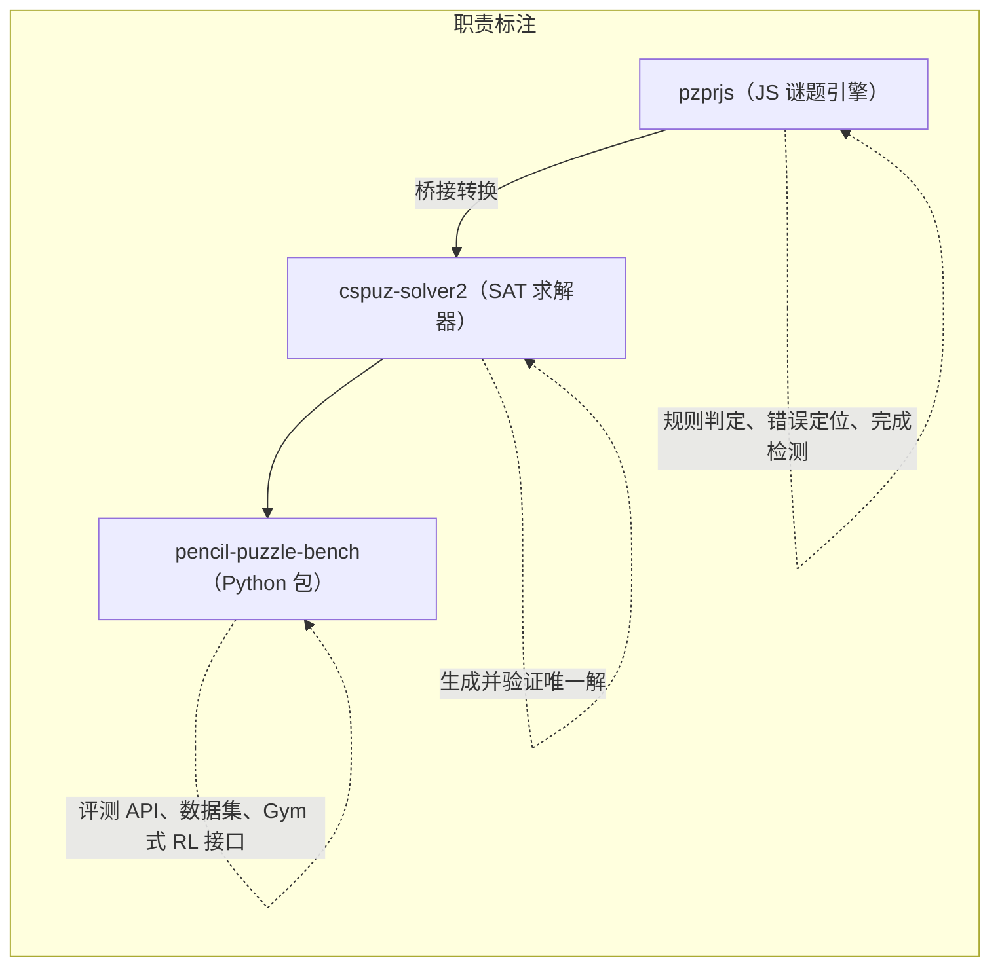

# 让大模型「逐步解数独/解谜」以构建智能评测基准：Pencil Puzzle Bench 与可验证的LLM多步推理

最强的推理模型，不借助算法、代码，仅靠推理，解普通数独，成功率有多少？**33.3%**。如果给他加上"边做边检查"的本事，依然不借助其他的计算工具，成功率冲到 **56.0%**。但是，如果是其他的有固定规则的日式纸笔谜题（pencil puzzles）呢？事实上，Pencil Puzzles 也能成为大模型推理评测的下一个试验场。

这篇文章简单分享一下 [arXiv:2603.02119](https://arxiv.org/pdf/2603.02119) Pencil Puzzle Bench: A benchmark for multi-step verifiable reasoning 这篇文章引入的新的评测基准，以及作者在探索 LLM + Pencil Puzzle 上得出的结论。

[HuggingFace🥳](https://huggingface.co/datasets/bluecoconut/pencil-puzzle-bench), [website & leaderboard 📊](https://ppbench.com).


---

## 一、论文速览：一张卡片

| 维度           | 内容                                                                                                                      |
| -------------- | ------------------------------------------------------------------------------------------------------------------------- |
| **标题**       | Pencil Puzzle Bench: A Benchmark for Multi-Step Verifiable Reasoning                                                      |
| **作者**       | Justin Waugh（唯一作者）                                                                                                  |
| **机构**       | Approximate Labs（近似实验室）                                                                                            |
| **发布**       | arXiv 预印本 2603.02119，2026 年 3 月                                                                                     |
| **一句话概括** | 用 62,231 道日式逻辑谜题、94 种谜题构建评测基准，让大模型在"每一步棋盘状态都能被自动验证"的环境里解谜题，评估多步推理能力 |
| **核心创新**   | 不只是看"解没解出来"，而是能检查**每一个中间步骤**，并精确定位"违反的是哪条规则、哪个格子"                                |
| **配套资产**   | `pencil-puzzle-bench` Python 包 + 全量数据 + 全部运行记录 `runs.jsonl`（HuggingFace）                                     |


这是一篇很典型的"基建型"论文：它不宣称哪个模型赢了，而是修好了一条**人人都能用的推理评测流水线**，并顺手给出了 51 个模型在这条流水线上的表现画像。

---

## 二、为什么偏偏是逻辑谜题？——大模型评测的困境与破局

### 2.1 评测基准的三个痛点

论文主要评测时间集中在2025～2026年初，彼时大模型评测有一些集体焦虑：

1. **单轮不够用**。GSM8K、MATH、ARC 这些经典基准都是一问一答，测的是"一把梭"式的能力，测不出几十步的推理链条。
2. **污染防不住**。GSM8K 这类公开题集早就被训练数据"喂"进去了，模型"背答案"而不是"会推理"。
3. **只能验结果，不能验过程**。SWE-bench 这类代码基准只检查最终代码对不对，推理到一半是否走偏，根本无从得知。

而强化学习（RL）、过程奖励模型（PRM）这些训练技术，恰恰需要"**过程**"级别的信号——你要能告诉我哪一步错了、为什么错，模型才能学会自我修正。

### 2.2 逻辑谜题：为此而生

作者给出的答案是**纸笔谜题**——就是数独 (sudoku)、数回 (slitherlink)、Nurikabe、数方 (Heyawake) 这类日本纸笔逻辑谜题。它们普遍具有如下的性质：

| 性质                                    | 含义                                                          | 为什么宝贵             |
| --------------------------------------- | ------------------------------------------------------------- | ---------------------- |
| **可验证** <br>(Verifiable)             | 一个合法题目**应该恰有一个解**，这可以快速地由 SAT 求解器验证 | 有客观的正确答案       |
| **多步** <br>(multi-step)               | 需要数十到数百步演绎推理                                      | 天然的长链条任务       |
| **逐步反馈** <br> (step-wise feedback)  | 每一步都能按变种规则校验，报错还能指明违反哪条规则            | 稠密的"过程"级信号     |
| **低污染风险** <br> (low contamination) | 社区习惯共享题面 URL，但几乎不公开发布答案                    | 训练数据里"背答案"很难 |
| **解序无关** <br>                       | 终局唯一，但到达顺序任意，可撤销重做                          | 评测不怕"走法不同"     |
| **多表示**                              | 同一棋盘有 ASCII / SVG / 像素图三种表示                       | 为多模态评测留后门     |


> 逻辑谜题求解过程。

理论上，**很多铅笔谜题是 NP-Complete的**（数独、数回、Evolomino 都已被证明）。这意味着在特定情况下，"表面模式匹配"不可能通吃所有变种和尺寸——推理深度在这里是刚需。

作者认为这一块是一个"又难、又干净、又能够量化过程"的领域。这三点同时成立的领域在 AI 评测里非常稀有。

---

## 三、数据与技术链路：三层搭出来的"推理跑步机"

作者的技术栈是三段式接力，每一段都有明确分工：



### 3.1 三块基石

1. **pzprjs**：一个成熟的 JavaScript 谜题框架，实现了 **100+** 种谜题变种的完整规则判定，正是日本谜题社区 **puzz.link** 背后的引擎。谜题以 "classic URLs"（紧凑编码）在社区流传。
2. **cspuz-solver2**：基于 SAT 的约束求解器，负责"这道题到底有没有解、解是否唯一"——保证数据集的每一道题都经过机器验证。
3. **Python 包**：把引擎包成一行就能用的接口。论文给出了极简示例：

```python
from ppbench import Puzzle, load_dataset

puzzle = Puzzle.from_url("http://puzz.link/p?sudoku/...")
puzzle.send_move("mouse,left,3,5")   # 落一步棋（第 3 列第 5 行左键）
violations = puzzle.check()          # 空列表 = 合法
if puzzle.is_complete():
    print("Solved!")
```

### 3.2 把“给出的解”翻译成“求解过程”

上述是既有的比较成熟的工具链，但中间有一个关键的"翻译"步骤：

> **SAT 求解器输出的是一整张完成状态（最终棋盘长什么样）；而 pzprjs 和模型打交道的是"一连串交互移动"（先点哪里、再点哪里）。**

比如人类求解数独，不可能啪一下子把所有数字都填满了，而是循序渐进地，先用行/列/宫排除，把一些简单的格子填上，比如，R1C3 填 5，之类之类，然后再用一些更强的策略，比如 XY-Wings，Naked Pairs，一点一点填满剩下的格子。

于是，整个求解过程就能够被拆解成一系列“可行的走法序列”：

```
「STEP-1」：(R1, C3) -> 5
「STEP-2」：(R5, C4) -> 3
「STEP-3」：...
「STEP-57」：(R7, C9) -> 1 
「STEP-58」：answer_check()
```

把"终局棋盘"拆解为"可行走法序列"后，能够带来连锁性变化：

- 模型可以用**解轨迹**做监督微调，帮小模型"起步"；
- 可以据此做**难度分析**；
- 可以验证每道题**唯一解**成立；
- 整个流程和真实人类的解谜体验对齐

实际过程比上面说的要复杂一些，可以看看 Kimi 帮我整理的 pzprjs 支持的步骤：

| 指令                  | 语法                   | 含义                                 | 示例                 |
| --------------------- | ---------------------- | ------------------------------------ | -------------------- |
| `newboard`            | `newboard,W,H`         | 按宽×高新建空白盘                    | `newboard,5,2`       |
| `playmode`/`editmode` | `playmode[,输入模式]`  | 切到求解 / 编辑模式（可带输入模式）  | `playmode,shade`     |
| `mouse`               | `mouse,{按键},{坐标…}` | 一次鼠标手势：点 / 拖 / 多段折线     | `mouse,left,1,1,9,1` |
| `key`                 | `key,{键}[,{键}…]`     | 一次键盘输入序列（每个键按下并松开） | `key,1,right,-`      |
| `cursor`              | `cursor,X,Y`           | 把输入焦点移到指定格 / 板外件        | `cursor,1,1`         |
| `clear`               | `clear`                | 清空全部输入                         | `clear`              |
| `ansclear`            | `ansclear`             | 只清"答案"（求解层）                 | `ansclear`           |
| `subclear`            | `subclear`             | 只清"辅助记号"                       | `subclear`           |
| `setconfig`           | `setconfig,{键},{值}`  | 设置运行选项                         | `setconfig,use,1`    |
| `flushexcell`         | `flushexcell`          | 重建棋盘外的额外格                   | `flushexcell`        |

### 3.3 逐步验证

评测的核心机制是**四步验证流水线**：

1. **移动前**：检查当前棋盘是否已有违规；
2. **施加移动**：执行一个坐标式动作（如 `mouse,left,3,5`）；
3. **移动后**：立刻检查这一步引入了哪些新违规；
4. **完成检查**：判定整道题是否被正确解开。

每个变种都定义了自己的**有序约束集**：先查局部/直接约束（如"两个阴影格子相邻了"），再查全局状态约束（如"回路必须连通"）。违反时引擎不仅说"错了"，还告诉你**错在哪条规则、哪几个格子**，并在可视化里用红色高亮。

举例说明，引擎能给出的报错是这种粒度：

- Nurikabe："阴影格形成了 2×2 方块"、"两个带数字的岛连在了一起"
- Slitherlink："回路在顶点分叉"、"数字线索不满足（期望 2 条边，实际 3 条）"
- Norinori："阴影格周围没有相邻阴影格"、"区域内阴影格少于 2 个"
- Sudoku："行内数字重复"、"宫内数字重复"

通过让**"过程可证伪"**，这套基准可以无缝接上 RLVR（基于可验证奖励的强化学习）、过程奖励模型等——作者认为这是他的工作“最想为社区留下的一笔资产”。

---

## 四、数据集是怎么做出来的：前所未有之处与三点提醒

### 4.1 规模与来源

完整数据库是一个惊人的体量：

| 统计项           | 数值                                                             |
| ---------------- | ---------------------------------------------------------------- |
| 谜题总数         | **62,231** 道                                                    |
| 谜题类别         | **94** 种谜题                                                    |
| 创作者数         | **814** 位不同的作者提供的题目                                   |
| 谜题             | SAT 验证唯一解（100%）+ 逐步解轨迹 + 来源溯源（URL/作者/时间戳） |
| 求解步骤量中位数 | 78                                                               |
| 盘面大小中位数   | 100 格                                                           |

数据来自 **puzz.link** 社区 ——一个日本谜题爱好者社区，聚合了来自 Twitter、个人博客和谜题比赛的各类题。也就是说，这些不是合成题，而是**人类创作者多年"手作"出的真难题**，质量与多样性都有保障。

### 4.2 三层评测集（"Golden"）

从全库中再抽三层，按难度分层（每种内 short/medium/long 各取 5 道，按必要步骤数划分）：

| 评测集         | 题数 | 变种                                   | 用途                          |
| -------------- | ---- | -------------------------------------- | ----------------------------- |
| **Golden 300** | 300  | 20                                     | Direct Ask 全量评测           |
| **Golden 30**  | 30   | 4（yajilin, sashigane, lits, lightup） | 大多数模型的 Agentic 基线     |
| **Golden 60**  | 60   | 20                                     | 3 个顶级模型的 Agentic 扩展集 |


> 作者的 20 类经典变体，测试 Agentic。注意标红的表示执行中途，发现矛盾、错误的位置。

### 4.3 创新点

1. **逐步级验证 + 错误定位**。别的谜题基准（GridPuzzle、ZebraLogic、甚至最近的 Sudoku-Bench）要么只有文本、要么只看终局。Pencil Puzzle Bench 是第一个把**每一步棋盘状态**都对变种约束做程序化校验、并精确定位到"哪条规则、哪个格子"的。
2. **坐标式交互移动**。模型不是"说答案"，而是像真人一样在真实 UI 坐标系里落子（左键/右键/划线），可直接对接真实解谜环境。
3. **用"社区规范"论证抗污染**。这是很聪明的一手：不是"这题很冷门所以没被训练数据看到"，而是"puzz.link 社区的礼仪就是不发布答案，发答案是不礼貌的"——用**文化规范**来做抗污染的软证据，比单纯冷门更有说服力。
4. **可作 RL 训练场**。逐步验证信号可以组合成稠密奖励函数（违规数量变化塑形、进度奖励），加上 Gym 兼容接口，是现成的 RL 沙盒。

### 4.4 Limitations

1. **评测只用文本**。模型拿到的是 ASCII 棋盘，Agentic 模式下多了一个返回 SVG 文本的 `render_board_as_svg()` 工具；**像素图从未被使用**。所以"视觉—空间推理"强的变种可能被低估，多模态评测是留给未来的工作。
2. **评测集偏小 + 单次点估计**。每变种仅 15 题，多解 1 题就会让该变种成功率波动 **6.7 个百分点**；所有成功率都是单次运行的**点估计**，没有置信区间、没有重复试验、也没有人类表现基线。论文自己在 Limitations 里承认了这一点。
3. **Agentic 评测的规模不对称**。大多数模型只在 30 道题的基线上做 Agentic，只有 3 个顶级模型在 60 道全变种扩展集上跑——跨模型比较 Agentic 数字时要格外小心。

---

## 五、评测结果：51 个模型，两条"能力轴"——大模型进化的时间表

### 5.1 评测阵容

论文一口气评测了 **51 个模型、来自 11 家提供商**，覆盖 OpenAI（14 个模型配置）、Anthropic（11）、Google（7）、xAI（3）、DeepSeek（2）、Qwen（5）、Mistral（2）、Moonshot（2）、Minimax（2）、Zhipu（2）、Xiaomi（1）——既有闭源旗舰，也有开源/开放权重模型。这本身就是 2026 年初大模型版图的一份快照。

> 我仿佛看到了token在燃烧 ... 

两种策略设计得很朴素（作者强调**没做任何提示词优化**，目的是"量现状"而非"刷分"）：

- **Direct Ask（直问）**：给模型完整棋盘，让它一次性输出完整的 JSON 格式的步骤列表，只推理一次。
- **Agentic（多轮代理式）**：给模型工具（`make_move`、`check_board`、`reset_puzzle`、`give_up` 等），让它落子 → 检查 → 看报错 → 修正，循环直到解出或放弃。输出不合规时框架会自动催它："还没做完，继续！！"或者“错了，快调整！！”

### 5.2 一场"马拉松"式的评测

Agentic 模式不是跑几步就算完，而是真正的长程多轮：

| 统计          | 均值    | 中位数  | P90      | 最大          |
| ------------- | ------- | ------- | -------- | ------------- |
| **回合数/次** | 57.2    | 29      | 113      | **1,221**     |
| **时长/次**   | 40 分钟 | 17 分钟 | 108 分钟 | **14.3 小时** |

作者说为了进行评测，在对应数据集上（并没有让所有算例都跑Agentic）进行了 **1,602** 次 Agentic 运行，叠加直问总共 **17,032** 次运行。一场单题解谜最多 1,221 个回合、持续 14 小时——这不是"会调工具"就能完成的事，它同时考验**长上下文利用能力**和**持久推理**。

### 5.3 最重要的发现：两条相互独立的能力轴

论文全文最漂亮的一个结论是——大模型在这类任务上的进步来自**两个正交的维度**：

1. **推理深度**（reasoning depth）：靠 effort 级别、扩展思维（extended thinking）控制；
2. **Agentic 迭代**（agentic iteration）：靠"做一步→检查→纠错"的外部闭环控制。

它们不冗余、互补，且 **"直接问" 表现越弱的模型，从 Agentic 迭代中获益越大**。论文称之为 **Agentic 鸿沟（the agentic gap）**。

看几个极端案例：

| 模型                                | 直接问   | Agentic   | 提升                      |
| ----------------------------------- | -------- | --------- | ------------------------- |
| Claude Opus 4.6（默认，无扩展思维） | **0.3%** | **30.0%** | **+29.7pp**               |
| Claude Opus 4.6@thinking            | 27.3%    | 33.3%     | +6.0pp（匹配集 +4.8pp）   |
| GPT-5.2@xhigh                       | 27.0%    | 56.0%     | +29.0pp（匹配集 +35.7pp） |


作者举例了 Claude Opus 4.6：以直问来看，它的**内部**推理几乎不存在（直问 0.3%正确率），但只要给它"能动手、能看报错"的外部闭环，成功率冲到 **30.0%**——**靠"外部脚手架"补足了"内部推理"的缺失**。而强如 GPT-5.2@xhigh，即使已经很强，也还能再靠迭代提升 35.7 个百分点。最强结果总是"深度推理 + 迭代验证"双轴叠加的结果。

### 5.4 大模型进化的"能力快照"

再把这些点串成时间线，你会看到一个非常清晰的能力爆发曲线：

- **2024 年底之前发布的模型**（GPT-3.5-turbo、GPT-4o、GPT-4.1、o1……）→ **0% 或接近 0%** 的解题率；
- 2025 年初 o3 首次冒出 3.0% 的"非平凡"成绩；
- **2025 年 11 月起，GPT-5 家族与推理增强模型带来爆发式增长**。


换句话说，**"不借助工具解日式逻辑谜题"是一项 2025 年底才从LLM中普遍诞生的新能力**——2024 年的模型一题都不会。没有这个基准，你很难把"模型变强了多少"量化得这么精确。

Claude 家族内部的进化弧同样耐人寻味（同一配置：默认 effort、无扩展思维）：

```
Sonnet 4.5 (0.0% / 3.3%)  →  Opus 4.5 (0.3% / 3.3%)  →  Opus 4.6 (0.3% / 30.0%)
      直问/Agentic               直问/Agentic              直问/Agentic
```

从 Opus 4.5 到 4.6 的跨越，**几乎全部发生在 Agentic 模式**——两代模型"单发解题"能力几乎没变，但新一代更善于利用外部验证循环。这说明模型进化的"下一个前沿"正在从"想得更多"转向"会与环境互动"。

### 5.5 反直觉的两个细节

- **更高 effort 不一定更好**：Claude Opus 4.6 默认配置（30.0%）反而胜过 @max（23.3%）。推理深度与 Agentic 有效性之间是**非单调**关系——想得太多可能适得其反。
- **推理努力缩放惊人但带刺**：GPT-5.2 从无推理到最高 effort（xhigh），直问成功率从 0.33% 提升 81 倍到 27.0%（各档 0.33% → 2.3% → 9.3% → 20.7% → 27.0%）。但 xhigh 档有 **35% 的请求在返回前就失败了**——能力与可靠性之间出现了尖锐的权衡。


### 5.6 解开"没人解过的变种"

- Agentic 扩展评测**解开了 3 个此前没有任何模型“直问”能够解出的变种**（sashigane、heyawake、shakashaka）——至此全部 20 个变种至少被解出过一次；但仍有多达 **49% 的单题没有任何模型解出**（Agentic 之前是 57%）。
- 最扎心的落点是 Sudoku：最强模型 @xhigh 在普通数独上也只解出 **33.3%**。数独是训练数据里最常见、最"背得出来"的变种，仍然只有三分之一的成功率。

作者筛选出的 20 个 Golden 数据集的求解情况、规则一览（按最优解题率排序）：

| 变种            | 规则一句话                                | 最优模型                 | 最优解题率 |
| --------------- | ----------------------------------------- | ------------------------ | ---------- |
| Norinori        | 涂阴影，每格恰邻一个阴影格，区域内恰 2 个 | gpt-5.2@xhigh            | 100%       |
| Shikaku         | 把盘面分成矩形，每块恰含一个数字          | gpt-5.2@xhigh            | 86.7%      |
| Lits            | 每区放一块四连块，无 2×2 满铺，同形不共边 | gpt-5.2@xhigh            | 73.3%      |
| Hitori          | 涂格去重，无相邻阴影，未涂格全连通        | claude-opus-4-6@thinking | 66.7%      |
| Lightup         | 放灯照亮全盘，灯不能互照                  | claude-opus-4-6@thinking | 66.7%      |
| Mashu           | 画回路过每圆，黑白圆转向规则不同          | gpt-5.2@xhigh            | 66.7%      |
| Tapa            | 涂格，线索表示周围连续阴影长度            | gpt-5.2@xhigh            | 66.7%      |
| Firefly         | 从萤火虫引路成连通网络，转向有计数        | gpt-5.2@xhigh            | 46.7%      |
| Nurimisaki      | 涂格，圆点格恰邻一个未涂格                | claude-opus-4-6@thinking | 40.0%      |
| Yajilin         | 涂格 + 回路，箭头指示方向阴影数           | gpt-5.2@xhigh            | 40.0%      |
| Nurikabe        | 涂墙，数字岛大小唯一，墙全连通            | claude-opus-4-6@thinking | 33.3%      |
| Slither         | 画回路，数字=该格被圈边数                 | gpt-5.2@high             | 33.3%      |
| **Sudoku**      | 每行/列/宫 1–N 各一次                     | gpt-5.2@xhigh            | **33.3%**  |
| Kurodoko        | 涂格，数字=直线可见未涂格数               | gpt-5.2@xhigh            | 26.7%      |
| Nurimaze        | 涂格成迷宫，无同色 2×2，S→G 通路过圆      | claude-opus-4-6@thinking | 26.7%      |
| Sashigame（*）  | 分成 L 形区，角在圆、端在箭头             | gpt-5.2@xhigh            | 20.0%      |
| Country         | 回路过每国一次，数字=途经格数             | gemini-3.1-pro           | 13.3%      |
| Dbchoco         | 分成黑白两同形区域                        | gpt-5.2@xhigh            | 6.7%       |
| Heyawake（*）   | 房间内阴影计数，无直线穿 2+ 房界          | gpt-5.2@xhigh            | 6.7%       |
| Shakashaka（*） | 放三角形，空白区成矩形                    | gpt-5.2@xhigh            | 6.7%       |

> 标（*）的变种**仅靠 Agentic 迭代才被解出**——直问模式下为 0%。

---

## 六、新结论：什么才真正决定谜题的难度？

论文把难度分析单独做了一章，结论很有趣：

- **步数不是好指标**：把解题率对"必要步骤数"回归，调整 R² 只有 **0.092**——步骤数几乎解释不了难度差异。
- **变种本身更能说明问题**：仅变种类型这一个因素（η²=0.242）就能解释比步骤数多 **2.6 倍**的方差。
- **「求解过程的压缩率」指标更有说服力**：把求解过程的序列做 zlib 压缩，"压缩后大小 / 原始大小"的比值，回归后调整 $R^2$ 高达 **0.385**，预测力是步骤数的 **4.2 倍**。
- 加上面积仅到 0.415，再加变种哑变量后到 0.621。

这里的直觉可能是，求解**压缩率高的解，意味着棋盘上有大量重复、有结构的模式**，模型可以从部分进展"举一反三"；压缩率低的解，每一步都是高熵的、必须做全新决策——那才是真正的难。作者认为这为课程学习（curriculum learning）提供了一把原理性的"难度标尺"。

---

## 七、成本账：近 3 万美元，1.7 万次运行，效率差距 6.6 万倍

- 总记录成本约 **$28,246**（17,032 次运行；实际更高，因为出错中断的运行没有计入已完成的 token）。
- **每次成功所需的成本，跨模型变化高达 66,822 倍**。
- 成本效率的极端是 **Grok 4.1 Fast**：每次成功的case仅耗费 **\$0.01**，但成功率低；而成功率最高的 GPT-5.2@xhigh，每次尝试都需要烧掉 **$9.74**。
- 一个典型的"能力—成本"帕累托前沿由此成形：**要么便宜但解不出来，要么贵但解得多**——中间地带目前还很稀疏。

论文还记录了基础设施的系统性极限：xhigh 的失败并非随机网络抖动，**100% 的失败集中在 1–4 小时区间，62% 的峰值在 2–3 小时**——指向服务端约 2.5–3 小时的硬超时。


附录里作者给出了 Agentic 下 Token 燃烧的情况。Claude 4.6 的 Agentic 模式把求解成功率从几乎没有，拔高到了 23.3%，但是付出的代价是每次约 169.27 \$ 的成本。

| 模型                       | 直问  | Agentic   | Δpp   | 成本/次 |
| -------------------------- | ----- | --------- | ----- | ------- |
| gpt-5.2@xhigh              | 27.0% | **56.0%** | +29.0 | $9.74   |
| claude-opus-4-6-1m         | 0.0%  | 36.7%     | +36.7 | $14.11  |
| gpt-5.2@high               | 20.7% | 36.7%     | +16.0 | $7.30   |
| claude-opus-4-6@thinking   | 27.3% | 33.3%     | +6.0  | $6.24   |
| gemini-3.1-pro             | 20.0% | 33.3%     | +13.3 | $14.36  |
| claude-opus-4-6            | 0.3%  | 30.0%     | +29.7 | $10.89  |
| claude-sonnet-4-6@thinking | 10.3% | 26.7%     | +16.3 | $3.94   |
| gpt-5.2-pro                | 9.7%  | 26.7%     | +17.0 | $41.52  |
| claude-opus-4-6@max        | 0.3%  | 23.3%     | +23.0 | $10.87  |
| claude-sonnet-4-6-1m       | 0.3%  | 23.3%     | +23.0 | $169.27 |

---

## 八、成果产出：给社区留下的"推理训练场"

用一句话总结产出：**一篇论文 + 一个开源基准包 + 一个数据集 + 一份完整透明的运行日志**。

| 产出          | 内容                                                                                   |
| ------------- | -------------------------------------------------------------------------------------- |
| **数据集**    | 62,231 题全库（含逐步解轨迹）+ 300 金标题                                              |
| **Python 包** | `pencil-puzzle-bench`：加载数据、走棋、校验、判断完成                                  |
| **运行日志**  | `runs.jsonl`（HuggingFace）记录每次运行的模型/谜题/策略/结果/成本/时长——**透明可复现** |
| **评测画像**  | 51 模型 × 2 策略的完整成绩表                                                           |
| **新结论**    | 两轴能力观、Agentic 鸿沟、压缩率难度度量                                               |

作者展望的落地路径：

1. **逐步奖励的强化学习（RLVR）**：用"每步每约束的验证信号"做稠密奖励微调；
2. **过程奖励模型（PRM）训练**：验证器天然提供逐步的监督标签；
3. **课程学习**：用压缩率做原理性难度度量，由易到难地训练；
4. **多模态评测**：让模型"看图"解谜，而不是只读 ASCII 文本。

当然了，如果你不喜欢这些技术细节，只想看个好玩，你可以访问作者自己搭建的这个网站，动态更新着不同 LLM 在这些逻辑谜题上的分数：


---

## 总结：

1. **逻辑谜题从来不只是休闲玩具。** 数独、数回、Nurikabe 这套"手作难题"，恰好是约束满足（很多还是 NP 完全）问题中**最可验证、最多步、最能给过程反馈**的一类。大模型时代，它们从"报纸角落的消遣"升级成了**推理训练的试金石**：一个 2024 年模型一道都不会、2026 年最强模型也只解三分之一数独的领域，就是衡量"推理能力"最苛刻也最干净的标尺。

2. 时间线告诉我们，LLM 能力不断进化；Agentic Gap 告诉我们进化方向正在从"内部想得更深"转向"学会与外部验证器协作"。

3. **未来的纸笔逻辑谜题研究，会比"解谜"本身更值钱。** 当每走一步棋都能得到"违反哪条规则、在哪一格"的反馈时，谜题就从一个"结果导向"的娱乐，变成了一个"过程导向"的训练环境——PRM、RLVR、课程学习、多模态理解，都能在这块试验田里种下自己的作物。Pencil Puzzle Bench 的意义，不在于它刷出了什么榜单数字，而在于它**把"可验证的多步推理"变成了一门可以量化的科学**。

