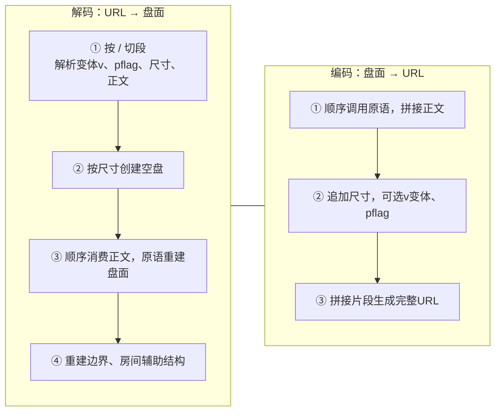

# pzprjs URL 编码体系总览

> 本文是「pzprjs 在线逻辑谜题编码规则」的第一篇总述文章。它试图回答三个问题：
> ① 一个经典的纸笔逻辑谜题是如何被塞进一小串 URL 字符供玩家解谜的？
> ② 这套编码系统由哪些"积木"组成？
> ③ 后续会怎么介绍这些“积木”？


## 1. 从一条 URL 说起

[pzprjs](https://github.com/robx/pzprjs) 是线上逻辑谜题工具 **puzz.link** 的前端：它支持 250 余种谜题的在线制作、求解、分享与求解记录。分享一个谜题只需要一条紧凑 URL，例如：

```
https://puzz.link/p?slither/6/6/h712221dh7137158dh872d
```

`?` 之后的部分 `slither/6/6/h712221dh7137158dh872d` 就是全部谜题信息：

| 段   | 值                       | 含义                        |
| ---- | ------------------------ | --------------------------- |
| pid  | `slither`                | 谜题类型标识（Slitherlink） |
| cols | `6`                      | 列数（宽）                  |
| rows | `6`                      | 行数（高）                  |
| body | `h712221dh7137158dh872d` | 压缩后的谜面正文            |

1. 考虑到谜题变体，完整的url设有变体段（`v:xxx/`）与 pflag 段（单个非数字字符）——它们是可选段，出现时位于 pid 之后、尺寸之前，语法见第 2 节。
2. 世界各地的玩家对于不同谜题可能有不同的拼写，比如 **yajilin 有 `yajirin` 旧写法、akari 有 `lightup` 旧写法**，pzprjs 解析url时候会对 `pid` 做谜题路由，把输入兼容到正确的谜题解析方法中，以兼容"历史别名"，这是作为一个成熟在线工具的常见特征。


我们在 [pzplus.tck.mn](https://pzplus.tck.mn/db) 上可以搜集到庞大的谜题数据，本次收集截止2026-01-29，共获得 63391 个真实谜题，覆盖250 种类型，剔除了谜题复杂变体。统计显示，**前 10 高频谜题**如下：

| 排名 | 类型        | 数量  | 占比   |
| ---- | ----------- | ----- | ------ |
| 1    | yajilin     | 15281 | 24.11% |
| 2    | slitherlink | 4955  | 7.82%  |
| 3    | heyawake    | 4800  | 7.57%  |
| 4    | shakashaka  | 2737  | 4.32%  |
| 5    | masyu       | 2521  | 3.98%  |
| 6    | nurikabe    | 2288  | 3.61%  |
| 7    | akari       | 1927  | 3.04%  |
| 8    | nurimisaki  | 1156  | 1.82%  |
| 9    | lits        | 1151  | 1.82%  |
| 10   | shikaku     | 1061  | 1.67%  |

---

## 2. URL 的完整语法

pzprjs 的 URL 解析框架负责把 URL 拆解成标准数据段。现代 v3 格式的完整语法为：

`http://<host>/p.html?<pid>/[(v:<variant>/][(<pflag>)/](<cols>)/(<rows>)/(<body>)`

各部分按 `/` 依次切分后，解析按以下顺序进行：

1. `pid` 谜题路由： 不可缺失，决定标记后续 url 的编解码方式，针对别名 (`lightup` v.s. `akari`，`yajilin` v.s. `yajirin`) 做了兼容，不可缺失;
2. **可选变体段**：若首段以 `v:` 开头，则取出变体名（如 `v:black`），弹出，标准谜题无该变体段；
3. **可选 pflag 段**：若下一段**不是数字**，则作为 pflag 弹出；否则视为尺寸开始，常见简单谜题无该 `pflag` 段；
4. **尺寸段**：读 `cols`、`rows` 两个数字，不可缺失；
5. **正文**：剩余所有段用 `/` 重新拼回，即 body，不可缺失。

`pflag`（puzzle flag）是这套体系里的"选项位"，它用一个**非数字字符**放在尺寸之前，表达谜题的变体/格式信息。各谜题通过检测 pflag 里是否含某个字符来决定选项。例如：

| 谜题        | pflag     | 含义                           |
| ----------- | --------- | ------------------------------ |
| slitherlink | `f`       | 全边规则变体 `slither_full`    |
| yajilin     | `o`       | 回路外侧变体 `yajilin_out`     |
| fillomino   | `t`       | 三角形区域变体 `fillomino_tri` |
| lits        | `c` / `d` | 新/旧 Applet 格式兼容          |

pflag 还有一段完整的"历史兼容"故事：creek、gokigen、lits 曾用 `c/d` 区分 Applet 与 v3 格式；icebarn 多次改版 URL；bonsan/kramma 用 `c` 缩短 URL 等。细节在后续文章展开。


除了 v3 格式，解析器还兼容多个**历史 URL 格式**：

| 格式              | 判定特征                                        | 示例                                                            |
| ----------------- | ----------------------------------------------- | --------------------------------------------------------------- |
| ぱずぷれ v3       | `?pid/...` 或 `?pid_edit/...` / `?pid_play/...` | `p.html?slither/...`                                            |
| ぱずぷれ Applet   | `indi.s58.xrea.com/<pid>/(sa\|sc)/`             | `http://indi.s58.xrea.com/lits/sa/q.html?/4/4/...`              |
| カンペン (Kanpen) | `www.kanpen.net/<kid>.html?problem=`            | `https://www.kanpen.net/slitherlink.html?problem=2/3/1_3/0_1_/` |
| へやわけ Applet   | `www.geocities.co.jp/heyawake/?problem=`        | Heyawake 专用                                                   |
| pzpr 文件         | `?pzprv3/<pid>/...`                             | 文件格式，`/` 换行为换行符                                      |

虽然其中的一些（比如 `kanpen.net`）似乎已经成了互联网失传媒体了...

---

## 3. 三种主要编码策略：进制、位打包、Run-Length

整个编解码逻辑由一**通用原语库**（供所有谜题共享的编码积木）与各谜题的**基类流程**构成。所有谜题共享三套压缩思想：

### 3.1 用高进制字母表压缩"每格的有限状态"

普通文本表示一格状态通常要一个数字或符号，这套体系直接用 **36 进制字母表**（`0-9a-z`，36 个字符）把多个格子/状态打包进一个字符：

| 打包方式        | 基数 | 每字符承载              | 典型用途       |
| --------------- | ---- | ----------------------- | -------------- |
| 数值直接映射    | 16   | 1 格（0-15）            | 数字谜题       |
| 三态打包        | 27   | 3 格 (3进制，权重9/3/1) | 圆圈/三分格    |
| 位打包          | 32   | 5 格（5 bit）           | 边界、二元属性 |
| Run-Length 计数 | 36   | 一个"连续空格数"        | 稀疏网格       |

### 3.2 位打包（bit-packing）

对于"有/无"这类二元状态（如一条边是否画线、一个格子是否冻结），会把格子的边以 5 位一组，每位是 0或者1的二进制，装进一个 base-32 字符（权重 `[16,8,4,2,1]`）。以边界编码 **Border**（边界位打包）为例，它把内部边按编号顺序打包：

- **先竖边**：共 `(cols-1) × rows` 条（左右相邻格之间的边界，编号靠前）；
- **再横边**：共 `cols × (rows-1)` 条（上下相邻格之间的边界，编号靠后）。

每 5 条打包成一个 base-32 字符。10×10 盘面的边界部分因此只需要 `(9×10)/5 + (10×9)/5 = 18 + 18 = 36` 个字符。

### 3.3 数值分段前缀（Number16）

数字谜题里数值跨度极大（Nurikabe 可到 6 位数），固定长度浪费空间，于是按大小分档，小数字用少字符、大数字加前缀字符：

| 数值范围      | 编码          | 例子     |
| ------------- | ------------- | -------- |
| 0–15          | 1 个 hex 字符 | `6`      |
| 16–255        | `-` + 2 hex   | `-a3`    |
| 256–4095      | `+` + 3 hex   | `+4b2`   |
| 4096–8191     | `=` + 3 hex   | `=001`   |
| 8192–12239    | `@` + 3 hex   | `@3ff`   |
| 12240–77775   | `*` + 4 hex   | `*0001`  |
| 77776–1126351 | `$` + 5 hex   | `$00000` |

这套"可变长数值"方案 **Number16**（16 进制数字编码）会在后续文章展开。

### 3.4 Run-Length：把稀疏网格的空格合并

网格谜题普遍稀疏：大量格子没有数字。若逐格写 `0` 会浪费字符。编码器用一个计数器累计连续空格，攒到一定数量就用一个 base-36 字符（`g`-`z`，即 16-35）表示"跳 N 格"，数值格直接写字符。这样**稀疏盘面的 body 可以做到极短**。

> 例：`slither/10/10/gb812c8bj...` 中，`b` 等字符即包含"跳格"信息（后续文章会展开）。

---

## 4. 编码原语总清单

这套体系的"积木"是若干**通用编码原语**（scheme）。每个原语解决一类"怎么把盘面信息写成字符"的固定任务；各谜题按自己的规则、以固定顺序调用它们。总清单如下：

| 方案名 + 中文说明                                                                      | 覆盖谜题（高频者加粗）                               |
| -------------------------------------------------------------------------------------- | ---------------------------------------------------- |
| **4Cell**（0–4 数值单元格）：一字符同时表达"数值 + 后面空格的占位"，稀疏空段用跳格压缩 | **slitherlink、shakashaka、akari** 等                |
| **1Cell**：稀疏单值（每格一个稀疏数字）                                                | haisu、pmemory、tents                                |
| **4Cross**：0–4 交叉点数值（数字落在格点而非格内）                                     | heyawake（sumiwake 变体）、gokigen、creek            |
| **Number10**：0–9 数值                                                                 | swslither 等                                         |
| **Number16**（16 进制数字编码）：大范围数值（0~112 万），前缀分档 + 跳格               | **nurikabe、shikaku、fillomino、kurodoko** 等        |
| **Number10or16**：按需选 10/16                                                         | 兼容类                                               |
| **ArrowNumber16**（箭头数字编码）：方向 + 数字，方向折叠进首字符并暗示数字位数         | **yajilin**、lixloop                                 |
| **Border**（边界位打包）：边/区域边界，每 5 条边 1 个 base-32 字符                     | **heyawake、lits、yajilin(区域)、fillomino** 等 100+ |
| **RoomNumber16**（房间数字编码）：Number16 作用在"房间"而非"格子"上                    | **heyawake**、yajilin(区域)                          |
| **Circle**（三态圆圈编码）：每 3 格打包进 1 个 base-27 字符，定长无跳格                | **masyu** 等                                         |
| **CrossMark**：交叉点黑点                                                              | 点型谜题                                             |
| **Dot**：网格点标记                                                                    | 点型谜题                                             |
| **Binary**：二元属性位打包（冻结/空等两态）                                            | icebarn 类谜题                                       |


---

## 5. 编码主流程

所有谜题的 URL 生成与解析都遵循同一套流程，只是"积木的拼法"不同。




整个 body 的解析就是一个**顺序消费的流**：每个原语从正文开头读掉自己需要的一串字符，剩下交给下一个原语。因此**原语的调用顺序即是 URL 中字段的顺序**，不同谜题的字段排列差异都体现在各自的拼法里。

例如：

- Heyawake 的顺序是"房间选项 → 边界 → 房间数字"；
- Slitherlink 是"4Cell 数值"；

---

## 6. 为什么要压缩编码

很简单，因为要省长度。以slitherlink 为例子，这个url：

`https://puzz.link/p?slither/10/10/gbgbi560122agdj177217bgdj25658ao620786bm5656a`，如果逐格子地表示状态，需要100个字符，而如果用压缩后的字符来表示，只需要 45个，55% 的缩减。

| 编码方式 | 字符数 | 说明                                          |
| :------: | ------ | --------------------------------------------- |
| 逐格编码 | 100    | 每个格子一个字符（0-4、-、?），等长于网格面积 |
| 稀疏列表 | 215    | 行,列,值;行,列,值;...格式，每个线索约 6 字符  |
| number4  | 45     | puzz.link 实际使用的方案                      |

number4 相较于逐格编码节省了 55%，相较于稀疏列表节省了 79%。随着网格增大和空置率提高，这一优势会更加显著 —— 因为 number4 的编码长度大致正比于线索数量而非网格面积，而逐格编码始终正比于网格面积。

更一般地，设网格大小为 $N = R X C$，线索数量为 $K$，线索密度为 $d= K/N$：

- 逐格编码：$N$ 字符
- number4 最优情况（所有线索相邻排列，无大量连续空格）：约 $K$ 字符
- number4 典型情况（线索分散，有大量连续空格）：约 $K＋ \frac{N - K}{20}$ 字符（每 20个连续空格需一个 2）

举个例子，如下这个大规模数回，尺寸（31 行*45 列，共计 455个提示数（占比32.6%）以及对应位置，最终表示下来的URL（不算开头）共 610 个字符，**仅用了比原始提示数多 34% 的字符就完整地进行了表示**，所需长度为逐格编码的 43%

```
https://puzz.link/p?slither/45/31/
h33cg8dgbdgba6cddgadk30bk6djc21dgd
ddg328dk31di21ag7bgbcgcb8ddg6dg10c
i32ck5bjd22dg23ddj8ck23di02bg8cgd7
cddgdcg6cg22di13cjb02cgddbg22ccj8d
k3388bgbdgcc6cadgcdg8cgck8dja32bgb
ddg22dcj01ai12dg6bgdcgcc6cb17bg13d
i11bk7cjc11bgahaj6dk12ai31cg8cgdch
bagcdg6bg21ci31ck6aibcag22bdj7dk02
bi10ddgcb7ccdgbag8bg13di8bjb22dgcd
cg13dbj8ai20dg7dgcdgbd7bdcgd31ai21
dk7djd22dgcddi6dk21ci21cg7cgccgdbh
cdg8dg33di30ck7bjbhdg21bdj5ck21ci0
2ag81ca6bdcgcdg5cg23bi23djc12cgcda
g22cbj8ckdg5dgccgdd7cdbgdcg8620bk7
cjd21bgbddg22cbj20di23dg8cgcagdd7c
ag6cg21ci02ak8cjd11dg31ddj7dk12ai0
2ag8agd6ddagcdg6dg20ci31dk722dgcda
g21cdj7dk30bkbagcd8bdagbcg8bg20b
```

---

## 7. 「待填坑的」各谜题盘面能力总览

下表归纳本系列各分篇或许会涉及谜题的**盘面元素**（谜面里会出现哪些东西）与**变体 / 别名**（规则如何变化、URL 里如何体现）。逐字符的推演见对应分篇。

| 谜题（分篇）                                           | 支持的盘面元素                                                                         | 变体 / 别名                                                                                                                                  |
| ------------------------------------------------------ | -------------------------------------------------------------------------------------- | -------------------------------------------------------------------------------------------------------------------------------------------- |
| Slitherlink / Shakashaka / Akari                       | 数字 0–4、空格、黑墙 `.`（空格与黑墙仅 Shakashaka / Akari 使用，Slitherlink 无墙概念） | Slitherlink pflag `f`（完整回路显示）；Akari 输入兼容旧名 `lightup`、输出统一 `akari`；同族 swslither 改用 Number10 记录羊/狼                |
| Masyu                                                  | 白丸、黑丸、空格（三态）                                                               | pflag `f`（loop_full：线段必须通过全部格子）；显示偏好"裏ましゅ"白黑对调（不写入 URL）                                                       |
| Nurikabe / Shikaku / Fillomino / Kurodoko / Nurimisaki | 数字（0–1126351 分档）、空格、黑格 `.`                                                 | Fillomino pflag `t`（三角形变体）+ 可选给定区域边界；Kurodoko / Nurimisaki 共用编码（Nurimisaki 直接继承），同族还有 cave / teri / cityspace |
| Heyawake                                               | 房间分区（区域边界）+ 房间数字（每房间至多一个）                                       | 变体 pid：ayeheya、oneroom、akichi（pflag `x`）、sumiwake（数字改放在格点上）                                                                |
| Yajilin                                                | 箭头 + 数字（可为 `?`）、空格、特殊标记 `+`                                            | pflag `o`（黑格全在回路外侧）、`b`（显示类型）；旧名 `yajirin` 归一到 `yajilin`；区域变体 yajilin-regions 用 Border + 房间数字（无箭头）     |
| LITS                                                   | 只有房间分区（区域边界）                                                               | pflag `c` / `d`（新旧格式兼容）；一族还有 norinori、invlitso（独立 pid，非 `v:` 变体）                                                       |

总的来说，**编码方案是"积木"，谜题是"搭法"**。同一块积木（如 Border 边界位打包）在 Heyawake 里表达"房间边界"、在 LITS 里是谜面的全部、在 Fillomino 里是"可选的分割线"；它们读 URL 时用同一套语法，含义由谜题规则决定。

---

## 8. 求解过程 = 一串"操作指令"(如 mouse,left,3,5)

除了盘面本身，pzprjs 还把**一次完整的求解过程**拆成一条条原子操作指令——可以回放、撤销，也能序列化存成"求解记录"。这套体系分两层：

- **输入指令层**：驱动求解的"台词"，测试脚本 `test/script/*.js` 与 `test/puzzle/input_test.js`（`execinput`）里写的就是它们；
- **内部操作层**：真正写入撤销栈、可存盘的"操作记录"（`src/puzzle/Operation.js`）。

### 8.1 输入指令一览（execinput 语法）

| 指令                  | 语法                   | 含义                                 | 示例                 |
| --------------------- | ---------------------- | ------------------------------------ | -------------------- |
| `newboard`            | `newboard,W,H`         | 按宽×高新建空白盘                    | `newboard,5,2`       |
| `playmode`/`editmode` | `playmode[,输入模式]`  | 切到求解 / 编辑模式（可带输入模式）  | `playmode,shade`     |
| `mouse`               | `mouse,{按键},{坐标…}` | 一次鼠标手势：点 / 拖 / 多段折线     | `mouse,left,1,1,9,1` |
| `key`                 | `key,{键}[,{键}…]`     | 一次键盘输入序列（每个键按下并松开） | `key,1,right,-`      |
| `cursor`              | `cursor,X,Y`           | 把输入焦点移到指定格 / 板外件        | `cursor,1,1`         |
| `clear`               | `clear`                | 清空全部输入                         | `clear`              |
| `ansclear`            | `ansclear`             | 只清"答案"（求解层）                 | `ansclear`           |
| `subclear`            | `subclear`             | 只清"辅助记号"                       | `subclear`           |
| `setconfig`           | `setconfig,{键},{值}`  | 设置运行选项                         | `setconfig,use,1`    |
| `flushexcell`         | `flushexcell`          | 重建棋盘外的额外格                   | `flushexcell`        |

### 8.2 mouse 指令详解

`mouse,left,1,1,9,1` 内部等价于 `inputPath("left", 1,1, 9,1)`：在 `(1,1)` 按下 → 依次向每个后继点拖动（内部按 0.5 格步长插值成若干 mousemove）→ 在最后一点松开。

| 组成部分 | 语法                 | 说明                                    | 示例                     |
| -------- | -------------------- | --------------------------------------- | ------------------------ |
| 按键     | `left` / `right`     | 左键=主操作，右键=副操作（画×、清除等） | `mouse,right,3,1`        |
| 连点     | `leftxN` / `rightxN` | 同一位置连续点击 N 次                   | `mouse,leftx2,1,1`       |
| 修饰键   | `alt+left`           | 按住 Alt 拖拽（如连画×）                | `mouse,alt+left,1,1,5,1` |
| 坐标     | `,X,Y[,X,Y…]`        | 原始坐标，1 单位 = 半格                 | `mouse,left,0,0,2,0`     |
| 板外件   | `,bank,{idx}`        | 点击 bank（配件栏）中第 idx 个件        | `mouse,left,bank,0`      |

**坐标约定**：mouse 坐标是"半格原始坐标"，**格心在奇数、格点/边界在偶数**。格子 `(x,y)` 的中心 = 原始 `(2x-1, 2y-1)`。于是：yajilin 点格子 (1,1) 用 `mouse,left,1,1`；slitherlink 从左上角格点起笔跨一条边用 `mouse,left,0,0,2,0`。

### 8.3 key 指令详解

`key,{键}…` 把每个键"按下再松开"各执行一次；连续多键用于输入多位数（`key,1,0` = 输入 10）。

| 键                                     | 含义                          | 示例              |
| -------------------------------------- | ----------------------------- | ----------------- |
| `0`–`9`、`a`–`z`                       | 数字（36 进制，>9 用字母）    | `key,1,0` 输 10   |
| `-` / `+`                              | 数值减一 / 增一（越界则循环） | `key,-`           |
| `up`/`down`/`left`/`right`             | 移动输入光标                  | `key,right`       |
| ` `（空格） / `BS`                     | 消去 / 退格                   | `key, `           |
| `shift+…`、`alt+…`、`ctrl+…`、`meta+…` | 修饰键组合                    | `key,shift+right` |
| `alt+h/j/k/l`                          | 等效左右上下方向键            | `key,alt+j`       |

数字"按下"的行为受 `setconfig,use,1` / `use,2` 影响（点击填数 / 直接填数两种模式）。

### 8.4 内部操作记录（撤销栈的序列化格式）

每次鼠标/键盘操作，`OperationManager` 生成一条 `Operation` 写入历史栈；序列化后即"求解记录"里保存的那行字符串。

| 操作类                 | 序列化格式                           | 含义                       |
| ---------------------- | ------------------------------------ | -------------------------- |
| ObjectOperation        | `{组}{属性},{bx},{by},{旧值},{新值}` | 单个对象属性变更（最常见） |
| ObjectOperation2       | `CR,{bx},{by},[旧数组],[新数组]`     | 整组数字数组替换           |
| BoardClearOperation    | `AC`                                 | 清盘                       |
| BoardAdjustOperation   | `AJ,{名字}`                          | 盘面整体调整（旋转等）     |
| BoardFlipOperation     | `AT,{名字},{x1},{y1},{x2},{y2}`      | 翻转/旋转一个矩形区域      |
| TrialEnterOperation    | `TE,{旧},{新}`                       | 进入"假设"层               |
| TrialFinalizeOperation | `TF,[位置,…]`                        | 确定假设为真               |

ObjectOperation 的对象组与属性码（`Operation.js` 的 `STRGROUP`/`STRPROP`）：

| 组码 | 对象          | 属性码        | 属性                      | 含义                      |
| ---- | ------------- | ------------- | ------------------------- | ------------------------- |
| C    | cell 格子     | U / N / Z     | ques / qnum / qnum2       | 题目值 / 数字 / 数字2     |
| X    | cross 格点    | C / M         | qchar / anum              | 字符 / 自动数字           |
| B    | border 边     | D / A         | qdir / qans               | 方向 / 答案               |
| E    | excell 额外格 | S / K / B / L | qsub / qcmp / snum / line | 辅助 / 组合 / 子数字 / 线 |

> 例：`CN,1,1,0,4` = 格子 (1,1) 数字从 0 改到 4；`BL,1,1,0,1` = 边 (1,1) 画线从无到有；`CS,2,3,0,1` = 格子 (2,3) 画辅助圈；`CB2,1,1,0,3` = 格子 (1,1) 的子数字位 2 改为 3。

### 8.5 历史栈如何组织：分组、合并、撤销、试错

- **分组（OperationList）**：一次"按下→拖动→松开"是一个操作组，组内共享一个时间戳；拖拽途中的连续变更用 `chainflag` 挂进同一组，避免一条线生成几十条历史。
- **合并（isModify）**：同一位置连续改数值型属性、且新值==上一条旧值时，直接覆写不新增——所以某格 "1→2→3→4" 只占一条历史。
- **撤销 / 重做**：`undo()` / `redo()` 按"组"整体回退/重放，`undoall()` / `redoall()` 一路退到头。
- **假设模式（Trial）**：`enterTrial()` 记 `TE` 并把位置压入 `trialpos`，此后撤销被限制在假设起点内；`acceptTrial()` 记 `TF` 转正；`rejectTrial()` 回卷到假设起点并丢弃其后记录。
- **持久化**：整条历史可用 `encodeHistory()` 序列化成 `{type:"pzpr", version:0.4, current, trialpos, datas:[…]}`——这就是"求解记录文件"里保存的内容。

### 8.6 完整求解过程示例（yajilin：画黑格 + 画圈 + 撤销）

```
newboard,4,1          # 建 4×1 空盘
playmode              # 进入求解模式
mouse,left, 3,1       # 原始坐标(3,1) → 格子(2,1) 涂黑 → 内部记 CA,2,1,0,1 (qans 0→1)
mouse,right, 5,1      # 格子(3,1) 画圈 + → 内部记 CS,3,1,0,1 (qsub 0→1)
key,right,-           # 光标右移一格,再按 - 把当前格数字减一/清除
undo                  # 撤销上一个操作组
redo                  # 重做
enterTrial → acceptTrial   # 假设 → 转正
```

每一步都落成一条/一组内部 Operation 写进 `opemgr.history`；正是这一串 `mouse,left,3,5` 式的指令，让 pzprjs 能够**回放、撤销、保存并分享整个求解过程**。

