## AMSS 00

- 系统是指若干部分相互联系、相互作用形成的具有某些功能的整体。A system is a whole that cannot be taken apart without loss of its essential characteristics, and hence it must be studied as a whole.

- Analysis of Manufacturing and Service Systems(AMSS,制造与服务系统分析), or called operating system analysis, studies the operating system of manufacturing and service firms by system analysis methodology(是**运用系统分析方法**研究制造与服务系统), with objective to improve the existing operating system or to design a best operating system.
- **运营管理与运营系统分析的方法**：QMAI:
  - Question： 
  - Model：
  - Analysis：分析影响因素
  - Insights：发现重要启示：设计方案/系统，改进反应问题相关的绩效指标。

## AMSS 01

- 运营的定义：
  - 运营是企业的核心业务职能之一，它的主要任务是通过运营系统向顾客创造、提供满足其需要的产品(有形产品、无形产品) 。
  - **职能**：marketing/ finance/ personnel resource mgmt/ information System/ Accounting/ 组织管理和战略
  - **顾客**：顾客是有需求的组织或者个人，是企业存在的价值所在，有多种类型
  - **产品**：Product是企业创造、生产并且提供给顾客的，企业通过产品吸引并留主顾客而生存与发展。有多种类型。
    - **搜寻品** search product：A Search product (搜寻品) is the product for which a buyer can try out a small sample to get a fair measure of its value. 顾客可以尝试一小部分，试用；
    - **经验品** expericne product：A Search product (搜寻品) is the product for which a buyer can try out a small sample to get a fair measure of its value.
    - **后验品**:  Post-experience Product(后验品) is the product for which a buyer cannot ascertain the total value and total cost even after purchasing and using the good. 特征很难被消费者观察到，即使在消费后。比如药、教育资源等；
    - **有形产品、无形产品**：physical objects, such as building, vehicle, clothing; can only be experienced and perceived such as an insurance policy.软件、电影、音乐、电子读物、信息服务；
    - **功能性的、创新性的**（functinal、innovative）product. 【一个市场需求可预测，一个市场需求不可预测】
  - **<u>运营系统Operation System</u>**
    - **运营系统是指承担着向顾客提供满足其需要产品的、由相互联系的各个部分所构成的整体**
    - **运营系统三要素**
      1. Input/ Output: **流入流出(def: Any tangible/intangible item that flows in and out of the process. )**：
         1. flow units/ customers/ data/ materials/ cash etc, 
         2. output: waste, 废料、碳排放等；
      2. **Conversion/Transformation subsystem 转换子系统**:
         1.  **supply chain**:承担着各种输入转化为有用产出的工作或者任务网络/ supply process承担各种供应活动的各种组织设施、部门或者企业形成的网络; supply process又可以细分为：
            - <u>activity</u>：最小单位Smallest process of interest
            - <u>buffers</u>： 不同activiy中间存储部分
            - <u>network</u>：activity顺序关系/先后关系/从属关系 
         2. **resources**（例如：labour, capital, HR, energy, water etc）
         3. **flow unit**: 和流入流出相关的运营对象；
      3. **Information and Mgmt Subsystem信息管理子系统** 
    - flow unit:  is the unit flow through the system, and generally defines the process output of interest.
- 运营管理与运营系统分析
  - 运营的核心问题：企业产品供应和顾客的产品需求之间的矛盾【时间/空间/数量/质量需求etc】
  - **运营管理意味着设计与改进运营系统，目的是能够有效地使得产品供应与满足目标顾客的产品需求。**
  - 运营系统的分析过程：QMAI， 见[第一章](#AMSS-00)
  
- 运营管理重要性：知乐坊餐厅、肯德基、荣华鸡的课堂案例。

## AMSS 02

- 通过流程图描述运营：似乎需要看一下bread making 的那个案例：

  - 箭头
  - 三角
  - 矩形

- 运营系统的分类：

  - 运营系统的分类方法：

    - Process Architecture
    - Product-Process Matrix
    - Mgmt Policy

  - **Process Architecture:**  defined by the types of resources used to perform the activities and their physical layout in the processing network.

    - Types of resources: General or specialized
    - Physical layout
    - variety/volume
    - Job shop vs Flow shop

    1. **Project type operating System:** Project is a series of related activities usually directed toward some **Unique** output and **requiring a significant period of time to perform**. `unique output, very flexible resources`, e.g. 航天飞机制造

    2. **Job shop type OS:** `high variety output, low volume output`, functional layout e.g. 自行车维修、医院急诊室、餐厅厨房...

    3. **Batch type OS**: small batches output, flexible resources, e.g. 重型机械、音乐器材、运动服装、标准实验室检测等； 

    4. **Disconneted Line Process**:需要从一个workstation移动到另一个workstation处理或者组装。workstations。e.g. 集成电路制造、很难制造处理的产品、被时间和距离分割的

    5. **Connected Line Process:**，经典的组装线。但是比disconnected，有更大规模，机械控制流 e.g. 电子产品制造、汽车制造、家电制造等

    6. **Continuous Process**：**极端 严格的流，massive scale， 资本密集，高度自动**化，product以连续方式流动而不是离散个体，e.g. 炼油、牙膏制作、大规模酿酒

       > 上述内容按照process spectrum的顺序介绍，从上到下，产品volume越来越大，但是variety越来越少。

    7. **special structure: serial structure/ assembly structure** 

  - **Product-Process Matrix**

    - 借助笔记补充：横轴是产品种类，纵轴是流程柔性（process flexibility）坐标上方是期望成本，下是out of pocket cost。
      - 依次是continuous flow, line flows, batch, job shop.

  - 根据activities何时运行，划分为

    1. **Make to Stock:** 在**收到顾客订单之前就生产好product然后存放在库存中，**在顾客购买后直接deliver给顾客
    2. **Make to Order**：直到接收到顾客的订单后才开始处理产品的物料（materials）和组成（components）
    3. **Assemble to Order:** MTO和MTS的变种，根据预测生产标准化可选的模块(modules)，然后在接受到顾客订单后组装特定的组成部分(combination)或者把一些模块打包(package)

  - 制造汉堡的几种方式：看一下图：汉堡王的/wendy的/Trading way

- 运营系统的绩效指标

  - performance measures
    - Financial Measures
    - External Measures (Product price, Delivery Time, Variety, Quality)
    - Internal Measures(Cost, flow time, Flexibility, Flow time, Consistency, quality)
      1. Flow time 和相关指标：Activity Time:  is the time required to process a flow unit for the activity.
      2. Setup time：用来准备机器的时间
      3. Operations time：setup time 和runtime的总和
    - 三种绩效指标之间的关系：
    - Cost-related Measures
    - Flow time -related measures
    - Flexibility: volume flexibility, volume flexibility
    - Quality related measures: 良品率

## AMSS 03

- 运营流指标（Flow Metrics)

  - Flow rate(Throughput)(R): is **the number of flow units that flow through a stable system per unit of time.**在稳定的

    - average flow rate 称为节拍时间**takt time** : is the reciprocal of throughput and denotes the maximal time that each system resource can devote to a flow unit to keep up with the demand.

  - Flow time(T): **total time spent by a flow unit within system boundaries**

  - Inventory(I): **total number of flow units spend in the operating system**

    - 库存包括了：正在被activities处理的units和处在buffers中的unit

      

- 利特尔定律：I = R * T, **Average Inventory = Throughput * Average Flow Time**

  - A manager can select any two operational measures on which to focus, and the third is determined by the levels of the two choices
  - Inventory Turnover =   Throughput / Inventory = 1 / T
  - 注：需要注意利特尔定律三个measure的consistency
  - 注：利特尔适用于稳定商业系统（stable business system）和稳定商业子系统中，例如每个jobshop 的子工作站

- 利用little定律分析运营系统：【**看一下书上案例**】

  - The T Insurance Company processes 10,000 claims per year. The average processing time is 3 weeks.  Assuming 50 weeks in a year, what is the average number of claims in system? 
  - Car battery Example: 
  - Service Flow Example: 1000 loan applications: 30-day work month:200 approval, 30days T = I / R

## AMSS 04

- Flow time Analysis of OS
  - **shorter flow time 的优点：**
    - 更短的delivery response time, 
    - 更少的库存和相应成本
    - Early market introduction of new product, 更快地进入市场
    - delay production closer to the time of sales，获取更加准确的市场信息，提高预测准确度，避免产品obsolescence，减少所需库存
    - 更快的反馈、纠错质量问题
- **Flow time of an activity：**
  - flow time = activity time + waiting time， 在buffer的时间：waiting time，在activity 中的时间：activity time
- critical path关键路径和关键环节critical activities
  - critial paths：**Longest paths in the process flow chart.**  
  - critical activities: 在critial path上的所有activities
- Theoretical flow time: is the minimum amount of time required for a flow unit to flow through the system from entry to exit, without any waiting or interruptions。 没有等待和中断情况下一个flow unit 走完全部运营系统的actvities所需的最小时间，也就是activities time的总和（不计入buffer中的waiting time）
  - **<u>Theoretical flow time = Value-adding flow time + Non-value-adding flow time</u>**
  - 因此减少non-value-added-flow time是一个节省时间和成本的有效方法。
- **Flow-time efficiency:  **theoretical flow time/average flow time
  - 大多数inefficiency 来自waiting
- Flow - time analysis result:
  - Flow time of a system is the total flow time of every critical activity (in the critical path).
  - Flow time of an activity = Activity time + Waiting time
  - Activity time = Value-adding Activity time + Non-value-adding Activity time
- 如何缩短flow time？
  - 缩短waiting time
  - 减少activity time
    1. 消除non-value-added activities
    2. 减少返工
    3. 提升运营速度
  - 具体举措：重新设计运营系统：
    1. 并行parallel：
    2. 改变activities处理顺序

## AMSS 05

- Throughput, or average flow rate, of a stable system is the average number of flow units that flow through the system per unit of time.

  - 节拍时间：（略）

- Throughput and Capacity

  - **<u>*Capacity is the maximum sustainable throughput.*</u>**
  - 
  - 一种是input rate限制，一种是demand rate限制，一种是system capacity限制

- 为何throughput analysis很重要？

  - throughput代表着经济价值的创建，不充足的系统capacity可能导致堵塞congestion和过量的waiting time
  -  等待

- 如何测量估计R和capacity？

  - Observe the system over a given, extended period of time.
  - Measure the number of flow units that are processed by the system over the selected period of time.
  - Compute the average number of flow units per unit of time.
  - The maxim limited flow rate can be estimated as capacity.

- Capacity of Operations System

  - activities are performed by capital and labour resources. 依赖于每个actvities 里面被赋予的resources以及这些resoucres的利用率。【**resource pool**】

- Rescources and **effective Capacity:**

  - The capacity of an activity is Equivalent to the **capacity of a resource pool**, when there is exactly one unique resource pool dedicated to each activity.
  - **unit load** of a resource unit:, is the average amount of **time required by the resource unit to process one flow unit in activity j.**也就是利用某种资源单位在一个activity中处理一个flow unit所需的平均时间；**就是T**，也可以划分为theoretical和effective两种情况
  - load batch:the number of **flow units** can be processed simultaneously by resource **pool i in activity j.** 在一个activity中，一个资源池能被处理的flow units的数量
  - **effective capacity of a resource unit:,** is the average amount of time required by the resource unit to process one flow unit in activity j, 在j过程中，利用一种资源处理一个flow unit所需的平均时间
  - The effective capacity of a resource pool i to perform activity j is the sum of the effective capacities of all the resource units in that pool, cijnij/Tij where cij is the number of resource at resource pool i for activity j. 是 cijnij/Tij的求和的结果。

- **影响effective capacity 的其他因素：【有效产能】**

  - effective capacity的主要假设：所有的资源在schedule time内被完全使用，不考虑资源闲置（resources idleness），这些闲置由

    - 饥饿：没有input
    - 阻塞：output buffer已满

    造成的。**实际system capacity还需要考虑上面两点。**

- Theoretical capacity and capacity waste

  - **The theoretical unit load of a resource unit is the minimal amount of time required to process a flow unit, if all capacity waste were eliminated.**  需要处理一个flow unit所需的最少时间，如果不考虑capacity waste的话
  - Let CWF indicate the **capacity waste factor,** expressed as a percentage of the theoretical capacity. Then,
    Theoretical Capacity = Effective Capacity/(1 - CWF)
  - Capacity waste 出现的原因：资源resources unavailability：
    - 资源中断breakdown
    - 预防性的维修maintenance
    - 机器启动、换班时间（product mix) 

- **<u>Theoretical capacity[TC]</u> and <u>effective capacity</u>[EC] and <u>System capacity</u>[SC]**

  - TC: resource allocation + product Mix
  - EC = TC - resource unavailability(3点)
  - SC = EC - rescource idleness（2点）
  - **通俗解释：TC就是真实情况下的Capacity，包括了闲置、unavailability的情况；EC减去了resource unavailability的情况（3种，换班启动时间/资源中断/维修），SC减去了idleness的情况（阻塞/饥饿）**

- 管理 throughput 的方法：

  - 增加System capacity：通过synchronization减少饥饿；通过select buffer size减少阻塞；
  - 增加EC：增加所有瓶颈资源：（policies/HR mgmt/ less setup/changeover times）
  - 增加TC：**降低瓶颈步骤的unit load、增加load batch、增加资源单位、增加schedule availability**

- product mix是什么？注意看一下？

- **Resources and resources pool:**
  - A resource pool is a collection of interchangeable resources that can perform an identical set of activities.
  - 将不同的分散的资源集合在一起形成一个完整的pool来执行activities，就是resource pooling

## AMSS 06

- Inventory I is the total number of flow units spend in the operating system， 包括了在流程中的units 和正在在buffer中等待的flow units
  - Inventory can be: in MFG settings:
    - Raw materials
    - work in process (WIP)
    - finished goods(FG)
  - service settings:
    - 病人
    - 应用
    - 订单等
  - **Average** Inventory主要包括三部分：
    - Average input inventory $Ii = Ti * R$
    - **Average** in-processing inventory $Ip = Tp * R$
    - **Average** outputs inventory $Io = To * R$
    - $total I = Ii + Ip + io = Ttotal * R$
    - 其中Ti/Tp/To都表示**average** flow time in XXX inventory
- 运营系统中持有库存的原因：
  - **解耦库存**decouple inventory：前后的activities紧密联系在一起，导致运营系统的连锁反应；这样可以让前后activity保持相对独立；
  - **批量库存**（cycle/batch inventory）：规模经济效益使单位成本下降,在采购/运输/生产环节都存在。
  - **安全库存（**safety Inventory）防止缺货（stockout protection)【补充缺货原因：预测误差、供应商生产线出问题、预测的第一法则，也就是mismatch of demand and supply】
  - **季节库存**（seasonal inventory）目的：capacity smoothing防止需求的季节性波动（服装、空调等）
    - **两种生产策略**：**level-production** 【平衡战略：尽量保持生产的平稳状态，需求增多 时候就调用库存，这依赖于需求预测，优点：可以降低转换成本/制造成本，但是对需求预测要求很高】和**chase demand.**【追赶战略：顾客需要多少，就做多少，quantity of flow unit 需要match demand，需要根据需求调整产量】 
  - **投机库存**（speculative inventory）：低价买入原材料，高价售出，套期保值；由于市场价格的波动
- 基础公式：
  - Average Inventory =Throughput x Average Flow Time （little‘s law）
  - Theoretical Inventory =Throughput x Theoretical Flow Time
- SKU：库存保管单位：stock keeping unit
- ABC分类法：分清主次，将管理对象分为ABC三类

## AMSS 07

- Inventory holding cost

  - physical holding cost: 保管在某地要花的钱：保险、营运、仓库租金、安保等；

  - opportunity cost：机会成本

  - H = c( r + h),其中c表示库存品的价值：h表示physical cost的比例,

  - 例题：Centura Health is a nine-hospital integrated delivery network based in the Denver area in the United States. **Weekly demand for the IV Starter Kit is 600 units.** **The unit cost of an IV Starter Kit is $3.Physical holding cost of one unit of medical supply is about 5 percent per year**. The hospital network’s annual cost of **capital is 25 percent.** Each hospital incurs **a fixed order cost of $130 whenever it places an order**, regardless of the order size. **The supplier takes one week to deliver the order.** Currently, each hospital places an **order** of 6,000 units of the IV Starter Kit .

    > 5% * 3 = 0.15
    >
    > 25% * 3 = 0.75
    >
    > 0.15 + 0.75 = 0.9【单个库存unit 的】
    >
    > 600/week 的需求量，单个order 的进货量是6000，因此10周进一次货，实际上第9周就下订单；每个库存的停留时间：5week，5 * 600 = 3000 = I，因此cycle inventory = 3000

- 经济批量模型的库存分析

  - 什么时候购入库存？购入多少库存？如何确定我有多少库存？

    1. continuous review/periodical review
    2. 每次补货数量都是Q

  - 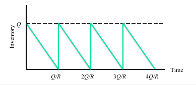

  - Average Inventory $= Q/2$

  - Cycle time between orders $= Q/R $

  - $K * R/Q$ 【平均订货成本average ordering cost】；H *（Q/2）【平均库存保管成本】；c X R 【平均原料采购成本】

  - $TC = \dftac{KR}{Q}$(这里是1/T求购买频率) $+ \dfrac{HQ}{2}+cR$

  - $$Q_{opt} = \sqrt{\frac{2RK}{H}}
    \\
    TC_{opt} = \sqrt{2KRH} + cR$$

  - 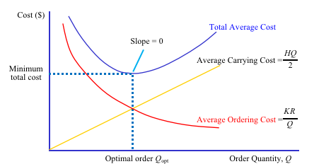

  - 订货决策与Lead time 的效果

    - Lead Time（前导时间、前置时间） is the time lag between the **available of replenishment** and the time **the order was to be placed,** denoted as L. 决定订货到订货最终到达中间的时间间隔-> 包括例如：订单到达到能够使用、订单准备、准备订货到最终产生订货的时间

    - Clearly, we should order L units of time before the inventory drop to 0.

    - 因此在库存 = L* R的时候就应该reorder，这个时间节点就是reorder point（ROP），ROP = LR

    - On-hand stock: OH(t) 也就是目前拥有的库存量，**现货量**

    - Backorders(t)：负库存，只有当库存线在time以下的时候才是非0的。

    - Inventory level ：库存水平 = IL(t) = OH(t) - B(t)，库存水平 = 现货量 - 负库存量，库存水平可以是负的，表示暂时缺货

    - On-order(t) = OO(t) 在途库存

    - Inventory Position = IP(t) = IL(t) + OO(t) 库位量。也就是库存水平 + 在途库存

    - $$OH(t) * B(t) \equiv 0
      \\
      \\
      IP(t) = OH(t) - B(t) + OO(t)$$

    - 小结：不允许缺货，意思是B(t) == 0

    - A policy under which the **inventory position is reviewed at fixed time** intervals and an order placed at that time, if necessary, is called a periodic review policy按固定时间间隔补货的policy

    - A specific instance of such a policy is called the order up to policy in which orders are placed at periodic intervals **to bring inventory position to a fixed level, called the order up to level (OUL).** 周期性地把库存提到一个固定的容量level上
      $$OUL = R \times (T_r + L )
      \\ 
      I_{cycle} = \frac{Q}{2} = (R \times T_r)/2$$
      
- I cycle表示平均循环库存
    
- pipeline Inventory ：R*L
    
- $$Q_{opt} = \sqrt{\frac{2KR}{H} }$$
    
  其中K是每个订单的固定成本，R是flow rate，H是每周期的保管成本
    
- **好的解决办法：降低固定成本开销或者缩减review period，使得预测更加准确？**

## AMSS 08

- 需求的不准确性和预测

  - 未来是从过去到现在的连续。

- 预测的三大特征：

  - 预测都是都是不准确的
  - 群体预测比单体预测要准确
  - 短期预测比长期预测要准确

- **安全库存和Service Level**

  - 不确定性和缺货：stockout
  - 缺货的原因：顾客表现等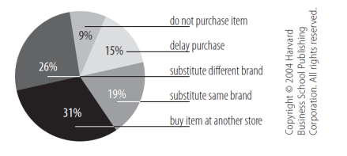
  - 安全库存：是指超过平均需求之外额外设置的库存，或者说是超过预测需求为了方式需求不确定性进行缺货保护设置的库存。or **safety stock(SS)**, is the inventory held **in excess of the average demand or in excess of forecast demand to hedge against uncertainty to protect against stock-out.**

- **Service Level Measures**

  - **<u>*cycle-service-level*</u>**： **refers to either the probability that there will be no stockout within a time interval。**在一个时间间隔中（周期中）不会缺货的概率。
  - **Fill-rate:** is the fraction of total demand satisfied from inventory on hand.

- 库存控制系统（ICS）的相关问题

  - 如何检查库存状态？

    > 周期性 periodically vs 一直 all time

  - 补多少货？

    > Batch Q VS Target level

  - 何时补货？

    > ROP vs the time after inventory reviewed

- 以连续review为例讲解

  - **LTD = Leadtime demand, the total flow-unit requirement during replenishment lead time.** 在lead time期间的总flow unit 的需求，还有average LTD

  - $$
    \sigma_{LTD}
    $$

    是Standard deviation of leadtime demand，标准差。

  - 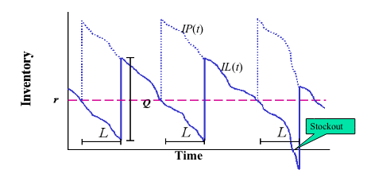

  - 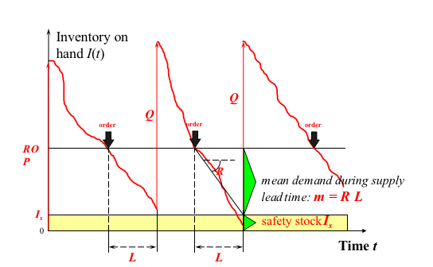

  - $$I_{s} = ROP - LTD
    \\
    \\
    ROP = I_{s} + LTD
    \\
    \\
    I = I_{c} + I_{s} = Q/2 + I_{s}
    \\
    \\
    mean\quad demand = RL$$

    

  - 安全库存的计算、ROP的计算，总库存的计算，leadtime期间的平均需求 = RL，etc	

  - CSL== Prob(no stock out) = Prob(**LTD ≤ ROP**)

  - CSL = Prob[(DLTD - mLTD)/sLTD ≤ (ROP- mLTD)/sLTD ] 
     = Prob(Z ≤ z*)                [use tables to find z*]

    - 这里进行了一个标准正态分布的转化

  - $$z = \frac{I_{safety}}{\sigma_{LTD}}
    \\
    CSL = Prob[(D_{LTD} - \mu_{LTD}) / \sigma_{LTD} ≤ \
    (ROP - \mu_{LTD})/\sigma_{LTD}]$$

  - $$ROP = LTD + I_{s}
    \\
    = \mu_{LTD} + z\times \sigma_{LTD}
    \\
    = RL + z \times \sigma_{LTD}$$

  - 所以需要尽量减少LTD的波动程度，提高预测准确性。从而实现减少库存的最终目的？

- **报童模型** 

  - R：demand with distribution F，f, c = unit cost产品成本, p = retail price零售价格, v = unit salvage value设备残值
  - p > c > v, Q : 订单总量， 决策变量
  - 当季销售收入：p * min(Q, R)
  - 回收残值收入：v * max( Q - R, 0)
  - 购买成本：cQ
  - 最终收入：E[p * min(Q, R) +v * max( Q -R,0)] - cQ
  - At any order quantity, Q, the expected marginal benefit from ordering an additional unit is (p-c) * Prob(R > Q)期望边际；期望边际成本：(c - v) *Prob(R ≤ Q)
  - 尽管边际收益是随着数量增多不断递减，但是边际成本却会不断增加
  - **F(Q*) = Cu/(Cu + Co), 其中Cu =  p - c[买少了，under-stocking], Co = c - v[买多了，over-stocking]**
  - 选在Cu/（Cu+Co）对应的Q*最好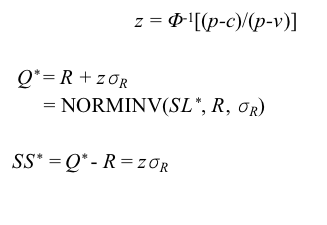
  - 其中z是安全库存因子，与service level相关，我们需要减少西格玛R从而减少Q*，上面的R表示的是需求的平均值，西格玛是需求的标准差

- Lead Time Demand Analysis 不确定性分析增加随机变量L（LTD）

  - $$\sigma_{LTD} = \sqrt{L} \times \sigma_{R}
    \\
    \\
    SS = ROP - LTD = z\sigma_{LTD} = z\sqrt{L} \times \sigma_{R}
    \\
    \\
    \sigma_{LTD} = \sqrt{LS_{R}^2 + R^2S_{L}^2}
    \\
    \\
    \frac{C_u}{C_u + C_o}
    
    \\
    = (p-c)/(p-c + c - v)\\
    =(p-c)/(p-v)
    \\
    z = \Phi^{-1}[c]
    \\
    =\Phi^{-1}[(p-c)/(p-v)]$$

  - 分析LTD的标准差，可以看出影响因素：

    - z
    - 前导时间L
    - 前导时间的标准差$$\sigma_L$$
    - 需求变化率的标准差

  - **所以三个影响安全库存的关键**

    - **给定的期望的服务水平**
    - **需求的均值和不稳定程度**
    - **前导时间的均值和不稳定程度**

    这几点可以简化为：

    - 减少前导时间的均值和标准差
    - 减少需求的波动程度

- **Risk pooling strategies**

  - 整体预测比单体预测更加准确
    - Demand variability is reduced if one aggregates demand across locations/products(varieties). 
    - More likely that high demand from one customer or for one kind of product will be offset by low demand from another or for another kind of product. 
    - Reduction in variability allows a decrease in safety stock and therefore reduces average inventory. 
  - Aggregation：将多个类似产品或者不同地区的产品的需求整合起来看。
  - **Physical centralization：地理上将不同地区整合到一个地方【根号n效应】：**
    - 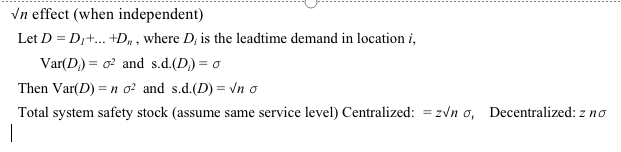
    - 
  - Virtual centralization：为了满足不同地区间需求，将产品在不同地区间输送
  - Specialization
  - Component Commonality（MTS、ATO等策略）
  - Product Substitution：产品替代：利用多余的类似产品的安全库存弥补某一个产品的安全库存；
  - Postponement：缩短预测的长度，实现更加精准的预测

- Periodic Review Policy Structure

  - 具体性质见上文OUL的部分

  - $$(T_r + L) \times R
    \\
    \\
    \sigma_{RLTD} = \sqrt{T_r + L} \times \sigma_R
    \\
    \\
    SS = z \times \sigma_{RLTD}
    \\
    OUL = R \times (T_r + L) + SS$$

  - 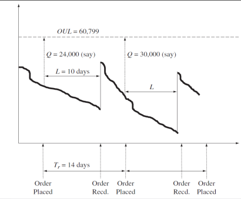

  - Tr是订货周期，L是leadtime，Tr比leadtime 长一点。

  - 对于Periodic review来说，这种OUL的方法会增加库存， 应该减少review的周期。

## AMSS 09 Waiting Line Analysis

- Service System	
  - Input / output
  - channel/multichannel:  one person barber shop vs. bank tellers' windows 一个人的理发店和银行窗口
  - Phase/multiphase : 洗车 vs 理发， 银行柜员窗口vs 医院就诊

- information and operating control policies:

  - Information structure
  - **operating control policies:** 排序的规则
    - FIFO
    - LIFO
    - Priority

- Service System相关参数

  - Arrival Process：

    - Arrival rate Ri： average in flow rate
    - inter-arrival time = 1/Ri

  - Service Process

    - 处理时间 $T_p$
    - 每个Server 的处理速率： $= 1/Tp$
    - Server数量 $c$
    - 总处理速率（Capacity）$Rp = c/Tp$
    - Buffer capacity: $K$ 最大队长

  - 可能存在的queue的现象：blocked，abandon

  - **Inventory related measures**

    - Queue length Ii在输入buffer中的平均库存单位
    - 正在处理中的顾客Ip = Ri * Tp

  - **Flow-time related measures**

    1. waiting time Ti:在队列中等待的时间
    2. service time Tp
    3. total flow time = 1 + 2, T
    4. flow time efficiency e = Tp/T

  - **Throughput related measures**

    1. Throughput: R = min(Ri, Rp)
    2. **capacity utilization: 在服务池中忙于处理顾客服务的server pool capacity占比，u = R/Rpc**
    3. Safety capacity: Rs = Rp - R 超出处理顾客需求的那部分可用的capacity

- 为何会产生delay，为何队列会增长？

  - **原因1**: 只要到达速率（arrival rate) > processing rate处理速率，且到达和处理时间都是连续的，那么队列就一定会增加
  - **原因2:** 随机变动会导致队列增长，甚至于在一个order process rate 高于order arrival rate 的系统中；
    - 一个不同步的系统（**unchronized** system) 可能会导致顾客delay和queues 增长
    - 如果到来和处理时间能被同步（correlated)，队列和等待时间能被减少
  - 稳定状态（stability condition) 
    - 平均处理速度 > 平均到达速度
    - 相等的，capacity利用率 u < 1, 或者安全capacity  Rs > 0

- 随机性哪里来variability？
  - Input：不可预测性、product mix、random arrival, volume swings
  - Tasks: quality, inherent variation
  - Resources: setup time, changeover, breakdown, maintenance,
  - route : variable routing, dedicated machines
- Queueing notation :
  - A/B/X/Y/Z: A 代表arrival pattern顾客到来的模式；B代表服务模式：service pattern， X代表并行的server数量；Y代表队的容量；Z代表队列的排序规则；
  - M/M/1：指数分布的arrivals , service
  - 柏松随机过程，指数分布的服务时间，c个服务器，buffer capacity K，无人放弃排队
    - 队伍长度：
  - G/G/C
- 提高buffer capacity, blocking and abandonment:
  - Rate at which customers enter R = Ri (1- Pb)(1- Pa)
  - 要排除被block的部分顾客和一部分不愿意继续等待的impatient 顾客（b: blocked, a: abandonment)
  - 
- Performance Variability：
  - Effect of Variability： Average versus Actual Flow time
  - Time Guarantee ：Promise
  - **Service Level ：P(Actual Time < Time Guarantee)**
  - Safety Time：Time Guarantee – Average Time
  - P(Actual Time ≤ t) = 1 – EXP(- t/T) 

- 排队心理学
  - satisfaction = perception - expectations
  - 影响实际排队时间感知的：
    - Comfortable waits are shorter then uncomfortable wait.
    - Occupied Time Feels Shorter Than Unoccupied Time. 
    - Uncertain Waits Are Longer than Known, Finite Waits
    - Unexplained Waits Are Longer than Explained Waits 
    - Unfair Waits Are Longer than Equitable Waits 
    - Solo Waits Feel Longer than Group Waits
  - 影响顾客等待时间期望的：
    - The More Valuable the Service, the Longer the Customer Will Wait
- 如何减少等待？
  - 增加server
  - pool arrival streams把到达的顾客流pool在一起
  - 提高capacity
  - 减少需求的variability

## AMSS 10. Planning and Control Strategies

- **planning and control: how and when it should be operated ? Which resources should be allocated to the activities that consititute it?: 这**里属于信息管理子系统。
- planning & control 决定了
  - 做什么工作
  - 什么时候开始做这个工作
  - 谁来做这个工作
- Overview of Operational Planning Activities
  - Time-dimensions:
    - Long-range planning( > 1year)
    - Medium-range planning( 6 - 18 months)
    - Short-range planning( 1day ~ <6months)
  - 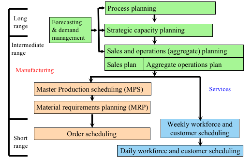
- Aggregate  planning(AP综合预测)
  - 通过决定多公司需要留下多少雇员以及对于公司来说需要生产的产品的数量、种类
  - **竞争策略**：
    - chase strategy：对需求变化快速反应，但是长期来说很难执行
    - level-production ：保持一个稳定的库存/人员安排的状态
    - 为企业设计生产计划，在计划期内最大化利润，满足capacity约束
  - 重点：
    - Smoothing：从一个状态转化到另一个状态的成本和扰动；
    - Bottleneck planning：瓶颈时间，因为capacity限制导致的问题
    - planning horizon：滚动时域、地平线效应
    - Treatment of demand 对需求的预测准确性、可预测性
      1. 满足需求的举措：改不改变生产率：（seasonal Inventory）
      2. 改变工人/工作时间/
  - AP导致的成本：（1）smooth cost （2）holding cost， shortage cost，（3）regular time cost；（4）overtime costs， idle time costs主要看：**闲置、smooth过程中的开销、逾期开销、日常管理开销等。**
  - AP的techniques：Trial & error
  - AP的决策变量：生产多少、库存多少，backlog多少，overtime多少，用多少工人等，目的是最小化total cost in period T
- Type of OS and control Strategy
  - **Type of OS**:
    - Make to Order（由外部已知的customer进行）
    - Make to Stock（customer未知）
  - **Type of CS:**
    - Push: 由对需求的预测推动；
    - Pull：由下游（downstream）的需求（内部信息）拉动
  - 注意了，push和pull是针对control strategy提出来的，而不是OS，OS是M2O，M2S
  - 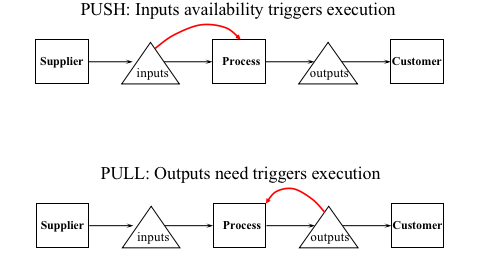
- Push Control Strategy：
  - MRP（Material Requirement Planning)
    - Def: 将Master Production Schedule**（主生产计划）** for final products转化为上游流程中所需的最终的物料需求
    - MRP的输入1：需要多少最终产品，需要哪种产品，什么时候需要？
    - MPS必须与综合生产计划相一致，虽然它是根据每个特定的产品制作的。
    - MRP的输入2: **BOM**（Bill of materials）产品物料清单，列明产品组成和各个组成的数量，利用一个**产品结构树（product structure tree）**【自行车拆解的图】
    - MRP 的计算：
      1. Net requirements(净需求量) Actual amount needed in each time period
      2. Planned-order receipts(计划入库量) Quantity expected to received at the beginning of the period offset by lead time
      3. Planned-order releases(计划订货量) Planned amount to order in each time period
      4. Gross requirements(总需求量) Total expected demand
      5. Scheduled receipts(预计入库量)
         Open orders scheduled to arrive
      6. Projected Available(预计可用量) Expected inventory on hand at the beginning of each time period
      7. 在列表之前需要确定好LT， Lotsize的大小等数据；
      8. **本期的计划入库量就是下一期的计划入库量**
      9. 净需求= 总需求-预计可用量
      10. **预计入库量就是按照lotsize取最小能够覆盖净需求的量；**
      11. 本次的预计可用量 = 上一次的预计入库+上一次的预计可用-上一次的总需求
      12. 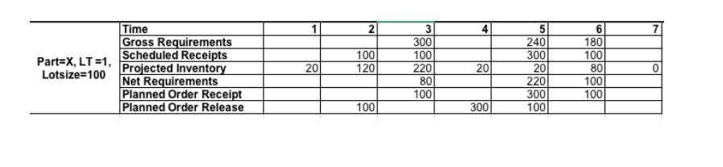
    - MRP的首要报告（？）
    - MRP的次要报告（？）secondary report
    - MRP的具体实现：
      1. 计划中心化（scheduled centralized）
      2. 物料根据schedule分配
      3. 每个中心处理所有available input然后输送给下一个阶段；
      4. 实现了供给和需求之间有效的匹配（正确的数据、库存数据、需求数据、BOM数据、需求预测、可靠的过程）
    - 对MRP的批评：
      1. 过于决定的模型
      2. push system
      3. 需要大量数据
      4. self-fulfilling leadtime
      5. 难度，安装费用很多，需要维护
  - MRP-II：manufacturing Resource Planning
    - 特点：包含了capacity planning 的内容在里面，拓宽了物料的定义范围；
  - ERP：Enterprise Resoucre Planning System
    - Def. 一个计算机系统，将 会计、销售、制造和公司其他功能整合在一个程序中；具体通过一个数据库实现了各个功能之间的互通；
    - 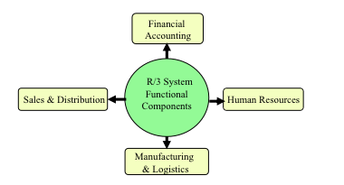
- Pull Strategy
  - 特征：	
    - 物料通过拉动的方式传递，与传统的推动的方式相反；
    - 迫使公司降低过高生产估计和过低生产估计
  - Kanban Production Control
    - ​	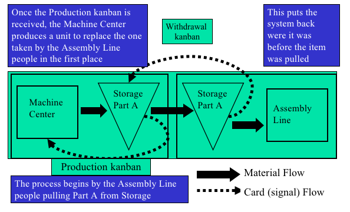
    - 物料流和kanban反馈流
    - 实现Low WIP levels
    - **当且仅当一个产品作为产出被下游阶段所需要的时候，生产才会开始**；也就是说，每个部分是通过下一个部分被拉动的，而不是像push一样被预测所推动；**这是对当下的 顾客需求作出反应，而不是基于对未来顾客的需求的预测**；去中心化的控制（pull） vs 中心化的控制；
    - 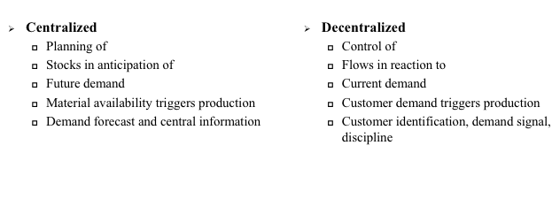
    - 看板的维护质量的作用；
    - 双箱系统，实现了full production完全生产，是production kanban拉动了生产开始，withdrawal kanban实现了货物的流动

## AMSS 12. Operations Scheduling

- **Operation Scheduling是项目activities开始前的最后一个阶段，要解决资源分配等问题**
- Push 还是 pull 核心是看能否使得demand match supply
- MRP条件：估计预测误差很大；预测总是错的；leadtime/处理流程是否可靠
- 本章内容：**调度问题**，属于一个更加小的范畴。
- 短期调度安排的重要性：
  - 满足更多顾客的需求
  - 更快、更可靠的传递
  - 更好地使用资源和更低的成本
- **schedule的三个重要因素：**
  - **resources资源**
  - **tasks/jobs/customers：任务、工作、顾客**
  - **目标objectives**
    - High customers : on-time delievry + less waiting time
    - low Inventory Levels: WIP and FGI(finished goods Inventory)
    - 高利用率
- Flow units\ resources \ 
- Flow shop: high volume system：**产量大，种类少，需要稳定的需求供给，标准化的机械设备与activities，主要注意的：生产线平衡！！**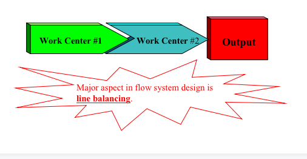
- Intermediate-volume system：output介于两者之间
- Job shop: low volume system：产量低但是种类多，需求复杂

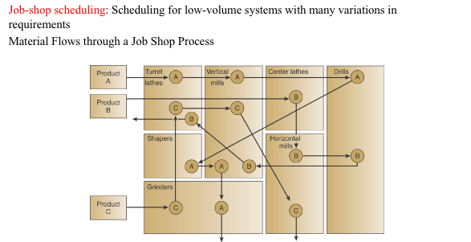

- 甘特图法：解决jobshop处理问题
- 指派问题【匈牙利算法】
- 排序问题
  - 决定任务在机器或者工作中心执行处理的顺序
  - 优先顺序规则：
    - FCFS
    - SPT：最短处理时间法则
    - EDD：最早结束日期
    - CR：critical ratio：关键指标
    - rush/emergency
    - etc
  - 如果是n个任务在1台机器上，
    - 没有什么顺序是在所有标准下最优的No one sequencing rule excels on all criteria
    - SPT does well on minimizing flow time and number of jobs in the system but SPT moves long jobs to the end which may result in dissatisfied customers
    - FCFS does not do especially well (or poorly) on any criteria but is perceived as fair by customers FCFS会被顾客认为是公平的
    - EDD能够减少lateness
  - n个任务在2个机器上：Johnson's rule 约翰逊-贝尔曼法则

- 三个要素：Inventory status、MPS、BOM
- AM financial services
  - initial review 的巨大作用

Non-value-added:

Activities:

构成activities time的几块：（1）有可能返工次数比较多，不是一次作一次做到位，因此想要缩短返工；（2）如果做对了有没有可能进一步缩短？

 

缩短waiting的时间：调整流程的结构，原来都是一步一步串联的方式，有没有可能去同时做？【称为：流程冲突】：

- Q1:如何估计每一次的flow time？

- Q2:如何计算系统的capacity？（capacity和throughput、flowrate之间的关系、flow in rate和flow out rate之间的关系）增加throughput就是增加capacity，增加不了就去增加demand rate。（CRU rental的案例）

- Q3:什么是capacity？分为theoretical capacity、effective capacity、capacity分别是什么关系？

主要是强调schedule available、有些loss（一类：resource unavailable（设备维修、员工缺勤，另一类：changeover： 切换成本，从一个任务到另一个任务之间的切换时间要扣掉的）。去掉这些unavailable都不考虑，假设这些都是available 的话，得到的capacity就是effective *。如果因为计划的原因导致没有input（flow unit input），导致的starvation，和因为blockage（阻塞）的原因，把这些都考虑进去才是capacity？【capacity\**** ***\*和\**** ***\*effective ~\*******\*之间\*******\*的差别\****】

Capacity取决于瓶颈，而瓶颈的capacity如何计算？

要考虑resource pool（C表示）；要考虑load batch；要考虑t（单位资源的来做这件事情的要花的时间，单位时间可以处理多少？）。通过这三点找出瓶颈。

- Q4:Inventory：广义的狭义的：

狭义的有哪些类型：按照价值和数量进行划分：ABC库存；按照库存处在不同阶段分为原材料和半成品库存成品库存；按照库存品作用分为理论的safety inventory、cycle inventory、季节库存、投机库存、解耦库存、

EOQ模型和报童模型。【要回去仔细看，比如什么是安全库存？什么是cycle inventory？怎么在不影响顾客满意的情况下减少库存？】

预测的三大原则？

1. 预测都是错的

2. 长期预测没有短期预测准确
3. 个体预测没有群体预测准确（risk pooling）

 

整体的、个体的之间的分担：叫做risk pooling：风险分担、风险组合、风险对冲。把总体的pooling在一起。

 

短期的长期的：在库存管理时，有哪些，举措，应用到了这一点？

 

有哪些举措pooling在一起？【vitru】

 

Postponement引用了什么原理？-》短期比长期的原理，差异化。【安全库存和西格玛有关，西格玛的那个公式？】

  

计划对未来的安排：长期中期短期。

MRP：MRP的三大XX，最后决定了XX order receipt、MPS、。。。

Push pull？

Schedule的一些问题：大概解决什么问题？

Schedule三个很重要的要素：（1）资源（2）任务；（3）目标；

分配资源做哪些任务？这么做的安排是那些？scheduling的时候，jobshop scheduling涉及的两大任务：分配：dispatch、assignment，loading把任务安排给谁；排序（一系列的排序规则：FIFO、SPT (最短时间优先)，sequence rule；priority rule优先级排序：先是谁后是谁？

最后得出了什么结论？【看下ppt】

 

比较的是影响flow rate，inventory

 

四道大题：前面20判断题；稍微改一改就有错的：

e.g什么是安全库存？Reorder point点？安全库存指在补货点的库存量。

 

SPT在所有规则最好的->NO

 

十道选择题单选。

 

简答题：课上都讲过的概念。

 

流程分析题：要计算flow time，capacity，inventory，

注意要先画流程图。

要花一点时间，不然可能有点绕，要回去看看案例CRU，cranberry等。

有的内容就是书上的题目。

 

判断题主要还是看意思。

