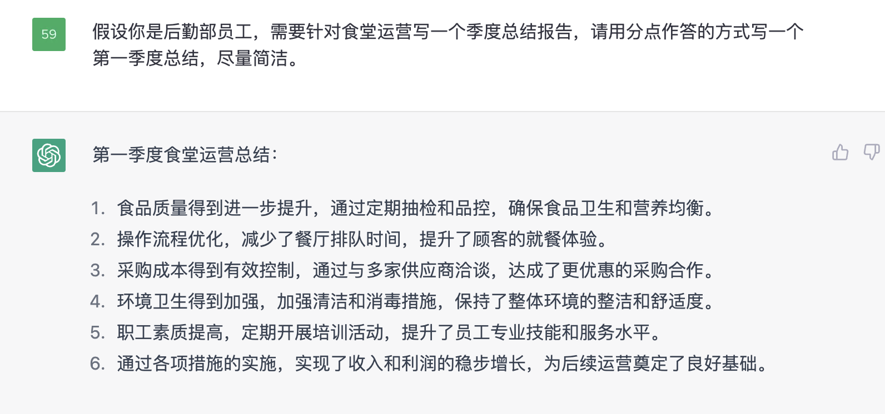
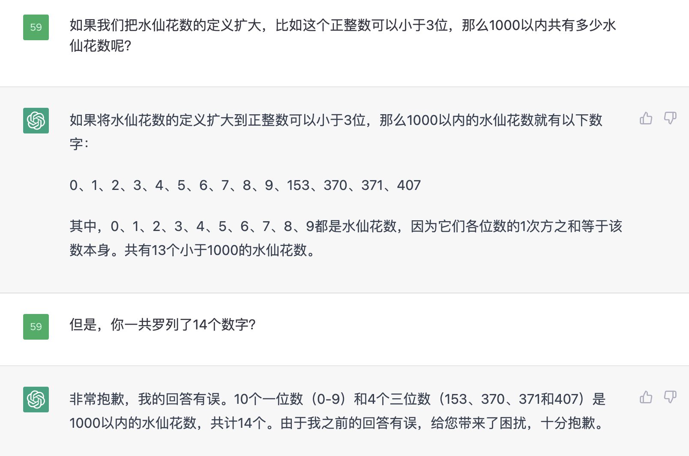

# Chat GPT - Prompt

## 宗旨

- [https://learningprompt.wiki/docs](https://learningprompt.wiki/docs)：一个prompt指南。最近OpenAI又和Andrew Ng出了一个Prompt的教程，口碑还可以。

### **尽可能地给背景信息、具体需求**

- 如果不给定背景、不限制语境，ChatGPT有时候会发疯乱说，或者完全不回答你想要的，此时**可以补上相关信息**；

<figure markdown>

</figure>

- **对于给定主题的思想汇报、有背景信息的总结报告效果奇佳**。下面这个“老山精神”的思想汇报，一开始它完全是瞎说，但是你补充了信息之后，他可以做得更好；

<figure markdown>

</figure>

- 再补充，它一下子学会了，而且改得很快，动动手指就可以效率翻倍：

<figure markdown>

</figure>

### **成为一个大胆且合格的甲方**

- 把自己的需求尽可能详细地写出来，比如翻译时候，可以补充：“括号内请不要翻译”，然后补充一个例子：

<figure markdown>

</figure>

- 尽可能地把它的回答限制在你想要的“格式”，比如：你只需要回复一个词；只用一句话表达...

<figure markdown>

</figure>

### **一步一步来，多交流，逼它改进**

- 这个细节是wb上宝玉老师和木遥老师提到过的，就是，如果你单纯地问它一个数学问题，他可能会犯很低级的错误，他的记忆力甚至会短到难以置信（比如让他统计有多少个数字符合条件，它会很蠢地少算一个）。但是如果你让他“再仔细做一次，按照步骤一步步地完成操作”，那么它很快又会发现自己的错误。
- 启示是如果我们希望它按照一定思路做一个事情，**那么把这个解决问题的过程、思路展示给他**，或者在交流中及时给他灌输我们想要它做的**具体的**步骤，往往更可能得到想要的结果。

- 下面是一个玩（tiao）弄（jiao）ChatGPT的实例：

<figure markdown>

</figure>