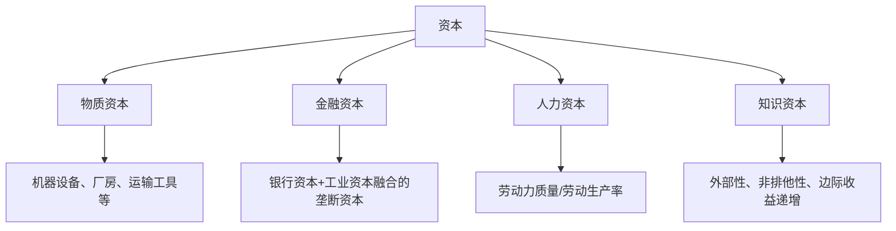

# 📚 发展经济学与中国经济发展

## 第一讲：历史逻辑与基本内容

> 📅 整理时间：2026年3月22日  
> 🎯 适用对象：发展经济学初学者 | 📖 参考教材：《新帕尔格雷夫经济学大辞典》等

---

## 一、发展经济学的学科定位

### 1.1 核心定义

| 维度         | 内容                                                                                                                                                |
| ------------ | --------------------------------------------------------------------------------------------------------------------------------------------------- |
| **研究对象** | 发展中国家的**经济发展规律**，涉及由贫穷落后到现代繁荣的过程、政策、途径、机制、变化、影响、预期等理论与现实问题                                    |
| **研究范式** | 以宏观经济学为基础，综合应用区域·产业·公共·行为等多学科理论，使用数理模型、实证分析与理论分析等多样手段，在**人性良知**和**经济理性**约束下进行分析 |

### 1.2 核心概念辨析


**分析思路的深化路径**：

1. 📈 **经济增长**：要素投入 → 数量变化
2. 🔄 **经济发展**：结构+制度+创新 → 可持续的数量变化 + "公平"
3. 🌐 **贸易与金融**：制度完善 → 增长+发展协同
4. 👥 **社会福利**：个人福利↑ → 国家现代化 → 发展问题在发展中解决
5. 🎯 **目标演进**：更快增长 → 可持续增长 → 可持续发展 → **高质量发展**

---

## 二、理论模型框架

### 2.1 两类核心模型

| 模型类型                               | 核心关系                     | 代表理论                                                                                  |
| -------------------------------------- | ---------------------------- | ----------------------------------------------------------------------------------------- |
| **函数模型**<br>（要素→经济增长）      | 资本/技术投入 → 产出扩张     | • 哈罗德-多马：投资促进增长<br>• 索洛模型：技术促进增长<br>• 新增长理论（罗默）：内生技术 |
| **机制模型**<br>（结构·制度→经济发展） | 制度变迁+结构优化 → 效率提升 | • 二元经济模型（刘-拉-费、托达罗）<br>• 中国特色：新发展理念、高质量发展                  |

### 2.2 课程理论脉络

```
1️⃣ 学科回顾 + 资本增长（H-D模型）
2️⃣ 技术进步：新古典 + 内生增长理论
3️⃣ 结构调整：二元经济·城乡流动
4️⃣ 产业+区域：工业化、城市化、现代化
5️⃣ 金融深化：规制缓和与要素配置
6️⃣ 中特理论：发展阶段论、新常态、四化同步、新理念、高质量、双循环、绿色发展...
```

---

## 三、资本理论：含义与分类

### 3.1 两种视角下的"资本"定义

| 视角                                 | 核心观点                                                                               | 定义侧重           |
| ------------------------------------ | -------------------------------------------------------------------------------------- | ------------------ |
| **马克思主义政治经济学**             | • 资本是"能带来剩余价值的价值"<br>• 资本是"一种运动"<br>• 资本体现"剥削关系"           | 🔴 **生产关系属性** |
| **现代经济学**<br>（帕尔格雷夫辞典） | • **资本品**：为生产需要而生产的商品（机器、厂房等）<br>• **资本值**：资本品的价值总和 | 🔵 **生产性功能**   |

### 3.2 现代经济学中资本的分类



> 💡 **关键理解**：资本形成的本质 = 储蓄（抑制消费）→ 金融机构 → 投资 → 产出扩张

---

## 四、哈罗德-多马模型（Harrod-Domar Model）

参考具体的内容。

---

## 五、资本与经济发展：发展中国家的视角

### 5.1 资本匮乏的恶性循环


> 🎯 **核心结论**：解决资本形成问题是发展中国家实现经济起飞、摆脱贫困的**先决条件**

### 5.2 相关理论支撑

| 理论                 | 提出者              | 核心观点                                   |
| -------------------- | ------------------- | ------------------------------------------ |
| **贫困恶性循环理论** | 纳克斯（R. Nurkse） | 供给/需求双侧的资本短缺导致贫困自我强化    |
| **低水平均衡陷阱**   | 纳尔逊（R. Nelson） | 人均收入低于临界值时，人口增长抵消资本积累 |

### 5.3 政策启示

- ✅ **优先积累物质资本**：即使其他要素不变，增加资本投入也能改善产出效率
- ✅ **完善金融体系**：促进储蓄→投资的有效转化
- ✅ **重视人力资本**：劳动力质量提升可突破物质资本约束
- ✅ **制度创新**：通过改革降低$ICOR$，提高投资效率

---

## 📝 本章学习要点总结

```diff
+ 掌握发展经济学的研究对象与范式特征
+ 理解"增长"与"发展"的概念演进逻辑
+ 熟练推导哈罗德-多马模型的基本方程与均衡条件
+ 分析资本匮乏对发展中国家的约束机制
+ 思考中国特色发展理论对经典模型的补充与创新
```

> 🔖 **引用建议**（APA格式）：  
> Snowdon, B., & Vane, H. R. (Eds.). (1996). *The New Palgrave Dictionary of Economics*. Economic Science Press.  
> Harrod, R. F. (1939). An essay in dynamic theory. *The Economic Journal*, *49*(193), 14-33.

---

> 💬 **思考题**（供课后讨论）：
> 1. 哈罗德-多马模型假设技术不变，这在分析当代发展中国家时是否仍具解释力？
> 2. 中国改革开放以来的资本积累路径，如何突破"贫困恶性循环"的理论预判？
> 3. 在"高质量发展"阶段，资本投入的边际效应是否发生变化？应如何优化资本配置？

