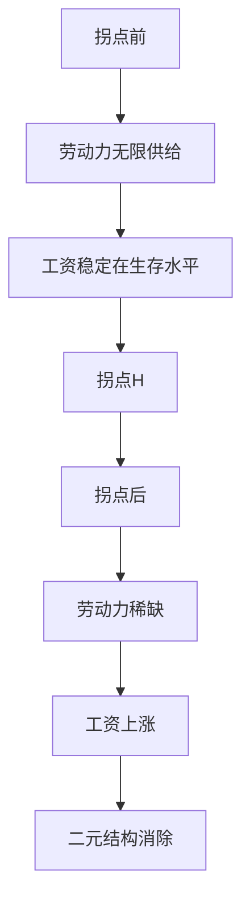
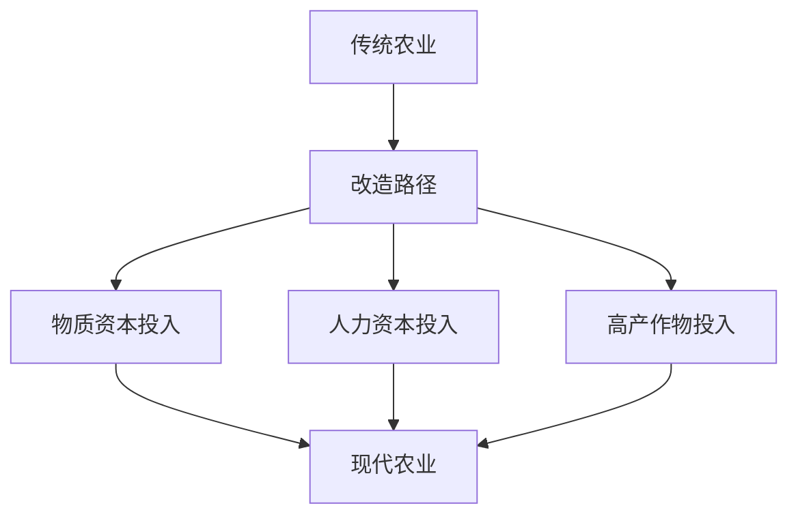

# 第二讲：二元经济结构与劳动力转移

## 一、二元结构的基本概念

### 1.1 二元结构的定义

| 维度           | 传统部门（A）                      | 现代部门（I）                  |
| -------------- | ---------------------------------- | ------------------------------ |
| **产业性质**   | 农业、零星商业服务业               | 工矿业、建筑业、现代商业服务业 |
| **生产方式**   | 维持生计、自给自足                 | 使用再生产性资本谋取利润       |
| **劳动生产率** | 很低，边际劳动生产率≈0             | 较高                           |
| **工资水平**   | 极低，仅维持最低生存               | 高于传统部门                   |
| **就业特征**   | 容纳绝大部分劳动力，存在隐蔽性失业 | 容纳就业较少                   |
| **生产要素**   | 土地（刚性）+ 劳动                 | 资本（可积累）+ 劳动           |

> 💡 **关键理解**："方式"的定义根据**生产性质**而非生产内容

### 1.2 二元结构向一元结构的转变


**研究对象的简化对应**：
- **A部门**：农业（农村）→ 提供食物、劳动力、原料
- **I部门**：工业（城市）→ 提供资本、技术、商品

---

## 二、刘易斯模型（Lewis Model）

### 2.1 模型背景

| 项目         | 内容                                                   |
| ------------ | ------------------------------------------------------ |
| **提出者**   | 威廉·阿瑟·刘易斯（W. Arthur Lewis）                    |
| **文献**     | 《劳动无限供给下的经济发展》，《曼彻斯特学报》，1954.5 |
| **核心命题** | 二元向一元结构转变以**劳动力从A向I的移动**为核心       |

### 2.2 基本假设


- 两部门经济：传统农业部门 + 现代工业部门
- 劳动力无限供给：传统部门存在大量剩余劳动力
- 工资差异：工业部门工资 > 农业部门制度工资
- 资本积累：仅发生在工业部门，用于扩大再生产
- 技术不变：分析期内生产技术保持不变
- 农业收益不变：拐点之前A部门收益不变


### 2.3 模型机制推导

#### （1）工业部门扩张机制

```
横轴：劳动力数量（L）
纵轴：工资/边际产出（W/MPL）

Dn时刻资本存量Kn，资本固定时：
• 劳动力扩大 → 边际产出递减
• 劳动数量L1时的成本 = OIFL1
• 利润 = 总产出 - OIFL1
• 利润用于扩大再生产 → MPL曲线外推 → 劳动需求扩大
• 吸收剩余劳动力至刘易斯拐点H
```

#### （2）数学表达

$$
\text{工业部门生产函数：} Y_I = F(K, L_I)
$$

$$
\text{边际劳动产出：} MPL = \frac{\partial Y_I}{\partial L_I}
$$

$$
\text{利润：} \pi = Y_I - W \cdot L_I
$$

$$
\text{资本积累：} \Delta K = s \cdot \pi \quad (s为利润再投资率)
$$

### 2.4 刘易斯拐点（Lewis Turning Point）

| 特征         | 描述                                           |
| ------------ | ---------------------------------------------- |
| **定义**     | 剩余劳动力被吸收完毕的临界点（H点）            |
| **标志**     | 农业生产要素缺乏 → 农业报酬提升                |
| **工资变化** | 工业部门必须提高工资（S→S'）才能扩大生产       |
| **结构转变** | 二元结构开始向一元结构转化                     |
| **后续路径** | 工业部门需帮助农业提升生产手段、技术、组织方式 |



### 2.5 刘易斯模型的评价

| 贡献                                     | 局限                                               |
| ---------------------------------------- | -------------------------------------------------- |
| ✅ 揭示两部门二元结构是发展中国家普遍现象 | ❌ 不考虑农业增长与技术进步                         |
| ✅ 开创一元转化的分析思路                 | ❌ 忽略外部作用及城市就业规模影响                   |
| ✅ 明确剩余劳动力是结构转变动力           | ❌ 假设工业完全就业（实际城镇也可能存在剩余劳动力） |
| ✅ 资本积累是扩大再生产与吸引劳动力的原因 | ❌ 劳动力转移过程可能因要素分配份额变化而突然中止   |

---

## 三、拉尼斯-费景汉模型（Ranis-Fei Model）

### 3.1 模型背景

| 项目               | 内容                                                                                               |
| ------------------ | -------------------------------------------------------------------------------------------------- |
| **提出者**         | Gustav Ranis & John C.H. Fei                                                                       |
| **文献**           | 《A Theory of Economic Development》，*The American Economic Review*, 1961, Vol.51, No.4, p533-558 |
| **与刘易斯的关系** | 建立在刘易斯模型基础上，直接以其为出发点                                                           |

### 3.2 对刘易斯模型的改进

```diff
+ 明确指出刘易斯未清楚说明农业生产在经济发展中的地位
+ 引入"农业产量剩余"概念
+ 农业劳动生产率提高和农业剩余增加是经济顺利发展的内生变量
+ 明确将二元结构归结于传统农业与现代工业的并存
+ 增加农业与工业互动问题的分析
```

### 3.3 三阶段转移过程

| 阶段         | 特征                                | 关键点            |
| ------------ | ----------------------------------- | ----------------- |
| **第一阶段** | 边际生产率为零的剩余劳动力转移      | 刘易斯拐点前      |
| **第二阶段** | 边际生产率>0但<制度工资的劳动力转移 | 短缺点            |
| **第三阶段** | 农业要素商业化                      | 商业化点→一元经济 |


### 3.4 核心变量定义

| 变量     | 含义         |
| -------- | ------------ |
| **OB**   | 农业产出     |
| **AO**   | 人口（横轴） |
| **VZDA** | 边际生产率   |
| **AS**   | 农业制度工资 |
| **SYZO** | 平均农业剩余 |

### 3.5 模型特色与创新

| 维度             | 内容                                   |
| ---------------- | -------------------------------------- |
| **增长步骤**     | 农业社会 → 二元经济 → 成熟一元经济     |
| **中心特征**     | 庞大低效的农业部门与活跃工业部门并存   |
| **前提继承**     | 初始边际生产力为零 + 劳动力无限供给    |
| **过程描述**     | 较刘易斯模型更加具体                   |
| **第三阶段创新** | 提出农业要素商业化概念                 |
| **互动分析**     | 增加劳动力转移引起的农业与工业互动问题 |

---

## 四、中国现实：农村工业化与就地转移

### 4.1 乡镇企业的发展模式

| 方面         | 具体内容                          |
| ------------ | --------------------------------- |
| **资金筹集** | 自筹资金 → 解决工业化资金问题     |
| **人员采用** | 本地雇佣 → 解决农村剩余劳动力问题 |
| **示范作用** | 组织化、资本积累、契约化观念导入  |
| **转移特点** | **离土不离乡**，缓解城市就业压力  |

### 4.2 农业关联产业的作用

```
✅ 提高农产品商品化与农业现代化
✅ 增加农民收入
✅ 解决农业资本短缺
✅ 就地转移剩余劳动力
```

---

## 五、改造传统农业：舒尔茨理论

### 5.1 理论背景

| 项目         | 内容                                                         |
| ------------ | ------------------------------------------------------------ |
| **提出者**   | 西奥多·舒尔茨（Theodore Schultz）                            |
| **文献**     | 《改造传统农业》，商务印书馆，1999（原著1964）               |
| **时代背景** | 20世纪50年代后，工业化、城市化受推崇，农业处于经济增长对立面 |
| **核心观点** | 反对消极看待农业，认为农业可能是经济发展的**推动力量**       |

### 5.2 三种农业类型

| 类型       | 特征                                                                           |
| ---------- | ------------------------------------------------------------------------------ |
| **传统型** | 技术状态与要素结构长期基本不变，低水平均衡，维持简单再生产，长期停滞的小农经济 |
| **现代型** | 农民充分使用现代农业生产要素，生产力较高                                       |
| **过渡型** | 传统与现代之间，经济失衡状态，农业要素价格与生产率价值不平等                   |

### 5.3 传统农业的特征

```
1️⃣ 长期停滞的农业技术
   • 生产要素长期无明显改变
   • 供需状况不变
   • 农民文化水平低（文盲半文盲比例大）
   • 土地和劳动是主要生产要素，产出仅够维持生存

2️⃣ 要素边际收益率极低
   • 储蓄和投资率低下
   • 缺乏资本
   • 但农民对经济变动敏感

3️⃣ 大部分劳动力被固定在土地上
   • 农业提供的剩余有限
   • 无法满足工业化对农产品需求上升
   • 资源自发流向非农部门，二元结构被强化
```

### 5.4 与主流发展观的对立

| 主流观点                     | 舒尔茨观点                                     |
| ---------------------------- | ---------------------------------------------- |
| 农民愚昧，对经济刺激不敏感   | 农民**精明**，对经济刺激敏感                   |
| 要素配置效率低下             | 要素配置已達**最优状态**                       |
| 剩余劳动力边际生产率为零或负 | 贫穷社会中农业劳动力边际生产率为零是**错误的** |
| 农业是工业发展的要素提供者   | 农业可能是经济发展的**推动力量**               |

> 📌 **实证支撑**：实地调研表明，无配置低下问题，人口对产出有重大影响

### 5.5 改造路径



**原则**：增加对农业**新型生产要素**的投入

---

## 六、农业在经济发展中的地位与贡献

### 6.1 农业的基础地位

| 维度           | 内容                                       |
| -------------- | ------------------------------------------ |
| **历史地位**   | 人类最先从事的经济活动                     |
| **宏观地位**   | 国民经济的有机组成部分，经济平稳发展的基础 |
| **分工地位**   | 为社会分工提供基本物质保障                 |
| **工业化基础** | 发达的农业是保证工业化实现的基础           |

### 6.2 农业相对重要性下降的原因

```
1. 人均收入增加 → 消费结构变化
2. 工业发展对农业影响日益巨大
3. 农业劳动生产率提高 → 农业就业人口减少
```

### 6.3 农业的四大贡献（张培刚，《农业与工业化》，1949）

| 贡献类型        | 具体内容                                                                                |
| --------------- | --------------------------------------------------------------------------------------- |
| **1. 产品贡献** | 农业剩余（总产品-农业部门消费）= 食品贡献 + 原料贡献                                    |
| **2. 要素贡献** | 土地贡献（生产率提高为前提）+ 劳动贡献（剩余劳动力转移）+ 资本贡献（市场机制/政府强制） |
| **3. 市场贡献** | 农业作为非农产品的需求者，促进市场贸易形成和扩展                                        |
| **4. 外汇贡献** | 农产品出口创汇 + 减少农产品进口节省外汇                                                 |

---

## 七、绿色革命与农业现代化

### 7.1 绿色革命的两个阶段

| 阶段       | 时间             | 核心内容                                                                 |
| ---------- | ---------------- | ------------------------------------------------------------------------ |
| **第一次** | 20世纪60年代中期 | 推广矮秆、半矮秆、抗倒伏、高产小麦和水稻优良品种，配合灌溉、施肥技术改进 |
| **第二次** | 1990年后         | FAO提出可持续农业发展：增加产量消除饥饿、增加收入消除贫困、保护资源环境  |

### 7.2 消除二元结构的四条对策

```
1️⃣ 加大农用土地制度改革 → 激励生产积极性与扩大规模
2️⃣ 建设和培育农产品市场 → 稳定合法收入、食品安全
3️⃣ 农产品贸易结构调整 → 外部刺激改善生产结构，促进高附加值与商品化
4️⃣ 扩大社会分工 → 农村多种经营、产业发展，提高剩余劳动力与农村社会化水平
```

---

## 📝 本章学习要点总结

```diff
+ 理解二元结构的含义与传统/现代部门的特征差异
+ 掌握刘易斯模型的基本假设、机制及刘易斯拐点的经济意义
+ 熟悉拉尼斯-费景汉模型对刘易斯模型的改进与三阶段划分
+ 理解舒尔茨改造传统农业理论的核心观点与政策启示
+ 掌握农业在经济发展中的四大贡献
+ 结合中国乡镇企业发展理解农村工业化与就地转移的现实路径
```

---

## 🔖 引用建议（APA格式）

```
Lewis, W. A. (1954). Economic development with unlimited supplies of labour. 
    The Manchester School, 22(2), 139-191.

Ranis, G., & Fei, J. C. H. (1961). A theory of economic development. 
    The American Economic Review, 51(4), 533-565.

Schultz, T. W. (1964). Transforming traditional agriculture. 
    Yale University Press.

```

---

## 💬 思考题（供课后讨论）

1. 刘易斯模型假设农业部门边际劳动生产率为零，这一假设在中国改革开放初期是否成立？
2. 拉尼斯-费景汉模型的三阶段划分中，中国目前处于哪个阶段？判断依据是什么？
3. 舒尔茨认为传统农业中农民是"精明"的，这与刘易斯的观点有何不同？对农业政策有何启示？
4. 乡镇企业的"离土不离乡"模式对缓解城市化压力有何作用？是否存在局限性？
5. 在高质量发展阶段，如何协调农村工业化与农业现代化的关系？
