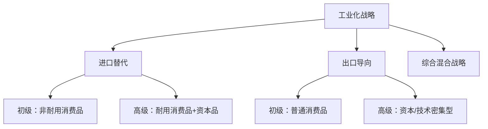

# 第三讲：工业化、结构转变与人口流动

> 📅 整理时间：2026年3月22日  
> 🎯 核心主题：结构变迁视角下的经济发展路径  
> 📖 参考文献：张培刚(1949)、钱纳里、托达罗(1969)

---

## 一、工业化的内涵与模式

### 1.1 工业化的定义

| 学者                 | 核心定义                                                         |
| -------------------- | ---------------------------------------------------------------- |
| **新帕尔格雷夫辞典** | 制造业和第二产业的国民收入份额与劳动人口份额**一般上升**的过程   |
| **张培刚**           | 国民经济中一系列**基要生产函数**连续发生由低级到高级的突破性变化 |
| **撒克(Thaker)**     | **脱离农业**的结构转变：农业份额下降，制造业和服务业份额上升     |
| **钱纳里**           | 制造业产值份额的增加过程，用制造业在GNP中的份额衡量工业化水平    |

> 💡 **本质理解**：工业化是**长期的经济结构变化过程**，由农业主导转向工业主导

### 1.2 工业化的历史阶段

```
18世纪    → 机械化标志
19世纪末  → 电气化标志  
20世纪中叶 → 电子化标志
21世纪初  → 信息化标志
```

### 1.3 四种工业化模式比较

| 模式类型               | 代表国家 | 核心特征                                                         |
| ---------------------- | -------- | ---------------------------------------------------------------- |
| **资本主义自由经济**   | 英美     | 城市大规模企业为载体；民间发动；消费品导向                       |
| **资本主义不完全市场** | 日韩     | 政府行政诱导+产业自主选择；企业集团规模扩大；外向型经济          |
| **社会主义中央计划**   | 前苏联   | 中央政府行政指令唯一推动；特定产业/企业集团扩大；重工业化        |
| **社会主义市场经济**   | 中国     | 中央战略引导+企业自主决策；产业间人口移动；产业升级+制度改革支撑 |

---

## 二、工业化战略及其评价

### 2.1 三大战略类型



### 2.2 进口替代战略（Import Substitution）

| 维度         | 内容                                                                                             |
| ------------ | ------------------------------------------------------------------------------------------------ |
| **定义**     | 当进口商品量达到国内生产最小经济规模时，通过**关税、配额、技术门槛**等提高进口成本，保护国内生产 |
| **适用对象** | 后进国家发展初期（技术落后、生产率低）                                                           |
| **理论支撑** | 保护幼稚工业论、民族工业论、贸易条件恶化论                                                       |
| **政策工具** | 保护性关税、进口配额、生产性补贴、外汇管制                                                       |

**⚠️ 不良作用**：
- 经济趋于"封闭化"，扭曲贸易导致国际收支恶化
- 资源配置低效，价格体系扭曲
- 不利于幼稚产业竞争力提升
- 劳动吸收能力低（多使用国外劳动节约型技术）
- 助长寻租活动和腐败

### 2.3 出口导向战略（Export Promotion）

| 维度         | 内容                                                                       |
| ------------ | -------------------------------------------------------------------------- |
| **定义**     | 利用进口替代期建立的工业基础，生产和出口**工业制成品**代替传统初级产品出口 |
| **适用对象** | 自然资源缺乏、人力资源丰富的中小国家（新加坡、香港等）                     |
| **类型**     | ① 出口鼓励与国内生产并重（印度、墨西哥）<br>② 一切为出口（新加坡、香港）   |

**✅ 优点**：
- 面向更大市场，摆脱狭小市场限制
- 就业机会多于进口替代，增长速度更高
- 国际竞争压力促进技术进步和生产率提高
- 加强世界经济联系，利于技术学习模仿
- 有利于吸收FDI和改善国际收支

**❌ 缺陷**：
- 加深对外国市场和外资的依赖，易受国际波动影响
- 价格补贴导致生产效率低，财政负担重
- 对管理体制和人员素质要求高

### 2.4 综合性工业化战略

> 📌 **核心观点**：大多数发展中国家不应片面强调某种战略，而应**混合运用**并根据工业化进程不断调整

| 国家类型                           | 适宜战略                  |
| ---------------------------------- | ------------------------- |
| 资源丰富、技术教育水平不高的大国   | 进口替代为主              |
| 资源缺乏、人力资源丰富的中小国家   | 出口导向为主              |
| 地域辽阔、人口众多、经济落后的大国 | 初级产品出口+进口替代工业 |

---

## 三、城市化与工业化的互动

### 3.1 城市化的定义

| 视角           | 定义内容                                                  |
| -------------- | --------------------------------------------------------- |
| **库兹涅茨**   | 城市与乡村之间**人口分布的变化**                          |
| **刘易斯模型** | 城市化=工业化；城市是现代经济"小岛"，资本和新思想高度集中 |


!!! quote ""
    刘易斯模型城市化含义完整7点
    
    1. 工业部门/资本主义部门与城市相统一，城市化=工业化
    2. 城市是现代经济的“小岛”，是经济发展的起点
    3. 资本和新思想高度集中在若干“小岛”上，经济发展以城市现代工业部门优先增长为基础
    4. 经济发展的中心事实是迅速的资本积累，资本积累主要来源是城市工业利润
    5. 新就业机会由城市工业部门扩大创造，资本主义部门就业随资本形成扩大
    6. 剩余劳动力向边际生产力高的工业-城市转移，人力资源城乡重新配置是经济发展基本途径
    7. 经济发展完成的标志：城市现代经济扩张促成农业工业化，农业在资本、技术、制度上与工业趋同

### 3.2 工业化与城市化的互促关系


### 3.3 四大互动机制

| 机制                                          | 核心内容                                                                   |
| --------------------------------------------- | -------------------------------------------------------------------------- |
| **1. 最低临界值原理**                         | 工厂需要最低销售额支持；城市经济存在**25万~30万人口**的最低临界值          |
| **2. 初始利益棘轮效应**                       | 过去形成的人口和经济状况影响未来决策；发展基础的影响**不可逆**             |
| **3. 循环累积因果机制**<br>（缪尔达尔，1957） | 工业化与城市化力量在循环因果关系中相互作用，具有**累积效应和加速度**       |
| **4. 磁场效应机制**<br>（芒福德、霍华德）     | 城市如"磁场"吸引厂商和人才；被"磁化"的物质和精神产品成为传播城市文明的媒介 |

### 3.4 渐进城市化进程

```
农村城镇化 → 城镇城市化 → 城市经济集聚 → 都市圈
        （规模不断扩大）
```

---

## 四、托达罗模型：人口流动与城市失业

### 4.1 模型背景与刘易斯模型的不足

| 刘易斯模型假设                   | 托达罗的修正                                       |
| -------------------------------- | -------------------------------------------------- |
| 城市不存在失业，无限吸收农村移民 | **城市存在失业**，移民与失业同步增长               |
| 部门工资恒定，工资差异是唯一动力 | 迁移决策取决于**预期收入**而非实际工资             |
| 农业自身发展被忽视               | 重视**农村与农业发展**                             |
| 未考虑技术进步与市场因素         | 考虑技术进步对劳动密集的排斥、市场竞争对就业的抑制 |

> 📖 **文献**：Todaro, M.P. (1969). "A Model of Labor Migration and Urban Unemployment in Less Developed Countries". *The American Economic Review*.

### 4.2 托达罗模型的四个核心特征

```
1️⃣ 促进人口流动的基本力量 = 相对收益及其取得成本的理性经济考虑
    （主要是经济因素，也包括心理因素）

2️⃣ 迁移决策 = 预期的城乡工资差异
    预期差异 = 实际城乡工资差异 × 城市就业机会概率

3️⃣ 城市就业机会概率 = 取决于城市就业率（失业率）

4️⃣ 人口流动率 > 城市工作机会增长率 是可能且合理的
    城市高失业率是城乡经济机会不平衡的必然结果
```

### 4.3 模型数学表达

**预期收入比较**：

$$
\text{迁移条件：} E(W_u) \cdot p > W_r
$$

| 符号     | 含义                 |
| -------- | -------------------- |
| $E(W_u)$ | 城市正式部门工资     |
| $p$      | 在城市获得就业的概率 |
| $W_r$    | 农村现有收入         |

**动态化表达（考虑时间贴现）**：

$$
\sum_{t=1}^{T} \frac{E(W_{u,t}) \cdot p_t}{(1+r)^t} > \sum_{t=1}^{T} \frac{W_{r,t}}{(1+r)^t}
$$

其中 $r$ 为贴现率，$T$ 为预期工作年限

!!! note "完整内容"
    1. 劳动供给：\(S=f_{0}(d)\)
    2. 预期收入差异：\(d = \pi w - w_{r}\)
    3. 就业概率：\(\pi=\frac{\gamma N}{W-N}=\frac{\gamma N}{U}\)
    4. 人口流动决策：\(J=\frac{w \gamma N}{U}-r\)
    5. 均衡失业水平：\(U=\frac{w \gamma N}{r}\)
    6. 失业/就业均衡比率：\(U/N = w\gamma / r\)
    7. 失业增加条件：\(\frac{\partial S / S}{\partial d / d}>\frac{u \pi-r U}{u \cdot S}\)
    8. 数值案例：城市工资=2×农村工资，\(\gamma=0.05\)，失业/就业比率=10%


### 4.4 托达罗悖论

```
⚠️ 政策困境：
城市正式部门就业扩张 → 提高就业概率预期 → 引发更大移民潮 → 城市失业加剧

即：旨在消除城市非正式部门的政策，反而可能扩大失业
```

### 4.5 政策组合分析

| 政策类型     | 机制                 | 效果                             |
| ------------ | -------------------- | -------------------------------- |
| **移民限制** | 控制农村人口流入     | 短期有效，但抑制经济发展活力     |
| **工资补贴** | 对城乡两部门统一补贴 | 可缩小城乡收入差距，但财政负担重 |
| **组合政策** | 移民限制+工资补贴    | 理论上可实现城乡就业均衡         |
| **农村发展** | 扩大农村就业机会     | **根本出路**，减轻城市压力       |

---

## 五、托达罗模型的政策含义

### 5.1 四大政策启示

| 启示                      | 具体内容                                                                           |
| ------------------------- | ---------------------------------------------------------------------------------- |
| **1. 城市就业创造的局限** | 仅在城市创造就业不足以解决失业；就业机会越多，诱导预期收入趋涨，失业水平可能越高   |
| **2. 工资干预政策的调整** | 政府制定最低工资线和城市失业补贴会导致要素价格扭曲，吸引更多农村劳动力进入城市     |
| **3. 教育投资结构调整**   | 农村人口教育学历与向城市转移的预期收入成正比；应减少高等教育过度投资               |
| **4. 农村发展的优先性**   | 超出城市就业机会供给的农村劳动力迁移是不发达的标志；**大力发展农村经济是根本出路** |

### 5.2 核心结论

> 🎯 **要解决城市失业问题，必须制定综合性的农村发展规划，缩小城乡就业机会之间的不平衡。城市的职位创造比农村职位创造困难，代价也更为昂贵。**

---

## 六、中国实践：双重二元结构与战略选择

### 6.1 中国的双重二元经济结构

```
第一重：整体层面
├── 农村落后经济
└── 城市现代经济

第二重：农村内部
├── 乡镇工业为主的非农产业
└── 种植业为主的传统农业
```

### 6.2 潜在发展"陷阱"

| 陷阱类型                   | 表现                                 |
| -------------------------- | ------------------------------------ |
| **农业发展低水平均衡陷阱** | 农业技术进步缓慢，生产率停滞         |
| **经济增长低效率陷阱**     | 资源配置扭曲，要素利用效率低下       |
| **经济结构低级化陷阱**     | 产业升级受阻，长期锁定在低附加值环节 |

### 6.3 中国的城市化战略

| 战略方向         | 具体措施                                           |
| ---------------- | -------------------------------------------------- |
| **小城镇建设**   | 农村城镇化、城镇城市化                             |
| **模型综合使用** | 刘易斯模型（鼓励流动）+ 托达罗模型（发展农村经济） |
| **协调发展**     | 兼顾农村工业与农业发展两方面                       |

---

## 📝 本章学习要点总结

```diff
+ 理解工业化的多重定义与四种发展模式
+ 掌握进口替代、出口导向、综合战略的优缺点及适用条件
+ 理解城市化与工业化的四大互动机制
+ 掌握托达罗模型的核心假设、数学表达与政策含义
+ 理解托达罗悖论及其对发展政策的启示
+ 结合中国双重二元结构理解城市化战略的现实选择
```

---

## 🔖 引用建议（APA格式）

```
Todaro, M. P. (1969). A model of labor migration and urban unemployment 
    in less developed countries. The American Economic Review, 59(1), 138-148.

Harris, J. R., & Todaro, M. P. (1970). Migration, unemployment and 
    development: A two-sector analysis. The American Economic Review, 
    60(1), 126-142.

张培刚。(1949). 农业与工业化. 哈佛大学出版社.

Myrdal, G. (1957). Economic theory and under-developed regions. 
    Gerald Duckworth & Co.
```

---

## 💬 思考题（供课后讨论）

1. 进口替代战略在当代发展中国家是否仍有适用空间？为什么？
2. 托达罗模型预测"城市就业创造可能加剧失业"，这一悖论在中国城市化进程中是否得到验证？
3. 如何平衡"鼓励劳动力流动"（刘易斯）与"发展农村经济"（托达罗）两种政策取向？
4. 中国的双重二元结构对制定城市化政策有何特殊启示？
5. 在高质量发展阶段，工业化与城市化的互动机制是否发生了变化？
