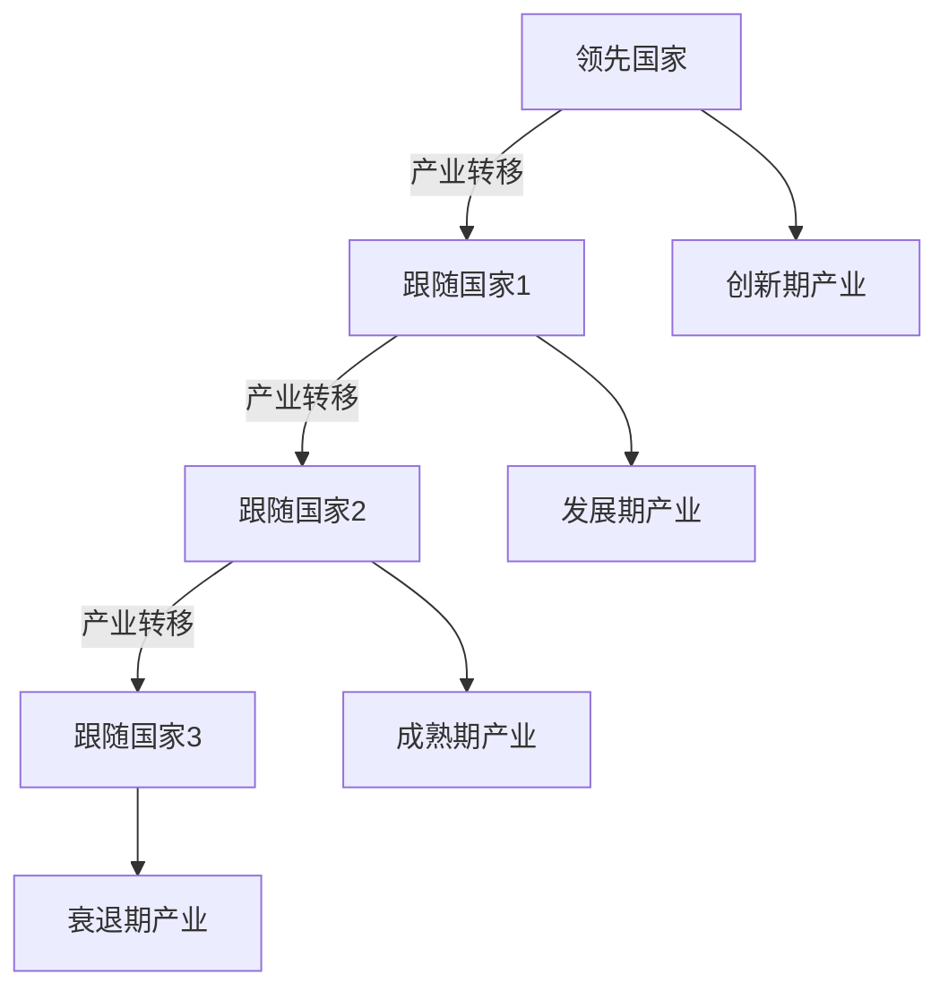
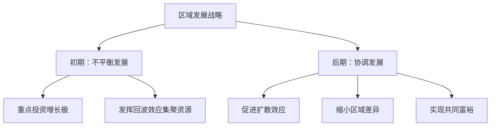

# 第四讲：区域发展、空间溢出与制度变革

> 📅 整理时间：2026年3月22日  
> 🎯 核心主题：区域经济发展的平衡与不平衡战略  
> 📖 参考文献：缪尔达尔(1957)、赫希曼(1958)、威廉姆森(1965)

## 一、平衡增长与不平衡增长理论

### 1.1 两种战略的核心对比

| 维度         | 平衡增长战略                                             | 不平衡增长战略                                           |
| ------------ | -------------------------------------------------------- | -------------------------------------------------------- |
| **核心思想** | 资本存量在各行业**同时扩张**到一定规模，产生外部经济效益 | 有选择地在**某些部门**投资，通过外部经济带动其他部门发展 |
| **实现手段** | 对国民经济各部门**同时大规模投资**                       | 重点投资社会固定资本或直接生产活动                       |
| **代表学者** | 罗森斯坦·罗丹、纳克斯                                    | 赫希曼、罗斯托                                           |
| **理论依据** | 大推进理论、贫困恶性循环理论                             | 关联效应理论、资源最优配置                               |
| **适用条件** | 资源充足、工业化初期                                     | 资源稀缺、发展中国家                                     |

### 1.2 赫希曼对平衡增长的批评

> 💡 **核心观点**：发展是经济从一种类型向更先进类型转变的**渐进过程**，各国增长过程的"关联效应"本身就是**不平衡**的

### 1.3 不平衡增长的两种途径

| 途径                 | 具体内容                               |
| -------------------- | -------------------------------------- |
| **社会固定资本投资** | 基础设施、教育、公共卫生等先行投资     |
| **直接生产活动投资** | 政府直接或间接投资于具有关联效应的产业 |

---

## 二、区域发展理论：回波效应与扩散效应

### 2.1 缪尔达尔的累积因果理论

| 概念                                | 定义                                                                                                   | 影响方向   |
| ----------------------------------- | ------------------------------------------------------------------------------------------------------ | ---------- |
| **回波效应**<br>（Backwash Effect） | 经济中心地区从其他地区吸引**净人口流入、资本流入和贸易活动**，加快自身发展，使周边地区发展速度**降低** | ⚠️ **负面** |
| **扩散效应**<br>（Spread Effect）   | 经济中心周围随着基础设施改善，从中心获得**资本、人才**等，被刺激促进本地区发展，逐步**赶上**中心地区   | ✅ **正面** |


### 2.2 发展极理论（Perroux）

**发展极的形成条件**：
```
1️⃣ 存在具有创新能力的企业群体和企业家群体
2️⃣ 具有规模经济效益
3️⃣ 有适宜经济发展的外部环境
```

**发展极的辐射作用**：

| 作用类型     | 具体内容             |
| ------------ | -------------------- |
| **技术创新** | 示范和扩散效应       |
| **资本功能** | 集中与扩散功能       |
| **规模效益** | 产业集聚产生规模经济 |

### 2.3 增长极效应的发生顺序

```
第一阶段：回波效应主导
├── 资本、人才向增长极集聚
├── 区域差异扩大
└── 联系托达罗模型（人口流动）

第二阶段：扩散效应主导
├── 增长极生产规模不断扩大
├── 生产要素供应紧张、成本上升
├── 有利投资机会减少
└── 资本技术向落后地区扩散
```

---

## 三、区域发展战略理论

### 3.1 倒"U"形理论（威廉姆森，1965）


| 发展阶段 | 特征                 | 必要条件     |
| -------- | -------------------- | ------------ |
| **初期** | 非均衡过程，差异扩大 | 回波效应主导 |
| **后期** | 均衡过程，差异缩小   | 扩散效应主导 |

> 📌 **核心结论**：区域间发展水平差异程度随经济增长和收入水平提高，大体呈现**先扩大后缩小**的倒"U"型变化

### 3.2 梯度转移理论

**理论基础**：产品生命周期理论（弗农等）

| 生命周期阶段 | 特征               | 布局指向               |
| ------------ | ------------------ | ---------------------- |
| **创新期**   | 技术密集、高附加值 | 高梯度地区（发达地区） |
| **发展期**   | 资本密集、规模扩张 | 中高梯度地区           |
| **成熟期**   | 劳动密集、标准化   | 中低梯度地区           |
| **衰退期**   | 成本敏感、利润下降 | 低梯度地区（落后地区） |

```
产业结构更新规律：
高梯度地区 → 中梯度地区 → 低梯度地区
    （随时间有次序地转移）
```

### 3.3 雁行模式（小岛清）



> 📖 **东亚案例**：日本 → 亚洲四小龙 → 东盟国家 → 中国沿海 → 中国内陆

---

## 四、技术溢出效应

### 4.1 溢出的基本内涵

| 要素         | 内容                       |
| ------------ | -------------------------- |
| **前提条件** | 两个经济体存在经济关联     |
| **受益方**   | 发展水平落后方获得先进要素 |
| **本质**     | 高发展水平**外部性**的体现 |
| **代表领域** | FDI的技术溢出              |

### 4.2 溢出效应的四种形式

| 效应类型     | 作用机制         | 具体表现                                     |
| ------------ | ---------------- | -------------------------------------------- |
| **竞争效应** | 外资企业带来压力 | 促使东道国企业发挥现有技术效率，提高产品质量 |
| **示范效应** | 技术差距存在     | 东道国企业通过学习、模仿提高技术和生产力水平 |
| **联系效应** | 产业间关联       | 后向联系（供应商）+ 前向联系（销售商）       |
| **培训效应** | 人员流动         | 外资企业就业、培训、人员扩散提升当地人力资本 |

### 4.3 影响技术溢出水平的因素

```
1️⃣ 外资规模：规模越大，溢出潜力越大
2️⃣ 技术差距：差距适中时溢出效果最佳
   • 差距过大 → 难以学习模仿
   • 差距过小 → 溢出空间有限
3️⃣ 当地企业能力：吸收能力决定溢出效果
4️⃣ 制度环境：知识产权保护、市场开放度等
```

---

## 五、发展中国家的区域发展问题

### 5.1 地理上的二元经济结构（缪尔达尔）

```
空间二元结构：
├── 经济发达地区（增长极）
└── 经济不发达地区（边缘区）
```

| 特征         | 内容                                               |
| ------------ | -------------------------------------------------- |
| **共存局面** | 传统经济的平衡发展状态 + 现代经济的不平衡发展战略  |
| **优先次序** | 政府对经济基础较好的地区给予重点投资               |
| **发展路径** | 先回波效应（差异扩大）→ 后扩散效应（带动其他地区） |

### 5.2 中国区域发展的复合性差异结构

| 差异维度     | 具体表现                     |
| ------------ | ---------------------------- |
| **东西差异** | 东部沿海 vs 中西部内陆       |
| **城乡差异** | 城市现代经济 vs 农村传统经济 |
| **城市内部** | 中心城区 vs 郊区             |
| **农村内部** | 乡镇工业 vs 传统农业         |
| **产业间**   | 现代产业 vs 传统产业         |
| **产业内**   | 高端环节 vs 低端环节         |

> ⚠️ **双重&复合性二元结构**：中国区域发展问题比一般发展中国家更为复杂

### 5.3 中国区域发展的历史与地理视角

| 视角         | 内容                                                         |
| ------------ | ------------------------------------------------------------ |
| **历史视角** | 东南沿海地区最先接触先进生产方式和经济制度，内陆地区相对延迟 |
| **地理视角** | 自东向西呈现不平衡的资源条件                                 |
| **现实视角** | 复合性的差异结构，需要综合性区域发展战略                     |

---

## 六、区域发展战略的政策启示

### 6.1 战略选择原则



### 6.2 政策工具组合

| 政策类型         | 具体措施                     | 适用阶段   |
| ---------------- | ---------------------------- | ---------- |
| **增长极培育**   | 特区建设、产业园区、中心城市 | 发展初期   |
| **基础设施投资** | 交通、通信、能源网络         | 全阶段     |
| **转移支付**     | 财政补贴、税收优惠           | 发展中后期 |
| **产业转移引导** | 梯度转移政策、区域协作       | 发展中后期 |
| **人力资本投资** | 教育、培训、人才流动         | 全阶段     |

### 6.3 避免发展"陷阱"

| 陷阱类型         | 表现               | 防范措施         |
| ---------------- | ------------------ | ---------------- |
| **回波效应固化** | 区域差异持续扩大   | 适时推动扩散政策 |
| **产业锁定**     | 落后地区长期低端化 | 产业升级支持     |
| **资源枯竭**     | 增长极发展受限     | 多元化发展策略   |
| **制度障碍**     | 要素流动受阻       | 制度改革与创新   |

---

## 📝 本章学习要点总结

```diff
+ 理解平衡增长与不平衡增长战略的核心区别及适用条件
+ 掌握缪尔达尔的回波效应与扩散效应理论
+ 熟悉发展极理论的形成条件与辐射作用
+ 理解倒"U"形理论与区域差异演变规律
+ 掌握梯度转移理论与雁行模式的产业转移逻辑
+ 理解技术溢出效应的四种形式及影响因素
+ 认识中国区域发展的复合性二元结构特征
+ 思考区域发展战略的政策组合与陷阱防范
```

---

## 🔖 引用建议（APA格式）

```
Myrdal, G. (1957). Economic theory and under-developed regions. 
    Gerald Duckworth & Co.

Hirschman, A. O. (1958). The strategy of economic development. 
    Yale University Press.

Williamson, J. G. (1965). Regional inequality and the process of 
    national development: A description of the patterns. Economic 
    Development and Cultural Change, 13(4), 1-84.

Perroux, F. (1950). Economic space: Theory and applications. 
    The Quarterly Journal of Economics, 64(1), 89-104.

Vernon, R. (1966). International investment and international trade 
    in the product cycle. The Quarterly Journal of Economics, 
    80(2), 190-207.

Kojima, K. (1975). Trade is best for development. Journal of 
    Developing Areas, 9(2), 203-224.
```

---

## 💬 思考题（供课后讨论）

1. 平衡增长与不平衡增长战略各有什么优缺点？在什么条件下应选择哪种战略？
2. 缪尔达尔的回波效应与扩散效应在中国区域发展中如何体现？当前处于哪个阶段？
3. 倒"U"形理论是否适用于所有国家？中国的区域差异演变是否符合这一规律？
4. 梯度转移理论在解释东亚经济发展时有哪些成功之处和局限性？
5. 如何通过政策设计促进技术溢出效应，同时避免"回波效应固化"陷阱？
6. 中国的双重二元结构对区域协调发展战略提出了哪些特殊挑战？

---

> ⚠️ **注**：本整理稿基于课件内容提炼，部分图表因PDF格式限制以文字描述呈现。建议结合教材原文与课堂讲解深化理解。学术引用请核查原始文献。

!!! quote "补缺"
    - **平衡增长与不平衡增长补充**
 
    1. **赫希曼对平衡增长的完整批评**
    平衡增长思想源于发达国家经济萧条期（大量闲置资源、开工不足），用发达国家场景解决发展中国家问题，忽视二者基本经济条件差 异，理论具有**“早熟性”**。
 
    2. **区域经济研究两大思路**
 
    - 从本区域经济发展角度研究
    - 从区际经济角度，侧重区域间均衡与协调
 
    - **缪尔达尔累积因果理论劳动市场案例**
    设A（发达）、B（落后）两地区，初始工资相等\(W_A=W_B\)：
    1. 外部刺激使A地区劳动力需求上升，工资涨至\(W_{A1}\)
    2. 劳动力从B流向A，B劳动供给减少、A劳动供给增加
    3. **累积因果**：B流失人力资本/企业家，需求下降，劳动需求曲线左移；A企业兴起、需求扩张，劳动需求曲线进一步右移
    4. 结果：工资差距**持续扩大**，形成回波效应
 
    - **增长极的三大经济效益**
    1. **要素集聚与整合**：企业空间邻近，共享劳动力、技术交流、市场供需，获综合经济效益
    2. **规模经济**：生产范围扩大，提高分工程度、降低管理/广告成本，提升劳动生产率
    3. **外部经济**：厂商低成本获得技术、配套、信息等外部收益
 
    - **经济发展空间形态演进**
    点状经济 → 轴线经济 → 网络经济 → 全面经济
 
    - **空间经济学拓展提示**
    需关注与**引力模型**相关的区域/国际贸易、要素流动、经济合作文献
 
    - **中国区域发展补充内容**
    1. **“一个中国，四个世界”**（2003年，胡鞍钢）
    按人均GDP、受教育程度、预期寿命聚类，将中国区域分为第一至第四世界，反映极端区域差异。
    2. **区域发展现实案例**
    - 宁镇扬一体化：2014-2020规划，分两阶段实现同城化，空气质量、城镇化率、社保覆盖率明确目标
    - 淮河生态经济带、沿海海洋经济核心带、沿江海洋经济支撑带等国家战略区
    1. **城乡历史代价数据**
    - 计划经济时代：工农产品“剪刀差”让农民付出**6000-8000亿元**
    - 1979-1994年：剪刀差提取农业剩余约**15000亿元**，农民年均负担811亿元
    - 改革开放后：低价征地使农民蒙受损失**至少2万亿元**
 
    - **技术溢出完整测度公式与变量**
    1. **内资企业生产函数**
 
    \[Y_{d}=A L_{d}^{\alpha} K_{d}^{\beta}\]
 
    取对数：
 
    \[ln Y_{d}=\alpha ln L_{d}+\beta ln K_{d}+ln A\]
 
    修正（含研发、FDI溢出）：
 
    \[ln Y_{d}=\alpha ln L_{d}+\beta ln K_{d}+\gamma ln R_{d}+\varphi F D I+C+\omega\]
 
    2. **技术创新与成果转化测度**
 
    \[ln Z_{d}=\alpha ln L_{d}+\beta ln K_{d}+\gamma ln R_{d}+\varphi F D I+C+\omega\]
 
 
    \[ln I C_{d}=\alpha ln L_{d}+\beta ln K_{d}+\gamma ln R_{d}+\varphi F D I+C+\omega\]
 
    3. **增长绩效测度**
 
    \[In(V A D / L)=In A+\theta \cdot SPILLOVER +\alpha In(K / L)\]
 
    4. **核心变量**
    - LOC：外资企业本地化程度（示范/模仿效应）
    - FSHA：外资与本地产业关联度（竞争/联系效应）
    - NS：市场化制度变量（溢出实现效率）
 
    - **学者补充：缪尔达尔**
    1. 卡尔·纲纳·缪尔达尔（1898-1987），瑞典经济学家
    2. 1974年诺贝尔经济学奖（与哈耶克同获），贡献：货币与经济波动理论、经济社会制度依赖分析
    3. 代表著作：《美国的困境》《经济理论和不发达地区》《亚洲的戏剧》《世界贫困的挑战》
 
    - **雁行模式东亚顺次发展补充**
    东亚家庭生活品产业顺次承接：日本→亚洲四小龙→东盟→中国沿海→中国内陆，呈现**高成长顺次发生**特征。
 
    - **区域经济核心补充**
    区域经济盛衰**根本取决于区域产业结构的优势及其变动、转移**，产业结构更新是地区向高梯度升级的核心动力。