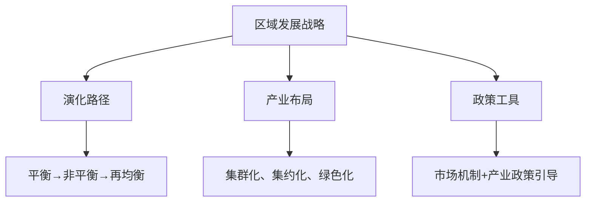

# 第五讲：新时代中国的区域发展战略与产业布局

> 📅 整理时间：2026年3月22日  
> 🎯 核心主题：中国区域发展战略的演化与实践  
> 📖 参考文献：国务院区域发展规划、国家发改委文件

---

## 一、中国区域发展战略的演化历程

### 1.1 三个阶段的历史演进

| 阶段         | 时间      | 战略特征       | 核心政策                           |
| ------------ | --------- | -------------- | ---------------------------------- |
| **第一阶段** | 1949-1978 | 区域平衡发展   | 三线建设、内地优先、七大经济协作区 |
| **第二阶段** | 1978-2012 | 不平衡发展战略 | 东部沿海优先、梯度发展、效率优先   |
| **第三阶段** | 2012至今  | 新时代再均衡   | 3+4格局、高质量发展、协调发展      |

### 1.2 新时代"3+4"区域战略格局

```
三大全局性战略：
├── 一带一路（全球资源配置、内外联动）
├── 京津冀协同发展（跨行政区要素流动）
└── 长江经济带（生态与经济协同）

四大区域板块：
├── 西部开发
├── 东北振兴
├── 中部崛起
└── 东部率先示范
```

> 💡 **核心转变**：从"被动式战略布局" → "科学理性效率优先" → "全球辐射力积极主动"

---

## 二、主要经济区域发展战略

### 2.1 四大城市群战略定位

| 区域           | 战略定位         | 核心目标                                       |
| -------------- | ---------------- | ---------------------------------------------- |
| **京津冀**     | 协同发展示范区   | 一核双城三轴四区、疏解非首都功能               |
| **长三角**     | 高质量发展样板区 | 2025年城镇化率70%、PM2.5达标、一体化实质性进展 |
| **珠三角**     | 改革开放新高地   | 现代服务业+先进制造业、对接港澳                |
| **长江经济带** | 经济脊梁         | 覆盖6亿人口、GDP占全国45%、保护水资源          |

### 2.2 东北振兴战略要点

```
核心问题：体制机制、产业结构、经济结构
政策取向：
├── 宏观：转变政府职能、国企改革、融入一带一路
├── 产业：优势产业提质增效、培育新业态、现代服务业
├── 就业：创新创业、产学研融合、人才培养
└── 保障：社保就业、棚户区改造、公共服务均等化
```

### 2.3 中原与关中经济区

| 区域           | 空间格局                           | 发展思路                       |
| -------------- | ---------------------------------- | ------------------------------ |
| **中原经济区** | 一核四轴四区（郑州大都市圈为核心） | 中心-外围、包容发展、创新高地  |
| **关中经济区** | 重点开发区+农产品主产区+生态功能区 | 军民融合、航空航天、产学研合作 |

---

## 三、产业布局与集群发展

### 3.1 苏南地区产业集群案例

| 产业类型     | 主要城市         | 特色与地位                             |
| ------------ | ---------------- | -------------------------------------- |
| **电子信息** | 南京、无锡、苏州 | 2015年电子信息百强中苏南占10席         |
| **高端装备** | 南京、常州、镇江 | 装备制造业规模实力全国第一             |
| **生物医药** | 南京、苏州、无锡 | 镇江医疗器械多项产品国内第一           |
| **新能源**   | 无锡、常州、镇江 | 无锡是中国光伏产业发源地               |
| **新材料**   | 苏州、常州、镇江 | 苏州工业园区为世界微纳领域八大区域之一 |

### 3.2 产业布局的"三沿"特征（苏南）

```
沿沪宁线：集成电路、新型电子元器件、网络通信设备
沿江地区：装备制造、石化、冶金、物流（国际竞争力基础产业）
沿宁杭线：先进设备制造、传统特色资源工艺、旅游度假、都市农业
```

### 3.3 产业集群发展的国际借鉴

| 案例               | 经验启示                                                                  |
| ------------------ | ------------------------------------------------------------------------- |
| **日本太平洋沿岸** | 5大工业地带用1/3国土创造2/3工业产值                                       |
| **关键做法**       | ①国民经济计划指导 ②集中资源建设核心区域 ③扩散型产业分布 ④城市功能合理分工 |

---

## 四、区域发展的主要规律与政策启示

### 4.1 七条核心规律

| 规律          | 内涵                               |
| ------------- | ---------------------------------- |
| **1. 市场化** | 冲破国内壁垒，促进要素自由流动     |
| **2. 区别化** | 根据发展程度、资源分布分类治理     |
| **3. 内生化** | 强调技术进步和创新驱动             |
| **4. 绿色化** | 环境保护与可持续发展               |
| **5. 共享化** | 优势互补，不再追求绝对先行         |
| **6. 多极化** | 从核心区到协调发展                 |
| **7. 个性化** | 根据本地资源、人力资本设计发展路径 |

### 4.2 区域发展战略小结



### 4.3 当前面临的主要问题

| 问题类型     | 具体表现                         |
| ------------ | -------------------------------- |
| **产业同构** | 同质化竞争依然存在               |
| **协调机制** | 区域缺乏整体规划、内部协调不够   |
| **产业配套** | 产业与区域粘合度较低、配套滞后   |
| **集聚效应** | 产业内部关联度不强、效应有待提升 |

---

## 📝 本章学习要点总结

```diff
+ 理解中国区域发展战略的三阶段演化历程
+ 掌握新时代"3+4"区域战略格局的核心内容
+ 熟悉四大城市群的战略定位与发展目标
+ 了解产业集群发展的典型案例与布局特征
+ 掌握区域发展的七条核心规律与政策启示
+ 思考区域协调发展中面临的问题与解决路径
```

---

## 💬 思考题（供课后讨论）

1. 中国区域发展战略从"平衡"到"非平衡"再到"再均衡"的演化逻辑是什么？
2. 新时代区域发展战略如何体现"高质量发展"的要求？
3. 苏南产业集群发展的经验对其他区域有何借鉴意义？
4. 如何协调"效率优先"与"区域公平"之间的关系？
5. 在双循环新发展格局下，区域发展战略应如何调整？

---
