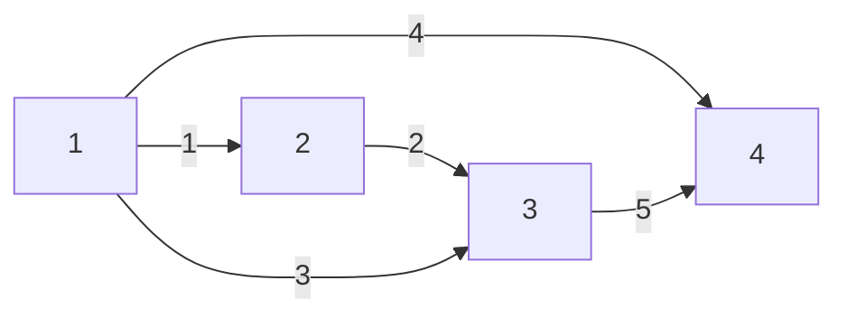

# 线性代数的应用

!!! abstract "大纲"
    1. 图与网络
    2. 关联矩阵
    3. Kirchnoff's Laws

## 简介

这节课在讲线性代数的应用。

上课用的矩阵大部分都是编的，事实上，使用线性代数处理的矩阵都是有出处的。（Matrice comes from reality）

它们来自实际问题，描述问题的拓扑结构。人们在实际处理问题时需要搞清楚它的拓扑结构。

## 网络和图

Small world Graph 的内容。什么是图？是节点和边集合。（{nodes, edges}) 通过边把各个点连接起来。实际上图有很多种表达方式，一种是==邻接矩阵（adjacent matrix）==.

假设图上有很多点，或者说全世界每个人都是一个点。假设教室中的每个人都是一个点，两个节点之间存在一条边，表示这两个人是朋友。这样就构成了一个很庞大的图。现在的问题是，从任意一个节点到任意其他节点，共需要走多少步？

比如，就整个国家而言，图中两个人最远相距多少步？两人之间的最大距离是多少？数据告诉你，大概6步就可以到达任意一个人。这就是**小世界图**。

## 关联矩阵

比如我们给出一张图，如上所示。这种网络可以表示很多结构：交通、桥梁、道路等。这里有5条边和4个节点。我们把边作为行，节点作为列，形成一个 $5 \times 4$ 的矩阵，叫做关联矩阵（incident matrix）。

$A = \begin{bmatrix} -1 & 1 & 0 & 0 \\ 0 & -1 & 1 & 0 \\ -1 & 0 & 1 & 0 \\ -1 & 0 & 0 & 1 \\ 0 & 0 & -1 & 1 \\  \end{bmatrix}$。这里，第一行表示序号为1的边。边的出发节点对应元素为 $-1$，到达节点的对应元素为 $1$。

这里注意前三行，这三行不是相互独立的（$r_1 + r_2 = r_3$）这说明这三条边**一定形成了回路**。（Loop means dependent）

这里还可以注意到，随着节点和边越来越多，矩阵会有越来越多的0元素，（因为每增加一行，只增加两个非零元素）。矩阵是个**稀疏矩阵**。

> 关联矩阵源自问题，描述了问题的拓扑结构。

---------

- 现在思考一个新问题：在这个网络中，零空间意味着什么？

零空间其实就是在问，这些列是否相关？

$Ax = 0 = \begin{bmatrix} x_2 - x_1 \\ x_3 - x_2 \\ x_3 - x_1 \\ x_4 - x_1 \\ x_4 - x_3 \end{bmatrix} = \begin{bmatrix} 0 \\ 0 \\ 0 \\ 0 \\ 0  \end{bmatrix}$，易见 $x = \begin{bmatrix}  1 \\ 1 \\ 1 \\ 1 \end{bmatrix}$

这里我们考虑Ax = 0的实际意义。通过关联矩阵、零空间，我们实际上获得了两边之间的差值，这可以用来计算**电势差**。x的物理意义，就是该点处的电势。而求Ax= 0的过程，实际上就是求各边上电势差为0的情况。

关联矩阵的各列是线性相关的。零空间 $c \begin{bmatrix} 1 \\ 1 \\1 \\1 \end{bmatrix}$。维数为1. 

!!! note "零空间的物理意义"
    表明在这个网络中，节点电势实际上都是由一个常数决定。电势差是产生电流的原因。如果没有电势差就没有电流。常数c决定了电势上升or下降。类似不定积分后的那个常数c。

回顾一下，这个 $5 \times 4$ 的矩阵，我们现在已经知道它的零空间是一维的。列数4，可以得到秩为3.

说明 $A$ 的任意三列都是线性无关的。任意三个节点的电势都是线性无关的。剩下的第4个节点的电势则不是。我们通常把它接地。

-------------

- 思考第二个问题，A的左零空间的含义是什么？它的维数是多少？

$\text{dim}(N(A^T)) = m - r = 2$。我们列一下左零空间。

$\begin{bmatrix} -1 & 0 & -1 & -1 & 0 \\ 1 & -1 & 0 & 0 & 0 \\  0 & 1 & 1 & 0 & -1  \\ 0 & 0 & 0 & 1 & 1 \\\end{bmatrix} \begin{bmatrix} y_1 \\ y_2 \\ y_3 \\ y_4 \\ y_5 \end{bmatrix} = \begin{bmatrix} 0 \\ 0 \\ 0 \\ 0 \\ 0 \end{bmatrix}$ 

补充一点物理知识，这里的y 就是这两点之间的电流值，电流和电势差之间的关系服从欧姆定律，边上的电流值是边的电势差的倍数。

于是我们有 $A^T y = 0$。这是经典的**基尔霍夫电流定律**（KCL），也叫平衡方程。它说明了**流入电流 = 流出电流。**

怎么理解这个东西？我们把上面矩阵形式展开成一般形式

$$\begin{aligned}\begin{equation*}
\begin{cases}
-y_1 - y_3 - y_4 = 0 \\ 
y_1 - y_2 = 0 \\ 
y_2 + y_3 - y_5 = 0 \\ 
y_4 + y_5 = 0
\end{cases}
\end{equation*}\end{aligned}$$

第一个等式，结合上面的图，意思就是从节点1流出的电流和一定是等于流入电流的。对节点2，$y_1$ 是流入，$y_2$ 是流出，这两者一定是相等的。同理可以推广到剩下两个式子。KCL也说明了，节点不存储电荷。

!!! note "线性代数的理解"
    回到线性代数的理解，我们试着不用消元法去理解这个矩阵。思路是找网络图中的环路（Loop）

    我们观察原来的图，1、2、3三个节点构成一个回路（不要看他们之间的边的方向，把它当做一个无向的情况！）。这说明如果 1->2->3 如果有电流，这种流量一定等于从 3->1 的电流。用 $y$ 向量表示就是 $\begin{bmatrix} 1 \\ 1 \\ -1 \\ 0 \\ 0 \end{bmatrix}$。用同样的方法找回路 3->4->5，可以得到相似的结果 $\begin{bmatrix} 0 \\ 0 \\ 1 \\ -1 \\ 1 \end{bmatrix}$。这两部分是线性无关的，又因为我们知道左零空间的维数是2，这两个就构成了左零空间的基。

    当然如果你说大回路中也有一个，那是必然的，不过这个大回路可以用我们的基线性表示。

---------

- 思考第三个问题，$A$ 的行空间的意义是什么？

还是 $A^T$，我们从上面的公式可以解出，第1、2、4列是线性无关的，行空间的维数是3. 把线性无关的三列在图上表示，会发现正好是不构成回路的三条边。

结论：线性无关，等价于**没有回路**。换句话说，边之间的相关性，==源自“形成了自回路”==。

讲到这里正好可以引出重要概念：“树”（tree），没有回路的图就叫“树”。**树的关联矩阵对应的行向量一定是线性无关的**。相比之下，关联矩阵的列向量之间重要结论反而不多。

## 从线性代数到欧拉公式

对于一个图而言，往往是边的数量要大于点的数量。我们用 $m$ 表示边的数量，$n$ 表示节点数量。边的数量至少是 $m = n-1$, 否则就不连通。

不过，当 $m > n-1$ 时，意味着图中有环（Loop）。最开始我们知道，这种图零空间只有1维，所以$n - r = 1$. $\text{dim}(N(A^T))  = m - r$，也就是 Loop的数量 $= m - r$, ==节点数 + 环数 - 边数 = 1==

这就是经典的欧拉公式的表示。（左零空间的维数 = 环的个数？）

!!! note "关于应用数学的总结"
    
    $e = Ax$ ;

    $y = cAx$; 

    $A^T y = c A^TAx  = f$;

