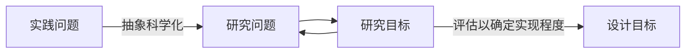

# 工程管理设计研究与论文写作

> 15150533263

!!! note "安排"
    考勤：20%，平时：20%，课程成绩：60%

    平时成绩：签到、互动、研究报告；

    课程成绩：结课论文、调查报告成绩

    > 作业很多（“不是一般的多”）

    Target: 利用科学研究的思路去解决实际问题；培养工程管理科学研究的素养；学位论文研究。

|              课程内容               |             考核方式              |
| :---------------------------------: | :-------------------------------: |
|     （1）工程管理与MEM培养要求      |                无                 |
|        （2）工程管理设计研究        |        报告:文献分析报告*#        |
|         （3）选题和研究问题         |         报告:选题报告框架         |
|            （4）文献综述            |        报告:文献综述报告*         |
|            （5）研究方法            |         研讨:案例研讨形式         |
|   （6）研究方案设计（1）:问题研究   |   报告:问题研究的研究方案设计*#   |
| （7）研究方案设计（2）:解决方案设计 | 报告:解决方案设计的研究方案设计*# |
| （8）研究方案设计（3）:解决方案评估 | 报告:解决方案评价的研究方案设计*# |
|          （9）开题报告撰写          |      报告:开题报告文稿和PPT       |
|         （10）论文章节安排          |    研讨:典型章节安排的案例分析    |

认真准备，可以到研究生二年级上学期的水平了。

!!! note "Def:"
    工程：涉及到采用判断和创造力来应用从研究、经验和实践获得的数学和自然科学知识，以开发利用材料和自然的力量来**实现人类的价值** (The International Technology and Engineering Educators Association, 2007)。 

    工程:采用==系统的、迭代的方式==来设计对象、过程、系统来满足人类的需要和愿望(The National Assessment Governing Board, 2014)。

    工程:是人类为了改善生存、生活条件，并根据当时对自然规律的认识，而进行的一项**物化劳动**的过程。

- 总体模型：系统输入（原材料和资源） -> 工程系统（工程全寿命过程） -> 系统输出（产品或服务）

> 在已有系统中构建一个人造新系统。
>

- 工程 = 工程的对象（人造物） + 过程（策划、实施、运营）（临时性活动：PM，非临时性活动：Operation Management）
- **价值**是什么：成本、效益的平衡。V = F / C 价值 = 功能 / 成本💰；**价值体系**：是付出的和获得的之间的一种关系。
- **人造物**
- **全寿命期**：策划、设计、建造、维护。

> 科学、技术、工程：三个划分。工程是整体的。好多因素叠在一起才能发挥作用。

## 0926 第二节课

> 工程: 人造物 、产品、服务性的、或者许多类型的组合

工程的价值导向 -> 人造物(典型特征：整体) -> 过程（策划、实施、运维；分阶段完成（一致性很重要，要成整体，要集成才行））

> 职能的集成、跨阶段的集成、跨主体的集成；
>

工程管理：工程策划、实施、运营等全寿命周期所涉及生产活动的组织。

## 1012 第三节课

### 专硕的培养目标要求
- 研究生专业学位发展
- 培养目标
- 学位论文要求

### 理论贡献和实践价值
- 实践价值（Q1 如何通过学位论文研究促进实践问题解决？）
- 理论贡献（Q2 如何在解决实践问题的同时有理论贡献？）

实践问题的理论化：具体实践问题 -> 一类抽象的理论问题 -> 一般性解决方案 -> 具体的解决方案；

> 在OR中应用得很多。

- 工程管理设计研究

!!! note "研究不足和实践问题"

    研究不足：得到的是研究问题（完全对应，knowledge gap），最终改进理论。

    实践不足是来自实践的，我们要最终改进的实践；

    **实践问题到研究不足是什么关系？**

    研究不足：已有研究无法解决新冠肺炎这个病毒；现有的认知的差距；对实践的理解不够：需要补充理论：出于理论；
    实践问题：如何解决体温过高、咳嗽等新冠症状？（具体研究不足体现在“没有具体的方法来治疗病毒”这个不足）出于实践；具体做法是改善实践；

    > 任务：找一个论文，把7个框里的内容找出来；

### 解决实践问题导向下的知识、能力、素质培养
- 知识、能力、素质
- 思维、能力要求

> 知识的学习；
>
> 能力的培养；
>
> 复杂工程问题解决能力；

> > 问题 - 设定目标 - 方案设计 - 结果分析和评估 - 形成报告

## 1019 学位论文

### 学位论文研究过程
- 研究的特征：不确定性、复杂性、模糊性、独特性、主体的认知不足
- 特征举例：迭代（认知有限，逐步深入、解决问题、慢慢清晰） 

> 沟通、交流、规划、调研、交流的载体、实施调研的方法、撰写论文的方法；
> 

!!! note "开题阶段主要解决的"
    选题的工作：实践问题的理论化、研究问题的提出、预期的理论贡献、可行性分析。

    - 精力放在最关键的问题的解决上；

### 学位论文研究过程管理的策略
- 认知和动手（系统认知、动手、螺旋式上升）
- 分阶段管理（开题、中期、盲审、答辩）
- 问题管理（整体认识问题、分析边界条件、问题分解、分析关键子问题的相互关系、规划总体的目标解决）

## 1026 

1. 选题概述：

> 以往知识的进一步概括

老师提问：怎么知道没有人研究过你的课题？
回答：看了最近5年和这个问题最相关和有代表性的的期刊XXX，XXX，XXX，都只研究了XXX，或者XX，没有对XXX进行考虑。

2. 实践问题的理论化

推理方式：**归纳、演绎、溯因。** 推理的逻辑是否严密，写的东西是否有逻辑。

归纳：不仅要保留特定问题的特征属性，还要兼顾到类似问题的一般性特征（兼顾特征和普遍性）

规则的制定；

!!! example "选题理论化：纸尿裤研发问题"
    - 新产品的研发
    - 快消品的研发
    - 纸尿裤的研发

### 选题的要求

- 确定研究不足、提出适当的研究问题
- 拟开展的研究具有可行性；

!!! note "选题和开题的比较"
    - 形式上：开题需要形成书面报告；
    - 顺序上，要先明确选题、再进入撰写
    - 内容上，要求一致，选题类似草图、开题类似方案设计

### 选题的步骤

- 初步猜想
    - 问题角度
    - 情境角度
    - 解决问题的理论与方法

- 迭代验证
    - 了解定义、背景、理论和实践 
    - 梳理现状
    - 解决问题的方法和角度

> 备选的**理论库**和**实践问题库**
>
> 以可解释性为原则进行筛选
>
> 以具体时间问题和理论相吻合作为决策规则；
>
> 解决方案的猜想；

### 研究问题的提出

情境、问题、解决方案的理论和方法、确定研究不足、确定研究问题；

## 1109 文献综述 

### 文献综述的目的

- 促进探索性的认识；
- 以当前研究不足为目的，形成研究问题和创新点的提炼；
- 提供理论基础，为本研究的解决方案设计提供理论指导；

!!! note "是不是一定越多越好"
    No 越合适越好；

    找到合适的理论基础；

    要快，要了解全局；

“你要回答的论文是哪几篇？能不能找到关键性的文章？”

作业：综述一下研究不足是什么，把研究不足写好。

不需要自己创造什么词来描述，只需要找一些文献，用特定的语句表示出来；注意用词准确性；

> “没有相关研究” 和 “缺少相关研究”

## 1116 文献综述内容

### 例子和作业

实践问题确定目的：解决实践问题以满足实践预期；

理论问题：理论上存在的问题，没有说清楚的东西；

paperswithcode???

某一类理论问题 -> 一般性解决方案 -> 分析现有理论状态 -> 研究不足与研究问题 -(展开研究)> 理论贡献

**理论的不足来源于文献。**

问题理论化后能找到理论空间，从理论空间（咨询服务跨专业知识融合）中找没有被研究到的东西。要找到综述的文献的领域。

## 研究方案设计概述

解决问题设定的计划

解决研究问题以及涌现问题的一系列步骤、流程 

实践问题-> 理论问题 -> 解决方案（理论基础） -> 评估 -> 解决方案

!!! question "研究方案在讲什么"
    一系列步骤：被理论和现实规律（现实表达）支撑

研究最终训练的就是逻辑推理能力。

研究方法的类型：

抽样调查、案例调查、文档资料、准实验设计、原型开发、数值试验与仿真

研究方案：联系三个阶段：

1. 确认问题和动机
2. 定义解决方案的目标
3. 设计与开发
4. 展示
5. 评估
6. 沟通 

## 1130 问题研究 

> 在刷mooc。

流程挖掘得到的调查结果和探索性访谈可以换位置吗？

不可以，会丧失探索性。（案例：识别、分析并找到销售线索黑洞）

问题、预期、现状和预期的偏差、设计（实施）

确定边界条件和范围、

作业：整理研究方案；2.问题研究时候的研究方案是什么样子的？为什么要设计这样一个研究方案进行研究？（有些文献里可能没有，留意一下）

## 1214 设计假设

!!! example "桥梁工程钢箱梁采购与制造"
    谁来承担？

    把风险转移给最能承担问题的一方。