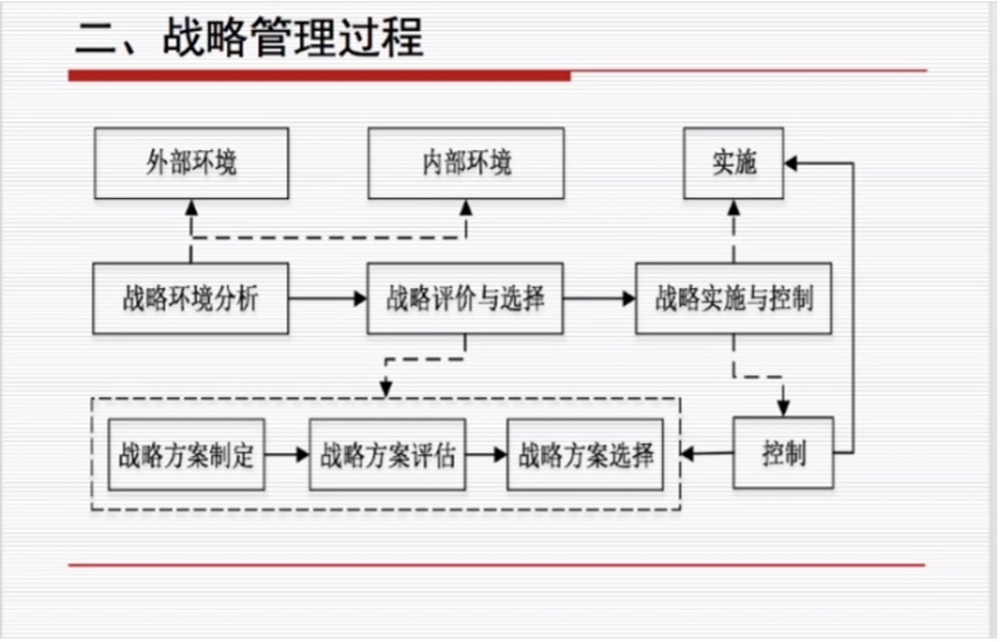
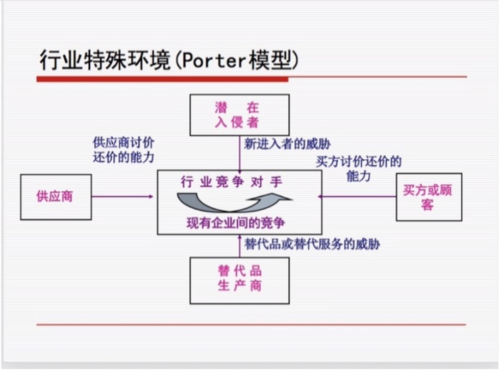
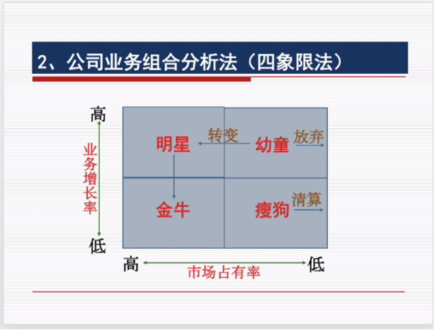
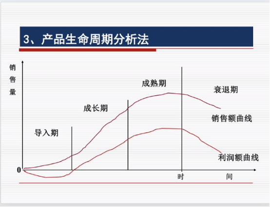
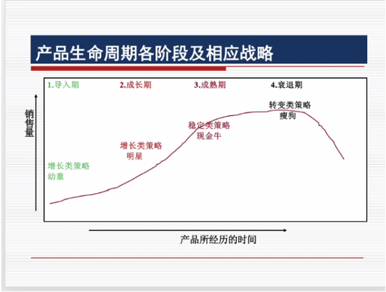
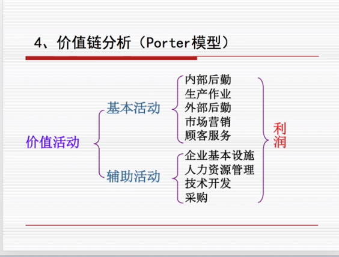

# 重点辨析

-------------------------

#### 什么是战略？战略具有什么特征？
- 战略是通过有效地组合组织内外部资源，以在动态的环境中确定组织的发展方向和经营范围，从而获取竞争优势，满足市场需求，实现利益最大化目标。

  - 纲领性与全局性：组织的总体发展方向、最基本的行动方针，均为概括性的；总体利益最大化；
  - 长远性与稳定性：相对于短期利益，更关注长远利益，不能随意变动；
  - 前瞻性与风险性：对未来的内外部变化做出相对准确的预测； 
  - 竞争性与合作性：在激烈的竞争中发展自己、打败对手，获得自己的优势，避免两败俱伤，因此合作、双赢甚至多赢；
  - 变化与创新性：适应环境变化，因此需要创新

-------------------
#### Q.2. 战略管理过程包括哪几个环节？
  - 战略管理是一个动态过程，规范而全面的战略管理可以分为战略分析、战略评价与选择、战略实施与控制。

{: style="height:350px"}

-------------------
#### Q3. 如何理解外部一般环节分析与行业特殊环境分析？
  - 一般外部环境 （PEST分析模型）
    - Political: 政治环境（政府政策、管制、立法、国家政局、社会制度...）
    - Economical: 经济增长、财政货币政策、利率、储蓄、消费偏好、通货膨胀
    - Social & Cultural 生活方式、社会价值观、风俗习惯、教育水平、宗教信仰
    - Technical: 技术总体水平、技术突破、知识产权保护情况、技术变化速度、社会科技力量
  - 行业特殊环境：（PORTER模型）大多数企业主要分析==竞争对手的差异性和企业应当寻求的战略地位==
    - 潜在入侵者: 考虑新进入市场者的威胁
    - 买方或顾客: 迫使业内企业降低价格，提高生产服务水平，使同行业竞争加剧
    - 替代品生产商: 替代品或替代服务的威胁
    - 供应商: 提高货物价格或降低产品服务和质量等来影响，有较强的讨价还价能力（数量、集中程度、可供选择的替代品输入方面）
    - 产业内竞争者:最强大的竞争力量

{: style="height:350px"}

-------------------
#### Q.4. 企业自身资源包括哪些内容？

  - 企业自身资源:
    - 两类：有形资源和无形资源
    - 五种：物质资源、财务资源，人力资源，技术资源和管理资源
-------------------
#### Q.5. 如何进行目标市场分析？
  - 目标市场分析:先进行总体市场分析，确定市场容量、市场交易便利程度，再对市场进行细分，选择目标市场。之后进行产品定位，确定产品价格，质量等。

-------------------
#### Q.6. 概述公司状况分析法、公司业务组合分析法、产品生命周期分析法、链分析法。

  - 公司状况分析 SWOT
    - 通过分析组织内部资源来评价优势和劣势，通过分析外部环境来发现机会和威胁。
    - Strength：优势
    - Weakness：劣势
    - Opportunities：机会
    - Threats：挑战
    - 对应的发展战略：
    > SO战略：增长战略；ST战略：多元化战略；WO战略：扭转战略；WT战略：防御战略
  - 公司业务组合分析（四象限）
    - 以业务增长率和市场占有率的高低为标准，将公司业务划分为明星，金牛，幼童和瘦狗来进行，分析目标是平衡消耗现金和产出现金。
    - 金牛产品：市场占有率高、业务增长率低。可以获得较为丰厚利润。产生大量现金流，增长前景有限。
    - 明星产品：市场占有率高、业务增长率高。开始成长率和占有率高，但是现金流不乐观甚至为负。
    - 幼童：市场占有率低、业务增长率高。投机性，投资性，风险性高。
    - 瘦狗：市场占有率低、业务增长率低，一般可以放弃。
    - 一般由金牛的现金流投资明星和幼童来快速发展。麦当劳一个例子。从幼童到明星到金牛。

{: style="height:350px"}

  - 产品生命周期分析 ：指的是产品随着时间的流逝，经过的一些阶段。分为四个阶段，不同产品在每个阶段的时间不同。处于不同生命周期的产品应制定适宜该周期的策略。
    - 导入期：发展缓慢，需要大量投资。
    - 成长期：快速增长。持续性增长。
    - 成熟期：增长缓下来甚至停滞不前。维持最低水平投入来保持。
    - 衰退期：战略清算 放弃。

{: style="height:350px"}
{: style="height:350px"}

  - 价值链分析
  - 将企业作为整体来考量，分析目的是找出最基本的价值链，然后分解为各个单独的作业，根据企业整体目标进行权衡取舍，实现成本最低 价值增值最大的目标。
  - 价值活动包含内部后勤，生产作业，外部后勤，市场营销，顾客服务，企业基本设施，技术开发等。

{: style="height:350px"}

-------------------
#### Q.7. 概述成本领先战略、差异化战略、目标集聚战略。

  - 成本领先
    - 以尽可能低的成本将产品卖给顾客。在保证质量和服务的前提下通过对所有关键成本的构成包括经验进行有效的积极的管理从而持续性获得优势，将成本最小化。风险在于易于模仿，成本优势容易失去，在性能服务方面往往落后。

  - 差异化 
    - 在质量、服务、技术等多方面有意识地创造与众不同的特色，让顾客感受到区别于竞争对手的差异而取得竞争优势。风险在于顾客可能不看重差异性，同时差异性成本可能很高。
   
  - 目标集聚  
    - 集中力量主攻某个特定的顾客群、特定产品、细分市场或地区市场，利用高度专业化提供更好的服务，对中小企业有特殊意义。风险在于狭窄市场的顾客需求可能与整体市场的需求逐渐变得相同。

-------------------
#### Q.8. 什么是增长战略？它有哪几种形式？
   - 企业增长战略就是企业在战略的协调和主导下，调配资源、集合众力，积极开展研发业务，寻求企业与环境的动态优化，以实现企业价值增长为目的的发展模式。	
     - 集中战略：集中于一个产品、一个产业、一个市场、一种技术，积极扩张经营规模。
     - 一体化战略：垂直以现有的事业线为基础向产业链的上下游扩展整合以增大经营规模。
     - 分散战略：企业从当前的事业线扩展到其他有关联或无关联的产业与部门。
	
-------------------  
#### Q.9. 组织的定义与组织的分类
  - 概念：为了达到特定的目标，经由分工合作及不同层次的权力和责任机制而构成的人的有机集合体。
  - 组织类型：经济组织 / 政治组织  / 文化组织 / 宗教组织  / 正式组织  / 非正式组织 

-------------------
#### Q.10. 组织设计的原则和影响因素
  - 组织设计的原则
      - 目标至上：明确目标以及个人工作；
      - 统一协调：组织机构上下级之间必须政令统一；
      - 权责一致：要明确规定各个管理层次的职责范围和管理权限；
      - 因事设职：将重心放在岗位职能上而不是成员的个体的独特性；

  - 组织设计的影响因素
      - 组织战略
      - 外部环境
      - 技术因素
      - 组织规模

-------------------
#### Q.11. 各类部门化组织的利弊
  - **职能部门化**：把相同或相似的活动归并在一起，作为一个管理单位。
      - 优势：在部门内实现了规模经济；可以促进员工发展更深层次的专业技能；部门主管易于规划和控制；有利于避免重复浪费
      - 缺点：容易各自为政，片面追求本部门的局部利益；部门之间缺乏交流合作渠道，难以培养综合管理人才。

  - **产品部门化**：围绕产品或服务来划分部门。
      - 优点：有利于提高效率水平；各类产品的绩效易于客观评估；可以培养综合管理人才
      - 缺点：提高了培训成本；各产品部门只关心本部门的产品，对整体组织欠缺考虑
  - **地域部门化**：分散经营的企业按照地理区域成立专门的管理部门。
      - 优点：对本地区的市场和问题反应迅速灵敏；充分利用地域资源和地区政策；为培养综合管理人才创造了条件。
      - 缺点：需要高素质的综合管理人才的数量较大；管理成本很高

  - **顾客部门化**：根据不同顾客的需要或不同顾客群设立部门。
      - 优点：有利于提升顾客体验，易发挥人才专长；可以建立持久性竞争优势
      - 缺点：并不一定完全了解顾客真实的需求状况；顾客的需求偏好发生变化，转移成本较大

  - **流程部门化**：按照生产过程、工艺流程或设备来划分部门。
      - 优点：可以充分发挥专业技术优势；规模经济；易于管理；简化了培训
      - 缺点：部门之间的协作有困难，成本管理比较困难；不利于培养综合管理人才

-------------------
#### Q.12. 管理幅度的影响因素有哪些?
  - 工作的内容和性质:组织制度和结构的完善程度；主管所处的层次；下属工作的相似性；非管理事务的多少。
  - 工作能力:主管的能力，下属素质 
  - 工作条件:助手的配备情况，信息手段
  - 组织所处的外部环境:环境稳定有助于扩大管理幅度，环境变化越快，程度越大，管理幅度就越小。
-------------------
#### Q.13 各种类型的组织结构的利弊
  - 直线型结构
      - 优点：简单明确、权责清楚、统一指挥，在主管人员素质高、能力强的条件下有很高的运作效率且节省管理费用。
      - 缺点：缺乏横向协调的渠道，当组织规模扩大或主管人员的能力不足以有效控制时，则难以适应业务发展的要求
  - 职能型结构 
      - 优点：易于控制和监督；能够突出业务活动的重点，确保高层管理人员的决策顺利执行 
      - 缺点：决策效率可能降低，部门之间协调困难，不利于综合管理人员的培养
  - 事业部型结构
      - 优点：可以使高层主管只用关注公司的战略决策，有利于培养综合管理人才；能充分发挥分权组织的优点，真正了解顾客的需求
      - 缺点：机构重复，管理成本大；事业部之间协调困难，甚至出现无效竞争
  - 矩阵型结构
      - 优点：组织可以满足环境的多重要求；资源可在不同的产品或地区或流程之间柔性分配；员工可以依据个人兴趣获得专业或一般管理技能
      - 缺点：接受双重命令，这些命令可能是矛盾和冲突的；管理者花费大量的时间在开会上，并且可能提高管理成本
  - 动态网络型结构
      - 优点：组织结构具有更大的灵活性和柔性；组织结构简单精炼，管理效率高
      - 缺点：组织可控性很差；组织风险性大；员工的组织忠诚度低
 
-------------------
#### Q.14. 什么是集权、分权、授权?
- 集权是指决策指挥权在组织层级系统中较高层次上的集中，分权是指决策指挥权在组织层级系统中较低层次上的分散 
  - 集权的原因：组织的历史、领导的个性、政策的统一性与行政的效率
  - 集权的弊端：降低决策的质量、降低组织的适应能力、降低组织成员工作热情

- 分权则是按照一定规则把权力分派给不同机关，上级核心机关只对关于全局的重大问题作出决策。

- 授权就是指上级委授给下属一定的权力，使下属在一定的监督之下拥有相当的自主权和行动权。授权不等于弃权，是把一部分权力分散给下级，而不是把与权力同时存在的责任分散下去

-------------------------
#### Q.15. 什么是直线职权、参谋职权、职能职权？

- 直线职权是指上级直接指挥下级的权力，表现为上下级之间的命令权力关系
- 参谋职权是指参谋人员所拥有的辅助性的职权，旨在帮助直线权力有效地完成组织目标
- 职能职权是指职能主管人员所拥有的，由高层授予的部门决策权和指挥权

-------------------------
#### Q.16. 工作分析的主要内容是什么?

- 收集、分析与工作岗位有关的信息，以此确定工作的职责和内容，以及具备什么素质的人可以胜任该工作岗位的过程。

-------------------------
#### Q.17. 常用的考评方法有哪些？

- 交替排序法
    - 根据绩效评价要素将员工们从绩效最好的人到绩效最差的人进行排序。将需要进行评价的所有下属人员名单列举出来，在被评价的某一要素上，列出最好的和最差的，再在剩下的员工中挑出最好和最差的，以此类推
- 强制分布法
    - 将所有员工分为杰出的、高于一般的、一般的、低于一般的和不合格的五种情况，分别占10%、20%、40%、20%、10%。然后按照每人绩效的相对优劣情况，强制列入其中的一定等级。
- 配对比较法
    - 首先列出一张表格，其中标明所有需要被评价的员工姓名以及需要评价的所有工作要素。然后， 将所有员工根据某一类要素进行配对比较， 用“ + ” （ 好） 和“（ 差） 表明谁好一些、谁差一些。最后， 将每一位员工得到的“ 好” 的次数相加。
- 关键事件法
    - 它是通过对工作中最好或最差的事件进行分析，对造成这一事件的工作行为进行认定从而做出工作绩效评估的一种方法。
- 360°绩效评估法 
    - 从与被考核者发生工作关系的多方主体那里获得被考核者的信息，以此对被考核者进行全方位、多维度的绩效评估的过程

------------

#### Q.18、何为组织创新的扁平化、团队化、网络化？
- 扁平化 
    - 通过拓宽管理幅度，减少中间的管理决策层次和组织的管理层级，从而实现缩减组织金字塔式高耸的管理结构的目的
- 团队化
    - 团队是由数个技能互补的成员组成的人群结构，团队的成员致力于共同的宗旨、绩效目标，并且共同承担责任
- 网络化
    - 企业网络是独立企业之间有一定稳定性的合作伙伴关系或利益共同体。依照所有权关系的紧密程度和维系力量的差异，企业网络分为战略联盟，小企业网络、准联合等多种类型。

------------

#### Q.19. 什么是领导？领导与管理的异同
- 领导是指在一定的环境下，具有影响力的个人或集体，通过引导、影响和激励其下属或组织成员为实现组织目标而共同努力的过程

- 领导与管理
  - 工作重点不同：领导的作用在于确定组织正确的行动方向，更关注企业的未来：管理的作用是在正确的方向下，选择最有效的途径和方法完成组织目标，更关注企业的现在
  - 权力来源不同：领导的权力既可以是合法的、强制的，也可以来自于自身的影响力和专家权力，而管理的权力只能来自于正式的职务权力

------------

#### Q.20. 领导者的素质包括哪些内容？
- 思想素质
    - 崇高的使命感、强烈的事业心、创业精神、进取意识等
- 知识素质
    - 有单独处理信息的能力，也要有科学的专业知识结构，广泛的知识面和较高的知识水平。
- 能力素质
    - 综合性能力强，包括分析判断能力，决策能力，组织指挥和控制能力，沟通协调能力，开拓创新能力等
- 身体素质 
    - 健康的身体，强烈的体魄，充沛的精力
- 心理素质 
    - 领导者行为是心理活动的结果也是领导者素质的外在体现

-------------

#### Q.21. 概述管理方格论与菲德勒权变模型
- 管理方格论： 
	将领导者按绩效导向（对生产的关心）和维护导向（对人员的关心）进行评估，把分值标注在两个维度的坐标界面上，并划分为9个等级，从而生成81种不同的领导类型。

- 权变理论 
    - 领导的有效性不是取决于领导者不变的品质和行为，而是取决于领导者、被领导者和情境条件三者的配合关系，S=f(L, F, E)
    - 菲德勒模型 没有揭示权变关系的原因
    - 三种权变因素：职位权力的大小、任务结构是否明确、上下级关系（下属乐于追随的程度）
    - 一种分析模式：LPC量表。该量表主要内容是询问领导者对最不与自己合作的同事的评价。如果领导者对最不喜欢的同事批评得一无是处，则被认为惯于命令和指挥，是只关心生产的领导（低LPC型领导方式）；如果能对最不喜欢的同事给以好的评价，则被认为注重人际关系和个人声望，是以人为主的领导（高LPC型领导方式）

---------------------

#### Q.22. 如何理解领导的艺术？
- 处事的艺术：准确定位、做该做的事情：领导者要干好本职工作 明确领导内容，制定企业经营战略，建设领导班子，培育企业文化 
- 待人的艺术：善于激励、知人善用：掌握激励理论 了解下属需要，用其所长，要对人进行正确的考察；
- 管理时间的艺术：善于管理时间：采用记录统计法，ABC时间管理法等方法管理时间；

----------------

#### Q.23. 概述主要的激励理论（需要层次、双因素、成就需要、期望、公平、强化等）
- **需要层次论**
  - 将需要按照强度分为生理，安全，感情，尊重和自我实现需要。分别对应经济人，社会人和自我实现人的需要。提供了一个比较科学的理论框架，成为激励理论基础
  - 指出了人的需要是从低级向高级发展的。将自我实现作为人的需要的最高层次具有积极意义。但是对需要5个层次的划分过于机械，分析过于简单，缺乏实证基础
- **ERG理论**
  - 认为人的需要可归结为生存需要（Existence）、关系需要（relation）和成长需要(growth)三种。在同一层次上，少量需要满足后会产生更强烈的需要。较低层次的需要满足得越充分，对较高层次的需要越强烈。较高层次的需要满足得越小，低层次的需要则更强烈
  - 相较于马斯洛理论，更全面地反映了社会现实。假设激励行为是遵循一定的等级层次，且与马斯洛需要层次理论相对应，认为人可能同时受到多种需要的激励。

- **成就需要理论**: 认为人们的生理需要得到满足以后，还有三种基本的激励需要：归属需要、权力需要和成就需要。高成就需要者总是喜欢设置自己的目标，希望目标具有挑战性，将金钱视为衡量成就的工具。

- **双因素理论**
  - 保健因素：这属于和工作环境或条件相关的因素。如公司的政策和管理、人际关系 和工作环境的条件、工作的安全性、工资和福利等，当人们得到这些方面满足时，只是消除了不满，却不会调动工作积极性。
  - 激励因素：这属于和工作本身相关的因素，包 括：工作成就感、工作挑战性、工作中得到的认可与赞美、发展前途、个人成才与晋升的机会等。当人们得到这些方面的满足时，会对工作产生浓厚的兴趣，极大地调动工作积极性。
  - 管理者应善于区分两种因素，运用各种手段，如调整工作的分工，使员工满意自己的工作。

- **期望理论**
  - 通过人们的努力与预期奖酬之间的因果关系来研究激励的过程。认为，人们对某项工作积极性的高低，取决于他对这种工作能满足其需要的程度及实现可能性大小的评价，告诉管理人员要搞好奖惩制度 采取最受员工欢迎的奖惩政策。
- **公平理论**
  - 认为人的工作积极性不仅受其所得的绝对报酬的影响，更重要的是受其相对报酬的影响。这种相对报酬是指个人付出劳动与所得到的报酬的比较值。
- **强化理论**
  - 认为无论是人还是动物，为了达到某种目的，都会采取一定的行为，这种行为将作用于环境，当行为的结果有利时，这种行为就会重复出现，当行为的结果不利时，这种行为就会减弱或消失

--------------------

#### Q.24. 何为沟通？沟通的类型有哪些？
- 定义：沟通指在管理过程中所发生的，两个或两个以上的个体或群体，通过一定的联络渠道，传递和交换各自的意见、观点、思想、情感与愿望，从而达到相互了解、相互认知的过程。

- 类型：按照沟通的组织系统可分为正式沟通和非正式沟通，按照沟通方式的可逆性可分为单向沟通和双向沟通，按照沟通方向可分为下行沟通，上行沟通，横向沟通。 

--------------

#### Q.25. 沟通的障碍有哪些？
- 从某种意义上讲，沟通的障碍主要来源于编码与解码过程。具体而言，可将影响有效沟通的要素概括为四种类型：
  - **人为障碍**，指个体知识，经验的影响
  - **语义障碍**，词的多义性，手语等
  - **物理障碍**，沟通的渠道，时间和空间障碍
  - **文化障碍**，即文化背景不同造成的理解障碍

---------------
#### Q.26. 何为控制，控制的主要类型有哪些？

- 含义：控制是指监视各项活动，以保证其按计划进行并纠正各种重要偏差的过程。
- 主要类型：
    - 前馈控制：是在工作之前对工作中可能产生的偏差进行预测和估计， 以便在实际偏差出现之前， 运用各种手段对可能产生的偏差进行纠偏。
    - 现场控制：是指企业组织活动开始以后而进行的指导和监督。
    - 反馈控制：亦称成果控制或事后控制，是指在一个时期的组织活动已经结束以后，对本期的资源利用状况及其结果进行总结。
 
- 概述控制的过程
    - 第一步：制定标准 ：控制的关键因素包含：出现偏差的可能性大的因素，直接决定工作成效的重点因素，能使控制最有效又最经济的因素。可以通过统计性方法，经验判断法，技术分析法等方法制定标准，要求制定出的标准有可衡量性，公平性，可实现性和适当的弹性。

    - 第二步：衡量绩效：首先选择衡量方式，包括亲自观察，分析统计资料，召开会议，抽样调查。之后，评价衡量结果，确定衡量频度，建立信息系统。

    - 第三步：纠正偏差：如果偏差可以接受，或者改进成本过高，可以不采取行动，也可以在生产技术，管理方式，组织结构，人事安排等方面着手改进绩效。
