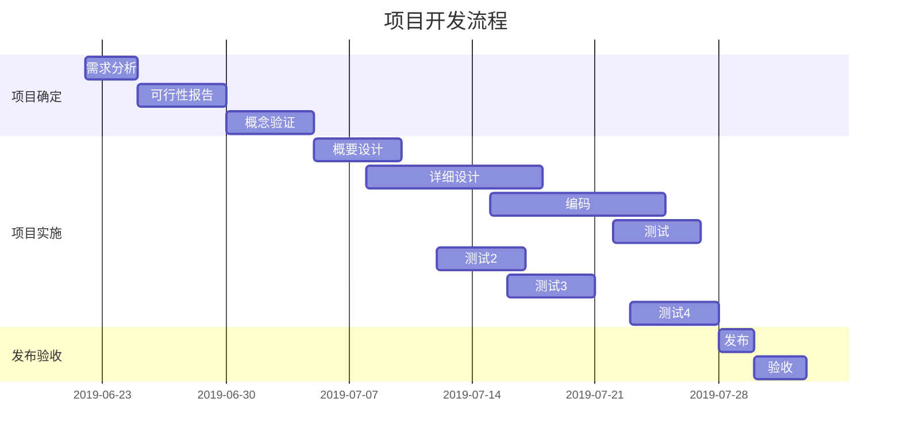
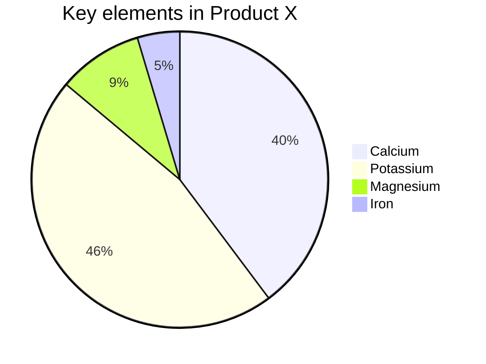
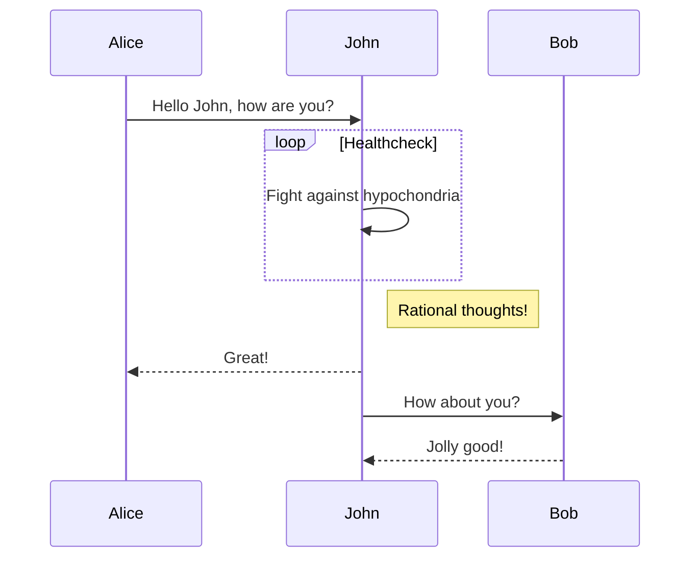

!!! quote
    参考pymarkdown插件链接：[传送门](https://facelessuser.github.io/pymdown-extensions/extensions/arithmatex/)


## 多窗口
=== "Unordered list"

    * Donec vitae suscipit est
    * Nulla tempor lobortis orci
    * Sed sagittis eleifend rutrum

=== "Ordered list"

    1. Sed sagittis eleifend rutrum
    2. Donec vitae suscipit est
    3. Nulla tempor lobortis orci


``` Markdown


=== "Unordered list"

    * Sed sagittis eleifend rutrum
    * Donec vitae suscipit est
    * Nulla tempor lobortis orci

=== "Ordered list"

    1. Sed sagittis eleifend rutrum
    2. Donec vitae suscipit est
    3. Nulla tempor lobortis orci


```

## 代码块

=== "带文件名称"
    ``` py title="bubble_sort.py"
    def bubble_sort(items):
        for i in range(len(items)):
            for j in range(len(items) - 1 - i):
                if items[j] > items[j + 1]:
                    items[j], items[j + 1] = items[j + 1], items[j]
    ```


    ``` Text 


        ``` py title="bubble_sort.py"
        def bubble_sort(items):
            for i in range(len(items)):
                for j in range(len(items) - 1 - i):
                    if items[j] > items[j + 1]:
                        items[j], items[j + 1] = items[j + 1], items[j]
        ```

    ```

=== "行数"
    
    ``` py linenums="1"
    def bubble_sort(items):
        for i in range(len(items)):
            for j in range(len(items) - 1 - i):
                if items[j] > items[j + 1]:
                    items[j], items[j + 1] = items[j + 1], items[j]
    ```

    ``` Text
        ``` py linenums="1"
    def bubble_sort(items):
        for i in range(len(items)):
            for j in range(len(items) - 1 - i):
                if items[j] > items[j + 1]:
                    items[j], items[j + 1] = items[j + 1], items[j]
    ```

## 文字格式

Text can be {--deleted--} and replacement text {++added++}. This can also be
combined into {~~one~>a single~~} operation. {==Highlighting==} is also
possible {>>and comments can be added inline<<}.

{==

Formatting can also be applied to blocks by putting the opening and closing
tags on separate lines __and__ adding new lines between the tags and the content.

==}

## HTML 嵌入

``` HTML 
<div class="grid cards" markdown>

- :fontawesome-brands-html5: __HTML__ for content and structure
- :fontawesome-brands-js: __JavaScript__ for interactivity
- :fontawesome-brands-css3: __CSS__ for text running out of boxes
- :fontawesome-brands-internet-explorer: __Internet Explorer__ ... huh?

</div>
```

<div class="grid cards" markdown>

- :fontawesome-brands-html5: __HTML__ for content and structure
- :fontawesome-brands-js: __JavaScript__ for interactivity
- :fontawesome-brands-css3: __CSS__ for text running out of boxes
- :fontawesome-brands-internet-explorer: __Internet Explorer__ ... huh?

</div>

## 图片/Gif嵌入（Mkdocs 下）

<figure markdown>

  <figcaption>这是简介</figcaption>
</figure>


<figure markdown>
  { width="300" }
  <figcaption>Image caption</figcaption>
</figure>


```
<figure markdown>

  <figcaption>这是简介</figcaption>
</figure>


<figure markdown>
  { width="300" }
  <figcaption>Image caption</figcaption>
</figure>

```


!!! danger
    图形绘制部分在移动端有可能显示出错，建议在PC端使用！

## 一些mermaid JS画的图









