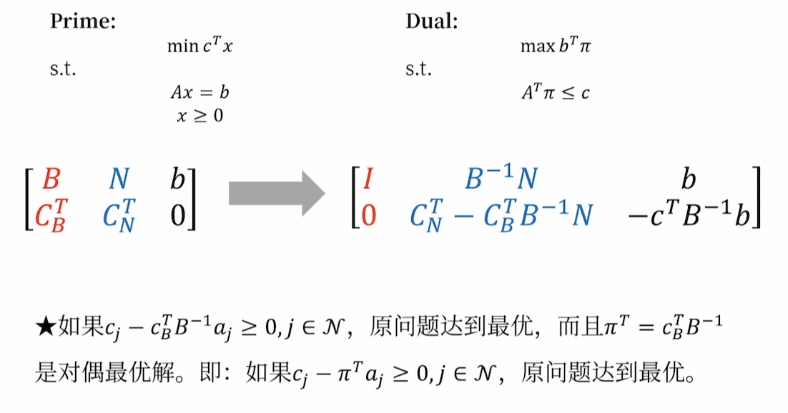

## 模型和解
----

- 线形规划（Linear Programming）：是在**线形约束**下**求解线性目标函数最优值**的数学理论和方法。
      - 决策变量(Decision Variables):
      - 目标函数(Objective Function):
      - 约束条件(Constraints):

$$max(min)z = \sum^{n}_{j = 1}{c_jx_j}$$

$$s.t. \sum^{n}_{j = 1}{a_{ij} }{x_j} \leq ( =, \geq) b_i , (i = 1,...m)$$

$$x_j \geq 0, (j = 1,...n)$$

- 线性规划模型的标准形式

$$max \quad z = \sum^{n}_{j = 1}{c_jx_j}$$

$$s.t. \sum^{n}_{j = 1}{a_{ij} }{x_j} = b_i , (i = 1,...m)$$

$$x_j \geq 0, (j = 1,...n)$$

- **松驰变量**：引入非负变量，把"$\leq$"不等式约束转换为等式约束，这样的$y_i$就是松弛变量
- **剩余变量**：引入非负变量，把"$\geq$"不等式约束转换为等式约束，这样的变量就是剩余变量；
- 满足约束条件（1-9）和（1-10）的解 $x = (x_1, x_2,....,x_n)^{T}$ 称为线性规划的**可行解**(Feasible solution)，全部可行解的集合称为**可行域**(Feasible Region).

$$max \quad z = c^{T}x\tag{1-8}$$

$$s.t. Ax = b\tag{1-9}$$

$$ x \geq 0\tag{1-10}$$

- 使目标函数(1-8)达到最大值的可行解称为线性规划问题的**最优解**(Optimal Solution)。

- 基(Basis)：考虑等式约束方程组$Ax=b$，一般假设$m \times n$ 矩阵是行满秩的，此时如果$B$是$A$中一个 $m \times m$ 的满秩子矩阵（系数矩阵的一个满秩子矩阵），那么B是线性规划问题的一个**基**。
- 基向量：组成基的各个列向量，称为**基向量**；
- 基变量：与基向量相对应的各个变量称为**基变量**；
- **基本解**(Basic Solution)：令系数矩阵非基变量为0，得到的方程组的解，称为**基本解**；
- 基本解的个数是有限的，最多有$C^{m}_{n}$个。
- 基本可行解(Basic Feasible Solution)：满足非负约束条件（1-10）的基本解；
- 最优基本可行解(Basic Feasible Solution)：使目标函数(1-8)达到最大的基本可行解
- 最优基（Optimal Basis)：最优基本可行解对应的基；
- 凸集(Convex Set):设$x_1,x_2 \in x$ 是集合S内的任意两点，如果对于任意的$x = \alpha x_1 + (1-\alpha)x_2,  0 \leq \alpha \leq 1$有$x \in S$，那么集合$S$就是凸集；（给定集合$C$，$C$中任意两点的连线仍在$C$中，那么$C$就是凸集；
- 凸集的顶点（极点）：如果凸集C中不存在任何两个不同的点$X_1,X_2$，使得$X$在线段$X_1X_2$，就说$X$是凸集$C$的顶点。 
- 两个凸集的交集仍然是凸集

### 图解法：

1. 确定可行域
2. 画出目标函数等值域，确定可行域
3. 确定最优解 

- 线性规划解的**三个基本定理：**
    - 若线性规划问题存在可行解，那么可行解是凸集；
    - 线性规划问题的基本可行解和可行域的顶点一一对应；
    - 如果线性规划问题有最优解，那么一定存在一个基本可行解是最优解。

## 单纯形法
-----

- **单纯形法**：
    - 迭代原理：先找到基本可行解，判断是否为最优解，如果不是，就转换到相邻的基本可行解，并且使得目标函数值不断增大，直到找到最优解；
    - 基的转换是在相邻基之间进行的，两个基本可行解之间有且仅有一基变量发生了变化，
    - 以最大化问题为例子，入基变量就是找到使得目标函数减小得最快（单位变动能创造最大收益的）的非基变量，也就是检验数最大的；出基变量就是原本基本可行解中最先因为资源受限降为0的基变量；
        - 检验数：$\sigma_{j} = (c^{T}_N - c^{T}_B B^{-1}N)_j$，如果线性规划问题要求极小值，那么当所有检验数$\sigma_{j} \geq 0$ 时候达到最优解。反之亦然。
    - 选中入基变量$x_k$和出基变量$x_l$，第$k$列和第$l$行的交叉点元素就是**旋转主元**，确保基矩阵始终是单位矩阵，对矩阵进行初等变换。
   
- 单纯形法具体步骤（按照==求解极大值问题==为例）
    - 列出单纯形表，要求$(B^{-1}b)_{i} \geq 0$
    - 进行最优性判断，如果所有的$\sigma_{j} = (c^{T} - c^{T}_B B^{-1}A)_j \leq 0$，那么当前基本可行解就是最优解；否则进入下一步
    - 确定换入变量：如果存在$\sigma_j > 0$，那么计算：$\mathop{\max} \left\{ \sigma_j | \sigma_j > 0 \right\} = \sigma_s$,将对应的列变量$x_s$当作换入变量
    - 确定换出变量：检查换入变量$x_s$所在的第$s$列，如果所有的$a_{is} \leq 0$，那么线性规划问题有无界解；如果存在$a_{is} > 0$，那么计算 $\theta = \mathop{ \min} \left\{ \dfrac{b_i}{a_{is}} | a_{is} > 0 \right\} = \dfrac{b_r}{a_{rs}}$ 。把对应的行变量$x_r$作为换出变量，$a_{rs}$ 作为旋转主元。
    - 重复2-4步骤，直到计算结束；
- 单纯形法的延伸
    - **人工变量法**：如果不能在系数矩阵中观察到单位矩阵，可以通过添加虚构的人工变量来构造单位矩阵。（人工变量的取值一定要是0，所以如果检验数$\sigma_j \leq 0$，基变量中依然有人工变量并且不为0，那么原问题无可行解
        - 大M法：在目标函数中的人工变量乘M（极大数）【不适用计算机运算】
        - 两阶段法：Step.1 目标函数为最小化“所有人工变量和”($\mathop{\min} -x_6-x_7$)的线性规划问题，找到一个基本可行解（或者判断是否无可行解）；Step.2 去除人工变量，重新引入原问题的目标函数，利用第一阶段的解作为初始基本可行解
    - **无可行解**：在最优解中，人工变量必须为0，<u>判断一个线性规划问题无可行解的准则：在得到“最优基本可行解”时（以求解极大值问题为例，就是非基变量检验数都 $\sigma_j \leq 0$)，如果基变量中依然含有非0的人工变量（两阶段中第一阶段目标函数不是0）。</u>
    - **无界解**：以求解极大值问题为例，存在非基变量检验数大于0，但是其所在列的系数均小于0，意味着它可以无限增大，此时目标函数可以趋近$+\infty$，所以无界；
    - **无穷多最优解**：如果所有检验数均满足条件(<0)，同时存在非基变量的检验数为0且$a_{is} >0$，那么此时的线性规划问题无穷多最优解；
    - **退化和循环**：基本可行解的基变量部分$x_B = B^{-1}b$至少有一个分量等于0，此时称为基本可行解的退化，按照最小比值确定换出值时，会出现两者及以上相同比值；退化解出现是因为模型存在多余的约束条件，使得多个基本可行解对应同一个顶点。
        - Bland法则：若多个检验数大于0，就选择下标最小的变量进基；若$\theta$出现两个或者两个以上的相同的最小比值，就选择下标最小的出基；
    - **修正单纯形法**：
        - $Ax = b \to Bx_B = b \to x_B = B^{-1}b$
        - 传统单纯形法针对换基后新的基变量**对应的原始矩阵求逆**，用逆矩阵左乘系数矩阵从而实现目的；
        - 当前表的基的逆以及初始表，就可以计算出**下一张表**；
        - 修正单纯形法的复杂程度主要取决于$B^{-1}$的大小；
        - 修正单纯形算法的基本思想就是在给定一个初始可行基矩阵$B$ 的逆矩阵以及初始基本可行解之后，通过不断地修正旧的可行基矩阵的逆矩阵 $B^{-1}$，获得新的可行基矩阵的逆矩阵 $B^{−1}$，进行操作得出 $y_q = B^{-1}\alpha_q$进而完成单纯形算法所需要的其他运算。在迭代过程中，修正单纯形算法只保留一些重要的核心信息，其他的信息可以根据需求适时地生成出来;
        - 锁定主元，除以本身，系数列向量完成更新，对于非主元的其他元素，用同样的转化即可，对于原本仍然在基里的变量，没有任何变化（因为只0和1）
        - 
        - 目的就是直接把$x_2$转化成$x_5$的形式，只需要对整个矩阵（包括b）做初等行变换即可；
    !!! Tip
        感谢这个链接提供的帮助；[Bilbili](https://www.bilibili.com/video/BV15E411H7it/)

    - **列生成算法**：切木材/钢筋/纸卷的现实问题：工厂生产的钢筋长度定值，但是客户的**需求**的长度不同，问如何在满足顾客需求情况下，让**浪费**最少？ 
        - 一个模型是基于IP的，但是不是很好；
        - 一个正常的建模是基于切割方案的数量的IP：
            - $n$ : 切割方案的总数
            - $x_j$ : 按照第j种切割方案切割的钢筋的数量
            - $a_{ij}$: 按照第j种切割方案切割下来的第i种小钢筋的数量
             $$\mathop{\min} \sum \limits^{n}_{j = 1} x_j \\ s.t. \sum \limits^{n}_{j = 1}a_{ij}x_j \geq n_i, i = 1,2,3...,m \\ x_j \in Z^{+} , j \in {1,2,3,...,n}$$ 
            - 这个问题不是很好求解，因为本质上还是个IP；一般而言会先松弛，允许$x_j$ 先取正实数，变成LPM（线性规划松弛问题），得到的结果**全部向上取整**，一定可以得到原问题的可行解（是满足所有约束的，但是浪费会更大一点）
            - 下一个问题：如何确定切割的总共方法数？
            - 能否新加入一列（也就是一个切割方案），使得目标函数值更优呢？或者能不能证明不存在新加入方案使它最优”
                - 找一个$a_j$，使得$c_j - c^T_B B^{-1} a_j < 0$
                - 转化为另一个**优化问题**，找到检验数的最小值，如果最小值都>0，**恰恰说明了**原问题已经达到最优解了；
         
                - $c_j$ 始终是1；$c^T_B B^{-1}$ 是对偶最优解；
              
                - 所以看起来就像是生成了一个新的列一样。   
        - Column Generation:在非基变量很多的情况下，传统单纯形法需要对比所有的非基变量，但是这种情况下并不需要这样做。对于基变量，可以只涉及很少的一两个非基变量，就实现出入基操作，而不需要遍历reduced cost。

- 一些应用模型：
    - 风险控制问题（例题1.10）【绝对值在线性规划中的处理】：
    - 生产库存问题（例题1.11）
    - 合理下料问题（例题1.12）
    - 人员安排问题（例题1.13）
    - 组合投资问题（例题1.14）

!!! Tips
    “线性”的含义：严格的比例、可叠加、可分性、确定性（所以整数规划是独立出来的）
    几种极端情况：

    - 无可行解：在人工变量时:
    - 无穷多最优解：
    - 无界解：
    - 退化和循环