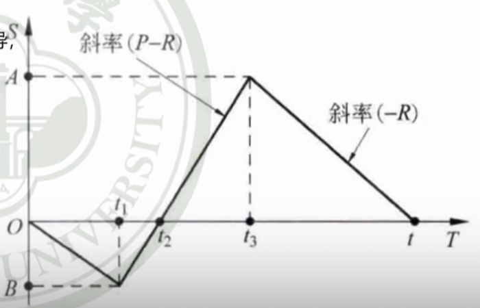

# 存储论

## 🐌要求

1. 问题提出
2. 理解缺货和补充时间在确定型存储模型中的影响
3. 对价格和订货批量相关的存储模型进行分析和求解

> 销售产品A，已知（1）单位成本；（2）单位时间存储费用；（3）单次订购费用；（4）商品的需求。在经营中需要对市场需求进行进货补充，问如何组织进货才能最经济？
- 存储模型
    - 需求：存储是为了满足需求
    - 补充：是补充库存的手段，主要考虑从开始订货到货进仓库的这段时间；
        - 提前期：从订单下达到货物入仓库之间的这段时间。（中间还要考虑货物到达到货物进入仓库的时间）；
    - 存储策略：库存低于某个阈值或者固定时间的**补充情况**和**补充数量**；
        - t-循环策略：每隔固定时间t补充一个固定存储量Q；
        - (t-s)策略：每隔固定时间t补充到固定数量s；
        - (s,S)策略：当前库存为I，如果 $I > s$,就不进行补充，如果 $I < s$，就补充，数量为 $S - s$。在这个策略下，$s$称为订货点（安全存储量）。当库存低于订货点时即将库存补充到$S$。某些情况下无法实时得知具体的库存情况，就需要每隔一个固定时间$t$补充一次，根据盘点的情况进行补货决策，称为$(t,s,S)$策略；
    - 费用：
        - 存储费用（与存储数量和时间成比例）
        - 订货费用
        - 生产费用（与生产数量成比例）
        - 缺货损失费用
- 研究工具
    - 存储状态图：时间$t$为横轴，实际库存$Q$为纵轴；描述$Q$随着时间$t$变化的过程；

## 确定性存储模型

- 价格与订货批量无关的存储模型，
    - 模型假设：
        - <u>允许缺货，补货时间长；</u>
        - 需求连续均匀，需求速度R是常数；
        - 补充需要一定时间，生产也是均匀的，生产速度比需求大；
        - 单位存储费用$C_1$，缺货费用$C_2$，订购费用$C_3$，需求速率$R$，生产速率$P$（表示为图像斜率）
    - 平均存储量：存储数量 $\times$ 存储时间（求一个定积分），同理可以推理平均缺货量
    - 将一个周期内的平均费用（=库存成本+缺货成本+订货成本）表示出来，分别求关于$(t,t_2)$的偏导数，求的最佳费用；

    - 可以得出如下结论：
        - 最优存储周期 $t = \dfrac{2c_3}{c_1 R} \times \dfrac{C_1 + C_2}{C_2} \times \dfrac{P}{P - R}$
        - 经济生产批量
        - 缺货补足时间
        - 开始生产时间
        - 结束生产时间
        - 最大存储
        - 最大缺货
        - 平均总费用

- 模型的拓展：是否允许缺货 / 补充时间短？（做法：不允许缺货，就把$C_2$设为无穷大，取无穷即可，补充时间长，就把$C_3$趋近无穷大再取极限；【共有4个模型的拓展】
  

### 模型5:

- 假设条件：在条件：（不允许缺货，补货时间极短）的基础之上，增加价格激励机制得到模型五，假设条件如下：
    - 需求连续均匀（需求速度R是常数）
    - 补充可以瞬间实现（补充时间近似为0）
    - 单位存储费用$C_1$，缺货费用无穷，订购费用$C_3$，考虑货物价值，存在价格激励机制，订货批量$Q$时候对应的货物单价为$K(Q)$，当$Q_{i-1} \leq  Q < Q_i，有K(Q) = K_i (i = 1,2,...,n)$，其中$Q_i$为价格折扣的某个分界点。
    - ⚠️⚠️ 这里就是供应链管理那本书$F$里的基本模型；

> 根据模型二，可知一个存储周期内模型的费用函数：
$$C(t) = \dfrac{1}{2} C_1 Rt + \dfrac{C_3}{t} + RK(Q)$$

    - 最后一项$K(Q)$是一个常数，随着$Q$的变化二变化，$K(Q) = K_i$，$R$ 是订货的批量
  

- 找新的最优点只需要找对勾函数的原极小值点和后续的价格激励的开始点的结果；

## 随机型存储模型

1. 确定型存储模型和随机型存储模型的区分
2. 需求是离散型随机变量的存储模型进行分析和求解（Model VI)
3. 需求是连续型随机变量的存储模型进行分析和求解（Model VII）

- 需求是离散随机变量
> 报童问题：每天售出的报纸份数是一个离散随机变量，概率$P(r)$已知，每次销售一份报纸可以赚k元，如果报纸没有全部销售，那么每剩下一部分，就赔h元。问报童每天应该准备多少报纸？

- 损失期望值最小准则确定Q*
    - 供过于求r \leq Q ，因为报纸过剩导致损失的期望 \sum \limits^{0}_{r=0} h(Q - r)P(r)
    - 供不应求r > Q, 因为失去销售机会少赚钱的损失期望  \sum \limits^{\infty}_{r = Q+1} h(r - Q)P(r)

- 借助差分法（边际分析法）进行求解： $\Delta C(Q) = C(Q+1) - C(Q) = ( k + h) \sum \limits^{Q}_{r=0} P(r) - \dfrac{k}{k+h}$
- 当 $Q \to \infty$ ， $F(Q)  = \sum^{\infty}_{0} P(r) = 1$，
- 当 $Q = 0, F(Q) = P(0)，\Delta C()$ 和 $P(0) - N$ 同号；
- 当 P(0) > N, \Delta C(0) > 0，可见 \Delta C(Q) 单调递增并且恒大于等于0，所以C(Q)单调递增。此时不订货是最优解（损失期望最小），Q^{*} = 0；
- 当 P(0) < N， \Delta C(0) < 0，由于 \Delta C(Q) 是单调递增并无穷时候恒大于0，所以\Delta C(Q) 可以先从负值增长到正值，也就是C(Q )先下降到最小值然后逐渐增大。此时F(Q^* - 1)   < N \leq F(Q^*)

- 损益转折概率：\dfrac{单位盈利}{单位盈利 + 单位损失}

- 需求是连续型随机变量的存储模型

- 货物进价k售价为p，存储费C_1（理解为“当天卖不出货的损失，亏的钱”），设货物需求r是连续型随机变量，密度函数是 \varphi (r)。问货物订购量是多少才能使得盈利期望最大；

- 订货量$Q$需求$r$，实际销售需求 $\mathop{\min} (r, Q)$，实际销售收入 $p \times \mathop{\min} (r, Q)$，进货成本$kQ$.
- 货物存储费用 

$$C_1(Q) =\left\{  \begin{aligned}  C_1 (Q-r), r \leq Q \\  0, r > Q  \end{aligned} \right.$$

此时的盈利为 $W(Q) =  p \times \mathop{\min} （r, Q) - kQ - C_1(Q)$

$$E(W(Q)) = \int^{Q}_{0} pr \varphi (r)dr + \int^{\infty}_{Q} pQ\varphi (r) dr - kQ - \int^{Q}_{0}C_1 (Q-r)\varphi (r) dr$$

$$= \int^{\infty}_{0} pr \varphi(r) dr - \int^{\infty}_{Q} pr \varphi (r)dr + \int^{\infty}_{Q} pQ \varphi(r)dr - kQ - \int^{Q}_{0}C_1(Q-r)\varphi(r) dr \\ = pE(r) - [ \int^{\infty}_{Q}p(r-Q)\varphi(r)dr + \int^{Q}_{0} C_1(Q-r) \varphi (r)dr + kQ ]$$

- 第一项为一个常数：平均盈利额度，与订货量无关；
- 括号内第一项是缺货期望损失值（也就是指考虑缺货的损失）
- 括号内第二项是滞销期望损失（也就是考虑只考虑滞销）
- 第三项是进货成本；

- 把括号内记作$C(Q)$ ，求导数可得$F(Q) = (C_1 + p) \int^{Q}_{0} \varphi(r)dr - (p-k)$ 
- 求得$F(Q) =  \int^{Q}_{0} \varphi(r) = \dfrac{p - k}{p + C_1}$ （这里是不是对应产品可获得性水平...）
- 通过$F(Q)$ 可以逆向地解出$Q^*$，（正态分布 $\dfrac{X - \mu}{\sigma } = P*$ 即可；

!!! Tip 
    如果缺货损失不只考虑销售收入的减少（还考虑赔偿买方损失等），单位缺货费用$C_2 < p$, 此时公式可以变为 $\dfrac{C_2 - k}{C_2 + C_1}$

## 其他存储模型

- 对需求为连续型随机变量的$(s,S)$存储策略进行分析和求解
- 对需求为离散型随机变量的$(s,S)$存储策略进行分析和求解

> 单位成本$k$，单位存储费用$C_1$,单位缺货$C_2$,每次订货费用$C_3$,期初库存 $I$，需求$r$为随机变量，采用$(s,S)$ 补货策略，问每次订货量Q如何确定，使得成本最小。

!! Tip
    $(s,S)$ 是一种全新策略，此时需要确定的是$s$和$S$分别的具体数值，同时考虑这两个最优决策

- 最大存储量： $\dfrac{c_2 - k}{c_1 + c_2}$
- s：订货点：不订货造成的损失的期望值应该不超过订货造成的损失的期望值；
【待补充】