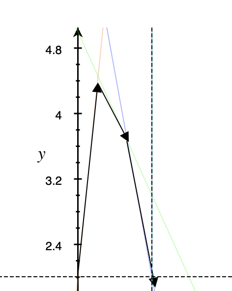

# 博弈论

- **决策者**：（所有参与者的集合）
- **策略集**：（所有可以做的决策）
- **支付函数（赢得函数）**，每个决策者所出的策略形成的策略组就是“局势”，当一种局势出现之后，必须要规定一个“结果”，这个结果可以是针对两个人的，也可能是两个人各有变化。


1. 局中人个数
2. 局中人赢得函数的代数和是否为0
3. 局中人中是否有合作
4. 局中人的策略集中的策略个数

- 占重要地位的是二人有限零和博弈


| 分类方式                              | 具体分类              |
| ------------------------------------- | --------------------- |
| 局中人个数                            | 二人对策  / 多人对策  |
| 各局中每个人的赢得函数的代数和是否为0 | 零和 / 非零和         |
| 是否允许合作                          | 合作 / 非合作博弈     |
| 策略个数                              | 有限对策 / 无限对策   |
| 是否知道对方的收益                    | 不完全信息 / 完全信息 |
| ！                                    | 动态博弈 / 静态博弈   |


### 纯策略 

$$\begin{pmatrix}
     -6 & 1 & -8 \\
     3 & 2 & 4 \\
     -3 & 0 & 6 
    \end{pmatrix}$$

- 一个优秀的博弈者会考虑所有最坏的情况（因为对手总会把自己利益降到最低）；所以为了使得利益最大，应该在所有不利的情况下选择最有利的情形作为决策依据；
    - 比如上面那个矩阵，A（按行看），选1，2，3的决策，1：-8，2:2，3:-3，一定会选2；

- Def. 1 $G = {S_1, S_2,A }$,  $\mathop{\max} \limits_{i} \mathop{\min} \limits_{j} a_{ij} = \mathop{\min} \limits_{j} \mathop{\max} \limits_{i} a_{ij}$，
- 如果满足上式，那么这个$V_G$就是对策的值，称使得上式成立的纯局势$(\alpha_i, \beta_j)$是$G$在纯策略意义下的解；这两个决策被称为局中人的最优策略；


## 完全信息静态博弈

E.G. 囚徒困境：
```
(-8,-8) | (0, -10)
(-10,0) | (-1, -1)
```
E.G. 智猪博弈：完全信息静态博弈

- 占优策略：小猪的占优策略就是等待，无论大猪采取什么举措，小猪一定会等待，因为等待的收益始终大于创新；但是大猪没有占优策略；
- 如果所有参与者都有占优策略，那么占优策略的组合就是**占优策略均衡；**

- 推广到：不断删除严格列策略,也就是对于任意其他参与者的策略组合，策略人选择某个策略s_{'}的效用严格小于选择策略s_{''}的效用.
- 大猪没有占优策略，但是大猪可以剔除严格劣策略，可以删除小猪“按”的选择，然后大猪只需要看小猪“按”的时候决策效用如何即可；
- 但是剔除严格列策略不一定总能得到最优解；
    - E.G 情侣博弈的情况：
    ```
    (2,1) | (0,0)
    (0,0) | (1,2)
    ```
    - 这里存在一个“先动优势”，如果一方先买，那么另一方就可以通过剔除严格劣策略找到自己的策略；


- 纳什均衡：它是指在一个博弈中，每个参与者采取的策略都是其最佳选择，即**在其他参与者的策略不变的情况**下，该参与者采取的策略能够使其获得最大的收益。
    - 也就是说，没有一方面能够单方改变策略而获得效用的提升；
    - 可以通过划线或者箭头法求解纳什均衡；每个人先找出自己针对其他人每种策略或者策略组合的最佳策略，最后**互为最优策略**的组合就是均衡
    - **纯策略纳什均衡**：是博弈中的一种状态，其中每个玩家都采用最优的单一策略，而没有必要使用任何随机化或混合策略。

- E.G. Cournet **寡头竞争模型**：如果博弈一方的策略集是无限多个决策，需要引入“反应函数”的概念，
- 假设市场中有n个厂商，每个厂商生产一种相同但互相竞争的产品，并且每个厂商的产量是相互独立的，即他们不知道其他厂商的产量。每个厂商的生产成本是已知的，并且市场需求曲线是已知的。在这个模型中，每个厂商的目标是最大化其利润。由于厂商之间的相互影响，每个厂商的利润取决于所有厂商的产量。因此，每个厂商必须考虑其他厂商的行为，并基于这些信息选择最优产量。

- 建立每个厂商的利润函数。每个厂商的利润函数可以表示为其产量乘以市场价格减去其生产成本，即：$\pi i(q_1, q_2, ..., q_n) = qi(P(q_1, q_2, ..., q_n)) - c_i(q_i)$,其中，$i$表示第$i$个厂商，$qi$表示其产量，$P(q_1, q_2, ..., q_n)$表示市场价格，$c_i(q_i)$表示第$i$个厂商的生产成本。

- 求出市场需求函数。市场需求函数表示市场上消费者对产品的需求量，它可以表示为所有厂商的产量之和的函数：$Q = q_1 + q_2 + ... + q_n$, 其中，Q表示市场需求量。

- 假设其他厂商的产量是固定的。在这个假设下，每个厂商都可以通过将其他厂商的产量代入市场需求函数来求出市场价格。市场价格可以表示为：$P = a - bQ$，其中，a和b是常数，可以根据市场需求函数确定。

- 求出每个厂商的最优反应函数。最优反应函数表示在其他厂商的产量固定的情况下，该厂商的产量能够使其利润最大化。**每个厂商的最优反应函数可以通过将其他厂商的产量代入其利润函数**，并对其产量求导数得到。例如，第i个厂商的最优反应函数可以表示为：$q_i* = f(q_1, q_2, ..., q_{i-1}, q_{i+1}, ..., q_n)$

- 其中，$qi*$表示第$i$个厂商的最优产量，$f$表示一个关于其他厂商产量的函数。

解Cournot均衡方程。Cournot均衡方程是指每个厂商的产量都是其**最优反应函数**的解，即：$q_i^* = f(q_1^*, q_2^*, ..., q_{i-1}^*, q_{i+1}^*, ..., q_n^*)$，对于每个$i=1,2,...,n$，都要求解出其最优产量$q_i^*$。

-----


### 混合策略
- 局中人I起码能保证赢得最小值中最大的，不会多于局中人II的所失去的，总有v_1 \leq v_2。但是实际中常常有 v_1 < v_2，此时对策不存在纯策略意义下的解；所以要考虑混合策略；

$$\begin{pmatrix}3&6   \\　5&4
\end{pmatrix}$$

- 按道理应该I选4，II选5，但是此时没有达到均衡，此时我们可以考虑一个**选择不同策略的概率分布**，将两个人的策略相乘得到一个赢得函数 E(x, y) = x^T A y  =\sum \sum a_{ij}x_i y_i 其中混合策略分别理解为局中人的纯策略的偏爱程度（概率），称这个矩阵是对策G的混合扩充。当纯策略意义下的解不存在的时候，可以认为讨论的是混合策略意义下的解；

- $S_1 = { (x_1, x_2) | x_1, x_2 \geq 0, x_1 + x_2 = 1}$
- $S_2 = { (y_1, y_2) | y_1, y_2 \geq 0, y_1 + y_2 = 1}$
- $E(x, y) = 3x_1y_1 + 6x_1y_2 + 5x_1y_2 + 4x_2y_2$，用y_1替换y_2，x_1替换x_2，可以得到一个用x_1 和y_1 表达的式，求偏导可以得出最优策略和对策的值；

### 混合策略纳什均衡
- 混合策略纳什均衡是指在博弈中，每个玩家以**一定概率随机选择多个可行策略，使得对手无法通过选择单一策略来获得更高的收益。混合策略纳什均衡是纳什均衡的一种形式**，其中玩家通过在不同的可行策略之间随机选择来达到平衡状态。混合策略纳什均衡是指在博弈中，每个玩家以一定概率随机选择多个可行策略，使得对手无法通过选择单一策略来获得更高的收益。混合策略纳什均衡是纳什均衡的一种形式，其中玩家通过在不同的可行策略之间随机选择来达到平衡状态。
    - 也就是存在某个决策集合，使对于所有人而言，这决策集合的支付函数是大于等于其他所有策略组合的；
    - 可以视为一个随机稳定状态；


```
一些区分：

纯策略纳什均衡是指在博弈中每个玩家选择一种可行策略，使得对手无法通过选择不同的策略来获
得更高的收益。换句话说，纯策略纳什均衡是一种状态，其中每个玩家都采用最优的单一策略，而
没有必要使用任何随机化或混合策略。（通过不断剔除严格劣策略）

与之相反，混合策略纳什均衡是指在博弈中，每个玩家使用一定的概率分布来随机地选择可行策
略，使得对手无法通过改变自己的策略来获得更高的收益。 换句话说，混合策略纳什均衡是一种
状态，其中每个玩家都采用一定的随机化策略，以确保对手无法获得更高的收益。
``` 
- E.G. **监督博弈**：
    - 经常应用在偷漏税检查、质量检查中：
    ```
    a: 缴纳税额
    C：检查成本
    F：罚款
             逃税                    不逃
    检查    (a - C + F, -a - F) | (a - C, -a)
    不检查  (0,0)               | (a, -a)   
    ``` 
    - 不存在纯策略纳什均衡
    - 税收部门检查的概率 $\theta$， 逃税的概率 $\gamma$，此时税收部门的期望效用$\theta((a - C +F)\gamma + (a - C)(1-\gamma)) + (1-\theta)(0 \times \gamma + a(1-\gamma))$
    - 求关于 $\theta$ 的偏导数得到最优 $\gamma^* = \dfrac{C}{a + F}$
    - 同理可得 $\theta^* = \dfrac{a}{a + F}$
    - 这表明如果罚款越小，或者罚款额越大，税收部门检查的概率就越大，
    - 此时混合策略纳什均衡： $(\dfrac{a}{a +F}, \dfrac{F}{a + F}), (\dfrac{C}{a + F}, \dfrac{a + F - c}{a + F})$, 


## 零和博弈
- 静态博弈中，所有人的支付之和是0.就是～；
- **矩阵博弈**的三个条件：
    - 两个参与者
    - I有m个纯策略；II有$n$个，形成各自的策略集；
    - 对任何一策略组合，I的赢得值是 $a_{ij}$，那么II的赢得值是 $-a_{ij}$

- **矩阵博弈的纯策略纳什均衡**：存在一个纯策略组合，使得对于一切$i = 1,..,m,j = 1,...,n$，都有 $a_{ij^*} \leq a_{i^*j^*} \leq a_{i^*j}$，就说存在博弈G的纯策略纳什均衡。（第i行的最小值和第j列的最大值）
- 鞍点的概念


- 定理1:存在矩阵博弈纯策略纳什均衡的充要条件：最大化最小与最小化最大的值是相等的；
- 定理2:是**鞍点**，$\forall x \in A, \forall y \in B$, 都存在：$f(x, y^*) \leq f(x^* ,y^*) \leq f(x^*, y)$

## 矩阵博弈的混合策略纳什均衡
- 如果按照纯策略找出的 $v_1$ 和 $v_2$ 不相等，那么需要利用混合策略找到均衡解；可以给出一个选取不同策略的概率分布（也就是混合策略）。

$S^*_1 = \left\{ x = (x_1, x_2, ... ,x_m)^T | \sum \limits^{m}_{i = 1}x_i  = 1, x_i \geq 0, 1 \leq i \leq m \right\}$

$S^*_2 = \left\{ y = (y_1, y_2, ... ,y_n)^T | \sum \limits^{n}_{j = 1}y_j  = 1, y_j \geq 0, 1 \leq j \leq n \right\}$

- 上述称为参与人I和II的混合策略集；

- 取混合策略组合$(x,y) \in S^*_1 \times S^*_2$，期望收益$E(x,y) = x^TAy = \sum \sum a_{ij}x_iy_j$，这个新的博弈就是原博弈的混合扩充；

- 如果这个混合扩充存在一个鞍点$(x^*, y^*)$，也就是$\forall x \in S^*_1, y \in S^*_2$， 都有$E(x, y^*) \leq E(x^*,y^*) \leq E(x^*, y)$，就把这个策略组合称为混合策略的纳什均衡，$x^*$和$y^*$分别是两个决策者的最优组合策略；
- 定理：混合策略纳什均衡结果具有唯一性；
- 如果矩阵博弈的混合扩充，存在一个策略组合使得 $\mathop{\max} \limits_{x \in S^*_1} \mathop{\min} \limits_{y \in S^*_2} E(x, y) =  \mathop{\min} \limits_{y \in S^*_2} \mathop{\max} \limits_{x \in S^*_1} E(x, y) = V_{G^*}$，那么$V_{G^*}$就是博弈的值，上式成立的组合就是混合策略意义下的纳什均衡；
- 定理5:任何一个矩阵博弈，一定存在混合策略意义下的纳什均衡解；
- 定理6:设$(x^*,y^*)$是矩阵对策的解，$v = V_G$，那么  ？（互补松弛性）
    - 这也说明了**可以基于线性规划的对偶理论**，利用单纯形法，求解矩阵对策的混合策略纳什均衡；
- 定理7:有两个矩阵对策$G_1 = {S_1, S_2:A_1}，G_2 = {}$，那么$V_{G_2} = V_{G_1} + L$ 
- 定理8:每个受益都是？
- 定理9:矩阵对策A为斜对称矩阵$A = - A^T$ ，那么$V_G = 0$，谁也赢不了；局中人I和II的最优策略集都是一样的；

## 求解方法

- 题目：利用LP方法求解矩阵对策 $G = \{S_1, S_2, A \}$。 A = $\left\{ \begin{matrix} 7 & 2 & 9 \\ 2 & 9 & 0 \\ 9 & 0& 11\end{matrix} \right\}$, $S_1 = {\alpha_1, \alpha_2, \alpha_3}$， $S_2 = {\beta_1, \beta_2, \beta_3}$.
    - 要把这个问题转换成求解两个互为对偶的线性规划问题：
    - $\mathop{\min} x_1 + x_2 + x_3$
    - $s.t \left\{ \begin{aligned} 7x_1 + 2x_2 + 9x_3 \geq 1 \\ 2x_1 + 9x_2 \geq 1  \\ 9x_1 + 11x_3 \geq 1 \\ x_1,x_2, x_3 \geq 0\end{aligned} \right.$

    - （它的对偶问题我不写了因为Latex真的不好写）

- **图解法**：求解 $2 \times 2$对策，$m \times 2$ 的矩阵对策：
    - 先找**鞍点**，设混合策略为$( x , 1 - x)，x \in [ 0, 1 ]$
    - 这时可以确定直线。比如 $( \begin{matrix} 2 \\ 7 \end{matrix} )$ ，就可以写成 $2x + 7(1-x)$以此类推（因为都是 $2 \times m$）
    - 如果不符合上面的约束，可以先根据矩阵对策的优超原则对A进行化简；（比如，如果某一行的元素**均大于**另一行上对应的元素（某一列的元素**均小于**另一列上的元素），所以对于I而言，前一个策略必然会优于后一个策略。此时可以把后一个策略的那一行（列）删除；直到可以化简成可以用图解法求的情况；

<figure markdown>

  <figcaption>把图像画出来之后箭头覆盖即为边界</figcaption>
</figure>

- 方程组法：把矩阵对策转化为一方程组进行求解；


$\varphi_i(v) = \sum \limits_{S \in N,  i \in S} \dfrac{(|S| − 1)!(n – |S|)!} {n!} [ v(S) – v(S – {i})]$


