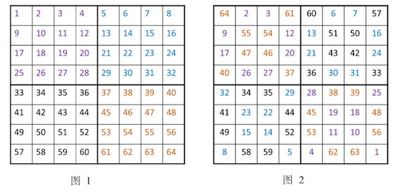

<h2>什么是幻方？</h2>
<b>幻方(Magic Square)</b>是一种将数字安排在正方形格子中，使每行、列和对角线上的数字和都相等的方法。正方形格子的边长就是阶数。

譬如下面的四个就都是三阶幻方。其对角线、每行、每列的和都是15。

<figure markdown>
  { width="300" }
  <figcaption>Magic Square</figcaption>
</figure>

那么给定阶数$n, n \geq 3$, 如何生成一个可行的幻方呢？如果给定奇数，幻方同样可以生成吗？

答案是肯定的，并且在研究过程中还有多种不同的生成算法。这个“随便写写”系列就是简单地实现了一些相关算法。

具体的思路是把情况分为：
1. 阶数是奇数
2. 阶数是$4n + 2 $型偶数 (也就是6，10，14...这类不能被4整除的)
3. 阶数是$4n $型偶数 (也就是4，8，12...这类能被4整除的)
-----

## 罗伯法（连续摆数）

把1（或最小的数）放在第一行正中，并按以下规律排列剩下的(n×n－1)个数：

- 每一个数放在前一个数的右上一格；
- 如果这个数所要放的格已经超出了顶行那么就把它放在底行，仍然要放在右一列；
- 如果这个数所要放的格已经超出了最右列，那么就把它放在最左列，仍然要放在上一行；
- 如果这个数所要放的格已经超出了顶行且超出了最右列，那么就把它放在底行且最左列；
- 如果这个数所要放的格已经有数填入，那么就把它放在前一个数的下一行同一列的格内。

<figure markdown>
  { width="300" }
  
</figure>

--- 

- 阶数是4n型偶数
  
## 海尔法

以8阶幻方为例：

1. 先把数字按顺序填。然后，按4×4把它分割成4块
2. 每个小方阵<b>对角线</b>上的数字，换成和它互补的数。

<figure markdown>
  { width="400" }
  <figcaption>Magic Square</figcaption>
</figure>
<!-- 

 -->

----

- 阶数是4n+2型偶数

## 斯特雷奇法

当n不可以被4整除时的偶数阶幻方，即4k+2阶幻方，半阶数m = n/2。

**算法：**

以10阶幻方为例。这时，k=2，m = 5。

1. 把n阶矩阵分为$A,B,C,D$四个象限（分别对应象限2,1,3,4），这样每一个象限肯定是奇数阶，阶数为m。按照奇数阶的方法用数字$[1, (n/2)^2]$ 在A象限填写数字，并用A象限初始化其他象限，其中$B = A+2m^2，C = A + 3m^2，D = A + m^2$。如图1。

2. 在A象限的中间行、中间格开始，按自左向右的方向，标出k格。A象限的其它行则标出最左边的$k$格。将这些格，和C象限相对位置上的数，互换位置。如图2。

3. 在B象限任一行的中间格，自右向左，标出$k-1$列。 将B象限标出的这些数，和D象限相对位置上的数进行交换，就形成幻方。

<figure markdown>
  { width="400" }
  <figcaption>Magic Square</figcaption>
</figure>

--- 

- 题目描述：

> 求正整数N以内的所有素数
> 给定正整数区间[a, b),给出区间内所有的素数

----

- 埃氏筛

做法其实很简单，C语言入门课程都会有讲。首先将2到n范围内的所有整数写在一张一维表里，其中2是最小的素数。将表中所有2的倍数划去，此时表中剩下的最小的数字是3，3无法被更小的数整除，所以3是素数。再将表中所有3的倍数划去......以此类推，如果表中剩余的最小数是m，则m就是素数，将表中所有m的倍数划去，这样反复操作，就能依次枚举n以内的素数，时间复杂度为$O(nloglogn)$

<figure markdown>
  { width="400" }
  <figcaption>Magic Square</figcaption>
</figure>

----
- 欧拉筛（线性筛）

由于每个大于等于2的合数必定存在一个最小的质因数，所以只要筛去每个质数的倍数就相当于筛去了所有合数。但欧拉筛相比埃氏筛最大的优化就在于欧拉筛保证每个合数只被筛了一次，且是被其最小的质因数筛去的，所以欧拉筛的时间复杂度可以达到$O(N)$。

这种算法也可以快速获取最小质因数。

----
- 素数区间筛

给定整数a和b，请问区间$[a,b)$内有多少个素数？（$a < b \leq 10^{12},b-a \leq 10^6$）

因为$b$以内合数的最小质因数一定不会超过$\sqrt{b}$.

如果有$\sqrt{b}$以内的素数表的话，就可以把埃式筛法用在$[a,b)$上了。也就是说，先分别做好$[2,\sqrt{b})$的表和$[a,b)$的表，然后从$[2,\sqrt{b})$的表中筛得素数的同时，也将其倍数从$[a,b)$的表中筛去，最后剩下的就是区间$[a,b)$内的素数了。

-----

## 手机App评论爬取

---

- 实现思路
    - 在移动端浏览请求界面，请求数据
    - 在电脑端利用抓包软件抓取移动端接收到的数据
    - 对数据进行清洗、整理、汇总

---

- 技术细节
    - 抓包软件是Charles,适用性很好(Windows /macOS/Linux都可，Android/iOS全部支持）。我是macOS系统+iOS🍎手机配置，运行时候效果👍
    - Charles正版是收💰的，有条件一定支持一波，可以找到pojie版本，我是在52pojie上找到的，上面也有<u>手把手的Charles</u>使用教程
    - 数据清洗用了Python，主要做的就是解析Json数据并进行本地存储

-----
- 具体实现

以防大家⬇️ 错，我用的Charles长这样👇

<figure markdown>
  { width="350" }
  
</figure>

<figure markdown>
  { width="350" }
</figure>

## 拉丁方

----
给定正整数$N$，把$N$组1到$N$的正整数填入一个$N \times N$的正方形格子中，使得：

1. 每一行，$1 ～ N$都出现且只出现一次
2. 每一列，$1 ～ N$都出现且只出现一次

例如下面的这个就是一个经典的三阶拉丁方.

<figure markdown>
  { width="100" }
</figure>

拉丁方可以视作数独的一种松弛形式，不同于数独的九宫格，拉丁方没有“宫”的设计，而只有“格”。也就是说，数独是一种更加严格的拉丁方。

## 拉丁方生成算法

----

$N$是偶数时:第一行：$1，2，N，3，N - 1，4，N - 2...$
随后的每一行都是在前一行的数字上加$1$，如果结果为$N + 1$，就写成$1$。一直运行到最后一行，直到形成拉丁方。

假设$N = 6$，第一行按算法排列为：

$\qquad \qquad \qquad  \qquad \qquad 1, 2, 6, 3, 5,4$,

同理执行剩下的六行，结果为：

$\qquad \qquad \qquad  \qquad \qquad 2, 3, 1, 4, 6, 5$
$\qquad \qquad \qquad  \qquad \qquad 3, 4, 2, 5, 1, 6$
$\qquad \qquad \qquad  \qquad \qquad 4, 5, 3, 6, 2, 1$
$\qquad \qquad \qquad  \qquad \qquad 5, 6, 4, 1, 3, 2$
$\qquad \qquad \qquad  \qquad \qquad 6, 1, 5, 2, 4, 3$

拉丁方就形成了。

$N$是奇数时，按照上面的格式生成一个方阵后，将每一行倒过来，就可以输出拉丁方了。

## Python 复杂计算器

----
- **要求**

输入一个字符串表示的代数式，输出计算结果

- **特性和功能**
    - 支持 $+ - \times \div$， 支持乘方运算、三角函数、自然对数、指数函数计算
    - 保证运算符优先级、括号优先级，可以处理多余括号
    - 递归法支持嵌套运算
    - 支持正负数计算

- **具体实现**

- 递归处理函数嵌套

- 栈(Stack)+优先性判断处理具体计算

- **尚未完成的部分**

☑️  几个其他常用科学计算函数，例如开方、阶乘、任意底数的对数、反三角函数等

☑️  异常情况检测（分母0、对数<0等情况的检查、提示、字符串是否合法）、可视化

