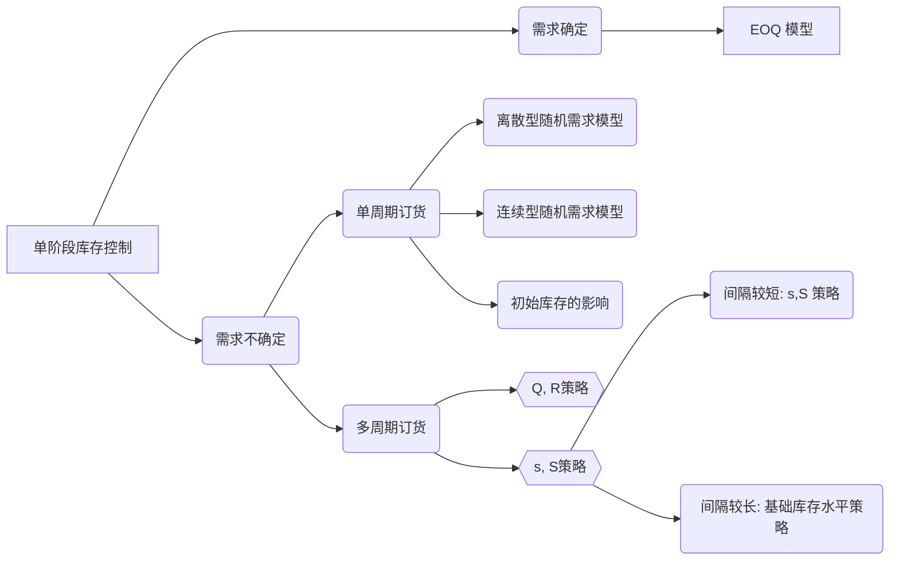

# 库存管理和风险分担-第一部分

- 在正确的时间、正确的地点拥有正确数量的产品

- 什么是客户服务水平？
    - = 得到服务的客户 / 来到的客户 

- 库存管理为什么重要？
    - 库存周转率 = 销售额 / 平均库存价值，越高越好。美国在8～10%？

- **企业为什么要持有库存**？
    - 客户需求的不确定性（竞争产品多、产品生命周期缩短，客户历史数据效用已经过时了）
    - 供应的不确定性（质量、数量、交货时间）
    - 提前期的不确定性
    - 运输公司要实现 **规模经济** 
    - 战略性库存（压货）

- 供应链的特性：客户的需求（D） ｜ 补货提前期（订单发出到收到货物的时间，L） ｜ 不同产品的数量 ｜ 计划期的长度（T）  ｜ 成本（C，订货成本K，库存成本h）。上述即为制定库存策略的外生变量
- 内生变量：什么时候订货？每次定多少货

------------------

## 单级供应链库存控制

- 考虑单级供应链的一个企业

### 经济订货批量模型（EOQ模型）
- 假设：
    - **需求速度恒定的**，每天需求D产品
    - 每个周期内仓库固定订购Q产品
    - 仓库每次订货的固定成本（准备成本）K 
    - 库存持有成本：单位时间内保管每单位库存产生的成本
    - 提前期为0 
    - 初始库存为0
    - 计划周期无限长

- 库存水平 q(t) = Q - Dt 
- 一个周期内库存总成本  $C_T = K + \dfrac{hTQ}{2}$，（可以求积分）
- 单位时间内的总平均成本 $\dfrac{C_T}{T} = \dfrac{K}{T} + \dfrac{hQ}{2}$
- $\dfrac{C_T}{T} = \dfrac{KD}{Q} + \dfrac{hQ}{2}$；（可以求一阶导数）
- 求的 $Q^* = \sqrt{2KD /h}$
- 总库存成本对订货批量不敏感：即使有一点参数估计的误差也问题不大。

- 需求不确定的影响：
    - 预测总是不准确的
    - 预测的期限越长，误差越大
    - 很难预测对某个单品库存单位（SKU）的需求，而把一个产品系列内所有SKU的总需求会容易很多；

### 随机需求单周期订货模型

- 考虑一种生命周期非常短的产品，需求不确定（报纸、杂志），这也是和EOQ模型的最大区别。
    - 只有一次订货机会
    - 在需求实现之前，公式必须决定订货量以满足需求（供不应求的损失、供过于求的损失）
    - 需求离散的，意味着所给到的信息大致为：

| 预测销售量 | 概率  |
| :--------: | :---: |
|    8000    |  10%  |
|    9000    |  15%  |
|   10000    |  24%  |
|   11000    |  26%  |
|    ...     |  ...  |

- 此时，可以通过如下公式计算，在需求量d_i的情况下，订购Q单位产品的期望收益。：

$$\sum { p_i * [ \min(Q, d_i) * P + \max(Q - d, 0) * S - QV - F  ]}$$

> $P$  为售价，$S$ 为残值，$V$ 为单位订购成本，$F$ 为固定成本

- 最优订货量 / 产量 $\neq$ 期望 / 平均需求

- 比较多卖出一件产品的边际利润和少卖出一产品的平均损失。
    - 边际利润 = 单位产品售价 - 单位可变成本
    - 边际损失 = 单位可变成本 - 单位残值
    - 如果边际利润 > 边际损失，那么最优订货量 > 平均需求
    - 否则，最优订货量 < 平均需求

- **风险和回报的权衡**：
    - 生产少一点和生产多一点，会获得相同的平均利润（9000 和 16000会获得相同的平均利润）
    - 高生产，会有可能获得更多利润。

- 这里可以把平均收益画个图，呈现拱型的。【补充图】
- 总结：
    - 最优订货量不一定等于预测需求或者平均需求
    - 固定成本对最优产量没有影响，但对是否生产有影响
    - 平均利润一般会随着订单量增加而增加，然后再减少
    - 产量增加，风险也会增加，获得较大利润的概率也会增加。

### 单周期连续随机需求模型（报童模型）

- 假设：卖出报纸的数量D是连续型随机变量。概率分布函数$F(\sigma)$。$\sigma$：实际需求量，报童每天买$Q$报纸，进价$c$，零售价$p$，折旧处理价格$s$元。
- 当实际需求 $\sigma \leq Q$ 时，报童获利：$(p - c) \sigma - (c - s)(Q - \sigma)$
- 当实际需求 $\sigma > Q$ 时，报童获利：$(p - c)Q$
- 考虑连续型需求的概率密度 $f(\sigma)$。可以把期望利润写作：

$$\prod{Q} = \int^{Q}_{\sigma = 0}[ (p - c) \sigma - (c - s)(Q - \sigma)] f(\sigma)d\sigma \\+ \int^{+\infty}_{\sigma = Q}[( p - c)Q]f(\sigma) d\sigma$$

> 将上式整理后得：

$$\prod{Q} = (p - c) \int^{Q}_{\sigma = 0} \sigma f(\sigma)d\sigma - (c - s)Q \int^{Q}_{\sigma = 0}f(\sigma) d\sigma + \\ (c - s)\int^{Q}_{\sigma = 0}\sigma f(\sigma)d\sigma + (p - c)Q\int^{+\infty}_{\sigma = Q}f(\sigma)d\sigma$$

> 变上下限积分求导（参考[变上下限积分求导](../Calculus/VariUpper.md)）

$$\dfrac{d\prod Q}{dQ} = (p - c)Qf(Q) + (c - s) \int^{Q}_{0}f(\sigma)d\sigma + Q(c - s)f(Q) + \\ (s - c)Qf(Q) + \int^{\infty}_{Q}(p - c) f(\sigma)d\sigma + (c - p)Qf(Q)$$

> 化简后结果是

$$\dfrac{d\prod Q}{dQ} = (c - s)\int^{Q}_{0}f(\sigma)d\sigma) + \int^{\infty}_{Q}(p - c) f(\sigma)d\sigma = 0$$

$$\dfrac{\int^{+\infty}_{Q}f(\sigma)d\sigma}{\int^{Q}_{0} f(\sigma)d\sigma} = \dfrac{c - s}{p - c} $$

> 左右两边同时 + 1，将分子化成1.

$$\int^{Q}_{0}f(\sigma)d\sigma = \dfrac{p - c}{p - s}$$

> 我们要求的最优 $Q^*$ 就是根据正态分布反解出来。怎么反解，查表。所以我们有

$$Q^* = F^{-1}(\dfrac{p - c}{p - s})$$

- 在查表的时候，要注意：
    1. 非标准正态分布的，需要标准化后再求；
    2. 利用  $\Phi^{-1}(Z) = 1 - \Phi^{-1}(1 - Z)$

### 考虑初始库存的影响

- 是否可以“不生产”
    - 只用手上的库存去满足需求，避免支付固定费用
    - 支付固定费用，从而拥有更多的库存来满足需求

- 滑雪服的案例：
    - 如果什么都不生产，平均利润：原来的情况下的库存的收益 + 生产情况下的成本（因为没生产，把这块加进来）
    - 如果生产，要话费机器开工成本，一下子生产到最高收益为止。可能开销反而更大。

- 那么到底什么时候安排生产呢？有无规律可循？
    - 初始库存低于一个点的时候，决定生产并提升到盈利最高点；
    - 否则不生产

- 【补充图，一个是有开工成本，一个是没有开工成本的情况】。没有开工成本的线作y轴垂线交有开工成本线于一点，该点对应的库存（x轴）就是该进行生产的点。

- 这给我们一个启示。一旦一个产品的库存总量小于这个点，那么就应该开工生产到最优的产量。由此我们引入下面的内容： 

### 多次订货

#### 定期检查策略：(s, S) 策略

1. 每过固定的时间就检查库存水平一次；
2. 每次检查以后确定合适的订购数量；
3. 当频繁地检查库存和下达订单不可行和不便利的时候，这种策略就比较适用。 

- 当库存水平低于特定值 $s$ 时，我们订货（或者生产）以增加库存水平到 $S$。这种策略我们称为最小最大策略。
- 我们称 $s$ 为订货点，$S$ 为最大库存水平。
- s和S之间的差距由订货/生产和运输的固定成本决定。（直接观察图片）

#### 持续检查策略：(Q, R) 策略

- 库存被持续地检查
- 当库存下降到订货点 $R$ 的时候就下达订单，订货量为 $Q$。
- 当库存可以持续检查的时候，这种库存策略最适用。
    - 监控的是“库存状况”（IP）
    - 譬如计算机管理库存系统

### 何时订货？

#### (Q,R) 策略下的相关计算

> **需求确定**和**提前期确定**的情况：

- 已知每天的需求恒定为$d$
- 每次订货，需要$l$天才能到货；
- 仓库每次订货都会产生一个固定成本$K$
- 库存持有成本$h$，单位时间内保管每单位库存产生的成本

> 模型实际上为：一个改进的EOQ模型。
> 订货点：$R = ld$
>
> 订货量$Q^* = \sqrt{\dfrac{2KD}{h}}$；正好到的时候仓库里容量为0

---------

> **随机需求**和**随机提前期**的情况

- 分销商面对每日需求$D_i$是独立、同分布随机变量，$(\mu_D, \sigma_D)$
- 订货提前期$L$是独立于每日需求$D_i$的随机变量，$(\mu_L, \sigma_L)$
- 分销商每次向制造商订购产品，需要支付一个固定成本$K$，加上与订购数量成比例的费用；
- 库存持有成本根据单位时间保管单位库存的费用$h$计算；
- 如果客户订单到达时，手头无库存满足客户需求，该分销商将失去这笔订单。
- 分销商规定周期服务水平 $\alpha$：(Cycle Service Level)：不出现缺货的概率；
- 安全库存：由于需求和提前期具有随机性，为了防止缺货而保留的高于期望需求的库存（Safety Stock）；

!!! note
    库存状况(Inventory Position) = 仓库中的库存 + 在途库存，也就是下了订单还在lead time中的时候，库存状况会升高。

> 我们要求的是 $R$ 和 $Q$ 的值
> 
> 提前期L天内的需求 $D_L = \sum^{L}_{i=1}D_i$。这里的L也是随机变量。本 质上是“随机多个天里随机变量的和”
>
> “复合随机变量的性质”       
>
> $E[D_L] = E[\sum^{L}_{i=1}D_i] = \mu_L\mu_D$
> 
> $V[D_L] = V[\sum^{L}_{i=1}D_i] = \mu_L\sigma^2_D + \sigma^2_L \sigma^2_D$
    > 上述的推导待补充   
>
> 所以$D_L \to N(E[D_L], V[D_L])$
>
> 订货点R应使得$P(D_L \leq R) = \alpha$
>
> 标准化$D_L$ :
>
> $P (\dfrac{D_L - E[D_L]}{\sqrt{V[D_L]}} \leq \dfrac{R - E[D_L]}{\sqrt{V[D_L]}}) = \alpha$
>
> 令 $z = \dfrac{R - E[D_L]}{\sqrt{V[D_L]}}$
>
> 则 $R = E[D_L] + z\sqrt{V[D_L]}$
>
> 其中 $z = \Phi^{-1}(\alpha)$

- 根据上述推理，订货点 $R^* = \mu_L\mu_D + z\sqrt{\mu_L\sigma^2_D +\sigma^2_L\sigma^2_D}$
    - 当 $L$ 为确定值时，$R^* = L\mu_D + z \sigma_D \sqrt{L}$
- (Q, R) 策略下，库存下降到订货点 $R$，订货量 $Q = \sqrt{\dfrac{2K\mu_D}{h}}$
- 接到订货前一时刻的库存水平 $= z\sqrt{\mu_L\sigma^2_D +  \sigma^2_L\sigma^2_D}$，最低；**这个值也就对应了安全库存**，如果提前期是确定的，那么库存水平 $= z\sqrt{L}\sigma_D$ 此时所有的库存都是为了应对不确定意外状况而多设置的。
- 接到订货后一时刻的库存水平 $= Q + z\sqrt{\mu_L\sigma^2_D +\sigma^2_L\sigma^2_D}$，最高；
- 平均库存水平：$= \dfrac{Q}{2} + z\sqrt{\mu_L\sigma^2_D  +\sigma^2_L\sigma^2_D}$

!!! info
    考虑一个从工厂订货并出售给零售商的电视机分销商。假定电视机分销商试图针对仓库的某型号电视机制定(QR)库存第略。分销商每发出一次电视机的订单，都需要支付一笔订货固定成本4,500美元,这个成本与订货批量无关。分销商购买每合电视机的 成本为250美元，平均库存年持有成本是产品成本的18%。补货提前期点为两个星期。下表提供了前12个月每个月的销售数据。假设分销商希望保证97%的服务水平，那么订货点和订货量应该为多少？ 平均库存为多少？

> 首先，根据概率论，用样本均值估计总体均值，用样本方差估计总体方差（注意不是除以N而是除以 N - 1），然后带入公式。记得把单位（年 / 星期）统一。
> $\mu_D = 44.46, \sigma_D = 32.09$，周需求的标准差 = 月需求 / $\sqrt{4.3}$
>
> 订货点 R  = 175, 订货量 = 679。平均库存 425。考虑一周的需求是44.46，保留的库存大概是10周左右的库存。

- 这个时候，库存降到175台时候就定679台，按照每周消耗44.46的速度，大约15.27周定一次货物。

-----------

#### (s,S) 策略下的相关计算

- 接下来讨论定期检查策略的情况
- 在很多实际中，库存水平的检查时周期性的，间隔是固定的。**检查的对象是“Inventory Position”，库存状况**；
- 每次检查后都可能要订购适当的数量
- 在频繁检查库存和下达订单不可行或者不便利的时候，这种订货策略就比较适用。
- 两种情况：
    - 检查间隔时间相对很短（1天）：每次检查库存，如果库存状况下降到s以下，就订购足够多的产品使库存状况达到S
    - 检查间隔时间很长（1周或者1月）：
        - 怎么定义“检查时间很长？”：如果你每次检查之后发现都需要订货，那么时间相对就是很长的了；
        - 就需要采用：基本库存水平策略。每次检查库存后，订购足够的货物使库存状况上升到基本库存水平。 
- 第一种情况下：
    -  求s和S的最优值的解析表达式很难，但是容易求一个有效的近似值：先假设为持续检查的情况，计算$Q$和$R$。令$s = R，S = Q + R$
- 第二种情况下：
    - 确定一个目标库存水平： 基本库存水平。每次检查都订购足够的货物使得库存状况上升到基本库存。

- 检查周期是 $r$ 天。这时候订购的量需要支撑：$R + L$ 天的使用不缺货。
- $r + L$ 天的平均需求 $(r + L) \times AVG$
- 安全库存 $= z \times STD \times \sqrt{r + L}$
- 基本库存水平 $=(r+L)\times AVG + z \times STD \times \sqrt{r + L}$ 
- 此时最低库存水平：$z \times STD \times \sqrt{r + L}$ 
- 最高库存水平：$r\times AVG + z \times STD \times \sqrt{r + L}$ 
- 平均库存水平也就算出来了。

> 此时同样采用前一节订购电视机的案例。如果分销商每3个星期发一次订单，其他条件不变：
>
> Base-Stock Level $= (r + L ) STD \Phi^{-1}(\alpha) + AVG (L + r) = 358$
>
> 平均库存水平： 202
>
> 现在发现只需要保留5周左右的需求。看起来比之前的效果更好了。
>
> 实际上，我们现在每次开工的频率变高了，意味着消耗的固定成本也在攀升。

## 零售商策略

- 给定所有产品的综合服务水平，决策每一个单位产品库存单位（SKU）的服务水平，使得期望利润最大化；
- 如何决定服务水平？
- 其他因素相同，具有以下特点的服务水平比较高：
    - 高边际利润
    - 需求不稳定性低
    - 高销售量
    - 较短的提前期

- Risk Pooling 方法：把多个地方的需求汇总起来，实行风险分担；
- 度量需求的变动性：
    - 标准差：需求变动的绝对值；
    - 变异系数：标准差和平均需求的比例（需求变动的相对值）

## 一个小结

------------

### ACME Risk Pooling Case

- 两个仓库，分成两个区域。
- 客户一般直接向仓库订货。每个零售商分配给一个特定的仓库；仓库向同一个制造厂要货；
- 当前维持 97% 的CSL。问是否应该合并到一个仓库。

- 建中心仓库，系统变异系数会有明显的下降（对库存水平下降有显著作用），但是提前期可能会，可以通过计算权衡。
  - 对需求不稳定性更高的产品，建立中心仓库对库存水平下降的效果最好

- 标准差：需求偏离平均需求的绝对大小
- 变异系数  （Coefficient of Variation）标准差和平均需求的比率；

> 集中化库存同时减少了系统的安全库存和平均库存
    > 在集中化配送系统中，无论何时，当一个市场区域的需求高于平均需求，而另一个市场区域的需求低于平均需求时，仓库中原来分配给一个市场的库存可以重新分配给另一个市场
> 变异系数越大，从集中化系统中获得的好处越多，即从风险分担中得到的利益越多
    > 需求的波动性越大，仓库保留的安全库存越多。而对于集中化系统来说，聚集的需求波动性较分散化系统更低。
> 从风险分担中获得的利益依赖于一个市场相对于另一个市场的需求方式
    > 两个市场需求的正相关程度越高，风险分摊获得的利益越少 

### 集中化和分散系统

- 安全库存：集中化系统更低
- 服务水平：集中化和分散化系统拥有相同安全库存，集中化系统的服务水平相对较高；
- 管理费用：更低
- 客户的提前期更短
- 运输成本：不一定；要综合考虑入库和出库成本；

## 多级供应链中的库存管理

> 库存决策由单一决策者制定，目标是：系统成本最小
> 决策者能了解到每个零售商和仓库的库存信息；
>

- 级：Echelon（批发商/零售商这种的供应链层次）
- 级库存（Echelon Inventory）= 该级的现有库存+所有下游库存
- 级库存状况（～ Position），分销商的 = 分销商的级库存 + 供应商提供给在途库存

### 分销商的订货点和订货量

- 分销商的策略是控制它的级库存状况，只要仓库的级库存状况低于R，就订购Q单位产品；
- $R = L^e \times AVG + z \times STD \times \sqrt{L^e}$;
- $Q = \dfrac{2 K \times AVG}{h}$
- $L^e$ : 级提前期，是零售商和分销商之间的提前期加上分销商和供应商之间的提前期；
- 制造商和原材料供应商的库存管理也用类似的方法，只需要适当调整提前期并使用级库存状况；

### 供应链的一级可以有多个单位

- 级库存 = 仓库拥有的库存 + 所有零售商的在途库存和持有库存
- 及库存状况 = 仓库的级库存 + 仓库的在途库存 - 缺货量
- 每一个零售商的订货点R和订货批量Q和以前一样计算；当零售商的库存状况低于订货点R，就订购Q单位产品；
- $R = L^e \times AVG + z \times STD \times \sqrt{L^e}$;
- $Q = \dfrac{2 K \times AVG }{h}$

> AVG： 所有零售商的平均需求
> STD：汇集所有零售商需求的标准差
> 
> 级库存状况 -> 第三方物流管理库存（顺丰） -> VMI -> 联合库存管理

### 需求预测

- 三原则
    - 预测总是不准确的
    - 期限越长，误差越大
    - 综合预测更加准确

- 方法
    - 专家咨询 / Delphi法 / 
    - 时间序列预测
    - 市场测试
    - 因果分析法