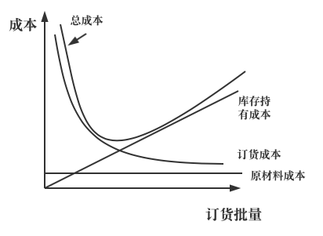

** 经济订货批量模型 **

在采购时，需要确定一份补货订单，采购批量为$Q$的物品，为了确定$Q$的具体数值，我们假设有以下的输入:

$\qquad D = $ 产品的年需求量
$\qquad S = $ 每次订货的固定成本
$\qquad C = $ 单位成本
$\qquad h = $ 年库存占有成本占产品成本的比率

假设供应商不提供折扣，无论订货规模多大，每单位物品的成本均为$C$，此时库存持有成本是$H = hc$，我们采用如下基本假设来构建模型。

- 单位时间内的需求稳定为$D$单位；
- 不允许出现短缺，也就是必须通过库存来供应所有需求
- 补货提前期是固定的(初始值为0)

为了最小化总成本，需要考虑如下三点：

1. 年原材料成本 = $CD$
2. 订货次数必须满足年需求量$D$，给定订货批量$Q$，我们有年订货次数 = $\frac{D}{Q}$
3. 由于每次订货都会有订货成本$S$，因此有，年订货成本 = $(\frac{D}{Q}) S$

给定订货批量$Q$，可以获得平均库存Q/2，因此年库存持有成本为持有Q/2单位库存一年的成本，也就是: 年库存持有成本 = 

$( \frac{Q}{2} ) H  = (\frac{Q}{2} )hC $

上面的成本总和  

TC = $CD + (\frac{D}{Q}) S + (\frac{Q}{2} )hC $

就$Q$对总成本求一阶导数并令其为0，最优订货批量被称为经济订货批量(Economic Order Quantity, EOQ)，用$Q^{*}$表示。公式为:

$Q^{*} = \sqrt{\frac{2DS}{hC} }$

对于上述公式，年库存持有成本比率$h$和需求$D$的时间应该保持一致，对于订货批量$Q^{*}$，系统中的周转库存为$Q^{*} /2$，单位产品在系统内的流动时间为$Q^{*} / (2D)$，随着最优订货批量的增长，周转库存和流动时间也会增加，最优订货频率$n^{*}$为:

$n^{*} = \frac{D}{Q^{*} } = \sqrt{\frac{DhC}{2S} }$

------

**案例分析**

A 公司对某电脑的需求为1000台，每次订购的固定成本、运输和收货成本为4000美元，每台电脑的价格是500美元。零售商库存持有成本是20%，计算商店经理每次订货应该订购多少电脑？

年需求 = 1000 $\times$ 12 = 12000； 每批次订货成本$S$  = 4000，每台电脑的单位成本$C$ = 500，h = 0.2，那么按照公式可以算出   $Q^{*} =\sqrt{ \frac{2 * 12000 * 4000}{0.2 * 500} } = 980$

此时的周转库存是980 /2 = 490

此时的年订货次数 = 12000 / 980 = 12.24

年订货成本+库存持有成本（套前面的公式） = 97980。

平均流动时间 = $Q^{*}  / (2D) = 490 / 12000 = 0.041 Year$

----

延伸

如果我们把订货批量设置在1100单位（而不是980），此时的年成本会从97980增加到98636，虽然和最优订货批量相比，这个订单批量超过了10%，但是总成本仅增加了0.67%。在现实中可以这样理解：如果CD的经济订货批量是6.5个单位，制造商很可能不愿意运送半单位的货物从而提出收取额外费用，此时我们把批量适度增加，这种改变几乎不影响库存相关成本，但是可以节省制造商提供半箱货物运输而收取的额外费用。
 

要点✅ ： 在经济订货批量附近，订货总成本和库存持有成本相对稳定，在很多时候订购一个接近经济订货批量的适当批量，比完全按照经济批量来更为划算

要点✅ ： 如果需求增加$k$倍，那么最优订货批量将增加$\sqrt{k}$倍，年订货次数也增加$\sqrt{k}$倍，周转库存的流动时间则减少为原来的$\frac{1}{ \sqrt{k} }$

要点✅：如果想要把最优订货批量减少为原来的$1/k$，那么固定订货成本必须减少为原来的$1/ k^{2}$ 

 
 
 
 
 
 
 
 

<b>供应链管理笔记</b>

 
 
 
 

<h1>经济订货批量 (EOQ)模型</h1>

<h2>模型假设 ｜结论推导 </h2><h2>案例分析 ｜拓展延伸 </h2>

 
 
 
 
 
 
 
 
 
 
 
 
 