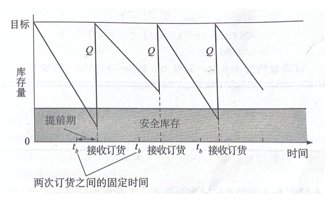
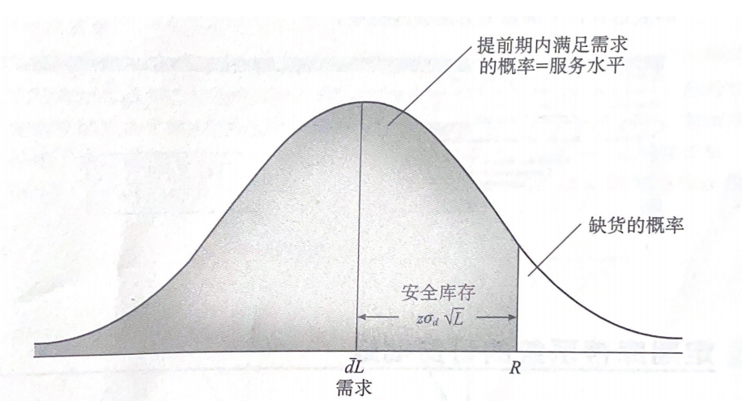

# 需求不确定情况下的订货量

需求固定、提前期固定的基本EOQ模型的订货点计算公式如下：

$R = \overline{d}(L) + z\sigma_d\sqrt{ L}$

$ \overline{d} =$ 平均需求，反映的是到下次订货之前和接收货物提前期这段时间的需求量

$ L =$ 提前期

$ \sigma_d =$ 需求标准差

$ z =$ 与服务水平概率对应的标准差数

<figure markdown>

</figure>

---

## 周期检查模型的订货点与订货量的确定

我们假设提前期内的每天的需求量是独立的、不确定的，同时可以用正态分布来描述。提前期的平均总需求等于提前期内的每日平均需求之和，也等于产品平均日需求 $\times$ 提前期的天数。类似地，分布的方差等于提前期每日的方差之和。使用这些参数，可以计算满足某一服务水平的订货点。

在这个专题的第7篇笔记中，简单介绍过连续库存系统安全库存的确定方法。这里给出周期检查库存系统中订货量的求解。

如果每日的需求量服从正态分布，那额周期性检查模型的订货量是：

$Q = \overline{d}(t_b + L) + z\sigma_d\sqrt{t_b + L} - I$

$\overline{d} =$ 平均需求，反映的是到下次订货之前和接收货物提前期这段时间的需求量

$t_b =$  订货周期

$L =$ 提前期

$\sigma_d =$ 需求标准差

$z\sigma_d \sqrt{t_b + L} =$ 安全库存，和平均需求一起反映了系统需要保持的库存水平

$I =$当前库存

<figure markdown>

</figure>