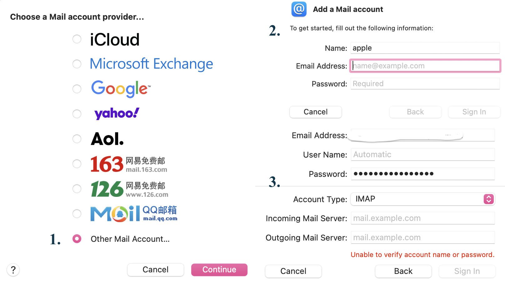
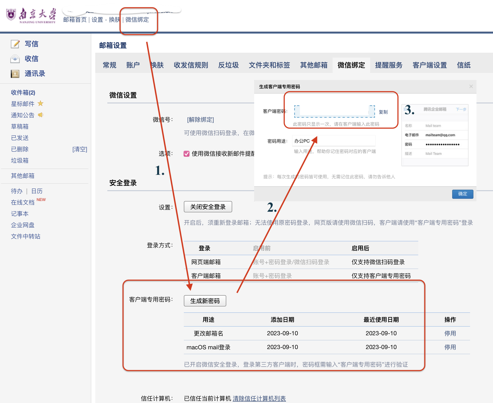

# 在macOS的Mail上使用南大邮箱

macOS  上有个很常用（当然对于一些非重度爱好者可能根本不会使用）的部分是：邮件。之前在上面集成了自己的163邮箱。这次升学之后换了新的邮箱，设置了新的邮箱别名，突然想到可以在自己的mac上也把自己的学术邮箱集成上去。说干就干。

1.  首先进入mail界面（图一1），选择邮箱要选“其他邮箱账户”，最底下那个选项；
2.  选完之后会先让你输入账号、昵称和密码（图一2），但是这里你输入了等于没用，因为不管输入啥都会继续要你输入更加详细的内容（图一3），所以我们直接就图一3需要写的内容讲起。

<figure markdown>
  { width="600" }
  <figcaption>图1</figcaption>
</figure>

- Email Address：这个简单，直接写你的学校（或者第三方）邮箱即可；
- User Name：这个是用来指定“登录在mail里这个用户”的用户名的，后续可以修改，你可以实名也可以昵称。设置后你发送邮件别人看到的发件人就是这个用户名。
- Password：重点。**这个不是你登录password学校邮箱时候的password**，具体步骤参考图二1.2.3步：你需要去网页版的南大邮箱 -> 微信绑定 -> 在安全登录板块的客户端专用密码处，“生成新密码”，复制即可，后续不会再展示，把这个复制的密码粘贴到mail的密码上，一个16位的数字-字符串。

<figure markdown>
  { width="600" }
  <figcaption>图1</figcaption>
</figure>

- Incoming Mail Server 和Outgoing mail Server：可以去“客户端设置”，能找到接受服务器和发送服务器，NJUmail box应该都是一样的，
    - Incoming：`imap.exmail.qq.com`
    - Outcoming：`smtp.exmail.qq.com`

- 输入完毕后点Sign In即可大功告成啦。

> PS 上面说的username 怎么修改：在mail软件上点击导航栏里的Accounts，点对应账号，选择details即可。