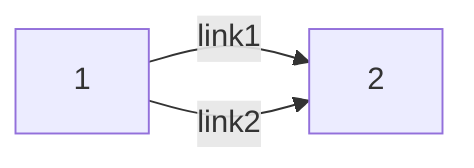
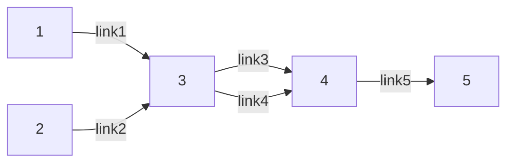

# 系统建模与优化

## 0922 

!!! abstract "课程简介" 

    交通相关：出行行为、网络均衡。

    最后几节课是研一同学的交流和讨论。并不适合不同专业方向的同学修这门课。

    > xw老师、xhl老师、wzl老师

    出勤：15%；
    讨论参与度：15%；
    选一个报告进行纪要以及自己的思考：30%；
    选一个论文进行细致阅读做一个PPT进行汇报：40%；

    -------------

    **Sheffi** MIT Urban Transportation-networks

!!! note "分类"
    - 道路交通流（微观，驾驶员行为，车辆速度、密度和流量）；
    - **网络交通流**（宏观，出行时间、出行方式和路径）🌟

!!! note "交通网络均衡分析的输入｜输出"
    输入：

    - 交通网络拓扑结构；
    - 路段出行时间（成本）函数 —— 阻抗函数（和流量差不多正相关）；
    - 交通需求分布矩阵（OD demand matrix, OD demand  function 有时候需求不是固定的，因为和==出行成本是相关的==递减函数）；
    - **出行者**路径选择决策规则（Path choice rules）

    ------------

    输出：
    
    - 路段的流量分布和出行时间

!!! note "描述"
    - Link：路段（一个有向边）
    - Node：节点N
    - Path：路径，从一个节点通向另一个节点的有向边集合；

    ---------

    1. 一个路口的不同描述：用四个节点表示一个十字路口而不是一个节点。（根据需求决定）

    ### 路段-路径关联矩阵

    > 这个路径是否包含一个link，包含就是1否则0。可以看出==哪个路径都经过了一个路段==；

    $$\begin{bmatrix} 1 & 2 & \cdots & k & \cdots & K \\ 2 & & & &  \\ 3 & & & &  \\ \cdots  & & \delta^{rs}_{a,k} &  &  \\ A & & & &  \end{bmatrix}$$

    矩阵的列数是 $r$ 到 $s$ 的路径数量；矩阵的行是图中所有的路段数；

    $\delta^{rs}_{a,k}$ : 如果连接 $r$ 到 $s$ 的路径 $k$ ，其包含第 $a$ 个路段，则为1，否则为0

    ### 路段、路径流量和时间

    路段流量：$x_a = \sum \sum f^{rs}_k \delta^{rs}_{a,k}$,   矩阵表示为 $x = \delta f$ ，意思是经过这个路段的每个路径的流量和；

    时间关系： $c^{rs}_k = \sum t_a(x_a)\delta^{rs}_{a,k}, \forall k, r,s$ ，路径 $k$ 上所有路段的时间和；

    ### 路段阻抗函数

    - $t_a(x_a)$： 路段阻抗函数：只跟路段a的流量有关（separable）
    - $t_a(\mathbb{x})$ : 路段流动时间和路段周边的路段的流量也有关（non-separable）

    - 零流时间：路段为空闲状态，车自由行驶完该段所需的时间；
    - 流量逼近通行极限，阻抗急剧上升，出行时间趋向正无穷。

    > Davidson's formula
    > 
    > $t_a(x_a) = t^0_a [1 + \alpha \dfrac{x_a}{C_a - x_a}]$
    > 
    > $C_a$ 是最大的路段流量，$x_a < C_a$

    > BPR function 
    > 
    > $t_a(x_a) = t^0_a [1 + \alpha (\dfrac{x_a}{C_a})^{\beta}]$ , $\alpha = 0.15, \beta = 4$，  $C_a$ 可以 $< x_a$，一旦超过设计流量，阻抗函数会急剧增加；

    ### 交通需求矩阵、函数

    $$\begin{bmatrix} & 1 & 2 & \cdots & s \\ 1 & q_{11} & & & \\ 2 & & & & \\ \cdots & & & & \\ r & & & & q_{rs}   \end{bmatrix}$$

    $q_{rs} = D_{rs}(c_{rs}), \forall r,s$ (OD demand function),表示从 $r$ 到 $s$ 的运输需求。 这里 $c_{rs}$ 是成本；

    $c_{rs} = D^{-1}_{rs}(q_{rs})$，反函数；

    ### 路径选择决策规则 

    - 效用最大化：最小时间、最小总成本、最小停站、....

## 用户均衡（UE）
    
- Each user wishes to minimize his or her travel time.
- 同一OD-pair之间所有被使用路径的出行时间相等，并比未使用的路径短；
- 所有出行者不可能**单方面**改变自己的路径选择来降低出行成本，因此不存在改变路径选择决策的动机。

> 囚徒困境。

$t_1 = 2 + x_1, t_2 = 1 + 2x_2, x_1 + x_2 = 5$，问 $x_1$ 和 $x_2$ 最终的流量分别是多少？

> 看：如果Link 1 绝对占优，那么所有流量都走 Link 1 的费用必然比 此时的 Link 2 还要小。比较发现，此时一定是 $x_1, x_2$ 都有且二者费用相同时候才是均衡。

---------

数学描述

$\text{if} \hspace{5pt} f^{rs}_k = 0, c^{rs}_k > c^{rs}_{\text{min}};$

$\text{if} \hspace{5pt}  f^{rs}_k > 0, c^{rs}_k = c^{rs}_{\text{min}};$ 可以转化成非线性互补问题(`Nonlinear Complementarity Problem`)：

$$\begin{align}\begin{equation*}
\begin{cases}
f^{rs}_k (c^{rs}_k - c^{rs}_{\text{min}})  & =   0 \\
f^{rs}_k  & \geq   0 \\ 
c^{rs}_k - c^{rs}_{\text{min}} &  \geq   0 \\
\sum_kf^{rs}_k &  =  q_{rs}, \hspace{5pt} \forall r, s 
\end{cases}
\end{equation*}\end{align}$$

### 等价的数学规划模型（UE-MP）

> BMW formulation ; 最优解满足的条件就是我们上面的线性互补条件(KKT condition)，这里的目标函数的形式实际上是人为构造出来满足条件的表达式；

$$\min z(x) = \sum \int^{x_a}_0 t_a(\omega)d\omega \\
s.t. 
\begin{align}\begin{equation*}
\begin{cases}
\sum_kf^{rs}_k & = q_{rs} \hspace{5pt} \forall r, s  \\ 
f^{rs}_k & \geq 0 , \hspace{5pt} \forall k\\
x_a & = \sum_{rs} \sum_{k} f^{rs}_k \delta^{rs}_{a,k}, \forall a
\end{cases}
\end{equation*}\end{align}$$

!!! note "解释"
    这个问题的决策变量是$f^{rs}_k$，也就是路段的流量。第一个约束对应总量约束（需求 = 流量）；第二个约束对应流量非负约束；第三个约束对应每个路段的流量约束；

写出上述问题的KKT条件：

1. $\sum_{a} t_a(x_a) \dfrac{\partial x_a}{\partial f^{rs}_k} - \lambda_{rs} - \mu_{k}^{rs} = 0$
2. $\sum_kf^{rs}_k = q_{rs}, \hspace{5pt} \forall r, s$
3. $f^{rs}_k \geq 0 \hspace{5pt} \forall k, r,s$
4. $\mu^{rs}_k \geq 0\hspace{5pt} \forall k, r,s$
5. $f^{rs}_k \mu^{rs}_k = 0, \hspace{5pt} \forall k, r,s$

> 细节：（2）的第2个约束并不是 $\leq$ ，而是 $\geq$，在处理的时候要先变号，然后再使用 `KKT condition`。由于等式约束没有符号限制，所以对应的拉格朗日乘子可以变号不影响计算，这里为了方便也取负。
> 
> 见：本文结尾部分，KKT条件的推导。思路提纲：等式约束 + 不等式约束 -> 拉格朗日函数 -> 拉格朗日函数的一阶导数与乘子满足的性质。五个条件。

由（2）的第三个约束可见，$\dfrac{\partial x_a}{\partial f^{rs}_k} = \delta^{rs}_{a,k}, \forall r,s,k$，也就意味着 $\sum_{a} t_a(x_a) \dfrac{\partial x_a}{\partial f^{rs}_k} = \sum t_a(x_a) \delta^{rs}_{a,k} = c^{rs}_k$，我们可以把$r$到$s$第$k$条路的时间这个变量这个用上了。

所以可以把上述KKT条件整理成: $c^{rs}_k - \lambda_{rs} = \mu^{rs}_k; \mu^{rs}_k f^{rs}_k = 0$，所以可知：

1. if $\mu^{rs}_k = 0, c^{rs}_k = \lambda^{rs}$，此时$f^{rs}_k \geq 0$
2. if $\mu^{rs}_k \geq 0, c^{rs}_k \geq \lambda^{rs}$，此时$f^{rs}_k = 0$

> 其实是一个互补松弛的表示；

说明无论何种情况，$\lambda^{rs} = c^{rs}_{\text{min}}$.

> The optimal solution of the optimization problem (MP) = UE condition

### 解的存在性和唯一性

UE-MP模型是一个严格凸规划当且仅当路段出行时间函数是严格单调增函数，此时解存在且唯一。(对于路段来说是唯一的，但是对于路径而言不一定是唯一的)

此时我们已知阻抗函数 $t_1 = 1, t_2 = 2, t_3 = 2x_3, t_4 = 2 + 2x_4, t_5 = 1$，也知道$q_{15} = 2, q_{25} = 3$, 求UE状态。我们暂定 1 -> 3 -> 5 是 $f^{15}_1$， 同样 1 -> 4 -> 5 是 $f^{15}_2$，以此类推：2 -> 3 -> 5 是 $f^{25}_1$， 同样 2 -> 4 -> 5 是 $f^{25}_2$

很明显不存在一种情况是大家都只走 link3 or link4。 我们可以列出计算公式：

$2 + 2(f^{15}_{1} + f^{25}_1 ) = 2 (f^{15}_2 + f^{25}_2)$ 并代入需求总量2和3. 计算得出: $f^{15}_1 + f^{25}_1 = 3$。此时这两条路只要保证走3的流量和是3即可。比如：

| $f^{15}_1$ | $f^{15}_2$ | $f^{25}_1$ | $f^{25}_2$ |
| :--------: | :--------: | :--------: | :--------: |
|     2      |     0      |     1      |     2      |
|     0      |     2      |     3      |     0      |

这两种情况下平衡路径流量分配是不同的，但是这两种情况对应的路段流量分配是相同的。都是如下表所示：

| Link1 | Link2 | Link3 | Link4 | Link5 |
| :---: | :---: | :---: | :---: | :---: |
|   2   |   3   |   3   |   2   |   5   |

**所以问题虽然只有一个平衡路段流量分布结果，却有无限个平衡路径流量分布结果。**

## 1008 

UE不一定是所有出行者出行时间最小的解；因此提出系统最优的概念。SO-MP

$$\min \sum_{a} x_a t_a(x_a)
s.t. \\
\begin{align}\begin{equation*}
\begin{cases}
\sum_k f^{rs}_k \ q_{rs} \\ 
\end{cases}
\end{equation*}\end{align}$$

SO flow is not stable: 除非SO和UE是等价的。

如果用户感知的时间用 t flow _a(x_a)  来表示的话，那么求解UE的情况就是SO的。

> If each user perceived link travel time as marginal link travel time and chooses the route accordingly, the resulting UE would be SO
>
> Implication: if the user pay the ==full cost== that his or her travel incurs to the system, the system will be optimum

$\tilde{t_a}(x_a) = t_a(x_a) + x_a \dfrac{\partial t_a(x_a)}{\partial x_a} = \dfrac{}{}$

负外部性：多出来的部分是自己走这个路段给其他用户带来的影响。（可以通过收费来给出）

### 弹性需求下的UE-MP模型

`marginal path travel time`

### 变分不等式的模型

General(non-separable) link performance $t_a(x\mathbb{x})$, $\mathbb{x}$ is a vector of flows. 

这里如果不同变量之间积分有顺序区别，先积一个后另一个，此时对目标函数里的积分就有更高的要求了。所以不能用这种模型继续表达。

为什么可以处理 non-separable 的情况：没有积分了，转化为不等式的形式了：

$t(x^*)^T(x - x^*) \geq 0, \forall x \in \Omega$ . 

### Braess Paradox

自私的出行选择。（补充）

### 弹性可变需求

如果考虑整体的情况，还用原来的目标函数，就会出现：“没有人出行”的情况。此时系统最优的目标要调整为“最大化社会福利”（net economic benefit）

消费者剩余：实际上只花费了更少的时间，实际上用户愿意花更多的时间（consumer surplus）

total user benefits: 所有的用户收益；下面的四边形给出的是出行时间成本。

!!! note "KKT条件Cheatsheet"

    考虑如下的优化问题：

    $$\min f(x) \\
    s.t. \begin{aligned}\begin{equation*}
    \begin{cases}
    h_i(x) = 0, \hspace{5pt} \forall i = 1, 2, ... m \\ 
    g_j(x) \leq 0, \hspace{5pt} \forall j = 1, 2, ... n \\     
    \end{cases}
    \end{equation*}\end{aligned}$$

    分别添加拉格朗日乘子并转化成无约束优化问题，推导后得出该约束条件最优解必然满足的五个条件，称为“KKT条件”（KKT condition）

    1. $\nabla f(x^*) + \sum_{i = 1}^m \lambda_i \nabla h_i(x^*) + \sum \mu_j \nabla g_j(x^*) = 0$; 一阶偏导数等于 $0$
    2. $h_i(x^*) = 0, \hspace{5pt} \forall i = 1, 2, ... m$，原等式约束；
    3. $g_j(x^*) \leq 0, \hspace{5pt} \forall j = 1, 2, ... n$，原不等式约束；
    4. $\mu_j \geq 0, \hspace{5pt} \forall j = 1, 2, ... n$，这是原不等式约束的拉格朗日乘子非负约束，注意等式约束不需要对拉格朗日乘子再约束了；
    5. $\mu_j  g_j(x^*) = 0, \hspace{5pt} \forall j = 1, 2, ... n$， 这是不等式约束的互补松弛条件（Complementary Slackness Condition）

!!! note "变分不等式"

    可微凸优化：最优性条件：从这点出发的所有可行方向都不是下降方向。

    下降方向集：和一阶导数内积 < 0

    可行方向：略过。

    $x^* \in \Omega, (x - x^*)^T\Delta \theta(x^*) \geq 0, \forall x \in \Omega$

## 1013 

!!! note "复习"
    UE的概念、系统最优的概念（fixed demand），出行时间是最小的；

    SO：考虑社会福利的最大化（elastic demand）

    Frank Wolfe 求解BMW模型的方法

### 离散选择模型

### 随机用户均衡

UE中存在理想化假设：出行者对网络中最短出行时间有认知。

### 道路拥挤收费

random regress model.

---------------

# 1020 基于交通波传播规律的道路拥挤收费建模和分析

!!! note "概念复习"
    
    线性规划、整数规划（non-linear / Linear）/ 非线性规划 （Constr or target is nonlinear）

    1. 时空演化；
    2. 位置和时间探测；
    3. 车辆排队形成的时空拥堵区域；（queue profile estimation）

    
shockwave: uninterrupted, directional. 非中断、有向的；

> 量化事故造成的delay
>
> 估算时空区域和最大拥堵时间；
>
> 预测事故的空间演变；

在事故影响下：

路段切分成10 sections. 采集到车辆的数据信息：speed map: 速度热力图表示拥堵的情况。纵是时间，横轴是路段。

怎么用规则进行刻画？

1. 不能有中空的形状；
2. 传播一定是逆着传播方向从下向上传播；
3. 一起事故而言，拥堵是连续的不能分成两块；

局限：有的研究违背了上面的3个rule；有的是直接用三角形直接表示拥堵的情况；

$l_j$: sections
$t_m$: 时间间隔
$s_{j,m}$: 在m时间段内j路段的速度；
mean and std deviation of $s_{j,m}$ $\bar{s_{j,m}}$, 

如果速度比正常情况下的小（一阶矩），就表示为拥堵。但是和真实速度数据不符。

$P_{j,m}$, 零一决策变量；

决策变量 ：$\delta_{j, m}$ ：格子真的（indeed）收到了影响，为1，否则为0；

我们希望从input的数据，经过我们的模型，得到拥堵的理想的图。

目标函数：$\sum \sum P_{j,m} (1 - \delta_{j,m}) + (1 - P_{j,m})\delta_{j,m}$ 

意思是，如果 $P_{j,m}$ 是1的话，我们希望 $\delta_{j,m} = 1$，如果 $P_{j,m}$ 是0的话，我们希望 $\delta_{j,m}$ 也是0.

约束条件：

1. 拥堵有一个源头：如果 $\delta_{j,m}$ 为1，那么 $\delta_{j + 1, m} ， \delta_{j, m - 1}$ 至少有一个为1.
2. 前后都堵，那么此刻必堵车：$\delta_{j + 1, m} ， \delta_{j, m - 1} - 1 \leq \delta_{j,m}$

拥堵的量化：【略】

结论：【略】

后续拓展的工作：primary and secondary accident的识别：事故B是从A发生导致的。

后续拓展的工作：严重拥堵、拥堵、缓行还是畅通：分得更加细致；

后续可以进行的：多个波之间的影响、做成连续情况的（时空聚类）、离散模型的线性化的过程（if then）

现实问题：怎么去刻画它、怎么去求解它；

----------

## 1027 物流选址 + 鲁棒优化

