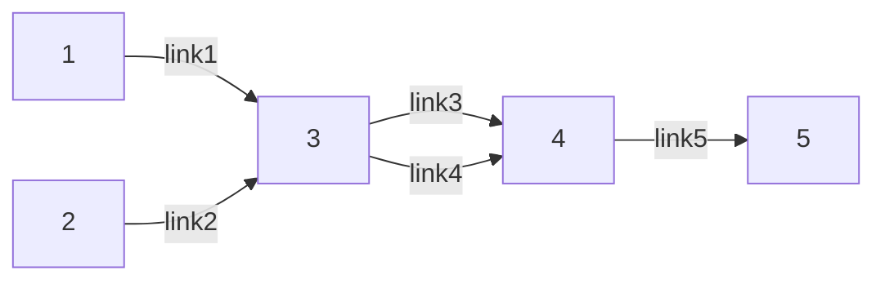

# 系统建模与优化

!!! note "感谢GPT-4o以及Claude 3.5 对本笔记在公式生成以及文本编排上作出的优化。"

## 0922 第一次课｜UE 

!!! abstract "课程简介" 

    交通相关：出行行为、网络均衡。

    最后几节课是研一同学的交流和讨论。**不适合**不同专业方向的同学修这门课。

    > xw老师、xhl老师、wzl老师

    出勤：15%；
    讨论参与度：15%；
    选一个报告进行纪要以及自己的思考：30%；
    选一个论文进行细致阅读做一个PPT进行汇报：40%；

    -------------

    推荐书目：**Sheffi** MIT Urban Transportation-networks


!!! note "分类"
    - 道路交通流（微观，驾驶员行为，车辆速度、密度和流量）；
    - **网络交通流**（宏观，出行时间、出行方式和路径）🌟


!!! note "交通网络均衡分析的输入｜输出"
    输入：

    - 交通网络拓扑结构；
    - 路段出行时间（成本）函数 —— 阻抗函数（和流量差不多正相关）；含义是走某个路段对出行者的成本。
    - 交通需求分布矩阵（OD demand matrix, OD demand  function 有时候需求不是固定的，因为和==出行成本是相关的==递减函数）；
    - **出行者**路径选择决策规则（Path choice rules）

    ------------

    输出：
    
    - 路段的流量分布和出行时间

!!! note "描述"
    - Link：路段（一个有向边）
    - Node：节点 $N$
    - Path：路径，从一个节点通向另一个节点的有向边集合；


    ---------

    1. 一个路口的不同描述：用四个节点表示一个十字路口而不是一个节点。（根据需求决定）

    ### 路段-路径关联矩阵 (Link-Path incidence matrices)

    > 这个路径是否包含一个link，包含就是1否则0。可以看出==哪个路径都经过了一个路段==；

    $$\begin{bmatrix} 1 & 2 & \cdots & k & \cdots & K \\ 2 & & & &  \\ 3 & & & &  \\ \cdots  & & \delta^{rs}_{a,k} &  &  \\ A & & & &  \end{bmatrix}$$

    **矩阵的列数是 $r$ 到 $s$ 的路径数量；矩阵的行是图中所有的路段数；**

    $\delta^{rs}_{a,k}$ : 如果连接 $r$ 到 $s$ 的路径 $k$ ，其包含第 $a$ 个路段，则为1，否则为0

    >  if path $k$ connecting $r$ to $s$ contains link $a$


    ### 路段、路径流量和时间

    我们记**路径流量** $f^{rs}_k$，含义是连接从 $r$ 到 $s$ 的路径 $k$ 的流量。可以得到：
    
    **路段流量** ：$x_a = \sum \limits_{rs} \sum \limits_k f^{rs}_k \delta^{rs}_{a,k}$,   矩阵表示为 $x = \delta f$ ，意思是经过这个路段的每个路径的流量和；


    **路径走行时间**： $c^{rs}_k = \sum \limits_a t_a(x_a)\delta^{rs}_{a,k}, \forall k, r,s$ ，也就是路径 $k$ 上所有路段的时间和；具体而言各标记的含义如下：

    ### 路段阻抗函数

    - $t_a(x_a)$： **路段阻抗函数**：只跟路段a的流量有关（separable）
    - $t_a(\mathbb{x})$ : 路段流动时间和路段周边的路段的流量也有关（non-separable）

    - 零流时间：路段为空闲状态，车自由行驶完该段所需的时间；
    - 流量逼近通行极限，阻抗急剧上升，出行时间趋向正无穷。

    下面给出几个经典的阻抗函数：

    > Davidson's formula
    > 
    > $t_a(x_a) = t^0_a [1 + \alpha \dfrac{x_a}{C_a - x_a}]$
    > 
    > $C_a$ 是最大的路段流量，$x_a < C_a$

    > BPR function 
    > 
    > $t_a(x_a) = t^0_a [1 + \alpha (\dfrac{x_a}{C_a})^{\beta}]$ , $\alpha = 0.15, \beta = 4$，  $C_a$ 可以 $< x_a$，一旦超过设计流量，阻抗函数会急剧增加；


    ### 交通需求矩阵、函数

    $$\begin{bmatrix} & 1 & 2 & \cdots & s \\ 1 & q_{11} & & & \\ 2 & & & & \\ \cdots & & & & \\ r & & & & q_{rs}   \end{bmatrix}$$


    $q_{rs} = D_{rs}(c_{rs}), \forall r,s$ (OD demand function),表示从 $r$ 到 $s$ 的运输需求。 这里 $c_{rs}$ 是成本；

    $c_{rs} = D^{-1}_{rs}(q_{rs})$，反函数；


    ### 路径选择决策规则 

    - 效用最大化：最小时间、最小总成本、最小停站、....

## 用户均衡（UE）

用户均衡的前提是，每个出行者都希望最小化他的出行时间。

我们把如下的交通条件定义为 **“达到用户均衡”**：

1. 同一OD-pair之间所有被使用路径的出行时间相等，并比未使用的路径短； 

>  Travel times on all used paths of each O-D pair are equal (and lower than the travel time on any unused path)

2. 所有出行者不可能**单方面**改变自己的路径选择来降低出行成本，因此不存在改变路径选择决策的动机。

>  No user can unilaterally change his/her path choice to reduce his/her travel cost, therefore no user has an incentive to change his/her path choice. (which is classical **Nash Equilibrium**)

这是1952年由Wardrop首次提出的，所以也叫：`Wardrop User Equilibrium (WUE)` 。

!!! example "例子"

    ```mermaid
    flowchart LR
    1 --link1 --> 2
    1 --link2 --> 2

    ```

    $t_1 = 2 + x_1$, 
    
    $t_2 = 1 + 2x_2$, 
    
    $x_1 + x_2 = 5$，问 $x_1$ 和 $x_2$ 最终的流量分别是多少？

    > 看：如果Link 1 绝对占优，那么所有流量都走 Link 1 的费用必然比 此时的 Link 2 还要小。比较发现，此时一定是 $x_1, x_2$ 都有且二者费用相同时候才是均衡。
    > 
    > 具体计算就直接解方程组即可。

---------


### 用户均衡的数学表达

$\text{if} \hspace{5pt} f^{rs}_k = 0, c^{rs}_k > c^{rs}_{\text{min}};$

$\text{if} \hspace{5pt}  f^{rs}_k > 0, c^{rs}_k = c^{rs}_{\text{min}};$ 可以转化成非线性互补问题(`Nonlinear Complementarity Problem`)：


$$\begin{aligned}
\begin{cases}
\begin{align}
f^{rs}_k (c^{rs}_k - c^{rs}_{\text{min}})   =   0 \quad \\
f^{rs}_k   \geq   0  \quad\\ 
c^{rs}_k - c^{rs}_{\text{min}}   \geq   0 \quad \\
\sum_kf^{rs}_k   =  q_{rs}, \hspace{5pt} \forall r, s  \quad
\end{align}
\end{cases}
\end{aligned}$$


### 等价的数学规划模型（UE-MP）

> BMW formulation ; 最优解满足的条件就是我们上面的线性互补条件(KKT condition)，这里的目标函数的形式实际上是人为构造出来满足条件的表达式；

$$\min z(x) = \sum \int^{x_a}_0 t_a(\omega)d\omega$$

$$\begin{aligned}
\begin{cases}
\begin{align}
\sum_kf^{rs}_k & = q_{rs} \hspace{5pt} \forall r, s \quad  \\ 
f^{rs}_k & \geq 0 , \hspace{5pt} \forall k \quad\\
x_a & = \sum_{rs} \sum_{k} f^{rs}_k \delta^{rs}_{a,k}, \forall a \quad
\end{align}
\end{cases}
\end{aligned}$$


!!! note "解释"
    这个问题的决策变量是$f^{rs}_k$ ， 路径流量。（5）约束对应总量约束（需求 = 流量）；（6）约束对应流量非负约束；（7）约束对应每个路段的流量约束；


写出上述问题的KKT条件：

1. $\sum_{a} t_a(x_a) \dfrac{\partial x_a}{\partial f^{rs}_k} - \lambda_{rs} - \mu_{k}^{rs} = 0$
2. $\sum_kf^{rs}_k = q_{rs}, \hspace{5pt} \forall r, s$
3. $f^{rs}_k \geq 0 \hspace{5pt} \forall k, r,s$
4. $\mu^{rs}_k \geq 0\hspace{5pt} \forall k, r,s$
5. $f^{rs}_k \mu^{rs}_k = 0, \hspace{5pt} \forall k, r,s$

其中，3-5都是互补松弛约束，针对2引入的乘子是 $\lambda_{rs}$，针对3引入的乘子是 $\mu^{rs}_k$.

> 细节：（2）的第2个约束并不是 $\leq$ ，而是 $\geq$，在处理的时候要先变号，然后再使用 `KKT condition`。由于等式约束没有符号限制，所以对应的拉格朗日乘子可以变号不影响计算，这里为了方便也取负。
> 
> 见：本文结尾部分，KKT条件的推导。思路提纲：等式约束 + 不等式约束 -> 拉格朗日函数 -> 拉格朗日函数的一阶导数与乘子满足的性质。五个条件。

由（2）的第三个约束可见，$\dfrac{\partial x_a}{\partial f^{rs}_k} = \delta^{rs}_{a,k}, \forall r,s,k$，也就意味着 $\sum_{a} t_a(x_a) \dfrac{\partial x_a}{\partial f^{rs}_k} = \sum t_a(x_a) \delta^{rs}_{a,k} = c^{rs}_k$，我们可以把$c^{rs}_k$，这个表示 $r$ 到 $s$ 的路径 $k$ 的时间； 这个变量用上了。

所以可以把上述KKT条件整理成: $c^{rs}_k - \lambda_{rs} = \mu^{rs}_k; \mu^{rs}_k f^{rs}_k = 0$，所以可知：

1. if $\mu^{rs}_k = 0, c^{rs}_k = \lambda^{rs}$，此时 $f^{rs}_k \geq 0$
2. if $\mu^{rs}_k \geq 0, c^{rs}_k \geq \lambda^{rs}$，此时 $f^{rs}_k = 0$

> 其实是一个互补松弛的表示；

说明无论何种情况，$\lambda^{rs} = c^{rs}_{\text{min}}$.

> The optimal solution of the optimization problem (MP) = UE condition


### 解的存在性和唯一性

UE-MP模型是一个严格凸规划当且仅当路段出行时间函数是严格单调增函数，此时解存在且唯一。(对于路段来说是唯一的，但是对于路径而言不一定是唯一的)




此时我们已知阻抗函数 $t_1 = 1, t_2 = 2, t_3 = 2x_3, t_4 = 2 + 2x_4, t_5 = 1$，也知道$q_{15} = 2, q_{25} = 3$, 求UE状态。我们暂定 1 -> 3 -> 5 是 $f^{15}_1$， 同样 1 -> 4 -> 5 是 $f^{15}_2$，以此类推：2 -> 3 -> 5 是 $f^{25}_1$， 同样 2 -> 4 -> 5 是 $f^{25}_2$

很明显不存在一种情况是大家都只走 link3 or link4。 我们可以列出计算公式：

$2 + 2(f^{15}_{1} + f^{25}_1 ) = 2 (f^{15}_2 + f^{25}_2)$ 并代入需求总量2和3. 计算得出: $f^{15}_1 + f^{25}_1 = 3$。此时这两条路只要保证走3的流量和是3即可。比如：


| $f^{15}_1$ | $f^{15}_2$ | $f^{25}_1$ | $f^{25}_2$ |
| :--------: | :--------: | :--------: | :--------: |
|     2      |     0      |     1      |     2      |
|     0      |     2      |     3      |     0      |

这两种情况下平衡路径流量分配是不同的，但是这两种情况对应的路段流量分配是相同的。都是如下表所示：

| Link1 | Link2 | Link3 | Link4 | Link5 |
| :---: | :---: | :---: | :---: | :---: |
|   2   |   3   |   3   |   2   |   5   |


**所以问题虽然只有一个平衡路段流量分布结果，却有无限个平衡路径流量分布结果。**

-----

## 1008 SO-MP 与弹性需求

在使用UE刻画真实世界的交通情况时，会发现：

1. 在UE下，总的系统出行时间可能不是最小的；

> Under UE, total system travel time (or average user travel time) may not be minimum

因此，提出系统最优的概念，是一种交通流模式，使得系统总出行时间最短。不过，这需要每个出行者采取行动来最小化总的出行时间，而不只是自己的出行时间。

> System Optimum (SO) is the flow pattern that minimizes total system travel time. SO would exist if all drivers acted to minimize total system travel time rather than their own


UE不一定是所有出行者出行时间最小的解；因此提出系统最优的概念。下面给出 SO-MP 的数学规划模型。

### SO-MP 数学表达

$$\min z(x) = \sum \limits_a x_a t_a (x_a)$$

$$\begin{aligned}
\begin{cases}
\begin{align}
\sum \limits_k f^{rs}_k = q_{rs}, \forall r, s \quad \\
f^{rs}_k \geq 0, \forall r, s, k \quad \\
x_a = \sum \limits_{rs} \sum \limits_{k} f^{rs}_{a,k}, \quad  \forall a \quad \\
\end{align}
\end{cases}
\end{aligned}$$

现在，我们同样写出上面数学规划的KKT条件：

$$\begin{aligned}
\begin{cases}
\begin{align}
\sum_a \frac{\partial \left( x_a \cdot t_a(x_a) \right)}{\partial f_k^{rs}} - \lambda^{rs} - \mu_k^{rs} = 0, \ \forall k, r, s \quad \\
\sum_k f_k^{rs} = q_{rs}, \ \forall r, s \quad \\
f_k^{rs} \geq 0, \ \forall k, r, s \quad \\
\mu_k^{rs} \geq 0, \ \forall k, r, s \quad \\
\mu_k^{rs} f_k^{rs} = 0, \ \forall k, r, s \quad \\
\end{align}
\end{cases}
\end{aligned}$$

注意到，

$$\frac{\partial x_a}{\partial f_k^{rs}} = \delta_{a,k}^{rs}$$

因此：

$$\frac{\partial \left( x_a \cdot t_a(x_a) \right)}{\partial f_k^{rs}} = \left( \frac{\partial \left( x_a \cdot t_a(x_a) \right)}{\partial x_a} \right) \frac{\partial x_a}{\partial f_k^{rs}} = \delta_{a,k}^{rs} (t) \left( t_a + x_a \left( \frac{\partial t_a}{\partial x_a}  \right) \right)$$

所以我们给出：

$$\tilde{t}_a(x_a) = t_a(x_a) + x_a \frac{\partial t_a(x_a)}{\partial x_a} = \frac{\partial x_a t_a(x_a)}{\partial x_a}$$

> Marginal link travel time = average link travel time + flow $\times$ additional travel time incurred by one more user
>
> Additional time to system from one more user = travel time of the user + flow $\times$ additional travel time to each other driver incurred by the new driver

如果我们定义：$\sum_a \delta_{a,k}^{rs} \tilde{t}_a = \tilde{c}_k^{rs}$

那么KKT条件可以紧凑地写成：

$$\begin{aligned}
\begin{cases}
\begin{align}
f_k^{rs} \cdot (\tilde{c}_k^{rs} - \lambda^{rs}) = 0 \quad \\
\tilde{c}_k^{rs} - \lambda^{rs} \geq 0 \quad \\
\sum_k f_k^{rs} = q_{rs}, \ \forall r, s \quad \\
f_k^{rs} \geq 0, \ \forall k, r, s \quad 
\end{align}
\end{cases}
\end{aligned}$$

所以我们有：

if : $f_k^{rs} = 0 \implies \tilde{c}_k^{rs} > \lambda^{rs}$

if : $f_k^{rs} > 0 \implies \tilde{c}_k^{rs} = \lambda^{rs}$

拉格朗日乘子 $\lambda$ 就是从 $r$ 到 $s$ 的最小边际出行时间。

### UE和SO的关系

如果用户感知的路段走行时间就是边际出行时间，那么求解UE的情况就是SO的。

> If each user perceived link travel time as marginal link travel time and chooses the route accordingly, the resulting UE would be SO

$$\min \sum_a \int_0^{x_a} \tilde{t}_a(\varpi) d\varpi = \sum_a \int_0^{x_a} \frac{\partial x_a t_a}{\partial x_a} d\varpi = \sum_a x_a t_a$$


> Implication: if the user pay the ==full cost== that his or her travel incurs to the system, the system will be optimum


### 用户均衡的变分不等式形式

> 此处略。想要了解变分不等式，可以参考我导的导师，数学家何炳生老师的[变分不等式Keynotes](http://maths.nju.edu.cn/~hebma/thinking/TwoD_CPPA.pdf). 


### Braess' Paradox

【补充图】

一个相当**反直觉**的现象。==多修了路，却导致拥挤状况恶化了，系统的总出行时间反而变长了，== 而不是直觉下，“多修路，则出行时间更短”。

这种现象是根植于用户均衡中的。因为每个人都想最小化自己的出行时间，从而作出自己的路径选择，不会考虑自己的行为对网络中其他用户的影响。

所以，我们无法期望总出行时间会减少。


### 弹性需求下的UE-MP模型

标准UE模型假定每个OD对之间的需求都是固定的，但是，我们也可修改为“需求受网络的服务水平影响”。具体来说：


$$q_{rs} = D_{rs}(u_{rs}) \forall r, s$$

这里的q 的含义是弹性需求（也就是可变需求）；$u$ 的含义是 $r$ 到 $s$ 之间的最小出行时间。

不失一般性地，我们认为需求函数的形式对所有OD对都是一样的。同时我们给出逆需求函数的说明：

【补充图片】

我们紧接着写出弹性需求下的用户均衡条件：

$$\begin{aligned}
\begin{cases}
\begin{align}
f_k^{rs} \cdot (c_k^{rs} - c_{\text{min}}^{rs}) = 0, \ \forall k, r, s \quad \\
c_k^{rs} - c_{\text{min}}^{rs} \geq 0, \ \forall k, r, s \quad \\
q_{rs} = D_{rs}(c_{\text{min}}^{rs}), \ \forall r, s \quad \\
\sum_k f_k^{rs} = q_{rs}, \ \forall r, s \quad \\
f_k^{rs} \geq 0, \ \forall k, r, s \quad 
\end{align}
\end{cases}
\end{aligned}$$

> Find the **link flows** and **O-D trip rates** that satisfy the UE condition.
> 
> - At equilibrium, the travel times on all used paths between any O-D pair are equal, and are also equal to or less than the travel times on any unused paths.
> - In addition, the O-D trip rates satisfy the demand functions.

我们写出整个模型：

$$\min \sum_a \int_0^{x_a} t_a(\varpi) d\varpi - \sum_{rs} \int_0^{q_{rs}} D_{rs}^{-1}(\varpi) d\varpi$$

subject to.

$$\begin{aligned}
\begin{cases}
\begin{align}
\quad \sum_k f_k^{rs} = q_{rs}, \ \forall r,s \quad \quad \\
f_k^{rs} \geq 0, \ \forall k,r,s \quad   \quad \\
q_{rs} \geq 0, \ \forall r,s \quad   \quad \\
x_a = \sum_{w \in W} \sum_{r \in R_w} f_{ar}^{w} \delta_{ar}^{w}, \ a \in A  \quad \\
\end{align}
\end{cases}
\end{aligned}$$

针对(25)，（26），（27），分别引入拉格朗日乘子 $\lambda^{rs}, \mu^{rs}_k, \eta_{rs}$，写出拉格朗日乘子后化简，可以得到：

$$\begin{aligned}
\begin{cases}
\begin{align}
f_k^{rs} \cdot \left( c_k^{rs} - \lambda^{rs} \right) = 0, \ \forall k, r, s \quad \\
c_k^{rs} - \lambda^{rs} \geq 0, \ \forall k, r, s \quad \\
\sum_k f_k^{rs} = q_{rs}, \ \forall r, s \quad \\
f_k^{rs} \geq 0, \ \forall k, r, s \quad \\
q_{rs} \cdot \left( \lambda^{rs} - D_{rs}^{-1}(q_{rs}) \right) = 0, \ \forall r, s \quad \\
\lambda^{rs} - D_{rs}^{-1}(q_{rs}) \geq 0, \ \forall r, s \quad \\
q_{rs} \geq 0, \ \forall r, s \quad \\
\end{align}
\end{cases}
\end{aligned}$$

话休絮烦，我们可以给出如下等价条件：

if $f^{rs}_k > 0, c^{rs}_k = \lambda_{rs}$， 否则, $c^{rs}_k > \lambda_{rs}$。

对于任何连接给定OD对的路径，如果这条路径上的流量是正，那么这个路径上的走行时间，必须等于最小的路径走行时间。

> **The travel time on any path connecting a given O - D pair must equal the minimum  path travel time if the flow on this path is positve.**

此外，我们还有：

If $q_{rs} > 0$, $D_{rs}(\lambda_{rs}) = q_{rs}$，which means if the demand between a given O - D pair, say r-s, is positive, it must be given by the demand function.

If $q_{rs} = 0$, $\lambda_{rs} > D_{rs}^{-1}(0)$, meaning that the O - D travel time is so high that no flow will be generated for that particular O - D.


------

!!! warning "后面的内容已经逐渐偏离我知识范围了。所以我暂时把能看懂在干啥的部分挪过来。"

首先，接下来的部分补充了几个新的场景：

1. 弹性需求下，考虑系统最优的SO-MP模型；
2. **带容量约束的UE-MP模型**。这里的容量约束指的是，每个路段有最大承载量，路段上的流量不能超过这个承载量。我们下面展开一下这个模型。

$$\min Z(x) = \sum_a \int_0^{x_a} t_a(\varpi) d\varpi$$

$$\begin{aligned}
\begin{cases}
\begin{align}
\sum_k f_k^{rs} = q_{rs}, \ \forall r, s \quad \\
f_k^{rs} \geq 0, \ \forall k, r, s \quad \\
x_a = \sum_{rs} \sum_k f_k^{rs} \delta_{a,k}^{rs}, \ \forall a \in A \quad \\
x_a \leq c_a, \ \forall a \in A \quad  \quad \\
\end{align}
\end{cases}
\end{aligned}$$

这里的约束39对应的就是容量约束。我们针对（36）、（37）和（39）分别引入拉格朗日乘子 $\lambda^{rs}_k, \mu^{rs}_k, \tau_a$，写出如下的KKT条件。


$$\begin{aligned}
\begin{cases}
\begin{align}
\sum_a t_a(x_a) \delta_{a,k}^{rs} - \lambda^{rs} - \mu_k^{rs} + \sum_a \tau_a \delta_{a,k}^{rs} = 0, \ \forall k, r, s \quad \text{(Optimality)} \quad \\
\sum_k f_k^{rs} = q_{rs}, \ \forall r, s \quad \text{(Feasibility)} \quad \\
f_k^{rs} \geq 0, \ \forall k, r, s \quad \text{(Non-negativity)} \quad \\
\mu_k^{rs} \geq 0, \ \forall k, r, s \quad \text{(Non-negativity)} \quad \\
\mu_k^{rs} f_k^{rs} = 0, \ \forall k, r, s \quad \text{(Complementary Slackness Condition)} \quad \\
x_a - c_a \leq 0, \ \forall a \quad \text{(Feasibility)} \quad \\
\tau_a \geq 0, \ \forall a \quad \text{(Non-negativity)} \quad \\
\tau_a (x_a - c_a) = 0, \ \forall a \quad \text{(Complementary Slackness Condition)} \quad \\
\end{align}
\end{cases}
\end{aligned}$$

**这里要解释一下这个模型的拉格朗日乘子的含义。**

- $\tau_a$ 可以视为排队等待的延迟；

如果 $x_a < c_a, \tau_a = 0$，此时没有等候时间；

如果 $x_a = c_a, \tau_a \geq 0$，此时导致等待，因为达到了容量上限；


- $\lambda_{rs}$ 依然表示从 $r$ 到 $s$ 的最小走行时间。

有的路径没有流量，$f^{rs}_k = 0，因为 c^{rs}_k > c^{rs}_{\min} = \lambda^{rs}$.

其他的路径有流量，此时它们的走行时间等于最短走行时间。

!!! note "在交通拥挤定价收费中的应用"
    这里的乘子 $\tau_a$ 能被解释为一个**费用** (toll)，强制路段容量不超过capacity。


!!! note "KKT条件Cheatsheet"

    考虑如下的优化问题：

    $$\min f(x) \\
    s.t. \begin{aligned}\begin{equation*}
    \begin{cases}
    h_i(x) = 0, \hspace{5pt} \forall i = 1, 2, ... m \\ 
    g_j(x) \leq 0, \hspace{5pt} \forall j = 1, 2, ... n \\     
    \end{cases}
    \end{equation*}\end{aligned}$$

    分别添加拉格朗日乘子并转化成无约束优化问题，推导后得出该约束条件最优解必然满足的五个条件，称为“KKT条件”（KKT condition）

    1. $\nabla f(x^*) + \sum_{i = 1}^m \lambda_i \nabla h_i(x^*) + \sum \mu_j \nabla g_j(x^*) = 0$; 一阶偏导数等于 $0$
    2. $h_i(x^*) = 0, \hspace{5pt} \forall i = 1, 2, ... m$，原等式约束；
    3. $g_j(x^*) \leq 0, \hspace{5pt} \forall j = 1, 2, ... n$，原不等式约束；
    4. $\mu_j \geq 0, \hspace{5pt} \forall j = 1, 2, ... n$，这是原不等式约束的拉格朗日乘子非负约束，注意等式约束不需要对拉格朗日乘子再约束了；
    5. $\mu_j  g_j(x^*) = 0, \hspace{5pt} \forall j = 1, 2, ... n$， 这是不等式约束的互补松弛条件（Complementary Slackness Condition）


!!! note "变分不等式"

    可微凸优化：最优性条件：从这点出发的所有可行方向都不是下降方向。

    下降方向集：和一阶导数内积 < 0

    可行方向：略过。

    $x^* \in \Omega, (x - x^*)^T\Delta \theta(x^*) \geq 0, \forall x \in \Omega$


## 1013 


!!! note "复习"
    UE的概念、系统最优的概念（fixed demand），出行时间是最小的；

    SO：考虑社会福利的最大化（elastic demand）

    Frank Wolfe 求解BMW模型的方法


### 离散选择模型


### 随机用户均衡

UE中存在理想化假设：出行者对网络中最短出行时间有认知。

### 道路拥挤收费

random regress model.


---------------


## 1020 基于交通波传播规律的道路拥挤收费建模和分析

!!! note "概念复习"
    
    线性规划、整数规划（non-linear / Linear）/ 非线性规划 （Constr or target is nonlinear）

    1. 时空演化；
    2. 位置和时间探测；
    3. 车辆排队形成的时空拥堵区域；（queue profile estimation）

    
shockwave: uninterrupted, directional. 非中断、有向的；

> 量化事故造成的delay
>
> 估算时空区域和最大拥堵时间；
>
> 预测事故的空间演变；

在事故影响下：

路段切分成 10 sections. 采集到车辆的数据信息：speed map: 速度热力图表示拥堵的情况。纵是时间，横轴是路段。

怎么用规则进行刻画？

1. 不能有中空的形状；
2. 传播一定是逆着传播方向从下向上传播；
3. 一起事故而言，拥堵是连续的不能分成两块；


局限：有的研究违背了上面的3个rule；有的是直接用三角形直接表示拥堵的情况；

$l_j$: sections
$t_m$: 时间间隔
$s_{j,m}$: 在m时间段内j路段的速度；
mean and std deviation of $s_{j,m}$ $\bar{s_{j,m}}$, 

如果速度比正常情况下的小（一阶矩），就表示为拥堵。但是和真实速度数据不符。

$P_{j,m}$, 零一决策变量；

决策变量 ：$\delta_{j, m}$ ：格子真的（indeed）收到了影响，为1，否则为0；

我们希望从input的数据，经过我们的模型，得到拥堵的理想的图。

目标函数：$\sum \sum P_{j,m} (1 - \delta_{j,m}) + (1 - P_{j,m})\delta_{j,m}$ 

意思是，如果 $P_{j,m}$ 是1的话，我们希望 $\delta_{j,m} = 1$，如果 $P_{j,m}$ 是0的话，我们希望 $\delta_{j,m}$ 也是0.

约束条件：

1. 拥堵有一个源头：如果 $\delta_{j,m}$ 为1，那么 $\delta_{j + 1, m} ， \delta_{j, m - 1}$ 至少有一个为1.
2. 前后都堵，那么此刻必堵车：$\delta_{j + 1, m} ， \delta_{j, m - 1} - 1 \leq \delta_{j,m}$

拥堵的量化：【略】

结论：【略】

- 后续拓展的工作：primary and secondary accident的识别：事故B是从A发生导致的。

- 后续拓展的工作：严重拥堵、拥堵、缓行还是畅通：分得更加细致；

- 后续可以进行的：多个波之间的影响、做成连续情况的（时空聚类）、离散模型的线性化的过程（if then）

- **自驱力：做研究**。

现实问题：怎么去刻画它、怎么去求解它；

给老师做选择题


----------

## 1027 物流选址 + 鲁棒优化

!!! note "如果没记错这个应该是一次讲座的笔记。比较零散。"

Introduction to Robust Optimization(Uncertainty)

> Drug Production Problem.
>
> Agent A constr：提取的量要 > 消耗的量；


参数估计的偏差很小，但是对整体profit 的降低很大：参数估计的不确定性影响最优解； 

怎么在估算不准确的情况下，依然能满足约束可行：先考虑**最坏的情况**：参数乘一个误差；要让不可行的情况越少越好。

> 考虑萃取率波动的情况：在千分之五的范围内波动： $z_1 , z_2$。 
>
> $0.01(1 + 0.005z_1) R_{I} + 0.02(1 + 0.02z_2)R_{II} \geq 0.5D_I + 0.6D_{II}$

限制不确定集的形状：

- Box Uncertainty: $z \geq 1$
- 椭球不确定： $Z = \{ z \in R^2 | \sum ^2_i \leq 1\}$
- 预算不确定： $\{z \in R^2 | \max{z_i} \leq i, \sum |z_i| \leq \Gamma \}$


-----------

## 1103 


### 分布式鲁棒

variables 是服从特定分布的情况；

随机规划

DRO questions:  $\max \text{inf} \hspace{5pt} E_F [ g_0 (x, Z) ]$

> inf: 下确界

- 报童模型：建模和推导：经典的DRO模型。

如果概率分布是不可知的：

一截矩：均值；二阶矩：协方差；

> Moment-based ambiguity set(模糊集) / Divergence-based ambiguity set. 
> 
> (2010 Allowing mement estimation errors , 2004 Bertismas)
>
> Wasserstein metric： 真实的随机变量的需求和历史数据的随机变量的需求的差别要小于一个范围；渐进一致性；


- Robust Optimization Webinar (in YTB)

-----------

> Reliable Facility location problem with Wasserstein ambiguity set.

鲁棒设施选址：

确定的disruption Probability / Uncertain disruption(distribution?) probability

列和约束生成（Column and Constraint Generation）

不同模糊集有什么区别？

用什么来对比？

out of sample performance：用自己生成的数据来评估不确定的效果；

Wasserstein distance 到底是个啥？和机器学习的关系是什么？用离散的数据反应连续的不确定（？）

- 只考虑中断的不确定，不考虑需求的不确定；

> scenario：历史数据的集合。


0-1 Assignment问题可以简化成一个可解的等价线性规划问题。

**发现一些好的性质**，从而实现问题简化的效果。

为什么出现整数规划的时候不好使用对偶？

**两阶段优化**：要学一下，补充自己的知识盲区；


!!! note "总结"
    大家都爱线性规划：大家都要线性性。

    线性化的各种方法（大M约束尽可能找M的下界）

    submodular cut!

    userCallback / lazyCallback /  warm start 把松弛问题先解到收敛（0-1先变成continuous 0-1，然后把结果强制改成整数变量） / 分枝定界树 / 

    如何确定最优的半径？


    benders cut: 切整合？


## 1110 交通研讨会


### 交通基础设施投资决策

> 城市轨道交通投资问题、城际铁路（与高铁）的投资问题、投融资模式（BOT、PPP）问题、


!!! note "Ring Road Investment"
    
    - 环路投资问题：（e.g. 北京六环）：一个城市几个环路是最好的。
    - 环路通行收费模型：路过环路之后要收费；（cordon tolling）


!!! note "地铁"
    政府融资模式（BOT，建设-经营-转让模式）：港铁给深圳修的地铁四号线：30年特许期，在地铁边修写字楼商场实现盈利：

    有的政府不愿意让地铁公司建；

    PPP模式：Public-Private- Partnership ：收益怎么分、怎么出

    Honkong Metro：R+P：在哪些地铁上建商业区


### 城市群交通系统

城乡交通运输一体化：了解一下：乡村快递运输情况；

市-乡-村三级快递物流网络：在村里设置物流服务站

怎么在乡村实现城市里的物流配送效率？


### 共享出行

利益相关方、车辆选址布局、双边市场定价、供需匹配和派单、车辆优化调度；


> Paper: Equilibrium Condition-Based Optimization Models for Network-Wide Travel Time Estimation Using Limited Observed Data

全路网通行时间：有的路径上不一定关注得了交通流量估计，没有摄像头，怎么猜路的通行时间？

- traffic counting: 线圈统计，开WLAN可以读到手机的mac地址？从而测试一些数据


> 充分挖掘现有数据的信息；看成随机变量，用协方差


考虑均衡 + travel behavior 交通行为信息

把平衡条件（线性约束）加进去，把盒子约束变成一个平面约束；

可解释性的机器学习（把平衡条件放进去）


> 在只知道一部分数据的情况下，估计系统总出行时间的上下界；路段出行时间；

- Sensor location Model 

最大出行时间差的最小值

!!! example "提问"
    如果平衡选的两个路径差距太大或者没有人走？

    怎么体现uncertainty这部分的内容呢？

## 1117 交通-电力耦合网络下的充电运营商最优定价研究论文分享

!!! info ""
    - ACOPF:最优潮流？
    - 电动汽车充电行为的演化博弈模型 
    - 双层规划 ｜ 锥优化 

## 1124 Optimal charging scheduling for bus

电动公交充电调度：

电动公交系统：集中车站。公交从车站出来，到线路上来回跑，最终回到车站。

决策一整天的调度情况。Line 2 可能是一个环形的线路。

只决策充电功率。

基于时间（偏重质量） + 基于事件（给出相对不错的解）的决策

目标函数：$TC = EC + \omega DC$

单位时间内用电过多，费用会逐渐增加。$\omega$ 是一个需求费率。

!!! question "提问"

    1. 如何处理停车之后的决策情况；
    2. 时间间隔大概是多少？


## 1130 考虑投资规划的并网微电网研究


!!! info "论文： A Lagrangian relaxation approach for the electric bus charging scheduling optimisation problem"
V2G的应用前景。

微电网：太阳能、风能、实时电力交易，这个价格是使用分时电价。

V2G 电动汽车的电池在微电网中储存能量。虚拟电池：利用电动汽车电池在微电网中储存能量。


- **两阶段随机规划建模**
- 交通潮流模型


!!! info "结论"
    多个论文

    - 与ACOPF 有关的论文

    > 不确定性、电池损耗、电动汽车进站率、电力价格市场波动对电网价格波动对微电网的影响；

## 1207 交通拥堵收费定价问题：基于仿真的优化方法

!!! info "论文： 交通拥堵收费定价问题：基于仿真的优化方法"

    >  ALADIN-Based Coordinated Operation of Power Distribution and Traffic Networks With Electric Vehicles
    
    - 基于仿真的优化 ｜ 贝叶斯优化（一种找到超参数的方法） ｜ Gauss Process

> 创新点：随机的预测误差对一些特征变量表现出统计意义上的依赖性，这些变量用 z 表示。例如，风电出力的预测值本身就与后续的预测误差之间存在一定的相关性。

> minimum transportation budget


!!! question "提问：（1）图是什么意思；（2）目前主要用到的方法有哪些？"


## 前景理论的电动汽车充电站定价方法

!!! info "前景理论"
    价格机制可以改变电动汽车用户的充电行为。在分时电价的情况下，车主可能会根据充电站提供的价格信息改变其充电行为，从而实现“削峰填谷”。
    
    本文提出了一种基于前景理论（行为经济学）的公共充电站服务费定价策略。这种定价机制将引导电动汽车用户自发地协调充电。通过分时电价和时变的充电服务费组成的时变充电价格。

    用户相应的这个是怎么计算出来的？

    充电概率：充电的效用 / 充电 + 不充电的总效用 

    收益和损失的公式参数是怎么算出来的。为什么具体地定。

    参考点。


## 公交时刻表动态优化

根据客流情况确定一系列班次的发车间隔。


> online learning 

------------

## 电动公交调度阅读记录


!!! info "论文：A Lagrangian relaxation approach for the electric bus charging scheduling optimisation problem"

充电电量不是线性的。

> 任务 $j$ 是什么意思？比如一条线路的车，一天之内有 $N$ 次车到终点站，那么第 $j$ 次到站就是任务 $j$

- 一种VRP方式的建模；
- 最小化系统总充电时间
- 决策：决定when,where,how long each bus should be charged
    - $u^{tt^{'}}_{l,j}$ 线路 l 的公交在$[t,t^{'}]$时间段内在第j个站点是否充电。（0-1 bin）
    - $v_{l,j,s}$ 在离开第 $j$ 充电站时，线路 $l$ 的公交的SOC是 $s$ ，那么就是1，否则为0（0-1 bin）
- 解决非线性充电时间函数：离散化（过往通常是线性化近似）
- 给定充电设施的情况下，协同充电策略
- 难点：电池容量大，充电时间长；为了保证固定的服务频率和可靠性，充电过程必须在预先给定的方案进行


!!! info "settings"
    在rush hour 时要允许紧急充电的情况：有的停留时间很短，但是电量很低、充电需求很高的公交车，需要有一个临时交换充电车。（举例子）

    - 所有的线路都是环线，只有终点站（始发站）有充电站，充电站数量有限；


!!! info "Discretization"
    
    - 常用方法：分段线性函数；
    - 本文方法：把充电函数离散化成一个个的时间节点，每个节点代表一个状态，意思是“车从SoC = 0充这个节点时间后，SoC是多少”


- 参数含义
    - $D_{l,j}$ 线路 $l$ 的公交，从 $j$ 站驶向 $j+1$ 站点的电量损耗
    - $H$： 从 SOC = 0的情况到完全充电（100%）的充电总时长
    - $\tau$ ：离散后的充电函数的节点
    - $s$ 是充电的interval数，比如从0开始充 $s = 2$, 那么就相当于充2个interval， $\phi(\tau)$ 是时间和充电状态之间的反向映射


- 约束条件
    - 每个离开/到达车站的车一定有一个battery状态。
    - 每个车从j-1站离开时一定要具有能够抵达下一站点的电量
    - 车从始发站开始时候的电量是Q（给定）
    - constr5: 离开上一站的电量状态和离开这一站的电量状态的差，等于中途损耗
    - constr6: 每个公交的充电阶段不会重叠
    - constr7：每个公交在每个站的充电阶段数（也就是充电时长）
    - constr8: 每个站每个时刻充电的车的数量是有限的。


!!! question "问题"
    s的状态是有限的。S表示电量状态集合，0，1，2，3....，电量状态增长是不连续的（反应非线性函数）

    - 需要知道从一个车站到下一个车站的电量损耗


!!! info "后续"
    
    > Optimal Scheduling to Manage an Electric Bus Fleet Overnight Charging. （过夜充电和机会充电）Houbadi

    > order dispatch / second-order cone program 锥 

    - 总结：有一种“第一个建模方式是在故意把问题复杂化了以方便论文产出的感觉。


> Time of Use electric price / TOU tariff 分时电价

-------------

!!! info  "论文：An optimal charging scheduling model and algorithm for electric buses"


!!! info "假设和问题特征"
    - 起终点（统称terminal）有的有充电站有的没有充电站；同时汽车在结束运营后需要开到车场（depot）；
    - 在depot可以快充也可以常规充电，用充电功率进行区分；
    - 时间离散化的方法
    - TOU


> slot 和 time-window 的区别是什么
>
> - 先有充电窗口（charging window）来自公交运营安排，有长有短，时间不一，此时可以视为车停在terminal，然后把每个充电窗口分成充电槽（slot），充电槽的时间是相同的


目标函数：最小化充电成本；

决策变量：

- 车队里的每个车在日常运营的时，在每个充电窗口的充电槽内是否充电
- b 每个车在充电窗口开始时候的SoC 


## 1222 论文汇报


Distributionally Robust Chance-Constrained Energy Management for Islanded Microgrids

!!! info "一些不确定方法"
    鲁棒优化、仿真、随机规划


盒模糊集、二阶锥规划


## 1229 

事故产生的拥堵情况。控制信号灯调整通行量：总出行时间最少；

交通事故情形下的交通信号控制方法。

!!! info "Assumption"
    交通事故已报告和验证、事故的持续时间已经预测、事故的影响已经确定

    流量：

