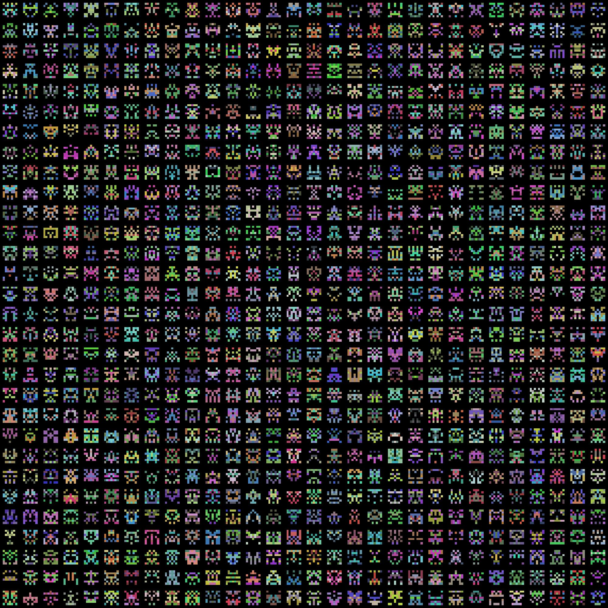

# Markdown 极简入门


!!! note
    [Markdown 语法的扩展使用](https://markdown.com.cn/extended-syntax/availability.html)

------------

## 引用中的要点

> 这是第一句话
> - 这是第一句话的一个要点
> - 这是第一句话的第二个要点

```
> 这是第一句话
> - 这是第一句话的一个要点
> - 这是第一句话的第二个要点
```


-----------------


## 要点的嵌套

- 这是第一句话
  - 这是第一句话的第一个要点
  - 这是第一句话的第二个要点
    - 这是第二个要点的第一个子要点
      - 这是子要点的第一个子子要点

```
- 这是第一句话
  - 这是第一句话的第一个要点
  - 这是第一句话的第二个要点
    - 这是第二个要点的第一个子要点
      - 这是子要点的第一个子子要点

```

------

## 超链接

<https://markdown.com.cn>

```
<https://markdown.com.cn> 

<!-- 只需要加上 < > 即可 -->
```


------

## 带格式化的超链接


I love supporting the **[EFF](https://eff.org)**.
This is the *[Markdown Guide](https://www.markdownguide.org)*.
See the section on [`code`](./MarkdownQuickStart.md).

```
I love supporting the **[EFF](https://eff.org)**.
This is the *[Markdown Guide](https://www.markdownguide.org)*.
See the section on [`code`](./MarkdownQuickStart.md).
```

-----------

## 带超链接的图片

[](https://markdown.com.cn)

----------------------

## 删除线

~~Nooooo!!~~

```
~~Nooooo!!~~
```