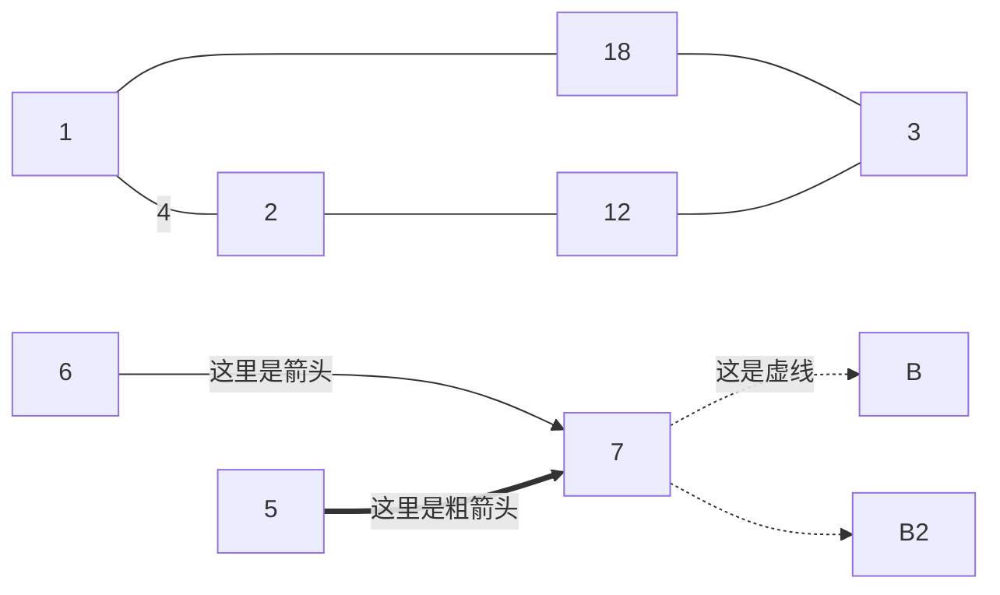
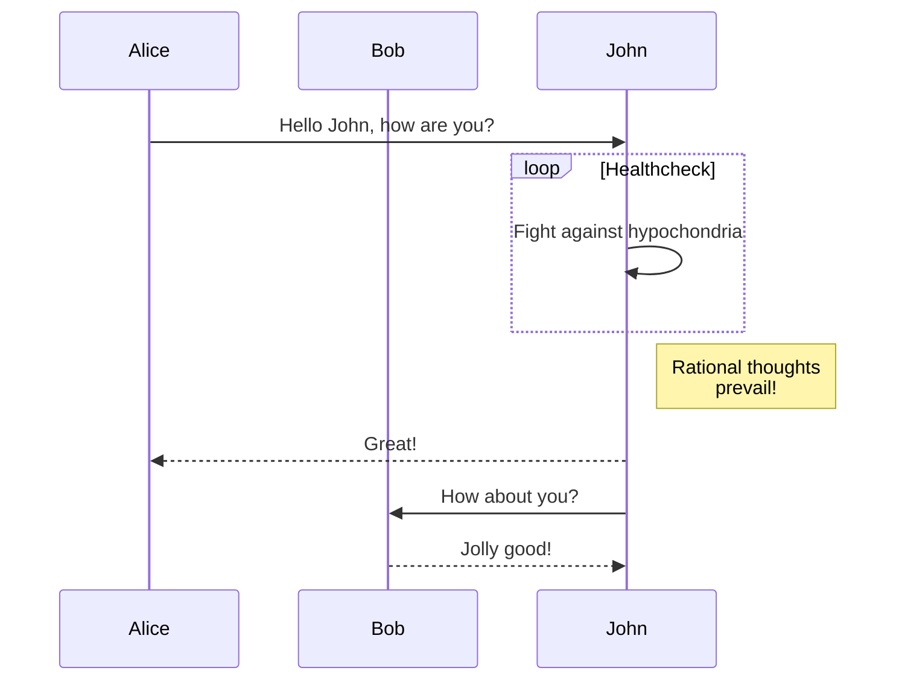
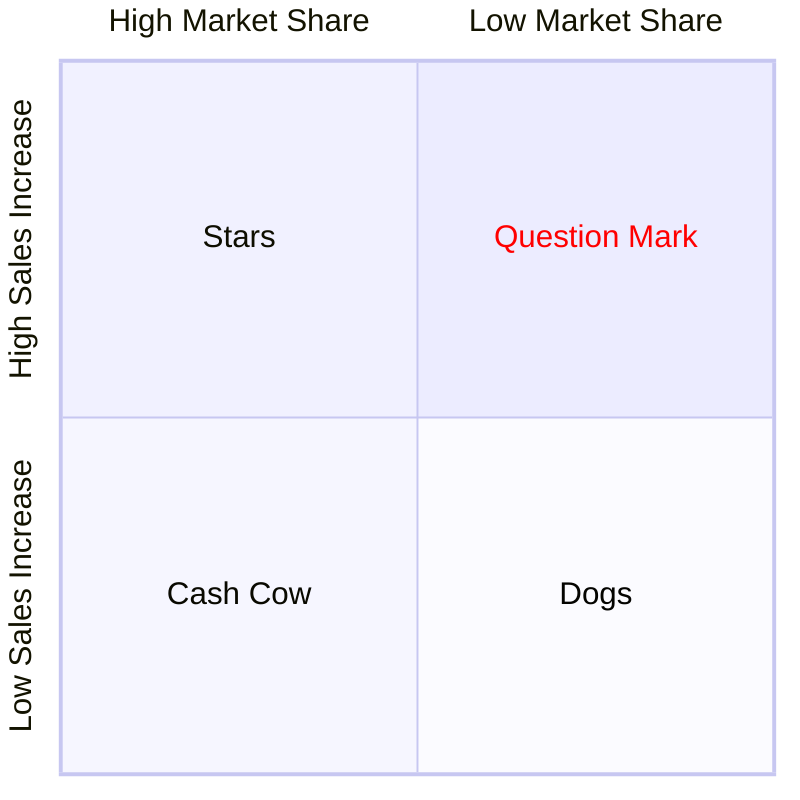
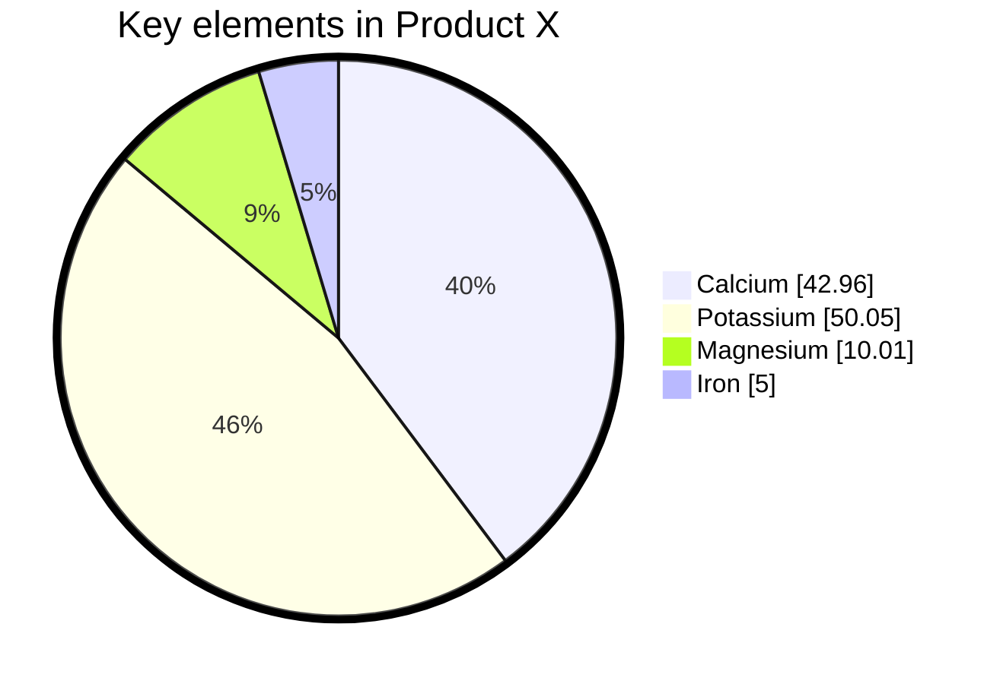
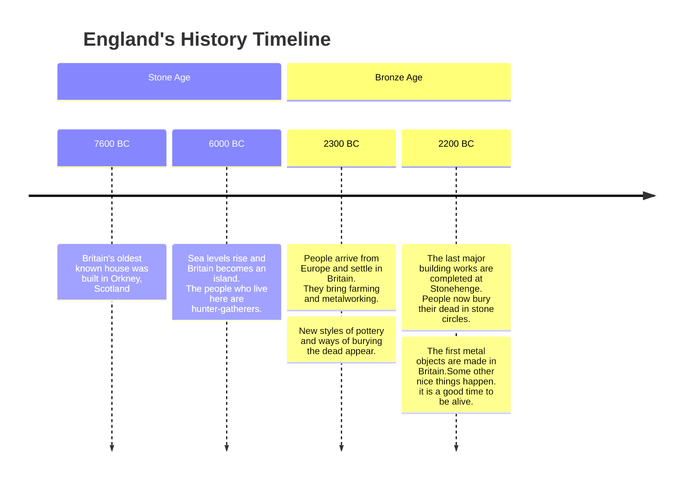
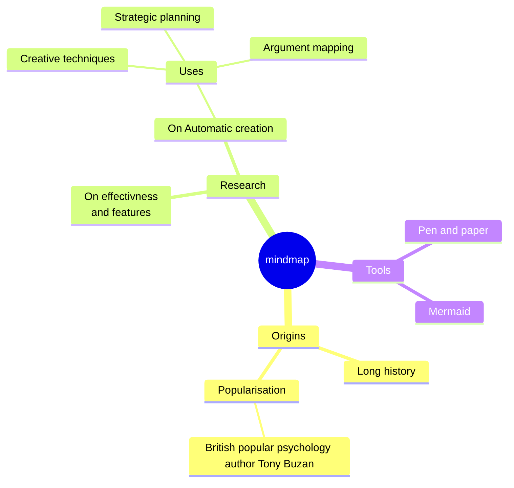

# Mermaid.js: 易上手的Markdown<br>风格图表绘制工具

!!! abstract "可以用易读的语法绘制一些直观的示意图。语法参考链接：[mermaid.nodejs.cn/syntax](https://mermaid.nodejs.cn/syntax/gantt.html) <br> 如果不想自己配置环境之类，可以在线编辑并下载你绘制的图片：[mermaid.live/](https://mermaid.live/) <br> 支持多种平台。拥有活跃的开发者社区。GitHub, GitLab, Obsidian, Hexo, WordPress. See [Here](https://mermaid.nodejs.cn/ecosystem/integrations-community.html)."


## 流程图



代码：
```javascript
flowchart LR
    1-- 4 ---2
    1--- 18 ---3
    2--- 12 ---3
    6-- 这里是箭头 --->7
    5== 这里是粗箭头 ==>7
    7-. 这是虚线 .->B
    7-.->B2
```

!!! note "线的长度也是可以控制的。用法如下："

| 长度  | 普通的  | 正常带箭头 |  厚的   | 粗带箭头 |  点状   | 带箭头虚线 |
| :---: | :-----: | :--------: | :-----: | :------: | :-----: | :--------: |
|   1   |  `---`  |   `-->`    |  `===`  |  `==>`   |  `-.-`  |   `-.->`   |
|   2   | `----`  |   `--->`   | `====`  |  `===>`  | `-..-`  |  `-..->`   |
|   3   | `-----` |  `---->`   | `=====` | `====>`  | `-...-` |  `-...->`  |


## 顺序图



## 甘特图

```mermaid
---
displayMode: compact
---
gantt
    title 工件加工甘特图
    dateFormat HH:mm 
    axisFormat %H:%M

    section 机器1
    任务1️           :a1, 00:02, 31m
    任务2           :a2, 00:37, 14m
    任务13          :a3, 00:58, 23m
    任务2           :a4, 01:24, 19m

    section 机器2
    任务1️           :a1, 00:12, 9m
    任务2           :a2, 00:37, 21m
    任务3           :a3, 00:59, 23m
    任务4           :a4, 01:24, 34m

    section 机器3
    任务1️           :a1, 00:32, 41m
    任务2           :a2, 01:49, 18m
    任务2           :a4, 01:24, 19m

    section 机器4
    任务1️           :a1, 00:00, 26m
    任务2           :a2, 00:49, 19m
    任务2           :a3, 01:54, 21m

```




代码：

```javascript
---
displayMode: compact
---
gantt
    title 工件加工甘特图
    dateFormat HH:mm 
    axisFormat %H:%M

    section 机器1
    任务1️           :a1, 00:02, 31m
    任务2           :a2, 00:37, 14m
    任务13          :a3, 00:58, 23m
    任务2           :a4, 01:24, 19m

    section 机器2
    任务1️           :a1, 00:12, 9m
    任务2           :a2, 00:37, 21m
    任务3           :a3, 00:59, 23m
    任务4           :a4, 01:24, 34m

    section 机器3
    任务1️           :a1, 00:32, 41m
    任务2           :a2, 01:49, 18m
    任务2           :a4, 01:24, 19m

    section 机器4
    任务1️           :a1, 00:00, 26m
    任务2           :a2, 00:49, 19m
    任务2           :a3, 01:54, 21m

```

## 象限图

> 可以快速画一个波士顿矩阵（Boston Matrix）



代码：

```javascript
%%{init: {"quadrantChart": {"chartWidth": 400, "chartHeight": 400}, \
"themeVariables": {"quadrant1TextFill": "#ff0000"} }}%%
quadrantChart
  x-axis High Market Share --> Low Market Share
  y-axis Low Sales Increase --> "High Sales Increase"
  quadrant-1 Question Mark
  quadrant-2 Stars
  quadrant-3 Cash Cow
  quadrant-4 Dogs
```

## 饼图



> 1. 以 pie 关键字开始绘制图表
> 
> 2. 后面跟着 title 关键字及其字符串值，为饼图提供标题。(可选)
> 
> 3. 接下来是数据集。**饼图切片将按与标签相同的顺序顺时针排序**，后跟 : 冒号作为分隔符，后面跟着 positive numeric value（支持最多两位小数）

代码：

```javascript
%%{init: {"pie": {"textPosition": 0.5},
 "themeVariables": {"pieOuterStrokeWidth": "5px"}} }%%
pie showData
    title Key elements in Product X
    "Calcium" : 42.96
    "Potassium" : 50.05
    "Magnesium" : 10.01
    "Iron" :  5

```

## 时间线图



代码：

```javascript
timeline
        title England's History Timeline
        section Stone Age
          7600 BC : Britain's oldest known house was built in Orkney, Scotland
          6000 BC : Sea levels rise and Britain becomes an island.<br> The people who live here are hunter-gatherers.
        section Bronze Age
          2300 BC : People arrive from Europe and settle in Britain. <br>They bring farming and metalworking.
                  : New styles of pottery and ways of burying the dead appear.
          2200 BC : The last major building works are completed at Stonehenge.<br> People now bury their dead in stone circles.
                  : The first metal objects are made in Britain.Some other nice things happen. it is a good time to be alive.
```

## 思维导图



<script type="module">
import mermaid from "https://unpkg.com/mermaid@10.0.2/dist/mermaid.esm.min.mjs"
mermaid.initialize()
</script>